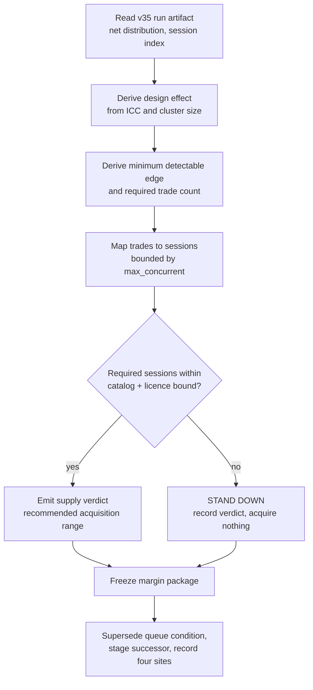

# ORB Power and Data Turn - Plan

## Goal Capsule

- **Objective.** Establish what sample the ORB head needs before any lever is judged: derive the trade count at which its plausible edge becomes distinguishable from zero, determine the session count and universe width that produce it, and decide whether the catalog can supply them.
- **Product authority.** This plan owns the sample-sufficiency question only. Lever selection, the instrument pivot, and rung-1 re-entry are not active scope.
- **Execution profile.** Offline throughout — no gateway, no live session. Reads one existing run artifact and the catalog's coverage status; writes a new read-only report, a frozen margin package, governance records, and two comment-only guidance corrections. No strategy code, no governed param, so head identity does not move.
- **Stop conditions.** A verdict of "sample unreachable" is a valid completion (R9). Stop and report rather than widening scope if the derivation would require touching `adapters/nautilus/lab/config/preregistration.json`, executing an ingest, or arming any lever.
- **Open blockers.** None.

---

## Product Contract

### Summary

Scope a measurement turn that answers "how much data does this strategy need to prove an edge?" before any further lever work. The turn derives a required trade count from the head's own dispersion and clustering, maps it to sessions and universe width, checks catalog supply, and defines the pre-registered margin a future head must clear. If the required sample is unreachable, the turn's output is a stand-down recommendation.

### Problem Frame

The documented head `v35` reports net RoR −0.0006 and has been read as a near-miss: a gross edge of 22.8 bps against a 23 bps round-trip hurdle, roughly a 0.9% shortfall. That framing invites a lever search — find 1% more edge and the sign flips.

The framing is wrong, and the head's own artifact says so. Over the 111 closed trades in `data/turn4-fresh/runs/20260731T023138Z-backtest-orb-v35/` (catalog fingerprint `ac026541`), per-trade net r has mean −0.0333 against a standard deviation of 0.6415. A session-block bootstrap over the 24 distinct sessions puts the 95% interval for net RoR at [−0.177, +0.164], with P(net RoR > 0) = 0.504.

Those 111 trades are not 111 independent observations. Intra-session correlation measured on the same artifact is 0.327 at a mean cluster size of 4.54, giving a design effect of 2.16 — an effective sample of about 51. Under the parameters pinned in KTD11 (two-sided 95%, 80% power) the smallest per-trade edge detectable at this sample is roughly **+0.25 R**, while the entire *gross* edge is **+0.0284 R** — smaller by a factor of about nine, and below the detection floor even with costs switched off. Reaching detectability at that effect size requires on the order of **8,600 closed trades**, which at the observed **2.47 trades per calendar session** is roughly **3,500 sessions — about fourteen years of KRX history**.

> **Corrected 2026-08-06 during implementation (code review, U5).** This paragraph originally divided by **4.6 trades per session** and read **~1,870 sessions, ~7.5 years**. That 4.6 is the rate per *trade-producing* session (111 trades over 24), but the session count it produces is compared against *calendar* catalog coverage — different units. The head trades on only 24 of the **45** calendar sessions its data range covers, so the honest rate is **2.4667** and the requirement is **~3,499 sessions**. The verdict direction is unchanged (a stand-down either way), but the shortfall roughly doubles and the target-effect band's optimistic top row flips from reachable to not. `report sample` prints both rates and uses only the calendar one for a verdict; see TURN-LOG 2026-08-06.

Two consequences follow. Any lever that reports net RoR > 0 on this sample has about even odds of doing so by chance, so the queue's literal unblock condition is satisfiable by luck. And the problem is not the cost model: the gross edge sits far below the detection floor regardless of costs.

`TURN-LOG.md:161-162` states the negative edge "is not attributable to any kept lever." That is correct, but not because the levers are individually sound — at this effective sample size nothing is attributable to anything.

### Key Decisions

- **Fix a pre-registered margin rather than accept a bare sign test.** (session-settled: user-directed — chosen over taking the queue's literal `net RoR > 0`, a significance test, or deferring the bar: the literal condition is satisfiable by luck at P≈0.5.) Governs R6.
- **Spend the next turn on sample sufficiency, not lever selection.** (session-settled: user-directed — chosen over re-scoping the unblock condition alone, pivoting instrument, or standing the arc down: the sample problem gates every other option.) Governs R1, R2, R4, R5.
- **Defer every lever until the edge is measurable,** including the `breakout_strength` band-pass, which is off in the head and never adjudicated. Deferring an untested lever is deliberate, not an oversight.
- **Treat an unreachable sample as a valid completion.** If the derivation lands beyond what the catalog and licence window can supply, the honest output is a stand-down recommendation. Governs R9.
- **Use the session as the resampling unit.** Trades cluster within sessions (mean 4.6, max 11 per session), so a per-trade bootstrap overstates independence. Governs R3.
- **Amend the gameable unblock condition within this turn.** (session-settled: user-directed — chosen over recording the conflict for the re-entry item to fix later, or amending it immediately as standalone governance: a condition a coin-flip head satisfies half the time is a live hazard, and the amendment is cheap once the margin exists.) Governs R7.

### Requirements

**Power derivation**

- R1. Derive the closed-trade count at which the head's plausible edge is distinguishable from zero, using the per-trade net-r dispersion measured from the v35 artifact **inflated by the design effect implied by its measured intra-session correlation and mean cluster size**.
- R2. The derivation states its target effect size, confidence level, and statistical power before reading any candidate, and sources them from measured data rather than choosing them once a result is visible.
- R3. The derivation reports its own fragility: the interval rests on 24 sessions, which is thin for a block bootstrap, and the design effect inherits that instability.

**Sample supply**

- R4. Determine the session count and universe width that yield the required trade count, accounting for `max_concurrent` capping how much universe width converts into trades.
- R5. Establish whether the catalog can supply that history, naming the acquisition path required and the licence or data-availability bound on it.

**Margin definition**

- R6. Define the margin a future head must clear, expressed against the sampling distribution so that a head whose evidence does not exceed the trials-corrected threshold fails it. Frozen before any candidate is read.

**Governance and identity**

- R7. Supersede the queue item `rung1-ladder-reentry-net-positive-head` so its unblock condition carries the margin from R6 rather than a bare sign test, using `lab-next supersede` rather than editing `queue/items.jsonl` by hand.
- R8. The turn reads artifacts and executes no ingest; it changes no strategy code and no governed param, so it moves neither `strategy_code_hash` nor head identity.
- R9. If the required sample is unreachable within the bound established in R5, the turn completes with a documented stand-down recommendation and performs no ingest.
- R12. Stage the verdict's successor as a queue item via `lab-next add` — on the reachable branch, the acquisition range and its budget bound; on the stand-down branch, the condition under which the verdict is re-evaluated — so no branch terminates without a `make next`-visible successor.

**Falsified-candidate record**

- R10. Record the minimum-opening-range-width entry filter as falsified by measurement, with the reading that killed it, so it is not re-proposed.
- R11. Correct the guidance in `adapters/nautilus/lab/src/params.rs` that advertises `profit_target_r = 1.5` as an unexplored optimum, since turn 9 already swept it and both legs were worse.

### Acceptance Examples

- AE1. **Covers R6.**
  - **Given** a candidate head reporting net RoR above zero,
  - **When** its evidence does not exceed the trials-corrected threshold,
  - **Then** it does not clear the margin and does not unblock rung-1, whatever the reported intervals show.
- AE2. **Covers R9, R12.**
  - **Given** the derived trade count exceeds what the catalog and licence window can supply,
  - **When** the turn reaches its verdict,
  - **Then** it emits a stand-down recommendation, ingests nothing, leaves rung-1 parked, and stages the re-evaluation condition as a queue item.
- AE3. **Covers R5, R8.**
  - **Given** the catalog grows to supply additional sessions,
  - **When** any prior head measurement is cited for comparison,
  - **Then** it is re-measured on the current catalog, because in-range content growth changes the trade set.
- AE4. **Covers R10.**
  - **Given** a future turn proposes an entry filter on opening-range width,
  - **When** it consults this record,
  - **Then** it finds the filter has no population to cut and does not spend a turn on it.

### Success Criteria

- The required trade count is a number carrying a stated effect size, confidence level, power, and design effect — not a qualitative judgement — and is reported across a band of target effects spanning the gross edge's own confidence interval.
- A downstream agent can reach go or stand-down without re-deriving any statistics.
- The margin is stated such that the current head fails it, demonstrated by running the current head through it.

### Scope Boundaries

**Deferred for later**

- Every lever turn, including the `breakout_strength` band-pass — off in the head, and its verdict is absent from `TURN-LOG.md`.
- Re-auditing the falsified levers against a net rather than gross objective. The standing claim at `TURN-LOG.md:193-196` that gross-measured NO-BUILDs "stand a fortiori under costs" does not hold in general for filters, since removing a trade whose gross return sits between zero and the hurdle lowers gross RoR while raising net RoR. Worth revisiting only once the sample can resolve the difference.

**Outside this arc**

- Porting ORB to a low-tax instrument. The 20 bps sell tax is roughly seven-eighths of the round-trip cost, so a near-tax-free instrument changes the economics — but it does not relieve the sample requirement: the gross edge is below the detection floor with costs off, so any ported arc inherits this turn's required trade count and must scope its own supply before a lever is judged.
- Rung-1 re-entry and the prereg v3+ re-registration, already carried by the queue item `rung1-ladder-reentry-net-positive-head`.

**Deferred to follow-up work**

- Acquiring the additional history. This turn produces the supply verdict and the recommended range; the acquisition is a fresh-catalog build rather than an incremental extension, is budget-bound, and re-baselines every prior measurement, so it is its own decision.

### Dependencies and Assumptions

- The v35 run artifact remains readable and is the sole source for the dispersion and clustering figures.
- Catalog reproducibility is not assumed: the fingerprint moved from `363f199d` to `ac026541` as morning-chain ingests backfilled history, and v34's 119 trades re-measure as 111 on identical code and params. Every comparison must be same-catalog, and every derived figure must name the fingerprint it was read at.
- The repo's Power pre-check (green at ≥30 trades in ≥2 tiers, `CONCEPTS.md:257`) answers whether a tier comparison is runnable, not whether an edge is certifiable. It passes this sample and must not be read as reassurance here.

### Outstanding Questions

All planning-owned questions are resolved: the confidence level, power, and target effect by KTD11, the breadth-versus-history route by KTD8, and the supersede sequencing by KTD9.

**Deferred to implementation**

- Q1. The resampling block length. The session is the natural block, but no single length is optimal for every statistic, and the automatic selectors need more blocks than this sample has. Choose it against the fixture during U1 and record the choice with the verdict.

### Sources

- `adapters/nautilus/lab/TURN-LOG.md:107-116` — the v35 measurement and its verdict; `:161-162` for the not-attributable-to-any-lever claim; `:193-196` for the a fortiori claim this plan disputes.
- `data/turn4-fresh/runs/20260731T023138Z-backtest-orb-v35/` — `performance.json` (111 closed trades of 113 records) and `manifest.json` (armed params, `breakout_strength` off).
- `adapters/nautilus/lab/src/strategy/orb.rs:291-330` — the cost model, and why it lives in `orb.rs` so arming it is a code turn.
- `adapters/nautilus/lab/ledger/trials.jsonl` and `adapters/nautilus/lab/src/trials.rs` — the committed trials ledger and its count verb, the machine-readable source for the trial count.
- `docs/solutions/conventions/strategy-loop-turn-9-profit-target-sweep-and-mfe-distribution.md` — the profit-target sweep in both directions, which R11 corrects the stale pointer to.
- `docs/solutions/conventions/suspend-vs-amend-frozen-governance-artifacts.md` — the no-consumer test and the four-site recording discipline a stand-down follows.
- `docs/solutions/workflow-issues/unbounded-accumulate-ingest-widens-the-catalog-and-moves-the-head-universe.md` — universe widening displaces trades as well as adding them.
- `docs/solutions/logic-errors/status-only-gate-is-not-evidence-and-all-over-empty-is-true.md` — a gate must test the claim's evidence, not a proxy; verify a guard by mutation.
- Bailey & López de Prado, *Minimum Track Record Length* / *Probabilistic Sharpe Ratio* and *The Deflated Sharpe Ratio* — the closed-form sample requirement and the trials-corrected null threshold.
- Politis & White (2004, corrected 2009) — automatic block-length selection and its consistency conditions.
- Arnott, Harvey & Markowitz, *A Backtesting Protocol in the Era of Machine Learning* — declared trial counts and pre-specified thresholds.

---

## Planning Contract

### Product Contract preservation

Changed: R1, R2, R3, R5, R6, R8, AE1, AE2, Success Criteria; added R12. R8's "may ingest data" clause contradicted the settled KTD7 and was reconciled to it. R1–R3 and R6 were tightened to name the clustering and power terms the derivation actually needs. R12 closes a gap where no branch of the verdict staged its successor. No R-ID was split or renumbered.

### Key Technical Decisions

- KTD1. **Ship the derivation as a new read-only report subcommand in the existing report family.** `report.rs` already reads a run's artifacts without re-running a backtest, writes no run-dir artifact, and returns success regardless of verdict — the shape a stand-down needs. Governs R1, R3, R9.
- KTD2. **Express the margin as the trials-corrected False Strategy Theorem threshold, not "the interval excludes zero."** (session-settled: user-approved — chosen over a bare interval rule: correcting for the levers already tested on this data is what makes the bar unfakeable.) The threshold takes two inputs beyond the sample: the count of evaluated trials and the variance across those trials' outcomes. Source the count from `trials::count_trials` over the committed ledger, scoped to the v35 catalog lineage, and the cross-trial variance from the per-arm figures recorded in TURN-LOG's sweep tables. Governs R6.
- KTD3. **Freeze the margin in the turn's own package, leaving `config/preregistration.json` byte-identical.** The amendment protocol's no-consumer test says not to re-derive a frozen artifact when the honest value would forbid the activity it gates. Governs R6, R7.
- KTD4. **Denominate every derivation in the net, cost-aware distribution.** Deriving the required n from the pre-cost distribution repeats the documented error where the omitted statutory term exceeded the signal. Governs R1, R2.
- KTD5. **Resample by session, and report few-cluster corrections alongside the naive interval — as diagnostics, not as the gate.** 24 clusters sits below the ~30 threshold where cluster-robust standard errors are biased downward, so the naive interval is the optimistic end; the report carries a wild-cluster variant and critical values from t with G−1 degrees of freedom. Neither interval binds the verdict; KTD2's threshold does. Governs R3.
- KTD6. **Name the new quantity `sample-sufficiency verdict`, reporting a `minimum detectable edge`.** The existing `Power pre-check` is a tier-quorum count floor in live code (`report.rs:189-194`); overloading the term would leave the glossary and two constants disagreeing. Governs R1, R4.
- KTD7. **The turn stops at the supply verdict and executes no acquisition.** (session-settled: user-approved — chosen over acquiring within the same turn: the acquisition is budget-bound and re-baselines the head universe, so it earns its own decision.) Governs R5, R9.
- KTD8. **Recommend lengthening history over widening the universe, and treat the acquisition as a fresh-catalog build.** At the measured intra-session correlation and cluster size, adding sessions raises effective n roughly in proportion while adding breadth raises it far less, because breadth adds trades inside blocks already held — and `max_concurrent` caps how much breadth converts at all (R4). Widening also displaces trades as well as adding them, which is a supporting reason rather than the load-bearing one. Critically, the history cannot be extended incrementally: `accumulate` never fetches below the watermark, so the recommendation is a fresh catalog at a wider lookback, whose cost includes a moved fingerprint, universe hash, and data range — and therefore the loss of comparability with every prior measurement. Governs R4, R5.
- KTD9. **Sequence the queue change as add-then-supersede, after the gate, in one commit with the governance records.** `lab-next supersede` refuses when the superseding id is absent and mutates the item with a reconcile flag on refusal; and `gate-run`'s whole-tree fingerprint splits its verdict if the queue moves mid-gate. Governs R7, R12.
- KTD10. **Calibrate the margin empirically, not with a single null draw.** A single permuted-label refusal is satisfied by any bar above roughly two standard errors, including one set far too low, and KTD2's threshold is a max-of-N-trials quantity that one draw cannot exercise. Generate permutation replicates grouped into max-of-N blocks and assert the realized rate at which a null block clears the margin is at or below nominal. Governs R6.
- KTD11. **Pin two-sided 95% confidence, 80% power, and the measured gross per-trade edge as the target, before any reading.** The gross edge is the largest this strategy has demonstrated, so targeting anything larger assumes an edge never observed. Power is the third parameter a sample-size derivation needs; leaving it unpinned lets the multiplier be chosen once the answer is visible, which is the hazard this decision exists to prevent. Governs R2.

### High-Level Technical Design

The turn is a single decision funnel with three terminal verdicts. Only the middle one authorizes further work, and only outside this turn.

The staging guard is load-bearing and mirrors the existing tier report: the run's performance figures are read to build the distribution, but no expectancy or P&L number reaches the verdict line. A power question must not be decided by a profitability number.

### Assumptions

- The per-trade net-r series is the unit of derivation, with session clustering absorbed through a design effect rather than by modelling intra-session correlation directly. A full mixed-effects treatment is out of proportion to a go/stand-down verdict.
- The trial count is the number of distinct evaluated parameter arms and code variants enumerated from the trials ledger and TURN-LOG — not the turn count or the lever count, both of which undercount multi-arm sweeps. The correlation-based effective-N reduction the literature permits is not attempted; declining it errs toward a stricter bar.

### Risks

- **The margin is derived from the same sample it will later judge.** Mitigated by deriving it from dispersion, clustering, and trial count — scale properties — never from the point estimate, and by freezing it before any candidate is read (KTD3). The residual is real: a margin set on 24 sessions inherits those sessions' idiosyncrasy, and the design effect itself is estimated from only 24 clusters.
- **Few-cluster bias makes the naive interval look tighter than it is.** At 24 clusters, cluster-robust standard errors are biased downward, so the recorded interval is the optimistic end. Mitigated by reporting corrected variants alongside it (KTD5) as diagnostics.
- **An undercounted trial count sets the bar too low.** Mitigated by counting evaluated arms rather than turns, and sourcing the count from the committed ledger so it is auditable rather than hand-tallied.
- **A queue mutation during the gate splits the verdict.** The gate's fingerprint is whole-tree, so touching the queue mid-run reports every step pending. Mitigated by KTD9's ordering: gate, then commit, then queue.
- **The expected outcome is a stand-down, which reads as failure.** Mitigated by the recording protocol treating it as a governed act with a named unblock condition and a staged re-evaluation successor (R12). The risk is cultural rather than technical, and worth stating so the verdict is not relitigated when it lands.
- **The target effect is itself a noisy estimate.** Required n scales as its inverse square, and the pinned +0.0284 R carries an interval spanning roughly [−0.09, +0.15] on this sample. Mitigated by reporting required n across a band of target effects rather than a single point.

---

## Implementation Units

### U1. Sample-sufficiency statistics core

- **Goal.** Pure, unit-tested statistics functions the report calls: mean, sample standard deviation, intra-cluster correlation, design effect, minimum detectable edge, required trade count, the trials-corrected threshold, and a session-block resampler.
- **Requirements.** R1, R2, R3. Implements KTD4, KTD5, KTD11.
- **Dependencies.** None.
- **Files.** `adapters/nautilus/lab/src/stats.rs` (new), `adapters/nautilus/lab/src/lib.rs` (module declaration), `adapters/nautilus/lab/tests/stats_derivation.rs` (new).
- **Approach.**
  1. Add a module of free functions taking slices and returning plain `f64`; no I/O, no artifact types, so the test file can assert against hand-computed constants.
  2. Compose the design effect into the required-trade-count function as a multiplier — required n is the naive count times the design effect, never the naive count alone.
  3. Take the target effect, confidence level, and power as explicit named parameters rather than constants, so the pinned values live in one place and the band in U5 can vary the target.
  4. Take the resampler a seed so runs are reproducible.
  5. Keep the few-cluster corrections (KTD5) as separate functions from the naive interval so the report can print both.
- **Patterns to follow.** `adapters/nautilus/lab/tests/prereg_derivation.rs` — reproduce each derived number from named constants rather than typing in the result, so the test is an audit of the formula. The lab crate has no existing statistics helpers; `nearest_rank()` / `mean()` in `report.rs:130-152` are private and stay that way.
- **Test scenarios.**
  - Mean and sample standard deviation over a known small series match hand-computed values.
  - Intra-cluster correlation is zero for a series with no between-cluster variance, and approaches one as within-cluster variance vanishes.
  - Design effect equals 1.0 when every cluster has size 1, and reproduces the documented formula for a known mean cluster size and correlation.
  - Required trade count scales linearly with the design effect: doubling the design effect doubles required n.
  - Minimum detectable edge scales as the inverse square root of effective n: quadrupling effective n halves the detectable edge.
  - Required trade count for a stated effect, confidence, and power reproduces a hand-computed constant, and rises when power rises from 50% to 80%.
  - The trials-corrected threshold is strictly increasing in the trial count, increasing in the cross-trial variance, and reduces to the single-trial case at N=1.
  - The block resampler with a fixed seed returns identical output across two calls.
  - Degenerate inputs fail closed: an empty series, a single trade, a single session, and a zero target effect each return an explicit error rather than a value.
- **Verification.** `cargo test -p nautilus-ls-lab --test stats_derivation` passes, and every assertion is against a constant derived in the test rather than a snapshot of the implementation's own output.

### U2. The `report sample` subcommand

- **Goal.** A read-only CLI verb that reads a finalized run and prints the sample-sufficiency verdict: observed dispersion, measured clustering, minimum detectable edge, required trade count, required session count, and the naive and few-cluster intervals as diagnostics.
- **Requirements.** R1, R3, R6, R8. Implements KTD1, KTD6.
- **Dependencies.** U1.
- **Files.** `adapters/nautilus/lab/src/runner/report.rs` (new `report_sample` + outcome struct), `adapters/nautilus/lab/src/runner/research.rs` (usage string, dispatch arm, config-from-env), `adapters/nautilus/lab/tests/research_cli.rs` (new `mod report_sample` block).
- **Approach.**
  1. Declare `report_sample` as an async function from the outset and have the dispatch arm own the runtime, mirroring the existing tier report — U5 extends this same function with a catalog read whose only in-crate reader is async, so a sync signature would have to be retrofitted.
  2. Resolve the run from an env var, defaulting to the latest finalized run and marking the header when defaulted — safe only because the report writes nothing.
  3. Load the frozen margin package and emit an explicit pass/fail margin verdict line alongside the derived figures, so the margin has a carrier rather than existing only as a document claim.
  4. Return a structured outcome plus a `lines` vector the binary prints; write no run-dir artifact.
  5. Name the head's catalog fingerprint in the output header so a figure can never be quoted without the catalog it was read at.
- **Patterns to follow.** `report_tiers` in `adapters/nautilus/lab/src/runner/report.rs` for the async outcome-plus-lines shape and its `rt.block_on` dispatch arm; the four wiring edits in `research.rs` (usage const, `report` dispatch arm, `*_config_from_env`, bail message listing valid modes). The CLI is hand-rolled positional matching, not a clap enum.
- **Test scenarios.**
  - A fixture run with a known trade set produces the expected design effect, minimum detectable edge, and required trade count in the printed lines.
  - The verdict line reports "insufficient" for a sample below the requirement and "sufficient" for one above it.
  - The margin verdict line reports a refusal for a head whose evidence does not exceed the threshold.
  - The staging guard holds: the joined output contains none of `expectancy`, `pnl`, `p&l` in any case form.
  - The output header names the catalog fingerprint and the resolved run id.
  - With the run env var unset, the header marks the run as defaulted to the latest finalized run.
  - A run directory with zero closed trades produces an explicit refusal line naming what was missing, not a silent zero.
  - A run whose closed trades carry null risk-capital or R-metric fields produces a refusal naming the missing field and the run's pre-field vintage, rather than falling through to an empty-series error.
  - The compiled binary's unknown-mode bail enumerates `sample` among valid report modes.
- **Verification.** `cargo test -p nautilus-ls-lab --test research_cli` passes including the new module, and running the verb against the v35 run reproduces the dispersion and clustering figures recorded in the Problem Frame.

### U3. The pre-registered margin package

- **Goal.** Freeze the margin before any candidate head is read, with its inputs recorded so the bar is reproducible and its staleness detectable.
- **Requirements.** R6. Implements KTD2, KTD3.
- **Dependencies.** U1.
- **Files.** Determined by the container decision in Open Questions; at minimum a machine-readable margin record plus its rationale prose, and a test asserting the recorded value reproduces from its inputs.
- **Approach.**
  1. Record the margin's inputs, not only its output: dispersion, design effect, trial count, cross-trial variance, confidence, power, and the closed-form expression.
  2. Record the catalog fingerprint and session span the dispersion was read at, plus an explicit re-derivation trigger — if a judged head's fingerprint differs from the recorded one, the margin must be re-derived before it binds.
  3. Source the trial count from `trials::count_trials` over the committed ledger rather than a hand tally, and record the ledger's record count at freeze time.
  4. Justify the value the way the additive-stream floor was justified — anchored below the smallest historically-kept gain and above screen-prediction noise.
  5. Leave `adapters/nautilus/lab/config/preregistration.json` untouched.
- **Test scenarios.**
  - The recorded threshold reproduces from the recorded inputs through the statistics core, so the frozen number is auditable rather than typed in.
  - The recorded trial count equals the ledger's count at freeze time.
  - A judged head whose catalog fingerprint differs from the recorded one triggers the re-derivation requirement rather than binding silently.
  - `config/preregistration.json` is byte-identical to its pre-change content.
- **Verification.** The margin record parses, its value reproduces from its inputs, and a diff confirms the frozen ladder pre-registration file is unchanged.

### U4. Empirical calibration of the margin

- **Goal.** Demonstrate by execution that the margin refuses at the intended rate, and that the fixture can express a failure.
- **Requirements.** R6. Implements KTD10.
- **Dependencies.** U2, U3.
- **Files.** `adapters/nautilus/lab/tests/research_cli.rs` (extend the new module), `adapters/nautilus/lab/tests/fixtures/` as needed.
- **Approach.**
  1. Build null replicates by permuting each trade's realized outcome against a fixed seed, preserving the risk-capital distribution and session structure.
  2. Group replicates into max-of-N-trial blocks matching the threshold's own construction, and assert the realized rate at which a null block clears the margin is at or below nominal.
  3. Assert the converse on a synthetic head whose edge is large enough at sufficient n, so the test is not vacuously passing.
  4. Run the actual v35 head through the margin and assert refusal — the plan's Success Criteria names the current head, not only a synthetic null.
- **Execution note.** Write the refusal assertions first and confirm they fail against a disarmed margin before implementing. The margin comparison needs a seam that lets a test disarm it in-process; specify that seam rather than relying on a manual edit-and-restore, which is a one-time check rather than a standing falsifier.
- **Patterns to follow.** The mutation discipline in `docs/solutions/conventions/coverage-only-change-is-verified-by-mutation-not-by-the-gate.md`; the staging-guard negative assertion in the existing tier-report tests.
- **Test scenarios.**
  - Null blocks clear the margin at or below the nominal rate across the replicate set.
  - The v35 head is refused by the frozen margin.
  - A synthetic head with a large true edge and sufficient n clears the margin.
  - Disarming the margin comparison turns the null-rate assertion red.
  - The null fixture's session count and risk-capital total match the source run, so the permutation changed only the outcomes.
- **Verification.** Both directions assert, the realized null clearance rate is reported alongside the nominal, and the disarmed comparison reds.

### U5. Catalog supply probe and the acquisition verdict

- **Goal.** Report how many sessions the catalog can supply, what acquisition a sufficient sample would require, and which arm the recommendation takes.
- **Requirements.** R4, R5, R9. Implements KTD7, KTD8.
- **Dependencies.** U2.
- **Approach.**
  1. Derive required sessions from required trades using the observed trades-per-session rate, and report the figure across a band of target effects spanning the gross edge's confidence interval rather than at a single point.
  2. Read `max_concurrent` from the source run's manifest and report the per-session trade ceiling it implies, stating that the observed rate cannot exceed it regardless of universe width.
  3. Read supply from the catalog's coverage rather than assuming it, using the watermark-gated status form.
  4. State that the acquisition path is a fresh catalog at a wider lookback rather than an incremental extension, and name the resulting fingerprint and universe re-baseline as part of its cost.
  5. Emit the stand-down recommendation when required sessions exceed supply, and perform no acquisition in any branch.
- **Files.** `adapters/nautilus/lab/src/runner/report.rs` (extend the sample report's output), `adapters/nautilus/lab/tests/research_cli.rs`.
- **Test scenarios.**
  - Required sessions equals required trades divided by the observed rate, rounded up, and is reported at each target effect in the band.
  - The output names the run's `max_concurrent` value and the per-session trade ceiling it implies.
  - The verdict line names the target-effect value it was computed at.
  - When required sessions exceed available coverage, the output carries a stand-down recommendation and names the shortfall.
  - When required sessions fit within coverage, the output names the acquisition range, states it is a fresh-catalog build, and states that this turn does not execute it.
  - The recommendation names history rather than breadth, with the effective-n reason stated.
  - No branch invokes an acquisition path.
- **Verification.** Both the reachable and unreachable branches are exercised by tests, and no code path in the report reaches an ingest entry point.

### U6. Verdict recording, queue supersede, and successor staging

- **Goal.** Record the turn's verdict in every site the stand-down protocol names, replace the gameable unblock condition, and stage the successor work.
- **Requirements.** R7, R9, R12. Implements KTD9.
- **Dependencies.** U3, U5.
- **Files.** `adapters/nautilus/lab/TURN-LOG.md`, `adapters/nautilus/lab/config/PREREGISTRATION.md` (status line), `adapters/nautilus/lab/RUNG1-PREFLIGHT.md`, `queue/items.jsonl` (via CLI only).
- **Approach.**
  1. Add the replacement queue item first, then supersede the old one — the supersede refuses when the new id is absent, and its refusal mutates the item with a reconcile flag that then blocks the actionable view.
  2. Stage the successor as its own queue item per R12, so neither branch of the verdict terminates without a `make next`-visible next step.
  3. Run all queue commands *after* the gate, never during it.
  4. Move all four recording sites in one commit.
  5. Do not hand-edit the queue file, and keep credentials out of any note.
- **Patterns to follow.** `docs/solutions/conventions/suspend-vs-amend-frozen-governance-artifacts.md` — the four-site recording discipline, and the rule that an unrecorded edit to a frozen mirror is itself the violation.
- **Test scenarios.** Test expectation: none — this unit is governance records and a CLI-mediated queue mutation, with no behavioral surface. Its verification is the post-change `make next` reading.
- **Verification.** `make next` reports the new unblock item and the staged successor with no reconcile flag on either; the four recording sites agree on the verdict; `git diff` shows no direct edit to `queue/items.jsonl`.

### U7. Stale-guidance corrections

- **Goal.** Retire two pieces of in-tree guidance that would send the next agent at an already-falsified lever.
- **Requirements.** R10, R11.
- **Dependencies.** None — independent of the derivation and landable at any point.
- **Files.** `adapters/nautilus/lab/src/params.rs` (doc comment only), `adapters/nautilus/lab/TURN-LOG.md`.
- **Approach.**
  1. Correct the profit-target doc comment so it records that the sweep already ran in both directions and was worse, rather than advertising an unexplored optimum.
  2. Record the minimum-opening-range-width filter as falsified by measurement, naming the reading in range-width terms under the head's armed stop mode — the narrowest opening range in the sample is roughly six times the round-trip hurdle, so the filter has no population to cut.
- **Execution note.** Comment-only in `params.rs`; no behavioral edit, so head identity is untouched. Confirm `strategy_code_hash` is unchanged rather than assuming it.
- **Test scenarios.** Test expectation: none — documentation and a doc comment, with no behavioral surface.
- **Verification.** The adapter suite stays green, and `strategy_code_hash` is unchanged before and after.

---

## Verification Contract

| Gate | Command | Applies to | Done signal |
| --- | --- | --- | --- |
| Lab unit and CLI tests | `cd adapters/nautilus && env -u <every LS_* var> cargo test -p nautilus-ls-lab` | U1–U5 | All result lines report `0 failed` |
| Adapter workspace | `cd adapters/nautilus && cargo test --workspace` | U1–U5, U7 | ~70 result lines, `0 failed`; redirect to a file and echo the exit code separately |
| Margin falsifier | The disarm-the-comparison test in U4 | U4 | The null-rate assertion reds when the comparison is disarmed and greens when restored |
| Frozen-file check | `git diff --stat adapters/nautilus/lab/config/preregistration.json` | U3 | Empty output |
| Queue state | `make next` | U6 | New unblock item and staged successor present; no reconcile flag |
| Full gate | `make gate-run` | All | Eight steps green, run to completion before any queue mutation |

Two standing traps apply to every row. Strip every `LS_*` variable before any cargo invocation — the operator shell exports about a dozen that false-red two `mount_universe` tests on a pristine tree. And never pipe the adapter gate to `tail`: the pipeline reports tail's exit code, so a red gate reads as success.

---

## Definition of Done

- The sample-sufficiency report runs against the v35 artifact and reproduces the dispersion, clustering, and detectability figures this plan records, naming the catalog fingerprint it read them at.
- The required trade count and required session count are stated with their effect size, confidence level, power, design effect, and trial count, and are reported across a band of target effects.
- The margin is frozen with its inputs recorded, reproduces from those inputs rather than being typed in, carries a re-derivation trigger keyed to the catalog fingerprint, and `config/preregistration.json` is byte-identical.
- The margin's null clearance rate has been measured across permutation replicates and is at or below nominal; the v35 head has been run through the margin and refused; and disarming the comparison reds the assertion.
- The supply verdict names either an acquisition range described as a fresh-catalog build or a stand-down, and no acquisition was executed either way.
- The queue carries the margin-bearing unblock condition and a staged successor, added before the supersede and after the gate, with all four recording sites moved in one commit.
- The two stale-guidance corrections have landed and `strategy_code_hash` is unchanged.
- `make gate-run` is green on the final tree.

---

## Deferred / Open Questions

### From 2026-08-06 review

- **Freeze a parameterized rule or a scalar?** (P1, KTD3 / U3 / R6) A scalar threshold scaled at n=111 is roughly 0.152 R against a target gross edge of 0.0284 R, so a frozen level would be unclearable at any sample size — the failure mode that permanently strands a viable strategy. Freezing a rule parameterized by the candidate's own trade count fixes it but requires somewhere to record the parameter block. Decide the shape before U3 is built.
- **The candidate schema rejects a flip-less gate.** (P1, U3 / KTD3) `candidates::load` bails when a candidate declares neither a flip param nor a sweep leg set, and `diagnose` short-circuits a `minimal` Phase-A candidate to an immediate GO before thresholds are evaluated — so the margin would never be enforced by the in-tree evaluator. Either extend the schema additively (a version bump invalidates the seven existing packages) or give the margin a home outside `candidates/`.
- **Which unit owns the margin comparison?** (P2, U2 / U3 / U4) U4 tests a comparison no unit builds. U2 now carries a margin verdict line, but whether the comparison logic lives in the report, the statistics core, or a gate path depends on the container decision above.
- **A permanent mutation meta-test needs a Rust seam.** (P2, U4) The cited precedent achieves permanence because a shell harness mutates a disposable copy of the script under test; a comparison compiled into the crate has no equivalent. An injected comparator or a test-only seam would work, but there is no in-crate precedent to copy.
- **Advisory report or enforcing gate?** (P2, KTD1 / U2) The report returns success in every branch and resolves its run from an env var with a latest-finalized fallback, so nothing exits non-zero when a head fails and the check can be answered about a different run than intended. Deciding this changes whether the margin is a document claim or a mechanical barrier.
