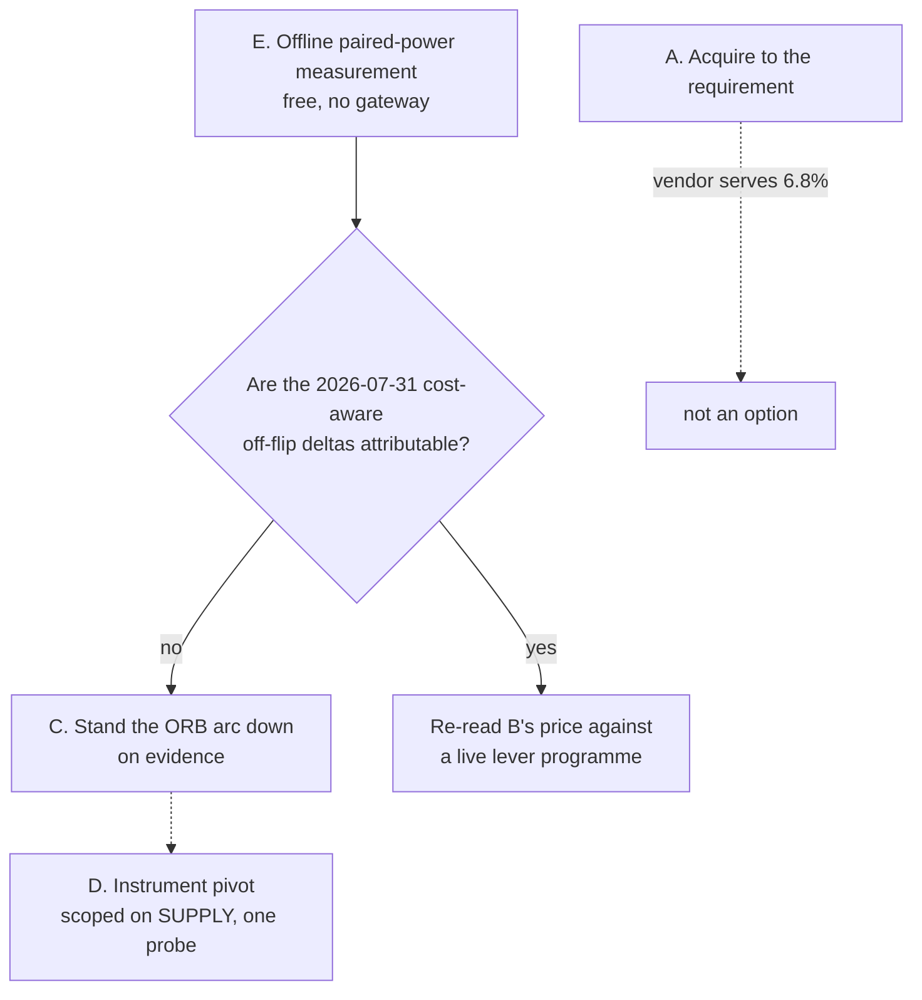
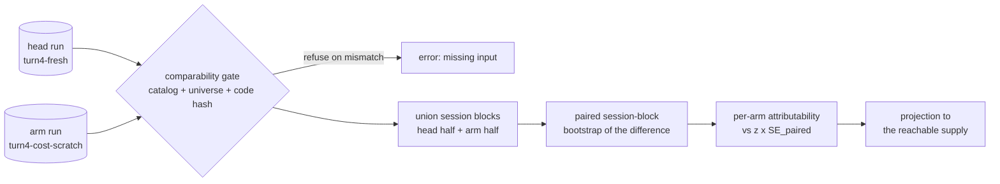
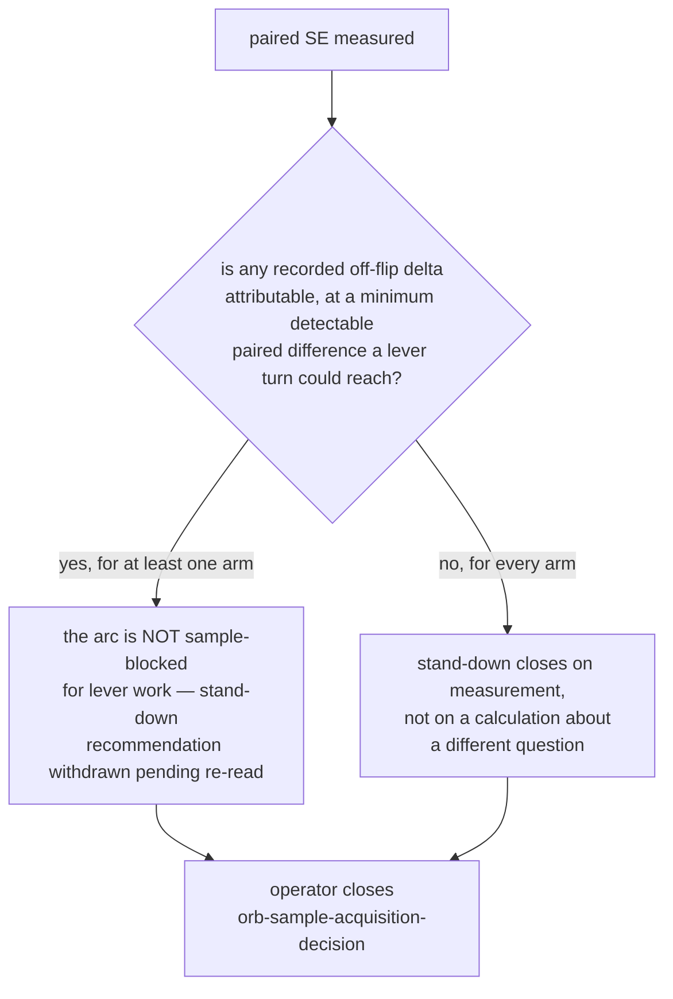

# ORB Sample Acquisition Decision - Plan

## Goal Capsule

- **Objective.** Price the four arms of the ORB sample-acquisition decision against the constraint that actually binds — the LS gateway's rolling minute-history window — and measure arm E, the offline paired power, so the operator can close `orb-sample-acquisition-decision` on evidence.
- **Product authority.** This plan owns the acquisition decision, the measurement that gates it, and the paired-power verb that produces it. It does not own lever selection, the instrument pivot, rung-1 re-entry, or the sample-sufficiency verdict itself, which it consumes as settled.
- **Execution profile.** Offline throughout. No gateway call, no ingest, no acquisition, no strategy code, no governed param. `strategy_code_hash` stays `7571abef…` and `adapters/nautilus/lab/config/preregistration.json` stays byte-identical at `abdb90a1…`.
- **Stop conditions.** The operator closes `orb-sample-acquisition-decision`; this plan informs it and never closes it. Stop and report rather than widening scope if an arm would require a gateway call before its named probe has run.
- **Open blockers.** None. Q1 (re-measure the served minute depth) gates arms B and D only; arm E is selected and needs no gateway call.
- **Tail ownership.** Gate, commit, and PR are in scope. The queue transition runs through `lab-next` after the gate, never by editing `queue/items.jsonl`.

---

## Product Contract

**Preservation note.** Product Contract restructured, no scope change. Every R-ID, AE-ID, and Key Decision keeps its meaning and number. Two edits: the feasibility bullet under Dependencies and Assumptions is corrected against the artifacts on disk (six off-flip arms, not seven; the head run lives under `data/turn4-fresh/`; trade and session counts are not uniform), and Q4 moves from Outstanding Questions to KTD3, which resolves it.

### Summary

Recommend running the offline paired-power measurement first, then standing the ORB arc down unless that measurement says lever work was never sample-blocked. The 14-year catalog the standing verdict asks for does not exist to be bought: LS serves minute bars from a rolling ~358-day window, which is 6.8% of the requirement, and the reachable remainder buys no decision. The measurement extends the existing `lab-research report` surface with a `paired` verb over a new paired-difference bootstrap in the lab's shared stats core, reading run artifacts already on disk.

### Problem Frame

The sample-sufficiency turn (TURN-LOG 2026-08-06, plan `docs/plans/2026-08-05-001-feat-orb-power-and-data-turn-plan.md`) left the acquisition open as a budget question: a fresh catalog at a ~14-year lookback, priced against the IGW00201 cumulative budget, weighed against a stand-down. Its successor queue item carries that framing forward and names four re-evaluation triggers — more sessions, a larger measured effect, lower clustering, higher participation.

The framing assumes the data is purchasable. It is not. `data/turn4-fresh/probes/minute-lookback.json` records the max-lookback probe of 2026-07-09: earliest served minute date `20250715`, depth `358` days. LS paper serves minute bars from a rolling window a little under a year deep. Counted against the frozen KRX calendar in `adapters/nautilus/state/krx.calendar.json`, that floor re-probed today reaches roughly 237 trading sessions. The requirement is 3,499 sessions, which reaches back to 2012-05-07. Daily bars go deeper, but ORB reads the opening range, so daily depth does not answer the sample question.

That converts the acquisition from a costing question into an availability question, and it changes what the remaining arms are worth. It also exposes a second constraint the trigger list does not mention: the margin frozen the same day carries an irremovable selection-tax floor of `+0.054302` net RoR, so no supply level clears it for a head measured at `−0.000607`.

### Key Decisions

- Price the reachable acquisition, not the required one. The 3,499-session catalog cannot be acquired at any budget, so costing it is costing a fiction. Governs R1, R2.
- Treat the supply ceiling as a measured figure with an expiry, not a fact. The lookback probe is dated 2026-07-09 and the window is rolling; every acquisition arm is gated on re-measuring it. Governs R3, R10.
- Judge each arm by whether it changes a decision, not by whether it adds data. Governs R6, R7, R11.
- Separate absolute detectability from paired detectability. The standing verdict measures whether the head's edge differs from zero; every lever turn asks whether one variant beats another over the same sessions, which has its own standard error that nothing in the tree has measured. Governs R8, R9.
- File the artifact as a requirements-only plan rather than a solutions doc. (session-settled: user-directed — chosen over framing the Product Contract as the operator's four questions, and over filing the load-bearing finding under `docs/solutions/`: the plan lineage from `2026-08-05-001` is what a downstream reader follows.)
- Leave `orb-sample-acquisition-decision` open. (session-settled: user-directed — chosen over closing it with the memo: the memo is evidence, and the arm selection is the operator's.) Governs R12.
- Take arm E. (session-settled: user-directed on 2026-08-07 — chosen over standing the arc down immediately and over funding the max-depth pull: the paired question is free to answer and nothing in the tree has answered it.) Governs R8, R9.

### The supply bound

| | |
|---|---|
| minute-history depth served | 358 days, earliest `20250715`, probed 2026-07-09 |
| reachable sessions if the floor is rolling | ~237 (floor ≈ 2025-08-13) |
| reachable sessions if the floor is fixed | ~258 (floor `20250715`) |
| sessions the catalog holds today | 54 (`20260518`..`20260804`) |
| sessions required at the pinned target `+0.028422 R` | 3,499, reaching back to 2012-05-07 |
| share of the requirement the vendor can serve | **6.8%** |

The reachable pull is a fresh catalog over the whole vendor window at the current 40-symbol universe, daily plus minute.

| cost line | figure |
|---|---|
| minute pages, honest | ~119 per symbol × 40 = ~4,760 t8412 pages, per the repo's own `estimate_pages` (1 page per 2 sessions) |
| minute pages, wasted | `collect_minute` submits the whole range as one chunk and `fetch_minute_chunk` caps at `MINUTE_MAX_PAGES = 100`, dispatching all 100 and discarding every bar before `requeue_halves` narrows — ~+4,000 calls, 1.8× the honest budget, unless the drip loop is pre-chunked |
| daily pages | ~1 per symbol, plus 3 universe-load calls once |
| pure request time at the 1/s per-TR cap | ~80 minutes, pre-chunked |
| IGW00201 backoff | cold budget sustains ≥600 calls; warm trips every ~13 pages at `refill_secs` 120 → ~9 trips per symbol |
| wall-clock | ~11–13 hours, realistically multi-day |
| collateral | the ingest holds the advisory lock for the whole run and shares the per-credential budget, so it blocks the morning chain |

The wall-clock is a model, not a measurement: `adapters/nautilus/lab/config/gateway-budget.json` carries `budget_calls: null` because the ceiling was never exhausted in the probe.

What the reachable pull detects: 237 sessions at 2.4667 closed trades per calendar session is 585 trades, effective n 271, minimum detectable edge **`+0.1092 R`** against the `+0.028422 R` target — still short by 3.84×. It does flip the two optimistic band rows (68 and 129 sessions) from NO to reachable, so it can refute the upper tail of the edge's own interval while remaining unable to confirm the edge.

Two further cost lines apply to any pull that reaches below 2016. `adapters/nautilus/src/rules.rs` pins `KRX_REGULAR_CLOSE` at 15:30 with no effective-date switch, but the close moved 15:00 → 15:30 on 2016-08-01 — so deep history mis-stamps sessions silently, with no error and no failing test (`docs/solutions/conventions/exchange-rule-constants-need-an-effective-date-switch-before-history-is-acquired.md`). And `adapters/nautilus/lab/config/turn4-universe.json` selects its 40 symbols by *current* market cap; the look-ahead its provenance calls "mild, disclosed and accepted" at 54 sessions is a year of survivorship at 237.

### The cheaper-power paths, tested

Holding ICC at `0.327334` and varying trades per trading session `m` against participation `p`, the observed pair reproduces the report's 3,499 exactly:

| m | p = 0.53 (observed) | p = 0.75 | p = 1.00 |
|---|---|---|---|
| 1 | 7,498 | 5,332 | 3,999 |
| 4.625 (observed) | **3,499** | 2,521 | 1,891 |
| 10 | 2,959 | 2,104 | 1,578 |
| → ∞ | 2,454 | 1,745 | **1,308** |

Three results follow, and the first is backwards from the trigger list.

Cutting cluster size makes the requirement worse, not better. One trade per session needs 7,498 sessions: the design effect falls, but the calendar rate falls faster. The queue item's trigger (c), "the clustering falls", only helps if ICC falls — never if cluster size does.

There is a clustering asymptote. At the measured ICC with full participation, even unbounded trades per session floors the requirement at 1,308 sessions, about 5.3 years. Triggers (c) and (d) together cannot reach the ~237-session ceiling. Driving ICC to zero at the observed cluster size and participation still needs 1,622 sessions.

Only trigger (b) moves the answer, because required n scales as the inverse square of the target. Fitting 237 sessions needs an edge of about `+0.109 R`, 3.8× the observed gross edge — a better strategy, not more data, and unmeasurable on this sample by construction.

The instrument pivot does not touch the target. KTD11 of `2026-08-05-001` pins the target at the *gross* edge, so removing the 20 bps sell tax changes profitability and never detectability, which is what that plan already recorded when it said a ported arc inherits the requirement. The one thing a pivot could change is supply: an instrument whose minute history the vendor serves deeper. That is the case for it, and it is unknowable offline.

The margin compounds the bound. Its threshold is `E[max]` plus `z · SE(candidate)`, and `E[max] = +0.054302` is a selection tax no amount of data removes:

| supply | candidate SE | margin threshold |
|---|---|---|
| 54 sessions (today) | 0.079421 | +0.209964 |
| 237 sessions (vendor maximum) | 0.037910 | +0.128605 |
| 3,499 sessions (the requirement) | 0.009866 | +0.073639 |

A head at `−0.000607` clears none of them. Acquisition alone unblocks rung-1 at no supply level.

### The priced options



| arm | cost | what it buys | consequence |
|---|---|---|---|
| A. Acquire to the requirement | — | — | Not an option. The vendor serves 237 of 3,499 sessions |
| B. Max-depth pull, ~237 sessions | ~11–13 h multi-day, ~4,800–8,800 gateway calls, blocks the morning chain, re-baselines every frozen figure | minimum detectable edge 0.109 R — excludes edges at or above that, nothing finer | Changes no decision: the margin stays unclearable at +0.1286 and the 0.028 R target stays invisible |
| C. Stand the arc down | Zero | Nothing measurable is forfeited | Rung-1 stays parked; the six kept levers stay unadjudicated |
| D. Instrument pivot | One `probe-lookback` on another lane | Whether supply is deeper elsewhere | Priceable only after that probe; the tax argument is not the case for it |
| E. Paired-power measurement | Offline, hours of lab-crate work | Whether the 2026-07-31 cost-aware off-flip deltas resolve at the sample held | Gates B and C on evidence rather than on a verdict about a different question |

The recommendation is E, then C. E is free and tests the one question the standing verdict did not ask. If paired power is adequate the arc is not dead and B's price is worth re-reading against a live lever programme; if it is not, the stand-down rests on measurement rather than on an absolute-edge calculation. B on its own is refused: it spends a multi-day gateway budget and destroys the provenance of a margin frozen on 2026-08-06 to buy an exclusion that moves no decision.

### What a landed acquisition re-baselines

Any arm that moves the catalog fingerprint away from `ac026541…` triggers all of the following before any figure binds again.

Must be re-derived:

- The frozen margin's provenance. `report sample` prints `RE-DERIVATION REQUIRED` on a fingerprint mismatch instead of adjudicating.
- `cross_trial_sd`, and through it `expected_max_null`. Its seven per-arm net RoR figures are the only same-catalog, same-cost-model arm set in the tree, so each of the six off-flip arms and the head must be re-run as a backtest. The trial count `N = 29` does not move — spent search cannot be un-spent — but grows with any new arm.
- The head's own distribution: net RoR, per-trade dispersion, ICC, Kish cluster size, design effect, and the bootstrap SE that sets the margin threshold. Precedent: v34's 119 trades re-measured as 111 on identical code and params.
- The null-calibration fixture `adapters/nautilus/lab/tests/fixtures/v35-closed-trades.json`, and with it the measured 0.0140 clearance rate that makes the margin a falsifier rather than a claim.
- The paired-power measurement this plan produces, and its fixture.
- The trades-per-calendar-session rate, the target-effect band, and every session count derived from them.

Becomes uncomparable:

- Every KEEP/REVERT verdict recorded for the six kept levers, all measured on prior catalogs.
- The falsified-candidate opening-range-width table. Its conclusion survives on a 5.5× margin, but the 139-envelope reading is catalog-specific.
- The v34 → v35 lineage and any `LS_TURN_EXPECT_VERSION` pin resolved against it.

Does not move: `preregistration.json`, which is byte-identical and SHA-pinned in `adapters/nautilus/lab/tests/sample_margin.rs` and has no consumer while the ladder is stood down; `adapters/nautilus/lab/config/transaction-costs.json`, whose rates are statutory; and `strategy_code_hash`, since no arm here edits strategy code.

A deep pull would also invalidate the universe. `adapters/nautilus/lab/config/turn4-universe.json` selects its 40 symbols by *current* market cap. A point-in-time universe would need a historical constituent source the repo does not have — `universe-metadata-20260723.json` carries no listing or delisting date across its 2,689 records.

### Requirements

**The reachable arm and its price**

- R1. State the acquisition's cost against the vendor's served minute-history depth rather than against the required lookback, and name that depth as the binding constraint.
- R2. Price the reachable pull in gateway calls, pacing, and wall-clock, separating the honest page count from the page count wasted by the un-chunked first attempt.
- R3. Prescribe pre-chunked per-symbol sub-ranges small enough that no single chunk exceeds the page cap, so the first attempt does not burn a full cap's worth of discarded dispatches.
- R4. State the wall-clock figure as a model bounded by an unmeasured budget ceiling, never as a measurement.
- R5. Name the operational collision with the morning chain that a multi-hour ingest causes.

**Deciding between the arms**

- R6. Report, for each arm, the minimum detectable edge it would reach and whether that changes any decision the operator faces.
- R7. Report the margin threshold implied by each supply level alongside the head's measured net RoR, so an arm that cannot unblock rung-1 is visible as such.
- R8. Measure the standard error of the per-session *paired* difference between the head and each off-flip variant from the surviving run artifacts, without a gateway call and without re-running a backtest.
- R9. State whether the recorded off-flip deltas are attributable at the current sample under that paired standard error, and at the reachable one. Attributability means out-of-sample replication over the session-generating process — the delta would survive a different draw of sessions from the same regime. The arms are deterministic re-simulations on identical bars, so no part of the verdict is a causal claim about the lever on the sessions actually held.
- R10. Gate every acquisition arm on re-measuring the served minute depth first, treating the recorded probe as expired.

**Governance**

- R11. Reach a recommendation that names its rejected arms and the reason each was rejected.
- R12. Leave `orb-sample-acquisition-decision` open and route any queue change through `lab-next` after a gate run, never by editing `queue/items.jsonl`.
- R13. Move `strategy_code_hash` and `adapters/nautilus/lab/config/preregistration.json` not at all, and verify both rather than asserting them.

R1 through R7, R10 and R11 are satisfied by the Product Contract sections above — the priced comparison *is* the memo. The Implementation Units below deliver R8, R9, R12 and R13.

### Acceptance Examples

- AE1. Covers R1, R6.
  - **Given** an operator reading the memo to decide whether to fund the acquisition,
  - **When** they reach the priced options,
  - **Then** they find the required lookback marked unavailable rather than expensive, and the reachable pull marked as buying no decision.
- AE2. Covers R8, R9.
  - **Given** the paired-difference standard error measured from the existing artifacts,
  - **When** it shows the recorded off-flip deltas are already attributable at the sessions held,
  - **Then** the arc is not sample-blocked for lever work and the stand-down recommendation is withdrawn pending a re-read.
- AE3. Covers R10.
  - **Given** any arm that would call the gateway,
  - **When** it is taken,
  - **Then** the served minute depth is re-probed first and the session ceiling recomputed from that reading, not from the 2026-07-09 figure.
- AE4. Covers R7.
  - **Given** a supply level at or below the vendor's ceiling,
  - **When** the margin threshold is computed at that level,
  - **Then** it exceeds the head's measured net RoR, and the memo says so rather than implying acquisition unblocks rung-1.
- AE5. Covers R8.
  - **Given** the paired report run against the head and one off-flip arm,
  - **When** the point estimate of the paired difference is printed alongside that arm's union and head-intersection block counts,
  - **Then** it equals that arm's whole-run net RoR — recomputed from the artifacts, not read from the four-decimal frozen record — subtracted from the head's, so the measured quantity is the recorded delta and not a differently-scoped one. The check only discriminates for arms whose union exceeds the intersection, which the printed counts make visible.

### Scope Boundaries

**Deferred for later**

- Executing acquisition arms B or D. This plan produces the priced comparison, a recommendation, and the arm-E measurement; the operator selects among the rest.
- Re-reading the six kept levers against a net objective, which stays parked behind the paired-power result.
- Re-noting `report-sample-catalog-read-metadata-only`. Its stated justification is the 65× catalog growth this plan says will not happen, so its priority falls — worth recording on the item, not fixing here.

**Deferred to Follow-Up Work**

- An effective-date switch for `KRX_REGULAR_CLOSE` in `adapters/nautilus/src/rules.rs`. It is a prerequisite for any pre-2016 acquisition, not for this plan, and it belongs to the acquisition layer.
- Re-running the six off-flip arms on a fresh catalog. Needed only if an acquisition lands and the paired figures must be re-derived.

**Outside this arc**

- The sample-sufficiency verdict itself, consumed as settled.
- Rung-1 re-entry and prereg v3+, carried by `rung1-ladder-reentry-margin-clearing-head`.
- Porting ORB to a low-tax instrument as a *tax* decision. A pivot is in scope here only as a supply question.

### Dependencies and Assumptions

- The recorded lookback probe describes a rolling window rather than a fixed floor. Under the fixed reading the ceiling is ~258 sessions rather than ~237, which changes no verdict.
- The probe was taken on a paper lane. Whether a production or paid tier serves deeper minute history is a vendor question, not a probe this repo can run.
- The 40-symbol universe and `max_concurrent 7` are held fixed. Widening the universe adds trades inside blocks already held and is capped by `max_concurrent`, so it does not convert into effective n.
- The sensitivity table holds ICC fixed while varying cluster size, and equates Kish and mean cluster size in the hypotheticals. The observed pair reproduces the reported 3,499 exactly, which anchors it.
- The paired-power hypothesis is untested. It sits alongside the standing verdict, which measures absolute attribution correctly; nothing here contradicts it.
- The paired measurement is feasible from artifacts already on disk, verified 2026-08-07 — with three corrections to the figures the queue item recorded. There are **six** off-flip arms, `20260731T023248Z-backtest-orb-v92` through `-v97` under `data/turn4-cost-scratch/runs/`; the first entry in the frozen record's `cross_trial_arms` is the head itself. The head run is `20260731T023138Z-backtest-orb-v35` under **`data/turn4-fresh/runs/`**, not under `turn4-cost-scratch`. Trade and session counts are not uniform: the arms carry 104 to 254 closed trades over 24 to 41 sessions against the head's 111 over 24. The conclusion holds — all seven runs share `catalog_fingerprint ac026541…`, `universe_hash 2dfc00d7…` and `strategy_code_hash 7571abef…`, and each arm differs from the head by its named lever, so no backtest re-run is needed.
- `20260731T022007Z-backtest-orb-v90` and `-v91` are excluded. Their `performance.json` files are byte-identical and carry no `cost_commission_rate_per_side` or `cost_sell_tax_rate`, so pairing them against the cost-armed arms would confound the lever flip with the cost model.
- The `seed-off-*-v8x` directories are manifest-only stubs with no `performance.json`, duplicating the v92–v97 param flips. They are not an eighth through thirteenth arm.
- `data/` is gitignored, so the run artifacts are machine-local. The committed fixture is what carries the distribution into CI; if the artifacts are lost before U2 lands, the arms must be re-run before R8 can proceed.

### Outstanding Questions

**Deferred — none blocks this plan.** Q1 through Q3 gate acquisition arms this plan does not execute. Q4 through Q6 each have a recorded default the implementer follows absent a decision, so they shape the work without stopping it.

- Q1. Does the served minute depth still read ~358 days? Probe: `LS_INGEST_MODE=probe-lookback` on the domestic lane, pilot `005930`. One paced sequence, credential-safe. Blocks arms B and D per R10; arm E does not wait on it.
- Q2. What is the IGW00201 ceiling and refill on a warm bucket? Probe: warm the t8412 bucket, then run `budget-probe` with a raised `LS_PROBE_CEILING`. Until it runs, the 11–13 hour figure stays a model. Needed only if an acquisition arm is selected.
- Q3. Does another instrument's lane serve deeper minute history? Probe: `probe-lookback` against that lane. Needed only if the pivot arm is selected. Its gating is circular as written — the arm is unpriceable until probed and the probe waits on selecting the arm — so if the stand-down branch is taken, run the probe as the first action under it rather than as a consequence of choosing the pivot.
- Q4. Which critical value gates the stand-down withdrawal — the per-arm value KTD9 makes primary, or the family-wide multiplicity-adjusted one? The routing gate fires on "at least one arm," which is itself a max-of-six, and the frozen margin already applies a selection tax over these same arms. A third reading would exclude the confounded risk-sizing arm from the routing decision while still printing it. Absent a decision the implementer follows KTD9's per-arm primary and prints both.
- Q5. Should the `report paired` verb and its CLI tests be deferred behind the verdict? Under the plan's own E-then-C recommendation `lab-research` gains a fifteenth verb with no remaining caller, and U3 plus U4 are the larger half of the engineering for a figure read once — while U1, U2, U5 and U6 already deliver the decision and its audit trail. Absent a decision the implementer follows KTD1 and builds the verb.
- Q6. Does the supply-ceiling Key Decision govern R3? Its stated rationale is probe expiry and re-measurement, which supports R10; R3 is about pre-chunking per-symbol sub-ranges under the page cap and has no bearing on expiry.

### Sources

- `adapters/nautilus/lab/TURN-LOG.md` — the 2026-08-06 sample-sufficiency entry, its unit correction, and the 2026-07-31 off-flip table that supplies the frozen dispersion.
- `adapters/nautilus/lab/config/SAMPLE-MARGIN.md` and `sample-margin.json` — the frozen rule, its inputs, and the fingerprint-keyed re-derivation trigger.
- `docs/plans/2026-08-05-001-feat-orb-power-and-data-turn-plan.md` — the parent plan; its Problem Frame carries a dated in-place correction, and TURN-LOG is the authority on the figures.
- `data/turn4-fresh/probes/minute-lookback.json` — the served-depth measurement that binds this decision.
- `adapters/nautilus/state/krx.calendar.json` — the frozen KRX calendar, coverage 2010-01-04..2027-07-22, used to convert lookback days into trading sessions.
- `adapters/nautilus/src/ingest/mod.rs` — `estimate_pages`, `MINUTE_MAX_PAGES`, and `collect_minute`'s narrow-and-requeue path, which together set the page budget.
- `adapters/nautilus/lab/config/gateway-budget.json` — the measured budget model, with the unmeasured ceiling recorded as `budget_calls: null`.
- `docs/solutions/integration-issues/ls-gateway-igw00201-bulk-minute-ingest-drip-feed.md` — the drip runbook, the warm-versus-cold finding, and the standing verdict that a deep multi-symbol pull stays multi-day.
- `docs/solutions/integration-issues/ls-gateway-t8412-chart-all-pagination-burst-and-silent-truncation.md` — the per-TR pacing requirement on the minute path.
- `docs/solutions/conventions/range-scoped-comparability-scope-every-derived-input.md` — a catalog fingerprint is range-scoped over hashed bars only; a derived selection can drift beneath an identical hash. Why U3 gates on universe hash and code hash too.
- `docs/solutions/conventions/performance-json-realized-r-is-risk-normalized-not-internal-r-denom.md` — `realized_r ≡ realized_pnl / risk_capital` exactly, so the crux objective is a ratio of sums and a paired difference is a difference of ratios.
- `docs/solutions/conventions/exchange-rule-constants-need-an-effective-date-switch-before-history-is-acquired.md` — the 15:00 → 15:30 close move of 2016-08-01, unswitched in `rules.rs`.
- `docs/solutions/workflow-issues/unbounded-accumulate-ingest-widens-the-catalog-and-moves-the-head-universe.md` — universe widening displaces trades as well as adding them.
- `adapters/nautilus/lab/config/turn4-universe.json` — the 40-symbol selection and its disclosed current-market-cap look-ahead.
- `data/turn4-fresh/runs/20260731T023138Z-backtest-orb-v35` and `data/turn4-cost-scratch/runs/20260731T023248Z-backtest-orb-v92` .. `-v97` — the head and the six off-flip arms that make the paired measurement possible without a re-run.

---

## Planning Contract

### Key Technical Decisions

- KTD1. Ship the measurement as a `report paired` verb on `lab-research`, implemented in `adapters/nautilus/lab/src/runner/report.rs`. The `report sample` verb landed there one commit back (`8c495bb`) and established every convention this needs: env-only config, `Vec<String>` output lines, a verdict that exits zero, and a read-only posture. A standalone binary would duplicate all of it. Governs R8.

- KTD2. Add a paired-difference bootstrap as a new `pub fn` in `adapters/nautilus/lab/src/stats.rs` rather than reusing `block_bootstrap_ratio`. The existing function resamples one arm's `(numerator, denominator)` blocks; a paired design must draw a session index once and apply it to *both* arms, which is what cancels the session-level common shock and is the whole point of the measurement. The cancellation applies only to blocks both arms traded, so for an arm that adds sessions the reported SE is a hybrid — U3 prints the shared and arm-only components separately rather than leaving that implicit. Reuse `SplitMix64`, `sample_sd`, `percentile`, and the `BootstrapOutcome` shape so the new function is the same instrument pointed at a difference. Governs R8.

- KTD3. Pair on **net RoR**, the ratio of sums `Σ realized_pnl / Σ risk_capital`, not on mean per-trade r. (session-settled: user-directed — chosen over mean per-trade r, which is less sensitive to session-level risk-capital swings: net RoR is the statistic the 2026-07-31 cost-aware off-flips were measured on and the one `sample-margin.json` already names, so a paired figure in any other unit could not be compared to the recorded deltas.) The measurement adjudicates those cost-aware off-flip deltas, not the original KEEP/REVERT verdicts, which were reached on prior catalogs against gross-RoR gates. This resolves the Product Contract's former Q4. Governs R8, R9.

- KTD4. Build blocks over the **union** of sessions either arm traded, not the intersection. (session-settled: user-directed — chosen over the 24-session intersection: only the union makes the point estimate equal the arm's recorded whole-run delta, because a session an arm did not trade contributes nothing to either sum. An intersection would silently measure a different quantity than the one TURN-LOG recorded.) The head trades 24 sessions and is a subset of every arm; the arms add 0, 1, 2 or 17 sessions of their own. AE5 is the check. Governs R8, R9.

- KTD5. Refuse a bootstrap replicate whose head or variant denominator is non-positive, and refuse the whole measurement when fewer than two usable replicates survive — mirroring `block_bootstrap_ratio`'s existing handling. With 17 of 41 head half-blocks empty on the widest arm, an all-empty draw is reachable rather than theoretical. A silently-dropped replicate set would understate the standard error. Governs R8.

- KTD6. Report the risk-sizing arm as **confounded**, do not drop it. `20260731T023309Z-backtest-orb-v95` flips two params — `risk_per_trade_krw` 299,340 → 0.0 *and* `ratio_atr_alpha` 1.0 → 0.0 — while `sample-margin.json` labels the arm by the first alone. (session-settled: user-directed — chosen over dropping the arm, which would silently change the frozen record's arm count from six to five.) The verb derives each arm's label from the manifest param diff against the head rather than from the frozen label, so the confounding is printed, not assumed away. Governs R9.

- KTD7. Gate the pairing on `catalog_fingerprint`, `universe_hash` **and** `strategy_code_hash` matching between head and arm, and refuse the pair on any mismatch. A fingerprint is range-scoped over hashed bars only, so an identical hash does not prove an identical derived universe (`docs/solutions/conventions/range-scoped-comparability-scope-every-derived-input.md`). All seven runs match today; the guard is what keeps a future re-run from being paired against a stale head. Governs R8, R13.

- KTD8. Commit a closed-trade fixture for the head and the six arms, mirroring `adapters/nautilus/lab/tests/fixtures/v35-closed-trades.json` in shape and in its "fields are verbatim, nothing here is derived" contract. `data/` is gitignored, so this is the only way CI can hold the distribution the verdict rests on — the same reason the v35 fixture exists. Governs R8, R9.

- KTD9. Report per-arm attributability at the frozen confidence as the primary verdict, with a family-wide multiplicity line as a secondary reading. The six arms were each judged in their own turn, not selected as a max-of-six, so a per-arm critical value is the honest primary; printing the six-arm adjusted value alongside it keeps the selection question visible without silently changing the standard. Which of the two gates the stand-down withdrawal is an open question — see Outstanding Questions. Governs R9.

- KTD10. Report paired power at the reachable supply as well as the current one, by scaling the measured paired SE by `sqrt(45 / 237)`. The root is the head run's in-range **calendar** sessions over the reachable calendar ceiling. 24 is the trade-producing count and must never denominate a calendar-session target — that is the unit slip `RateBasis` in `adapters/nautilus/lab/src/runner/report.rs` already guards, and the one the 2026-08-06 turn corrected. The factor is the same for every arm because each arm's union block count scales by the same 237/45. State it as a projection under an unchanged clustering structure, not a measurement. Governs R9.

- KTD11. Print the minimum detectable **paired** difference alongside each arm's verdict, and take the "arc is not sample-blocked" branch only when that figure is at or below the effect class a candidate lever turn produces. The six arms are whole-lever-OFF flips carrying deltas of 0.024 to 0.081 against a head gross edge of 0.028 — the largest effects the design space contains by construction. Detecting them does not establish that a marginal lever turn is measurable, and without this gate U6 would record a conclusion broader than the measurement supports. Governs R9.

### High-Level Technical Design

The measurement is a read-only fold from two run directories to one verdict. Nothing writes into a run dir, and no path reaches an ingest entry point.



The verdict routing the measurement feeds is a two-way gate, and both exits are legitimate completions:



The paired block is the structural change. Where `report sample` folds one arm's trades into `Vec<Block>` and resamples blocks with replacement, the paired form holds a `(head_half, arm_half)` pair per session and draws the *same* index for both halves in every replicate. Directional only — the exact type shape is the implementer's call:

```
per session s in union(head_sessions, arm_sessions):
    pair[s] = ( trades_head[s] as (pnl, risk) list ,
                trades_arm[s]  as (pnl, risk) list )     // either half may be empty

replicate:
    draw |pair| session indices with replacement
    accumulate num_h, den_h, num_v, den_v over the drawn pairs
    if den_h > 0 and den_v > 0:  record  num_h/den_h - num_v/den_v
```

### Assumptions carried into implementation

- The arms' `performance.json` files are still on the machine when U2 runs. U2 exists to remove this dependency for every later step.
- Session identity is the KST date of `ts_opened`, matching `report sample`'s existing `kst_date_of` key. A different key would not pair against the recorded deltas.
- The lab crate's five existing binaries and their tests are unaffected. This plan adds a verb; it changes no existing verb's output.

### Sequencing

U1 and U2 are independent and can land in either order. U3 needs both. U4 and U5 need U3. U6 needs the full test surface green. U7 and U8 close out. The natural PR shape is one branch: the measurement is not useful in halves, and its verdict is what the turn records.

---

## Implementation Units

### U1. Paired session-block bootstrap in the shared stats core

**Goal.** Give `stats.rs` a function that returns the standard error, interval, and one-sided evidence share for the difference between two arms' ratio statistics under paired session resampling.

**Requirements.** R8. Instantiates KTD2, KTD3, KTD5.

**Dependencies.** None.

**Files.**
- `adapters/nautilus/lab/src/stats.rs` — new paired block type and `pub fn`.
- `adapters/nautilus/lab/tests/stats_derivation.rs` — unit and property tests.

**Approach.**
1. Add a paired block type holding one session's head-side and arm-side `(numerator, denominator)` records; either side may be empty.
2. Add the paired bootstrap function, taking blocks, replicates, seed, and confidence, and returning the existing `BootstrapOutcome` shape. `point` is the observed difference of ratios, `p_positive` is the share of replicates where the head exceeds the arm, and `blocks` is the union session count.
3. Pre-fold each block's two halves to their `(Σnum, Σden)` pairs before the replicate loop, mirroring how `block_bootstrap_ratio` folds today, so the loop is linear in sessions rather than trades.
4. Draw one index per slot and apply it to both halves. This is the pairing; drawing independently per arm would silently produce the unpaired SE.
5. Refuse fewer than two blocks, zero replicates, and a confidence outside `(0, 1)`, matching the existing error vocabulary. Skip a replicate whose either denominator is non-positive; refuse the call when fewer than two replicates survive.

**Patterns to follow.** `block_bootstrap_ratio` at `adapters/nautilus/lab/src/stats.rs:688` — its pre-fold, its `SplitMix64` use, its percentile tails, and its `StatsError` refusals. Keep the new function pure and formatting-free; the CLI text belongs in `report.rs`.

**Test scenarios.**
- A two-session set where both arms are identical returns a point estimate of exactly zero and a standard error of exactly zero.
- A set where the arm's numerators are uniformly shifted returns a point estimate equal to the closed-form difference of ratios, to full float tolerance.
- Paired resampling on a set with a large shared session effect returns a strictly smaller standard error than resampling each arm independently on the same data — the property that makes the measurement worth taking.
- A block whose head half is empty contributes the arm's trades and nothing to the head sums; the point estimate matches the same data with that session's head half absent.
- A set where every head half is empty is refused, not returned as a degenerate zero.
- One block is refused with the too-short error; zero replicates is refused; confidence of `0.0` and `1.0` are both refused.
- The same seed and blocks return a bit-identical outcome across two calls; a different seed returns a different standard error.
- A block whose denominators sum to zero on one side is skipped rather than producing a non-finite draw.

**Verification.** `stats_derivation.rs` passes with the new cases, and every assertion is reproduced from named constants and the formula under test rather than from a snapshot of the implementation's own output.

---

### U2. Commit the paired-arm closed-trade fixture

**Goal.** Carry the head and six arms' closed-trade distributions into the repository so the derivation guard runs in CI, where `data/` does not exist.

**Requirements.** R8, R9. Instantiates KTD8.

**Dependencies.** None.

**Files.**
- `adapters/nautilus/lab/tests/fixtures/paired-arms-closed-trades.json` — new.

**Approach.**
1. Extract, for the head run and each of the six arms, every closed trade's KST session, `realized_r`, `risk_capital`, and `realized_pnl` verbatim from `performance.json`. Derive nothing.
2. Key the arms by `strategy_version`, and carry per arm: `run_id`, `catalog_fingerprint`, `universe_hash`, `strategy_code_hash`, `trade_records`, `closed_trades`, the manifest param diff against the head, and the arm's recorded net RoR from `sample-margin.json`.
3. Carry a `_comment` stating the extraction date, the plan unit, that `data/` is gitignored, and that fields are verbatim — matching the contract `v35-closed-trades.json` already sets.
4. Record the risk-sizing arm's two-param diff as extracted, not as the frozen record labels it (KTD6). Exclude `strategy_version` from every recorded diff, so the fixture's labels match what U3 derives.

**Patterns to follow.** `adapters/nautilus/lab/tests/fixtures/v35-closed-trades.json` — wrapper object, verbatim-fields contract, session as the KST date of `ts_opened`.

**Test scenarios.** None in this unit; U5 is where the fixture is asserted against. `Test expectation: none — this unit adds data, not behavior.`

**Verification.** Each arm's recomputed net RoR reproduces its matching `cross_trial_arms` entry in `adapters/nautilus/lab/config/sample-margin.json`, and the head's reproduces `cross_trial_arms[0]` (the v35 baseline row). The head's closed-trade and session counts reproduce `provenance.closed_trades` and `provenance.sessions`. `cross_trial_arms` records no per-arm trade count, so there is nothing to check the arms' counts against there.

---

### U3. The `report paired` verb

**Goal.** Add a read-only verb that resolves a head run and one or more arm runs, gates their comparability, builds union session blocks, and prints the paired difference, its standard error, interval, and per-arm attributability.

**Requirements.** R8, R9, R13. Instantiates KTD1, KTD4, KTD6, KTD7, KTD9, KTD10, KTD11.

**Dependencies.** U1, U2.

**Files.**
- `adapters/nautilus/lab/src/runner/report.rs` — config struct, outcome struct, the report function.
- `adapters/nautilus/lab/src/runner/research.rs` — dispatch arm, `USAGE` const, the unknown-subcommand bail message, and an env-config builder.

**Approach.**
1. Promote `sample_trades` to `pub(crate)` and reuse it for both arms. It already returns exactly the per-trade fields the pairing needs and already refuses pre-field vintages and degenerate risk capital.
2. Resolve the head run and the arm runs from env. The head is under `turn4-fresh` and the arms under `turn4-cost-scratch`, so `SampleConfig`'s single `data_home` cannot be copied: the paired config carries a `head_home` from `LS_DATA_HOME` with `LS_REPORT_RUN`, an `arm_home` from a new `LS_PAIRED_ARM_HOME`, and the arm run ids from a comma-separated `LS_PAIRED_ARMS`. Resolve each home through the existing `data_home_from_env` helper shape. Refuse an absent head run id rather than defaulting to the latest finalized run, which under `turn4-fresh` is not v35.
3. Gate each pair on matching `catalog_fingerprint`, `universe_hash`, and `strategy_code_hash`, refusing the pair with a message naming which of the three diverged (KTD7). A refusal here is a missing input, not a verdict.
4. Derive each arm's label from its manifest param diff against the head, excluding `strategy_version` — it differs on every arm by construction and is the run's identity, not a lever. Without that exclusion every arm prints as multi-param and KTD6's confound signal is destroyed.
5. Build union session blocks and call the U1 function at the frozen confidence, with the same replicate and seed defaults `report sample` uses.
6. Print, per arm: the label, the union and head-intersection block counts, the observed difference decomposed into its shared-session and arm-only-session components, the recorded delta from `sample-margin.json` as a four-decimal cross-check, the bootstrap standard error, the interval, the minimum detectable paired difference (KTD11), and whether the observed difference exceeds the per-arm critical value. Then the family-wide multiplicity line (KTD9) and the projection to the reachable supply (KTD10).
7. Preserve `report sample`'s staging guard: no KRW-denominated P&L or expectancy figure reaches the output. Net RoR and its difference are the adjudicated statistics and are printed.
8. Exit zero for every verdict. Only a missing or unusable input fails.
9. Register the verb in all three places `report sample` occupies: the dispatch match arm, the `USAGE` const, and the `other =>` bail text.

**Execution note.** Write the AE5 identity check first — that the printed point estimate equals the head's recorded net RoR minus the arm's — before the surrounding report. It is the assertion that proves the union-block choice measures the recorded quantity, and getting it late invites quietly settling for the intersection.

**Patterns to follow.** `report_sample` at `adapters/nautilus/lab/src/runner/report.rs:993` for the whole shape: run resolution via `read_manifest` / `latest_finalized_run`, `defaulted_run` header marking, `Vec<String>` line accumulation, a structured outcome for tests alongside the lines. `sample_config_from_env` at `adapters/nautilus/lab/src/runner/research.rs:1996` for the env-config builder, including its `parsed` helper that hard-fails on a present-but-unparseable override.

**Test scenarios.** Covered in U4.

**Verification.** `lab-research report paired` against the real head and the six arms prints a point estimate per arm that matches `head_net_ror − arm_net_ror` to six decimal places, both figures recomputed from the run artifacts rather than read from the frozen record, and exits zero.

---

### U4. CLI behavior and structural tests for the verb

**Goal.** Prove the verb's wiring, refusals, and read-only posture against synthetic runs, without depending on machine-local artifacts.

**Requirements.** R8, R13. Covers AE5.

**Dependencies.** U3.

**Files.**
- `adapters/nautilus/lab/tests/research_cli.rs` — a new `mod report_paired` block.

**Approach.**
1. Extend the existing `write_run` helper to take `run_id`, `universe_hash`, `strategy_code_hash`, and an `OrbParams` override — today it hardcodes all four, so the three-hash refusal tests and the two-param-label test cannot be built against it. Existing `report_sample` call sites pass the current defaults. Write head and arm runs into two separate tempdirs, matching the two-home resolution U3 specifies. Reuse `trade` and `frozen_fingerprint` unchanged.
2. Add the two structural tests the `report_sample` module already carries, adapted: that no code path in the paired report reaches an ingest entry point, and that the compiled binary's unknown-subcommand bail enumerates `report paired` alongside the existing verbs.
3. Keep every assertion on a value reproduced from the test's own constructed inputs, never on a snapshot of the implementation's output.

**Patterns to follow.** `mod report_sample` at `adapters/nautilus/lab/tests/research_cli.rs:2391`, and specifically `no_code_path_in_the_sample_report_reaches_an_ingest_entry_point` (:3041) and `report_sample_is_enumerated_by_the_compiled_bins_unknown_mode_bail` (:3076).

**Test scenarios.**
- Covers AE5. A synthetic head and arm whose whole-run net RoRs are known by construction produce a point estimate equal to their difference, to full float tolerance.
- An arm sharing no sessions with the head is still measurable over the union, and the head contributes zero to the sessions it did not trade.
- An arm whose `catalog_fingerprint` differs from the head's is refused, and the message names the fingerprint as the diverging field.
- An arm whose `universe_hash` differs but whose fingerprint matches is refused, and the message names the universe hash — the case a fingerprint-only gate would pass.
- An arm whose `strategy_code_hash` differs is refused, and the message names the code hash.
- A run with no closed trades is refused with a missing-input error, not reported as a zero-size sample.
- A run carrying null `risk_capital` on a closed trade is refused as a pre-field vintage.
- An arm flipping two params prints both in its label, not one.
- A present-but-unparseable replicate or seed override is a loud refusal, not a silent fallback to the default.
- The verb exits zero when every arm's difference is unattributable — a stand-down is a completion.
- No output line carries a KRW-denominated P&L or expectancy figure.
- The verb appears in the compiled binary's `USAGE` string and in its unknown-subcommand bail text.
- No code path in the paired report reaches an ingest entry point.

**Verification.** `cargo test -p nautilus-ls-lab --test research_cli` passes from `adapters/nautilus`, with the new module's cases present in the result count.

---

### U5. Derivation guard against the committed fixture

**Goal.** Recompute the paired verdict from the fixture through `stats.rs`, so every reported figure is derived and auditable rather than typed in.

**Requirements.** R8, R9. Covers AE5.

**Dependencies.** U1, U2, U3.

**Files.**
- `adapters/nautilus/lab/tests/paired_power.rs` — new, hermetic.

**Approach.**
1. Read only `adapters/nautilus/lab/tests/fixtures/paired-arms-closed-trades.json` and `adapters/nautilus/lab/config/sample-margin.json`. Reach no run directory and no data home.
2. Reproduce each arm's recorded net RoR from the fixture's trades, and assert it matches the `cross_trial_arms` entry.
3. Reproduce each paired point estimate and assert the AE5 identity holds for all six arms, printing each arm's union and head-intersection block counts so it is visible which arms the check discriminates on. Only the gap-retention arm has a union materially wider than the intersection; for the zero-added-session arms the identity holds under an intersection too, so a green result there proves less.
4. Assert the attributability verdict per arm from the measured standard error and the frozen confidence, recomputed rather than asserted against a stored verdict string.
5. Assert the reachable-supply projection equals the measured SE scaled by `sqrt(45 / 237)` per KTD10.

**Execution note.** This is the unit whose green means nothing on its own — a fixture-derived test passes before and after a behavior change. Make each assertion falsifiable by construction: reproduce the figure from named constants and the formula, so a wrong formula fails even though the fixture is unchanged. See `docs/solutions/conventions/coverage-only-change-is-verified-by-mutation-not-by-the-gate.md` and `docs/solutions/conventions/assert-on-a-fact-the-parent-emits-not-the-childs-own-marker.md`.

**Patterns to follow.** `adapters/nautilus/lab/tests/sample_margin.rs` — its hermetic input set, its derive-don't-assert discipline, and its `loading_cites_the_exact_bytes` citation-integrity shape.

**Test scenarios.**
- Each of the six arms' net RoR recomputed from the fixture matches its `cross_trial_arms` entry to the precision the frozen record carries.
- The head's recomputed net RoR matches `cross_trial_arms[0]`; its closed-trade and session counts match `provenance.closed_trades` and `provenance.sessions`.
- Covers AE5. Each arm's paired point estimate equals the head's net RoR minus that arm's, to six decimal places, with both recomputed from the fixture rather than read from the four-decimal frozen record.
- For each arm, the paired standard error computed on the fixture is strictly smaller than the standard error the same blocks produce under independent per-arm resampling, taken as `sqrt(SE_head² + SE_arm²)`. This is a property of these seven runs — pairing reduces variance only where the two arms' per-block contributions covary, and the arm-only blocks contribute no covariance — so the assertion records a measured fact about the fixture, not a theorem about the estimator. It does not assert the verdict, which belongs in the turn record.
- The fixture's per-arm `catalog_fingerprint`, `universe_hash`, and `strategy_code_hash` are identical across all seven entries.
- The risk-sizing arm's recorded param diff carries two entries, not one.
- Mutating one fixture trade's `realized_pnl` changes the recomputed net RoR for exactly that arm and no other.

**Verification.** `cargo test -p nautilus-ls-lab --test paired_power` passes from `adapters/nautilus` with no data home set, proving the guard is hermetic.

---

### U6. Run the measurement and record the verdict

**Goal.** Execute the verb against the real artifacts, and write the turn record that carries the verdict and its routing.

**Requirements.** R9. Covers AE2.

**Dependencies.** U3, U4, U5.

**Files.**
- `adapters/nautilus/lab/TURN-LOG.md` — one new entry, inserted immediately after the standing head-lineage section.

**Approach.**
1. Run `report paired` against the head under `data/turn4-fresh` and the six arms under `data/turn4-cost-scratch`, capturing the output verbatim.
2. Write the TURN-LOG entry: a heading naming the axis and the verdict in caps, a first bullet stating what did *not* change (`strategy_code_hash` unchanged at `7571abef…`, head stays v35), a metrics table of the per-arm figures, and closing bullets for deviations against this plan's KTDs and the queue successor.
3. State the verdict routing explicitly: whether the arc is sample-blocked for lever work, and what that does to the stand-down recommendation. Record the minimum detectable paired difference alongside the per-arm verdicts, and state that the six arms are whole-lever-OFF flips and therefore an upper bound on the effect sizes lever work will present (KTD11). Define attributability as R9 does — out-of-sample replication over the session-generating process — so a later reader cannot cite the entry as a causal claim about the levers.
4. If the measurement finds paired power adequate for one or more arms, record that the stand-down recommendation is withdrawn pending a re-read — and do not re-read the levers here, which is deferred.

**Patterns to follow.** The 2026-08-06 entry at `adapters/nautilus/lab/TURN-LOG.md:63` — reverse-chronological placement, `## Turn — <axis>: <VERDICT>` heading, bolded claim sentences, an indented metrics table, and a closing Queue bullet.

**Test scenarios.** `Test expectation: none — this unit records a measurement; U5 is where the figures are guarded.`

**Verification.** The TURN-LOG entry's figures match the verb's captured output line for line, and the entry names the verdict routing for both branches of the gate.

---

### U7. Capture the transferable findings as a repository learning

**Goal.** Give the statistical findings a durable home. The learnings store has no entry covering power, design effect, intra-cluster correlation, bootstrap standard error, or selection tax.

**Requirements.** R11.

**Dependencies.** U6.

**Files.**
- `adapters/nautilus/lab/config/SAMPLE-MARGIN.md` — one cross-reference line to the new entry.
- `docs/solutions/conventions/` — one new entry.

**Approach.**
1. Write one entry carrying the findings that generalize past this turn: that trades-per-session must divide by *calendar* sessions and not trade-producing ones, which roughly doubled the shortfall from ~1,866 to ~3,499; that a paired comparison has its own standard error which an absolute-detectability verdict does not answer; and that cutting cluster size raises the session requirement rather than lowering it, which is backwards from intuition.
2. Follow the frontmatter shape of the existing `docs/solutions/conventions/` entries: `title`, `date`, `category`, `module`, `problem_type`, `component`, `severity`, `tags`.
3. Keep the entry about the transferable rule. Point at TURN-LOG and this plan for the turn-specific figures rather than restating them.

**Patterns to follow.** `docs/solutions/conventions/range-scoped-comparability-scope-every-derived-input.md` for frontmatter and for the problem-then-rule-then-guard structure.

**Test scenarios.** `Test expectation: none — documentation.`

**Verification.** `make docs-check` stays green, and the entry's `module` and `tags` fields would surface it on a search for the concepts it covers.

---

### U8. Governance close-out

**Goal.** Prove the two frozen artifacts did not move, run the gate, and route the queue.

**Requirements.** R12, R13.

**Dependencies.** U6, U7.

**Files.**
- `queue/items.jsonl` — mutated only through `lab-next`, never by hand.

**Approach.**
1. Verify `strategy_code_hash` still reads `7571abef…` by reading it from a fresh manifest or the fingerprint verb, not by asserting it from the plan.
2. Verify `adapters/nautilus/lab/config/preregistration.json` is byte-identical against its pinned SHA. `adapters/nautilus/lab/tests/sample_margin.rs` already carries this assertion; confirm it ran and passed rather than re-deriving it.
3. Run the gate in full and record the verdict.
4. Close `orb-paired-power-measurement` through `lab-next done` **after** the gate completes — a `lab-next` mutation mid-gate changes the whole-tree fingerprint and splits the gate verdict.
5. Leave `orb-sample-acquisition-decision` open. If the measurement changed its framing, record that on the item through `lab-next`, and note there that `report-sample-catalog-read-metadata-only`'s priority falls because its stated justification was catalog growth this plan says will not happen.

**Execution note.** The queue close is the last action, after the gate. Closing it earlier reports every gate step as pending.

**Test scenarios.** `Test expectation: none — this unit verifies existing assertions rather than adding behavior.`

**Verification.** `make todo-check` passes, `queue/items.jsonl` shows `orb-paired-power-measurement` closed and `orb-sample-acquisition-decision` open, and the `preregistration.json` SHA assertion appears in the passing test output.

---

## Verification Contract

Run from `adapters/nautilus` for anything touching the lab crate — the standalone adapter workspace opts out of the root workspace, so a root `cargo test` never reaches it.

**Targeted, during implementation.** Strip the shell's LS environment first: this shell exports around a dozen `LS_*` variables that false-red tests in the adapter workspace. Check with `env | grep -c '^LS_'` and clear them for the run.

```
cd adapters/nautilus
env -u LS_DATA_HOME -u LS_REPORT_RUN ... cargo test -p nautilus-ls-lab --test stats_derivation
env -u ... cargo test -p nautilus-ls-lab --test paired_power
env -u ... cargo test -p nautilus-ls-lab --test research_cli
```

**The measurement itself**, from `adapters/nautilus`, read-only and offline:

```
LS_DATA_HOME=<head data home> LS_REPORT_RUN=<head run id> \
LS_PAIRED_ARM_HOME=<arm data home> LS_PAIRED_ARMS=<arm run ids, comma-separated> \
  cargo run -q -p nautilus-ls-lab --bin lab-research -- report paired
```

**Gate, before committing.** `make gate-run` runs all eight steps in order and records resumable state; run it rather than the steps by hand. Budget most of an hour: the run is dominated by `adapter-check` at roughly 45 minutes.

- `make docs`
- `cargo test` (workspace root)
- `cargo test -p ls-core`
- `make docs-check`
- `make lane-check`
- `make adapter-check` — required here; this plan touches the lab crate. Roughly 45 minutes; always background it, and never pipe it to `tail`, which reports the tail's exit code and makes a red gate read as exit 0. Redirect to a file and echo the exit status.
- `make script-check` — not reached by this plan's diff (nothing under `adapters/nautilus/scripts/`, no argv or state-root change in `calendar-fetch-inputs.rs`). `make gate-run` runs it anyway in position 7; that is expected.
- `make todo-check`

**Exit criteria.**

- `make adapter-check` clean: one more result line than the pre-change baseline, because U5 adds the `paired_power` integration-test target and `cargo test --workspace` emits one line per target. All `0 failed`, passed count above the baseline by the new cases, no suite regressing.
- Root `cargo test`: 32 result lines, all `0 failed`.
- The paired report's point estimate reproduces `head_net_ror − arm_net_ror` for all six arms to six decimal places, with both figures recomputed from the run artifacts. The `sample-margin.json` figures are a four-decimal cross-check and cannot meet that tolerance.

**Not applicable.** No live smoke, no `make raw-probe`, no `make live-smoke-*`. This plan makes no gateway call.

---

## Definition of Done

**Global.**

- `lab-research report paired` exists, is enumerated in `USAGE` and in the unknown-subcommand bail, and exits zero for every verdict.
- The paired standard error is measured for all six off-flip arms, and R9's question is answered at the current sample and projected to the reachable one.
- The verdict and its routing are recorded in `adapters/nautilus/lab/TURN-LOG.md`.
- `strategy_code_hash` reads `7571abef…` and `adapters/nautilus/lab/config/preregistration.json` is byte-identical at `abdb90a1…` — both verified from the tree, not asserted from this plan.
- No gateway call, no ingest, no acquisition, no strategy-code edit, no governed-param change occurred.
- `orb-sample-acquisition-decision` is still open; `orb-paired-power-measurement` is closed through `lab-next`, after the gate.
- The gate is green on all eight steps.
- No dead-end or experimental code remains in the diff — an abandoned approach is removed, not left behind a flag.

**Per unit.**

- U1: the paired bootstrap is pure, refuses every degenerate input the existing bootstrap refuses, and its paired-beats-unpaired property is asserted, not assumed.
- U2: the fixture is verbatim, carries its extraction contract in `_comment`, and reproduces the frozen `cross_trial_arms` figures.
- U3: the comparability gate refuses on each of the three hashes independently, and the staging guard keeps KRW P&L out of the output.
- U4: the two structural tests are present and adapted, and every assertion derives from the test's own constructed inputs.
- U5: the guard is hermetic — it passes with no data home set.
- U6: the TURN-LOG entry's first bullet states what did not change, the entry names both branches of the verdict gate, and it records the minimum detectable paired difference alongside the per-arm verdicts.
- U7: the learning entry carries the calendar-versus-trade-producing-session correction, which currently has no durable home in the repository.
- U8: the queue mutation happened after the gate, through `lab-next`.
