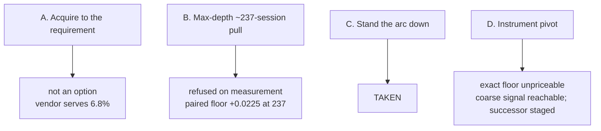
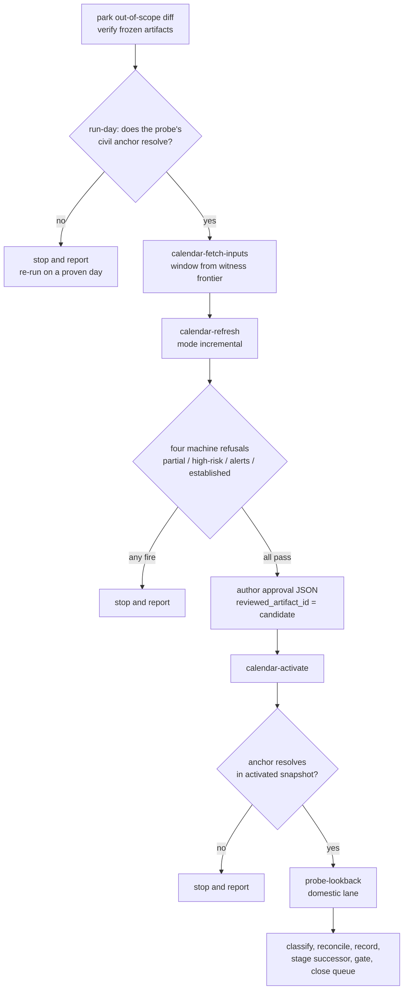
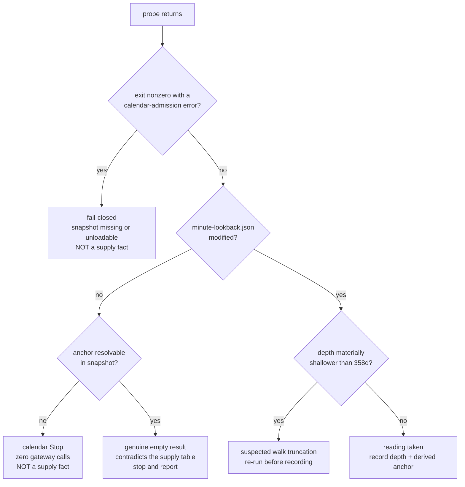

# ORB Sample Acquisition Close - Plan

## Goal Capsule

- **Objective.** Close `orb-sample-acquisition-decision` on arm C, after advancing the calendar's proven-session frontier far enough to re-take the one supply reading that is runnable, and fix the diagnostic that makes the reading ambiguous.
- **Product authority.** This plan owns the arm selection, the frontier advance, the domestic depth re-probe, the probe's outcome diagnostic, the disposition of arm D, and the queue routing. It does not own the probe generalization it stages, any pivot reading, or the ORB lever programme the stand-down parks.
- **Execution profile.** One probe invocation against the LS paper gateway — which issues a backward walk of roughly 50 seven-day window fetches, each self-paginating up to `MINUTE_MAX_PAGES`, for order 10² paced dispatches charged to the domestic lane's IGW00201 budget. The frontier advance calls KRX and KASI with `.env.calendar` credentials: a separate credential surface that shares no budget, lock, or rate limit with the probe. One compiled-code change (U7). No ingest, no acquisition, no backtest, no governed param. `strategy_code_hash` stays `7571abef…` and `adapters/nautilus/lab/config/preregistration.json` stays byte-identical at `abdb90a1…`.
- **Stop conditions.** Stop and report rather than widening scope if the run-day precondition fails, if the candidate calendar diff proposes anything beyond the expected `positive_witness` rows and the intended `unknown`-to-`trading_session` flips, if the frontier advance leaves the probe anchor unresolvable, if the probe makes no gateway call, if the depth reading moves the committed reachable-supply figures beyond what U4 covers, or if closing arm D would require pricing the pivot.
- **Open blockers.** None. The turn is window-any but **not** day-any — see R13.
- **Tail ownership.** Gate, commit, and PR are in scope. Queue transitions run through `lab-next` after the gate, never by editing `queue/items.jsonl`.

---

## Product Contract

**Preservation note.** Product Contract restructured, with two scope changes, both user-directed on 2026-08-09 after review. R2 is split: it keeps its original intent (do not wait on the KRX session window; state the anchor) and the newly-discovered prerequisite moves to **R11**. R3 is sharpened in place — its intent (never record a false floor; disposition instead) is unchanged, but the mechanism it names is corrected against `run_probe`. KD4 is corrected the same way. **KD7 and R11 are new**, and the Planning Contract instantiates them as a full implementation unit against a second credential surface, not a same-shape requirement tweak. **KD2 was widened** to absorb the probe's outcome diagnostic, adding R12 and U7 — the first compiled-code change in this turn. R13 is new and carries the run-day precondition. Every other R-ID, AE-ID, and Key Decision keeps its meaning and number.

### Summary

Close the ORB sample-acquisition decision on arm C. Advance the calendar's proven-session frontier, fix the probe diagnostic that cannot currently distinguish a refusal from a measurement, re-take the domestic minute-history depth reading that R10 of the preceding plan treats as expired, record arm D as unpriceable-as-specified, and stage the probe generalization as the successor capability.

### Problem Frame

The turn that opened this decision instructed running `probe-lookback` against a non-domestic lane, to answer whether another instrument's minute history reaches deeper than the domestic lane's rolling window. That probe does not exist. `LS_INGEST_MODE=probe-lookback` dispatches `run_probe` in `adapters/nautilus/src/bin/ls-ingest.rs`, which is bound to the t8412 fetcher — domestic KRX equity N-minute bars. `LS_INGEST_LANE_FILE` selects credentials, not an instrument or a TR. Pointing it at another lane sends the same domestic chart request under a different account's token and answers nothing about supply elsewhere.

The pivot question is not unanswerable, only unbuilt. The candidate minute-chart TRs on other instrument domains — `t8465` for KOSPI200 futures and options, `o3103` for overseas futures, `t8418` for sector indices — are already `implemented: true` with live-smoke targets and lane files on disk. What is missing is the depth search itself: the backward window walk that `probe-lookback` performs, pointed at a TR other than t8412.

The domestic probe is blocked too, on an axis neither the handoff nor the first reading of this plan identified. It is not the KRX session window: `probe-lookback` is calendar-anchored, and `docs/solutions/conventions/closed-window-reachable-read-shapes.md` records historical-bar pulls as closed-window reachable, certified on `t1310`. It is the calendar's proven-session frontier. `CalendarGate::probe_anchor` delegates to `select_recent_session`, which walks back from the anchor and returns `None` on the first `DayStatus::Unknown` it meets — it is proof-preserving and will not step *past* an Unknown to reach an earlier proven session. The last `positive_witness` in the snapshot is `2026-08-04`; every weekday after it is `unknown`. So any anchor at or after 2026-08-05 yields `ProbeAnchor::Stop`, and the probe returns `Ok(None)` having issued zero gateway requests.

The anchor is not the operator's to choose. `run_probe` computes it as `last_closed_session(now_kst, ACCUMULATE_CLOSE_BUFFER)` — today's civil date past 16:30 KST, yesterday's before it. Only weekdays go `unknown`; weekends and holidays are pre-proven `closed` through 2027-07-22 from scheduled-closure evidence. A weekday evening run therefore anchors on a day whose KRX witness is retrospective and cannot yet exist, so it Stops however far the frontier was advanced.

That failure is silent in the worst way. `run_probe` prints `"probe: pilot 005930 served no minute history — nothing recorded"` for a calendar refusal and for a genuine empty result alike, because `run_probe_lookback_gated` collapses both to `Ok(None)`. On a probe whose entire purpose is to measure supply, an operator reading that line could conclude the vendor serves nothing.

Meanwhile the domestic reading has acquired weight it did not carry when it was recorded. `data/turn4-fresh/probes/minute-lookback.json` is dated 2026-07-09, and the figures derived from it — the 237-session reachable ceiling and the `sqrt(45/237)` = 0.435745 projection — are now asserted in `adapters/nautilus/lab/tests/paired_power.rs` and quoted in the paired-power TURN-LOG entry. The expired probe is no longer only an input to a memo.

### Key Decisions

- KD1. **Take arm C — stand the ORB arc down.** (session-settled: user-directed — chosen over arm B: the paired measurement priced the max-depth pull as buying attributability for whole-lever-OFF flips it still could not act on, at a multi-day gateway budget.) Governs R7.
- KD2. **Scope the turn to the domestic re-probe and the diagnostic that makes it readable.** (session-settled: user-directed — originally scoped to the re-probe alone over re-specifying arm D's probe; widened on 2026-08-09 to absorb the outcome diagnostic, because deferring it was justified by a gate cost the turn already pays.) Governs R1, R5, R12.
- KD3. **The staged successor delivers the capability, not the reading.** (session-settled: user-directed — chosen over a successor that also prices the pivot: the harness is window-any and gate-able, the reading is neither.) Governs R6.
- KD4. **Do not wait on the KRX session window.** The read shape is closed-window reachable and the session clock is not what gates the probe. Governs R2.
- KD5. **Record arm D as unpriceable as specified, not as closed.** What is unpriceable is an exact depth floor, which needs the TR-parameterized walk; a coarse deeper-or-not signal is reachable today via `make raw-probe` against `t8465`. Say both, so the record does not read as "unreachable by any means". Governs R5, R6.
- KD6. **Gate a tree carrying only this turn's diff.** (session-settled: user-directed — chosen over carrying the uncommitted preflight-literal work in this PR: the gate's tree fingerprint is whole-tree, so a mixed tree records a verdict over a diff the PR does not carry.) Governs R8.
- KD7. **Advance the proven-session frontier before probing, using KRX and KASI evidence.** (session-settled: user-directed — chosen over closing arm C without the reading and over waiting for the next morning chain: verified to share no budget, lock, or rate limit with the probe, and the reading is what the scope was chosen to buy.) Governs R11.
- KD8. **Refuse to start on a day the probe cannot anchor.** (session-settled: user-directed — chosen over proceeding and stopping late: the frontier advance and a ~38-minute gate are spent before a late check would fire.) Governs R13.

The four arms and where this turn leaves each:



### Requirements

**The reading**

- R1. Re-take the served domestic minute-history depth through `probe-lookback` on the domestic lane as one paced, credential-safe sequence, and record the reading with the date it was taken.
- R2. Run the probe without waiting for an open KRX session, and state the anchor date it resolved to alongside the depth.
- R3. Discriminate a calendar refusal, a fail-closed refusal, a genuine empty result, and a truncated walk from a measured floor before recording any of them.
- R4. Reconcile the new reading against the committed reachable-supply figures, and state whether they hold unchanged or need a dated annotation plus a staged re-derivation.
- R11. Advance the calendar's proven-session frontier past the probe anchor before probing, and verify from the snapshot that the anchor resolves rather than assuming it.
- R12. Make the probe's outcome self-evident from its own output, so a refusal cannot be read as a supply fact.
- R13. Refuse to begin the frontier advance unless every `unknown` day between the last witness and the probe's computed anchor is establishable — none of them being the current session, whose KRX witness is retrospective.

**Arm D and the successor**

- R5. Record arm D as unpriceable as specified, naming that the probe mode is bound to a single TR, that a lane file selects credentials rather than an instrument, and that an exact floor — not a coarse signal — is what needs the harness.
- R6. Stage a successor that delivers a TR-parameterized depth probe, scoped to the capability and to no pivot reading, carrying an explicit condition that would make spending it worthwhile.

**Governance**

- R7. Close `orb-sample-acquisition-decision` through `lab-next` after the gate, and record the arm taken and the reason where the CLI can carry them.
- R8. Gate a tree carrying only this turn's diff, with the uncommitted `adapters/nautilus/scripts/session-morning.sh` work returned to its own queue item.
- R9. Move `strategy_code_hash` and `adapters/nautilus/lab/config/preregistration.json` not at all, and verify both from the tree rather than asserting them.
- R10. Make no LS gateway call other than the probe's own window walk.

### Acceptance Examples

- AE1. Covers R2, R3, R11, R13.
  - **Given** the calendar's last `positive_witness` at `2026-08-04` and every later weekday `unknown`,
  - **When** the probe is invoked without first advancing the frontier,
  - **Then** it issues zero gateway requests and records nothing — so the turn must establish the anchor resolves before treating any no-history outcome as a supply fact.
- AE2. Covers R4.
  - **Given** a re-probed depth materially different from the recorded 358 days,
  - **When** the turn records the reading,
  - **Then** it states the consequence for the 237-session ceiling and the 0.435745 projection, rather than recording the depth alone and leaving a landed test and a landed record silently stale.
- AE3. Covers R5, R6.
  - **Given** a reader asking later whether the instrument pivot was ever probed,
  - **When** they read the turn record,
  - **Then** they find that an exact depth floor is unrunnable as specified, that a coarse signal is reachable today, and what capability would make the exact reading runnable — not that it was skipped.
- AE4. Covers R7, R8.
  - **Given** the gate green on a tree holding only this turn's diff,
  - **When** the queue item closes,
  - **Then** the close runs through `lab-next` after the gate completes.
- AE5. Covers R12.
  - **Given** a probe run whose calendar gate refuses the anchor,
  - **When** the operator reads the command's output,
  - **Then** it names the refusal as a calendar Stop with zero gateway requests, distinctly from the line an empty vendor result produces.

### Scope Boundaries

**Deferred for later**

- Building the TR-parameterized depth probe. Staged as this turn's successor, not built here.
- Any depth reading on `t8465`, `o3103`, or `t8418`. The successor delivers the capability; spending it is a later decision.
- The uncommitted `session-morning.sh` diff. It belongs to `preflight-probe-literals-remaining-binaries` and returns there.

**Deferred to Follow-Up Work**

- Reconciling the two divergent `minute-lookback.json` artifacts under `data/` and `adapters/nautilus/data/`. This turn refreshes only the one the committed figures derive from.

**Outside this arc**

- Ingest, acquisition, backtest, and governed params, all excluded by R10 and the execution profile.
- Rung-1 re-entry, carried by `rung1-ladder-reentry-margin-clearing-head`.
- Whether to pivot at all. This turn establishes only that an exact supply floor cannot currently be measured.

### Dependencies and Assumptions

- KRX has published daily-market data for the sessions between the last witness and the current one, so the refresh can establish them. If a day stays `unknown` after the refresh, the anchor still will not resolve and the turn stops under its own Stop conditions.
- Only weekdays go `unknown` in the snapshot; weekends and holidays are pre-proven `closed` through 2027-07-22 from scheduled-closure evidence. Whether the anchor resolves therefore depends on which civil day the turn runs — see R13.
- Today's KRX witness is retrospective, so the current session's own row cannot be established the same evening (`docs/solutions/workflow-issues/todays-session-cannot-be-ingested-tonight-the-krx-witness-is-retrospective.md`).
- Historical-bar pulls are closed-window reachable per `docs/solutions/conventions/closed-window-reachable-read-shapes.md`, certified on `t1310`. t8412 shares that shape but was never certified outside the session — its own recommendation record excludes chart correctness outside the KRX regular session.
- The pivot-candidate minute-chart TRs are already implemented with lane files present, so the successor is a probe harness rather than an SDK expansion.
- `data/` and `adapters/nautilus/state/` are gitignored, so both the probe artifact and the calendar snapshot are machine-local and stay out of the gate's tree diff. The durable reading is the turn record, not the artifact.
- A candidate snapshot and diff from the 2026-08-05 refresh already sit in `adapters/nautilus/state/`. `activate`'s stale-base check and the approval's `reviewed_artifact_id` comparison turn a mis-activation into a refusal rather than a silent success, but the implementer must still bind the review to the run's own candidate.
- Two `minute-lookback.json` artifacts exist and disagree — `adapters/nautilus/data/probes/` reads `20250709` / 360 days at 2026-07-04, the repo-root `data/turn4-fresh/probes/` reads `20250715` / 358 at 2026-07-09. Their five-day spread is consistent with a rolling floor, which corroborates the rolling-window reading the supply table assumes.

### Outstanding Questions

**Deferred to Planning** — none blocks this plan.

- Q1. If the depth moved materially, does the turn re-derive the committed figures or annotate them? Resolved by KTD5: annotate and stage the re-derivation.
- Q2. Does the successor's harness write one depth artifact per lane under the existing `probes/` path, or key them by TR? Settled when the harness is built, not here.
- Q3. Does the successor's probe also need to parameterize the anchor, currently wall-clock-derived inside `run_probe`, or does it inherit the same calendar-frontier coupling that blocked this turn? Settled when the harness is built.

### Sources

- `adapters/nautilus/lab/TURN-LOG.md` — the 2026-08-07 paired-power entry, which carries the 237-session ceiling, the 0.435745 projection, and the standing recommendation this turn acts on.
- `docs/plans/2026-08-07-001-docs-orb-sample-acquisition-decision-plan.md` — the priced-options table, R10's probe-expiry gate, and the Q3 circularity this turn resolves.
- `adapters/nautilus/src/bin/ls-ingest.rs` — `run_probe` and its wall-clock anchor, `calendar_target_for_mode`, `automatic_mode_requires_calendar`; the TR binding that makes arm D's exact floor unrunnable, and the ambiguous no-history print U7 fixes.
- `adapters/nautilus/src/ingest/mod.rs` — `select_recent_session`, `probe_anchor`, `ProbeAnchor`, `run_probe_lookback_gated`, and `probe_minute_lookback`'s backward walk and break-on-empty termination.
- `adapters/nautilus/src/calendar.rs` — `snapshot_path_from_env`, `LoadedCalendar::NotConfigured`, and the `EnforcedFailClosed` action a missing snapshot produces.
- `adapters/nautilus/src/bin/calendar-activate.rs`, `calendar-rollback.rs`, and `src/calendar_refresh/activate.rs` — the `--approval` contract and the `ActivationApproval` shape both tools require.
- `adapters/nautilus/scripts/session-morning.sh` — the certified caller: the argument set, the `--state-root` confinement, the raised HTTP timeout, the four machine refusals at step [5], and the generated approval.
- `adapters/nautilus/state/krx.calendar.json` — the proven-session frontier at `2026-08-04` and the `unknown` weekdays after it.
- `docs/solutions/conventions/closed-window-reachable-read-shapes.md` — historical-bar pulls served non-empty under closure, certified on `t1310`.
- `docs/solutions/workflow-issues/todays-session-cannot-be-ingested-tonight-the-krx-witness-is-retrospective.md` — why a weekday evening anchor cannot be established.
- `data/turn4-fresh/probes/minute-lookback.json` — the expired 2026-07-09 reading this turn replaces.
- `adapters/nautilus/lab/tests/paired_power.rs` — where the reachable-supply constant and the projection root are asserted.
- `adapters/nautilus/lab/src/runner/next.rs` — the `lab-next` usage contract; `done` takes exactly one id.
- `metadata/trs/t8465.yaml`, `metadata/trs/o3103.yaml`, `metadata/trs/t8418.yaml` — the pivot-candidate minute-chart TRs, already implemented.

---

## Planning Contract

### Key Technical Decisions

- KTD1. **Drive the frontier advance through the same five-step chain `session-morning.sh` runs, not a fresh invocation.** `calendar-fetch-inputs` → `calendar-refresh --mode incremental` → gate the candidate diff → author the activation approval → `calendar-activate`. The script is the certified caller: it carries the `--state-root` confinement argument whose absence defaults the root to `$PWD/state`, the `--window` / `--krx-through` pair whose omission shipped a live defect, and the raised `LS_CALENDAR_HTTP_TIMEOUT_SECS`. The approval step is not optional — `calendar-activate` requires `--approval` and refuses without it. Governs R11.

- KTD2. **Derive the fetch window start from the calendar's last `positive_witness`; derive its end from the civil date the probe will anchor on.** The start is that witness plus one day. The end is `last_closed_session(now_kst, 16:30 KST)` evaluated at the moment the probe will run — a civil date, not a session date, because `run_probe` computes its own anchor and the operator cannot pass one. `session-morning.sh` seeds its start from the minimum daily watermark in the *ingest* checkpoint because it is about to ingest; this turn seeds from the *calendar* witness because it is only establishing calendar facts. The two are distinct frontiers that coincide today at `2026-08-04`. Governs R11, R13.

- KTD3. **Prove the anchor resolves before spending the probe, by reading the activated snapshot.** After activation, walk back from the civil date KTD2 derived and confirm the rows are `trading_session` or proven `closed` with no intervening `unknown`, and that the first `trading_session` reached is the expected one. `select_recent_session` skips `Closed` rows and returns at the first `TradingSession`, so a weekend or holiday anchor is normal and must not be treated as a failure. Governs R11, R3.

- KTD4. **Classify the probe's outcome from evidence, not from a single printed line.** U7 makes the binary say which case it hit, but the plan keeps an evidence-based discriminator as a cross-check across four outcomes: a nonzero exit with a calendar-admission error is a fail-closed refusal (missing or unloadable snapshot); an untouched artifact with the anchor unresolvable is a calendar Stop with zero gateway requests; an untouched artifact with the anchor resolvable is a genuine empty vendor result; a modified artifact is a reading — **unless** its depth is materially shallower than the 358-day prior, which is treated as suspected walk truncation and re-run before it is recorded. Governs R3, R12.

- KTD5. **On a materially moved depth, annotate rather than re-derive.** A dated annotation on the paired-power TURN-LOG entry and a staged re-derivation item preserve the closed measurement's provenance; re-running the derivation inside a governance turn would re-open a measurement this turn has no authority over. "Materially" means a change large enough to move the reachable-session ceiling by more than a session or two — a rolling floor drifting a handful of days is expected and is not a finding. The staged item names `PAIRED_REACHABLE_CALENDAR_SESSIONS` in `adapters/nautilus/lab/tests/paired_power.rs` explicitly, so the staleness is discoverable from the constant's owner. Resolves Q1. Governs R4.

- KTD6. **Target the repo-root `data/turn4-fresh/` home, and leave the `adapters/nautilus/data/` twin alone.** `probes_dir_for` derives the artifact path from the catalog's parent, so the data home selects which artifact is written. The committed figures derive from the turn4-fresh reading; refreshing the other would produce a fresh number nothing consumes while leaving the consumed one stale. Governs R1.

- KTD7. **Rely on `gate-run`'s own fingerprint invalidation; never hand-edit `.gate-run/state.json`.** The driver invalidates recorded steps on any tree change, including the untracked content-digest arm, so parking the out-of-scope diff automatically forces the affected steps to re-run. Editing the state file by hand would be the one way to manufacture a false green. Governs R8.

- KTD8. **Gate the run-day at U2's entry, before the fetch — on the whole gap, not on the anchor row alone.** Compute the civil date `run_probe` would anchor on, then check every `unknown` day between the last `positive_witness` and that anchor. Refuse unless all of them are establishable, which means none is the current session: today's KRX witness is retrospective and cannot exist yet. Checking the anchor row by itself is not sufficient — a proven-`closed` weekend anchor still Stops when an unestablished weekday sits between it and the nearest `trading_session`, because `select_recent_session` returns `None` at the first `unknown` it walks into. Governs R13; the post-advance walk-back is KTD3's.

- KTD9. **Fix the ambiguity in the library, not in the print statement.** `run_probe_lookback_gated` collapses a calendar Stop and an empty walk to `Ok(None)`, so the binary cannot tell them apart no matter how it words its output. Return a three-state outcome from the library function and have `run_probe` print a distinct line per case. This puts the discrimination where `adapters/nautilus/tests/ingest.rs` can assert it — a print-only change would be untestable. It also makes the earlier "two lines of Rust" estimate wrong: this is a signature change with call-site and test updates. Governs R12.

### High-Level Technical Design

The turn is a linear chain with three gates that can refuse, followed by a four-way disposition:



The probe's four outcomes. U7 makes the binary name the case; this remains the operator's cross-check:



### Assumptions carried into implementation

- The debug binaries under `adapters/nautilus/target/debug/` may predate their sources; running them by hand bypasses the staleness preflight, so rebuilding is a required first step rather than a contingency.
- `.env.calendar` still exports both `LS_KRX_APPKEY` and `LS_KASI_SERVICE_KEY` at mode 0600. `.env.domestic` is currently mode 0644 and U3 tightens it. Credentials never reach an argument, a log, or the turn record.
- The activated snapshot is machine-local and gitignored, so activation produces no repo diff and the previous snapshot remains the rollback target.
- U7 changes compiled code, so `make adapter-check` gains cases rather than matching its prior baseline exactly.

### Sequencing

U1 comes first — it makes the tree correct before any measurement. U7 is independent of the chain and can land in parallel, but must precede U3 so the probe's own output carries the discrimination. U2 gates the run-day and must precede U3. U4 needs U3's reading. U5 needs U3 and U4. U6 is last, and its queue mutations run only after the gate reports green.

---

## Implementation Units

### U1. Park the out-of-scope diff and verify the frozen artifacts

**Goal.** Leave the working tree carrying only this turn's diff, and prove from the tree that the two artifacts this turn must not move have not moved.

**Requirements.** R8, R9. Instantiates KTD7.

**Dependencies.** None.

**Files.**
- `adapters/nautilus/scripts/session-morning.sh` — returned to its own queue item, not carried here.

**Approach.**
1. Move the uncommitted `session-morning.sh` change out of the working tree so it can return to `preflight-probe-literals-remaining-binaries`. Preserve it — it is finished work, not a mistake.
2. Read `strategy_code_hash` from a fresh manifest or the fingerprint verb and confirm it reads `7571abef…`. Do not assert it from this plan.
3. Confirm `adapters/nautilus/lab/config/preregistration.json` is byte-identical against its pinned SHA. `adapters/nautilus/lab/tests/sample_margin.rs` already carries this assertion; confirm it ran and passed rather than re-deriving it.
4. Leave `.gate-run/state.json` alone. Its recorded steps invalidate themselves on the tree change U1 just made.

**Patterns to follow.** U8 of `docs/plans/2026-08-07-001-docs-orb-sample-acquisition-decision-plan.md` — same two verifications, same verify-don't-assert discipline.

**Test scenarios.** `Test expectation: none — this unit verifies existing assertions and moves an uncommitted file; it adds no behavior.`

**Verification.** `git status` shows only this turn's files; the `preregistration.json` SHA assertion appears in passing test output; the recorded `strategy_code_hash` matches. Note that `make script-check` is now evaluated against the parked tree — if it reds, the parked diff was masking a pre-existing failure and that is a finding, not this turn's regression.

---

### U7. Make the probe's outcome self-evident

**Goal.** Give `probe-lookback` an output that names which of its outcomes occurred, so a calendar refusal cannot be read as a supply fact.

**Requirements.** R12. Instantiates KTD9.

**Dependencies.** None.

**Files.**
- `adapters/nautilus/src/ingest/mod.rs` — a three-state outcome type returned by `run_probe_lookback_gated`.
- `adapters/nautilus/src/bin/ls-ingest.rs` — `run_probe` prints one distinct line per outcome.
- `adapters/nautilus/tests/ingest.rs` — coverage for the new discrimination.

**Approach.**
1. Replace `run_probe_lookback_gated`'s `Option<MinuteLookback>` return with a three-state outcome distinguishing a recorded reading, a calendar Stop, and a served-nothing walk. The Stop arm already exists in the function body as an early return; it currently loses its identity at the boundary.
2. Update `run_probe` to print a distinct, unambiguous line per arm — the Stop line naming zero gateway requests and pointing at the calendar frontier as the cause.
3. Leave the exit code unchanged. A Stop is a refusal to measure, not a failure of the command, and the calling convention is not this unit's to change.

**Execution note.** Write the discrimination test first. The whole defect is that two outcomes were indistinguishable, so a test that cannot tell them apart would reproduce the bug rather than catch it.

**Patterns to follow.** The existing Enforced-gate tests in `adapters/nautilus/tests/ingest.rs` — `enforced_later_session_does_not_cross_the_first_unknown` and `enforced_range_with_intervening_unknown_stops_and_preserves_state` — for how a calendar-gated ingest path is exercised against a fixture snapshot.

**Test scenarios.**
- Covers AE5. A fixture snapshot whose anchor row is `unknown` produces the calendar-Stop outcome, and no fetch is issued.
- A fixture whose anchor resolves but whose fetcher serves no rows produces the served-nothing outcome, distinct from the Stop.
- A fixture whose anchor resolves and whose fetcher serves rows produces the recorded outcome carrying the earliest date and depth.
- The Stop outcome writes no `minute-lookback.json`, and an existing artifact is left byte-identical.
- The three outcomes are distinguishable by the caller without inspecting the filesystem.

**Verification.** `cargo test -p nautilus-ls --test ingest` passes from `adapters/nautilus` with the new cases present, and a manual `probe-lookback` on an unadvanced calendar prints the Stop line rather than the served-nothing line.

---

### U2. Advance the calendar's proven-session frontier

**Goal.** Establish `trading_session` facts for every civil day between the last witnessed session and the probe's anchor, so the anchor resolves.

**Requirements.** R11, R13. Instantiates KTD1, KTD2, KTD3, KTD8.

**Dependencies.** U1.

**Files.**
- `adapters/nautilus/state/krx.calendar.json` — activated snapshot (gitignored, machine-local).
- `adapters/nautilus/state/` — normalized inputs, fetch checkpoint, candidate, candidate diff, and the activation approval (gitignored).

**Approach.**
1. **Run-day gate, before anything else (KTD8).** Compute the civil date `last_closed_session(now_kst, 16:30 KST)` yields now, then list every `unknown` day between the snapshot's last `positive_witness` and that date. Stop and report if any of them is the current session, whose KRX witness is retrospective and cannot exist yet; otherwise proceed, because the advance can establish the rest. Note that the anchor moves at 16:30 KST — a run that crosses that boundary re-derives it and may fall outside the gate, so treat the boundary as this turn's deadline.
2. Rebuild the calendar binaries. Running them by hand bypasses `session-morning.sh` entirely, so the staleness preflight that would refuse a stale binary never fires — and a clean tree is not evidence, since git operations touch sources after a build.
3. Re-derive the window at run time: start is the day after the snapshot's last `positive_witness`, end is the civil date from step 1.
4. Run `calendar-fetch-inputs` with `--window`, a matching `--krx-through`, an explicit `--state-root`, the paced fetch, and `LS_CALENDAR_HTTP_TIMEOUT_SECS=180` as the script sets. Key the checkpoint on both window ends — the binary refuses to resume a checkpoint whose window triple differs from the run's. A client-side timeout is recoverable; the checkpoint resumes only the un-fetched days.
5. Run `calendar-refresh --mode incremental --through <end>` against the active snapshot with those inputs, producing a candidate and a diff. The active file is not touched by this step. Bind every later step to *this run's* candidate — a candidate and diff from the 2026-08-05 refresh already sit in the state tree.
6. Apply the certified caller's four machine refusals rather than reviewing the diff by eye: refuse on `partial == true`, on any entry with `risk == high` or `high_risk`, on any non-empty `alerts` array read from the **candidate snapshot** (not the diff — reading it from the diff always yielded `[]`, a shipped bug the script's own comment records), and on a missing `status_established` entry for each intended day. Any refusal is a stop-and-report.
7. Author the activation approval: read `artifact_id` from this run's candidate, and write an `ActivationApproval` carrying `operator`, `approved_at`, `reviewed_artifact_id` bound to that id, `acknowledged: []`, and a `reason` **generated from the gate result in step 6** rather than hand-written. An approval that recites checks the gate did not perform is how a vacuous assertion previously went unnoticed. Never acknowledge past a refusal — `partial=true` is acknowledgeable, and acknowledging it consumes the chain transition while leaving every consumer as blocked as before.
8. Run `calendar-activate --active <snapshot> --candidate <candidate> --approval <approval> --as-of <instant>`.
9. Re-read the activated snapshot and confirm the anchor resolves per KTD3, walking back from the civil date — not from the window end — and re-deriving that date if the run has crossed 16:30 KST or midnight since step 1.

**Execution note.** Steps 1 and 9 are the same precondition checked at two different times, deliberately: step 1 refuses before spending anything, step 9 catches a long turn drifting into a different civil day.

**Rollback.** Activation is the only step here that replaces machine-local state. `calendar-rollback --active <path> --prior <path> --approval <approval> --as-of <instant>` restores the predecessor, and needs its own approval JSON whose `reviewed_artifact_id` names the prior snapshot — noting an id alone does not make rollback runnable. Record the predecessor's `artifact_id` in the operator's owner-local run log only; it is a licence-boundary item and must not reach the committed turn record or a queue note.

**Patterns to follow.** `adapters/nautilus/scripts/session-morning.sh` steps [3] through [5] — the argument set, the `--state-root` confinement, the raised timeout, the four refusals, the generated approval, and the diff-then-activate ordering. Mirror them; do not reconstruct them.

**Test scenarios.** `Test expectation: none — this unit advances machine-local state through certified binaries; its correctness is the run-day gate, the four machine refusals, and the anchor check.`

**Verification.** The activated snapshot's last `positive_witness` is the derived window end, no day in the window remains `unknown`, and the anchor the probe will compute resolves.

---

### U3. Re-take the domestic minute-history depth reading

**Goal.** Measure the served minute-history depth on the domestic lane and classify the outcome correctly.

**Requirements.** R1, R2, R3, R10. Instantiates KTD4, KTD6.

**Dependencies.** U2, U7.

**Files.**
- `data/turn4-fresh/probes/minute-lookback.json` — rewritten on a successful reading (gitignored).

**Approach.**
1. Refuse to run unless `.env.domestic` is owner-only. It is currently mode 0644 — world-readable — while the plan asserts a 0600 posture for `.env.calendar`; tighten it before sourcing.
2. Record the artifact's current contents **and mtime** before running. If the probe writes an identical reading, only the mtime distinguishes a rewrite from a Stop.
3. Run `ls-ingest` in `probe-lookback` mode with the full environment: `LS_TRADING_ENV=paper`, `LS_INGEST_LANE_FILE` pointing at `.env.domestic`, `LS_INGEST_MODE=probe-lookback`, `LS_INGEST_CATALOG` under `data/turn4-fresh/catalog`, **`LS_CALENDAR_SNAPSHOT` pointing at `adapters/nautilus/state/krx.calendar.json`**, `LS_PROBE_SYMBOL=005930`, `LS_PROBE_NCNT=1`. The snapshot variable is not optional: without it `snapshot_path_from_env` yields `NotConfigured`, which resolves to `EnforcedFailClosed`, and the run errors before gateway construction. The README runbook omits it because it predates the Enforced gate.
4. Expect a backward walk of roughly 50 seven-day window fetches, each self-paginating, charged to the domestic lane's IGW00201 budget — not a single request.
5. Classify the outcome against KTD4's four cases using U7's output as the primary signal and the artifact-plus-snapshot evidence as the cross-check. A depth materially shallower than the 358-day prior is suspected walk truncation, not a measurement: re-run before recording it. A genuine empty result contradicts the supply table the committed figures rest on — stop and report rather than dispositioning it.
6. Record the earliest served date, the depth in days, and the probe timestamp. The resolved anchor is not emitted — `MinuteLookback` carries only those three fields — so on the success path derive it as `earliest_date + depth_days`; on a Stop or empty walk recompute it from the run's wall-clock instant. Record which way it was obtained.

**Execution note.** Credential-safe throughout — nothing from `.env.domestic` reaches an argument, a log, or the turn record. Run the calendar chain's credentials in a subshell so `LS_KRX_APPKEY` and `LS_KASI_SERVICE_KEY` are gone from the environment before the probe, the gate, and the commit.

**Patterns to follow.** `session-morning.sh` step [7] for the probe's full environment, including the snapshot variable. The README runbook is a partial reference only.

**Test scenarios.** `Test expectation: none — this unit takes a live measurement; U7 guards the classification and U4 checks its consequences.`

**Verification.** The artifact carries a `probed_at` from this run, and the recorded outcome names which of KTD4's four classes it fell into and on what evidence.

---

### U4. Reconcile the reading against the committed figures

**Goal.** State what the new reading does to the reachable-supply figures that landed with the paired-power turn.

**Requirements.** R4. Instantiates KTD5.

**Dependencies.** U3.

**Files.**
- `adapters/nautilus/lab/TURN-LOG.md` — a dated annotation on the paired-power entry, only if the depth moved materially.

**Approach.**
1. Convert the new depth to a reachable session count against the activated calendar, the same conversion the supply table used.
2. Compare against the committed `PAIRED_REACHABLE_CALENDAR_SESSIONS = 237` and the `sqrt(45/237)` = 0.435745 projection root.
3. If the count is unchanged or drifts by a session or two, say so and change nothing.
4. If it moved materially, annotate the paired-power TURN-LOG entry in place with the new reading and its date, and stage a re-derivation item naming `adapters/nautilus/lab/tests/paired_power.rs` and its constant explicitly. Do not re-run the derivation here.

**Patterns to follow.** The dated in-place correction on the 2026-08-06 entry in `adapters/nautilus/lab/TURN-LOG.md` — the unit-correction note — for how an annotation is worded and placed without restating the original.

**Test scenarios.** `Test expectation: none — this unit records a comparison against figures tests/paired_power.rs already guards arithmetically.`

**Verification.** The reconciliation names both committed figures explicitly and states which of the two outcomes applied.

---

### U5. Record the turn

**Goal.** Write the durable record: the arm taken, the reading, arm D's disposition, and the routing.

**Requirements.** R5, R7. Instantiates KD1, KD5.

**Dependencies.** U3, U4.

**Files.**
- `adapters/nautilus/lab/TURN-LOG.md` — one new entry, inserted immediately after the standing head-lineage section.

**Approach.**
1. Write the entry with a heading naming the axis and the verdict in caps, and a first bullet stating what did *not* change — no governed param, no ingest, no acquisition; `strategy_code_hash` at `7571abef…`; head stays v35; `preregistration.json` byte-identical. Note that U7 changed adapter code, so the turn is not code-free.
2. State arm C as taken and why, citing the paired measurement rather than restating it.
3. Record the depth reading with its anchor and date, how the anchor was obtained, and the reconciliation outcome from U4.
4. Record arm D: an exact depth floor is unpriceable as specified — the probe mode is bound to t8412 and a lane file selects credentials, not an instrument — while a coarse deeper-or-not signal is reachable today via `make raw-probe` against `t8465`. Name the successor.
5. Record the findings a later reader needs: that the probe is gated on the calendar's proven-session frontier rather than the KRX session window, that the anchor is wall-clock-derived so the turn is day-of-week dependent, and that U7 fixed the print that made a refusal readable as a supply fact.
6. Carry no snapshot `artifact_id` or KRX-derived row into this entry.

**Patterns to follow.** The 2026-08-07 paired-power entry at the top of `adapters/nautilus/lab/TURN-LOG.md` — reverse-chronological placement, `## Turn — <axis>: <VERDICT>` heading, a what-did-not-change first bullet, bolded claim sentences, and a closing Queue bullet.

**Test scenarios.** `Test expectation: none — this unit records a decision.`

**Verification.** The entry's figures match U3's captured output, and a reader can tell from it alone why arm D's exact floor was not measured.

---

### U6. Gate, then route the queue

**Goal.** Prove the tree is green on this turn's diff alone, then stage the successor, re-note the invalidated item, and close the decision.

**Requirements.** R6, R7, R8.

**Dependencies.** U1, U5, U7.

**Files.**
- `queue/items.jsonl` — mutated only through `lab-next`, never by hand.

**Approach.**
1. Run the gate in full and record the verdict. Never pipe `adapter-check` to `tail` — the tail's exit code masks a red gate; redirect to a file and echo the exit status.
2. After the gate completes, stage the successor through `lab-next add --window any`, with a title naming the TR-parameterized depth probe and a `--note` carrying both why arm D's exact floor is unpriceable without it **and** the condition that would make spending it worthwhile — mirroring the named re-evaluation triggers the sample-sufficiency successor already carries. Refs to this plan and the turn record.
3. Re-note `report-sample-catalog-read-metadata-only` through `lab-next`, recording that its catalog-growth justification is void under the stand-down. The correction must live where `make next` reads it; a TURN-LOG line alone leaves the queue asserting a refuted justification.
4. Close the decision with `lab-next done orb-sample-acquisition-decision` — the id alone. `run_done` accepts no note or reason argument, so the arm taken and the reason are carried by the U5 turn record and the PR body.
5. Confirm `preflight-probe-literals-remaining-binaries` is still open and its parked diff is recoverable.
6. Carry no credential and no snapshot identity into any `--note`; `queue/items.jsonl` is git-tracked.

**Execution note.** Every queue mutation runs after the gate. A `lab-next` write mid-gate changes the whole-tree fingerprint and splits the verdict — the failure this turn already observed once.

**Patterns to follow.** U8 of `docs/plans/2026-08-07-001-docs-orb-sample-acquisition-decision-plan.md` for the after-the-gate ordering; the `lab-next` USAGE string in `adapters/nautilus/lab/src/runner/next.rs` for the exact `add` and `done` argument sets.

**Test scenarios.** `Test expectation: none — this unit runs an existing gate and mutates the queue through its owning CLI.`

**Verification.** `make gate-run` reports all eight steps green on a single tree fingerprint; `queue/items.jsonl` shows `orb-sample-acquisition-decision` closed, the successor open with its spend condition, and `report-sample-catalog-read-metadata-only` re-noted.

---

## Verification Contract

Run from `adapters/nautilus` for anything touching the adapter or lab crates — the standalone adapter workspace opts out of the root workspace, so a root `cargo test` never reaches it.

**Strip the shell's LS environment first.** This shell exports around a dozen `LS_*` variables that false-red tests in the adapter workspace. Check with `env | grep -c '^LS_'` and clear them for any cargo run.

**Targeted, during implementation.**

```
cd adapters/nautilus
env -u LS_DATA_HOME -u LS_REPORT_RUN ... cargo test -p nautilus-ls --test ingest
```

**Gate, before committing.** `make gate-run` runs all eight steps in order and records resumable state; run it rather than the steps by hand. Budget most of an hour — the run is dominated by `adapter-check` at roughly 33 minutes, and a full clean run measured ~38.5 minutes on this tree. The probe's own walk is additional wall-clock: ~50 paced window fetches at the t8412 1/s cap, plus pagination.

| step | applicability to this diff |
|---|---|
| `make docs` | runs; this diff regenerates nothing |
| `cargo test` (root) | runs; unaffected |
| `cargo test -p ls-core` | runs; unaffected |
| `make docs-check` | runs; asserts generated docs still match |
| `make lane-check` | runs; unaffected |
| `make adapter-check` | **required** — U7 changes adapter code |
| `make script-check` | not reached once U1 parks the `scripts/` change; `gate-run` runs it anyway at position 7 |
| `make todo-check` | runs; the queue stays the sole staging location |

**Exit criteria.**

- All eight steps green under a **single** tree fingerprint. A split fingerprint means the tree changed mid-run; re-run rather than accepting it.
- `make adapter-check` clean: passed count equal to the pre-change baseline **plus U7's new cases**, all `0 failed`, no suite regressing. The prior "count equal to baseline exactly" criterion no longer applies.
- Root `cargo test`: 32 result lines, all `0 failed`.
- `strategy_code_hash` reads `7571abef…` and `preregistration.json` is byte-identical at `abdb90a1…`, both read from the tree.

**Not applicable.** No `make live-smoke-*`, no `make raw-probe`, no backtest, no governed turn. The only LS gateway traffic is U3's probe walk.

---

## Definition of Done

**Global.**

- The run-day precondition was checked before the fetch, and the turn ran on a day whose anchor is establishable.
- The calendar's proven-session frontier reaches the probe's anchor date, established through the certified chain including its four machine refusals and a generated activation approval.
- `probe-lookback` names its own outcome, and the discrimination is asserted in `adapters/nautilus/tests/ingest.rs`.
- The domestic depth reading is taken, or its absence is classified against KTD4's four cases and reported — never recorded as a supply fact.
- The reading is reconciled against `PAIRED_REACHABLE_CALENDAR_SESSIONS = 237` and the 0.435745 projection root, with the outcome stated.
- `adapters/nautilus/lab/TURN-LOG.md` carries the turn record: arm C taken, arm D's exact floor unpriceable with a coarse signal named as reachable, and the calendar-gating and day-of-week findings.
- The TR-parameterized depth probe is staged through `lab-next` as an open, window-any successor carrying a spend condition; `report-sample-catalog-read-metadata-only` is re-noted in the queue.
- `orb-sample-acquisition-decision` is closed through `lab-next`, after the gate.
- `preflight-probe-literals-remaining-binaries` is still open and its parked diff is recoverable.
- `strategy_code_hash` and `preregistration.json` are unmoved and were verified from the tree, not asserted from this plan.
- No LS gateway traffic other than the probe walk; no ingest, acquisition, backtest, or governed-param change occurred.
- No credential, snapshot `artifact_id`, or KRX-derived row reached a committed file.
- The gate is green on all eight steps under one tree fingerprint.

**Per unit.**

- U1: the tree carries only this turn's diff, and `.gate-run/state.json` was not hand-edited.
- U7: the three outcomes are distinguishable by the caller without inspecting the filesystem, and the discrimination test was written before the fix.
- U2: the run-day gate fired before the fetch, the four machine refusals ran as machine checks, the approval's `reason` was generated from the gate result, and the anchor was proven after activation.
- U3: `.env.domestic` was tightened before sourcing, `LS_CALENDAR_SNAPSHOT` was set, and the outcome names which of the four classes it fell into.
- U4: both committed figures are named explicitly, and a material move produced an annotation plus a staged re-derivation naming the constant's owning test.
- U5: the entry's first bullet states what did not change, and arm D's disposition distinguishes the exact floor from the coarse signal.
- U6: every queue mutation happened after the gate, through `lab-next`, with `done` taking the id alone.
