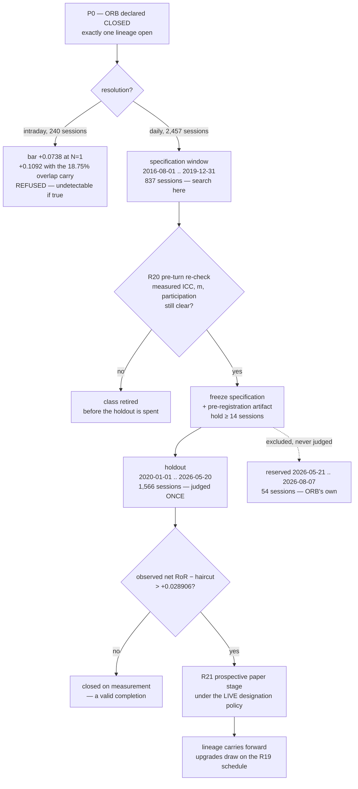

# Next Strategy Lineage Scope - Plan

## Goal Capsule

- **Objective.** Decide the resolution, hypothesis class, and pre-registration for the **one** [[Strategy lineage]] that succeeds ORB in the Consuming Project, and name what must land before its first turn — all argued from measured ceilings rather than from assumption.
- **Product authority.** This plan owns the resolution decision, the admissibility arithmetic, the pre-registration contract, and the prerequisite ladder. It does **not** own the strategy specification itself, the ingest that acquires the catalog, or the decision to open the lineage — the operator freezes the pre-registration and opens it.
- **Execution profile.** Requirements-only and documentation-only. Its one gateway action already happened: thirteen `make raw-probe` reads against `t8410` on the paper domestic lane — the eleven tabulated depth reads plus two page-cap reads — credential-safe, recorded below. No ingest, no strategy code, no governed param, no backtest.
- **Stop conditions.** Stop and report rather than widening scope if a prerequisite turns out to require a licensed [[External Data Source]] before turn one — that is a scope decision the operator makes, not this plan.
- **Open blockers.** **All eight prerequisites P0–P7 block turn one**, not just the governance one. P0 is the governance gate — exactly one lineage is open at a time, so ORB must be declared CLOSED (`orb-lineage-closure-declare`, `orb-stand-down-bind-to-closure-rule`) before this lineage's pre-registration may be frozen — but the calendar repair, the `t8410` promotion, the catalog, the universe, the preferred-share filter, the pre-registration artifact, and the daily backtest path are each independently blocking. See *Presupposed work*.
- **Tail ownership.** This plan produces a decision record. The queue transition runs through `lab-next`, never by editing `queue/items.jsonl`.

---

## Product Contract

### Summary

Open the next lineage at **daily resolution**, not intraday, because the two ceilings were measured and they differ by an order of magnitude. `t8412` minute bars come from a rolling ~359-day window — 240 reachable sessions, re-probed 2026-08-10. `t8410` daily bars are **not on a rolling window at all**: probed today, they serve ≥ 40 years, and the binding wall moves off the vendor and onto the KRX calendar's own witness source. At the pre-registered 2016-08-01 floor that is **2,457 proven sessions**, 10.2× the intraday ceiling.

That single fact changes three things at once. It clears the clustering asymptote the ORB arc could never reach. It makes the new sample **1.8% overlapping** with ORB's, which is what earns a reset of the selection tax — a reset an intraday lineage could not honestly claim. And it moves the binding term in the sample margin from sampling error to **search discipline**, which is why the pre-registration answer is a specification/holdout split with `N_max = 1` on the holdout rather than an argument about how many of ORB's 29 trials to carry.

The hypothesis class follows from the cost model, not from taste: transaction cost is fixed per round trip and gross edge accumulates with holding period, so ORB sat at the worst point on that axis by construction. The class is a **cross-sectional, high-participation, multi-session-hold ranking hypothesis computed from daily OHLCV alone** — which also keeps the external-data surface at zero.

### Problem Frame

The ORB lineage stood down on arm C (PR #264), and its formal closure declaration is P0 below — still open in the queue at the time of writing. It stood down under a condition that is now a pre-registered rule ([[Lineage closure]]): the frozen margin's threshold, evaluated at the lineage's obtainable-sample ceiling, exceeded the best net RoR it ever produced — `+0.1286` against `−0.0006`. Closure is a statement about **detectability, never profitability**, and cannot be reopened by acquiring data.

Its forward-facing half is the [[Search budget]], and that gate is where the next lineage has to pass. A lineage may be opened only if its hypothesized effect clears the threshold evaluated at its search budget **and** its obtainable-sample ceiling. So the first thing that must be known is the ceiling — and the ceiling is a property of **bar resolution**, not of budget.

For minute bars that property was measured twice and confirmed rolling. For daily bars it was never measured, deliberately: ORB read the opening range, so daily depth could not answer its question. It answers this one, and it decides what class of hypothesis this project can *ever* validate.

### The measured ceilings

**Intraday — carried forward, not re-derived.** `LS_INGEST_MODE=probe-lookback`, domestic lane, pilot `005930`, re-taken 2026-08-10 and anchored 2026-08-07: earliest served minute date `20250813`, depth **359 calendar days**, **240** reachable trading sessions. The floor advanced 29 days over the 32 between probes at near-constant depth, which confirms a rolling window rather than a fixed floor.

**Daily — measured by this plan, 2026-08-10.** Eleven `make raw-probe` reads against `t8410` on `/stock/chart`, paper domestic lane, `gubun: "2"` (daily), `sujung: "Y"`, credential-safe (`http` / `rsp_cd` / `body_len` only).

| symbol | window | http | rsp_cd | body_len | reading |
|---|---|---|---|---|---|
| `005930` | 2025-08-01 .. 2026-08-07 | 200 | 00000 | 44,092 | control — served |
| `005930` | 2016 full year | 200 | 00000 | 42,662 | served |
| `005930` | 2012 full year | 200 | 00000 | 43,075 | served |
| `005930` | 2005 full year | 200 | 00000 | 42,923 | served |
| `005930` | 2000 full year | 200 | 00000 | 40,949 | served |
| `005930` | 1990 full year | 200 | 00000 | 41,836 | served |
| `005930` | **1985 full year** | 200 | 00000 | **41,695** | **served** |
| `005930` | 2027 full year | 200 | 00000 | **618** | forward negative control — header block only |
| `005930` | 1960 full year | 200 | 00000 | **618** | pre-listing negative control — header block only |
| `323410` | 2012 full year | 200 | 00000 | **596** | pre-IPO negative control — header block only |
| `323410` | 2022 full year | 200 | 00000 | 42,268 | post-IPO — served |

The three negative controls are what make the positive readings admissible. `t8410` is a chart TR, and a [[Degenerate chart window]] is a known live-gateway behaviour: on a collapsed window the gateway ignores the start date and serves its default lookback. These windows are wide, and the controls prove the filter is live in **both** directions and **per symbol** — a symbol that had not listed yet returns 596–618 bytes, the summary out-block with zero candle rows, while the same window on a listed symbol returns a full year. A ~43 KB response at ~170 bytes per row is ≈ 250 rows, which is a KRX calendar year. The deep years are genuinely in-window.

Two further readings taken the same way: `qrycnt` 500 and 2000 over a 2010..2026 window both return ~87.6 KB, so the **server-side page cap is 500 rows** regardless of the requested count, and the walk is by [[Body-cursor continuation]] on `cts_date`.

**The wall moves off the vendor.** `adapters/nautilus/state/krx.calendar.json` carries **4,086** proven trading sessions from `2010-01-04` — its `krx-daily` witness source's own `available_from` — through `2026-08-07`. `t8410` reaches deeper than the calendar can prove sessions, so for a daily lineage the ceiling is a **calendar/witness** wall rather than a supply wall. That is a different kind of wall: it is not extendable by budget either, but it is extendable by evidence.

| | intraday (`t8412`) | daily (`t8410`) |
|---|---|---|
| supply shape | rolling ~359 days | full listed history (≥ 40 yr, probed to 1985) |
| binding constraint | **vendor** | **calendar witness source** (`available_from 2010-01-04`) |
| ceiling | 240 sessions | 4,086 sessions |
| ceiling at the pre-registered floor | — | **2,457** (2016-08-01 .. 2026-08-07) |
| pull cost, 40 symbols | ~4,760–8,800 calls, 11–13 h, multi-day | ~5 pages/symbol → ~200 calls |

### Key Decisions

- **KD1. Open at daily resolution.** (session-settled: user-directed on 2026-08-10 — chosen over intraday after the daily depth was probed rather than assumed.) Two figures decide it, and they must be read at a stated clustering basis or they are not comparable:

  | at ORB's own clustering (m 4.625, p 0.53) | intraday 240 | daily 2,457 |
  |---|---|---|
  | minimum detectable absolute edge | **+0.1085 R** | **+0.0339 R** |

  Like-for-like, the resolution effect is `√(2457/240)` = **3.20×**. At the proposed class's clustering (m 10, p 1.0) the daily figure falls further to **+0.0228 R**, but that is a *hypothesis-class* effect, not a resolution effect, and pairing it against the intraday ORB-clustering figure would overstate the gap by about 49%. The `N=1` margin bars are **+0.0738** intraday and **+0.0231** daily at the ceiling. Small intraday edges are structurally unverifiable here and no budget changes that. Governs R1, R2, R3.

- **KD2. Pre-register the floor at 2016-08-01, S_max = 2,457.** (session-settled: user-directed on 2026-08-10 — chosen over the 4,086-session 2010-01-04 floor and the 1,866-session 2019-01-01 floor.) The KRX regular-session close moved 15:00 → 15:30 on **2016-08-01**, and `adapters/nautilus/src/rules.rs:37` pins `KRX_REGULAR_CLOSE` at 15:30 with **no effective-date switch**; `ingest/mod.rs:629` stamps every daily bar at that constant. A 2010 floor would silently mis-stamp 1,629 sessions with no error and no failing test. Starting on the move's effective date makes the constant correct for every session in range, so the switch is **not a prerequisite** — it becomes one only if the floor is ever deepened.

  Three costs are recorded rather than one. The marginal power forgone is small: the `N=1` bar moves `+0.0179` → `+0.0231`. But the 2,457-session ceiling is also what makes the **low-turnover class inadmissible** — `m ≈ 1` needs 3,999 sessions at full participation, which the forgone 4,086-session floor clears and this one does not — so the choice forecloses a hypothesis family, not just a rounding. And `S_max` counts the two in-range `unknown` days (`2016-12-30`, `2017-12-29`) as non-sessions: if P1 establishes either as Open, `S_max`, the 837 / 1,566 / 54 split, and every bar derived from them are **re-derived before the pre-registration is frozen**. Governs R4, R11.

- **KD3. A new lineage does NOT automatically reset the selection tax — a disjoint sample does.** The False Strategy Theorem's `E[max of N]` corrects for taking the maximum over `N` trials **scored against the same sample**; the inflation is in that sample's noise realization. ORB's 29 arms were scored on 1-minute bars over 45 calendar sessions of catalog `ac026541…`. This lineage is scored on daily bars over 2,457 sessions; the overlap is **45 / 2,457 = 1.8%**, and the bar series is different. A per-lineage trial count therefore is not a bookkeeping convenience — it is what the theorem's own premise licenses. The residual is real but small, and is carried explicitly (KD4).

  **The reset is a one-time asset, not a per-lineage entitlement.** Once this lineage is scored on the 2016–2026 daily sample, a *successor* daily lineage would overlap it almost entirely and inherit this lineage's trials at close to full weight — the same arithmetic that produces the +5.44-trial intraday counterfactual below. Freezing this pre-registration spends the disjointness. Governs R5, R6.

- **KD4. Carry the residual as an overlap-weighted trial term, and pre-register the strict alternative alongside it.** `N_effective = N_lineage + N_prior × (overlapping sessions / lineage sessions)` gives `N_lineage + 29 × 0.0183 = N_lineage + 0.53`, i.e. **one carried trial**. This rule is a pre-registered convention chosen to err strict, **not** a result from the literature, and it is recorded as such. Two limits go with it. The denominator is the sample the verdict is **read on**, never the union — computing it against the union while judging on a subset understates the carry, which is the error KD5's split exists to make unnecessary. And the overlap weighting bounds only the *shared-noise* channel: it goes to zero as sample overlap goes to zero, so it does **not** bound **hypothesis-space pruning** — the fact that this class was chosen after watching ORB fail identified holding period as the binding axis. Nothing in either endpoint of the tabulated choice bounds that second channel; KD5's split is the mechanism relied on for it, and describing the all-29 alternative as the conservative bracket would overstate what has been bounded. Its consequence is the sharp one: had this lineage been intraday on the same ~240 sessions, ORB's 45 sessions would be 18.75% of it and the carry would be **+5.44 trials**, moving the bar from `+0.0738` to `+0.1092`. **The resolution choice and the selection-tax question are the same question.** Governs R5, R6.

- **KD5. Spend the search budget on a specification window and judge once on a holdout that is disjoint from ORB's own sessions, with `N_max = 1` on the holdout.** This is the cleanest available answer to KD3/KD4: rather than argue about the size of the tax, make it zero by construction. Disjointness is a **constructed property, not an observed one** — ORB's 42 sessions fall inside the naive holdout, so the boundary is placed at `2026-05-20` and the tail quarantined (see *The margin bar by supply and search budget*). Stated the other way: KD4's carry is not discharged by argument, it is discharged by the split, and a holdout drawn any other way owes the carry. It also removes a problem the frozen record cannot solve — `σ_trials` is ORB-specific (the sample sd of its six off-flip arms) and a new lineage has no arms until it has spent trials, so any `N > 1` bar would have to borrow ORB's dispersion. At `N = 1`, `E[max] = 0` and `σ_trials` never enters. Governs R6, R7, R8.

- **KD6. The hypothesis class is a cross-sectional, high-participation, multi-session-hold ranking on daily OHLCV alone.** Three independent arguments converge on it, none of them aesthetic — the clustering table, the cost model, and the external-data posture. See *The admissibility arithmetic* below. Governs R9, R10.

- **KD7. Drop the designation gate from the research universe; it is a live-trading gate, not a research one.** `is_tradable(designation) = designation.is_none()` (`adapters/nautilus/src/reference/universe_metadata.rs:140`) reads `t1405`/`t1404`, which are **current-state** boards. There is no historical designation feed in the SDK, and the #255 KRX Open API leg's completeness is UNESTABLISHED. Applying today's designations to 2016 is therefore not an approximation — it is a look-ahead, and strictly worse than dropping the gate. Verified against the artifact: **2,114 of 2,689 records (78.6%)** carry `tradable: true` with `designation: null` and `market_cap: unavailable`, so the gate is uninformative even today. This is exactly the split #245's D8 already chose — structural ineligibility versus policy exclusion.

  **The divergence it creates is a second upward bias and is bounded like the first.** Because designations still gate *live* eligibility, a holdout verdict can rest on positions live trading would refuse, so the measured edge is an upper bound on two counts, not one. Both are covered by the same pre-registered haircut (R14), and the lineage is not labelled successful on the holdout alone — a prospective paper stage applying the live designation policy is what closes the gap. Governs R12, R13, R14.

- **KD8. The point-in-time universe is a hard prerequisite, but the fix is bar-derived, not a licensed purchase.** Listing dates are **measurable from `t8410` itself** — proven above by `323410` returning a header-only block at 2012 and a full year at 2022 — which also means `S_max = 2,457` is a **pilot-symbol** ceiling, not a universe one: the universe's synchronized depth is the distribution of its listing dates, so P4 must compute the effective `S_max` and realized participation for the *frozen* universe and re-derive the margin before turn one. Delisting is **not** measurable: the ingest correctly refuses to read an empty page as delisting (`ingest/mod.rs:2621-2637`), so a departed symbol becomes permanent incompleteness rather than a dated fact. The asymmetry is the whole survivorship problem, and it is bounded, not removable. Governs R14, R15.

### The admissibility arithmetic

Everything below is scaled from figures already frozen in `adapters/nautilus/lab/config/sample-margin.json` and re-derived from them, never quoted. The scaling `SE(S) = 0.087002 × √(45 / S)` is the same projection KTD10 of `2026-08-07-001` used, and carries the same caveat: it is a **projection under an unchanged clustering structure**, not a measurement. It reproduces the committed **`+0.128605`** margin threshold at 237 sessions exactly — `E[max]` at `N = 29` plus `z·SE(237)` gives `+0.128604` — which is the check that it is being applied the same way. That is a *same-quantity* check; the other committed figure at that supply, `+0.1092`, is a **minimum detectable edge** and not a margin bar, so comparing the two would prove nothing.

**The margin bar by supply and search budget.**

| supply | S | SE(S) | bar at N=1 | N=2 (KD4 carry) | N=6 | N=29 (strict carry) |
|---|---|---|---|---|---|---|
| intraday ceiling | 240 | 0.037673 | +0.073838 | +0.087543 | +0.108120 | **+0.128139** |
| daily, 2016-08-01 floor | **2,457** | 0.011774 | **+0.023077** | +0.036782 | +0.057359 | +0.077379 |
| — of which specification window | 837 | — | *search happens here; not judged* | | | |
| — of which **holdout** | **1,566** | 0.014748 | **+0.028906** | — | — | — |
| — of which **reserved, never judged** | 54 | — | *quarantines ORB's own sessions* | | | |

The split is exact: 837 + 1,566 + 54 = 2,457. `2019-12-31` is itself a proven **closed** day — a KRX year-end closure — so no session straddles the specification boundary.

**Why the holdout stops at 2026-05-20 rather than at the ceiling.** ORB's head run spans `20260521..20260722`, which is **42 proven trading sessions**, and every one of them would otherwise sit inside the holdout. KD4's carry is computed against the sample the verdict is *read on*, not against the union — 42 / 1,620 = 2.59%, giving 0.75 carried trials, which rounds to `N = 2` and a bar of `+0.042125`. That is a **48.2%** tax, and it would defeat KD5 outright. Ending the holdout the day before ORB's first session drives the overlap to **exactly zero** for **+1.7%** instead: 1,620 → 1,566 sessions, `+0.028420` → `+0.028906`. The 54-session tail from `2026-05-21` is quarantined and never judged.

Two readings matter. First, the intraday row at `N=29` gives `+0.128139` at the **re-probed 240** sessions, reproducing the committed `+0.128605` at 237 up to the three sessions the re-probe added — the arithmetic is the same instrument. Second, at the daily ceiling the **binding term flips**: `z·SE` is `+0.0231` while `E[max]` at only six trials is `+0.0343`, half again as large. A deeper sample does not buy the right to search more; it makes search the last remaining tax. That is the design rule behind KD5, and the reason a full-sample `N_max = 6` bar (`+0.0574`) is *worse* than a holdout `N_max = 1` bar (`+0.0284`) despite using 1.5× the sessions.

**The clustering table decides the hypothesis class, arithmetically.** Holding the measured ICC at 0.327334 and varying trades per trading session `m` against participation `p`, the required-session figures recorded in `2026-08-07-001` are:

| m | p = 0.53 | p = 0.75 | p = 1.00 |
|---|---|---|---|
| 1 | 7,498 | 5,332 | 3,999 |
| 4.625 (ORB observed) | 3,499 | 2,521 | 1,891 |
| 10 | 2,959 | 2,104 | **1,578** |
| → ∞ | 2,454 | 1,745 | 1,308 |

Against S_max = 2,457, only the high-`m`/high-`p` cells clear. A **low-turnover** hypothesis — the low-volatility anomaly, a quality tilt, anything at `m ≈ 1` — needs 3,999 sessions at *full* participation and is **inadmissible at this ceiling**, however attractive its economics. A cross-sectional daily ranking that scores the whole universe and takes top-N every session sits naturally at `p = 1.0` and `m = N`; at `m = 10` the requirement is 1,578 sessions, cleared with **1.56× headroom**. The class is not chosen, it is what survives.

**The admission is ICC-fragile; only the exclusion is robust.** The table holds ICC at ORB's measured `0.327334`, and the daily lineage's own ICC is unmeasured. Solving the table's relation for the break-even at `S_max = 2,457`, `p = 1.0`: the `m = 10` admission survives only to **ICC ≈ 0.572**, and `m = 5` only to **0.518** — plausible ceilings to breach when ten positions share one market factor and holds overlap across sessions. The `m ≈ 1` exclusion, by contrast, is **ICC-independent**: at `m = 1` the design effect is exactly 1, so 3,999 sessions are required at any ICC. Measuring the lineage's own ICC and realized participation is therefore a **named turn-one output that can retire the class**, not a detail — and R20's pre-turn gate is where that fires.

**The cost model decides the holding period.** Transaction cost is fixed per round trip and asymmetric to the sell side: commission 0.00015/side plus a statutory 0.0020 sell tax = **23 bps round trip** (`adapters/nautilus/lab/config/transaction-costs.json`). In R-multiples, `cost_R = 0.0023 / stop_pct`, which is **strictly decreasing in stop width** — a wider stop genuinely does lower cost measured in R. What it does not do is improve anything: it lowers the numerator and the denominator together, leaving cost as a fraction of gross edge unchanged, and it buys that flat trade at the price of more capital at risk per position. ORB's measured cost is `gross − net = 0.028422 − (−0.033320) = 0.061742 R`, implying an average stop of **3.73% of price** — already about the width of a 1.5× daily-ATR stop, so there is no headroom to reach for even if it helped. The one structural lever is the **holding period**: cost is charged once per round trip while gross edge accumulates over the hold.

Because net RoR is proportional to `(gross_pct − 0.0023) / stop_pct`, the bar `+0.028906` **is not a well-defined test until the risk unit is fixed** — halving the stop roughly doubles measured net RoR with no better signal. The stop rule (a `k × N`-session ATR, with `k` and `N` named) is therefore a frozen pre-registration field, not an implementation detail (P6). ORB held ~30 minutes, the shortest possible, which is why its cost was 2.2× its gross edge.

**What the hypothesis must claim.** On the holdout the bar is `+0.028906` net RoR. The cost must be taken at ORB's **measured** `0.061742 R`, not at the low end of a range — the lower figure implies a ~4.0% stop, which is exactly the stop-widening the paragraph above says buys nothing, so quoting it would be arguing both sides. The required gross per-trade edge is therefore

> **≥ +0.0906 R** at the threshold, versus ORB's `+0.028422 R` — a factor of **3.189×**.

The reason that is reachable is the horizon, not the entry. ORB books intraday, so its holding period is **at most one session**; under √-time scaling — a heuristic, flagged as such and not a measurement — clearing `3.189×` needs a horizon of `3.189² ≈ 10.2` sessions.

**The threshold is a coin flip, so the pre-registration must clear it with power.** An effect hypothesized at exactly the bar clears at judge time about half the time. Requiring 0.80 power raises the target to `bar + z(0.80)·SE = +0.041318` net, hence:

| pre-registration target | required net | required gross | ratio to ORB | implied minimum hold |
|---|---|---|---|---|
| at the threshold (≈50% clearance) | +0.028906 | +0.090648 R | 3.189× | ≈ 10.2 sessions |
| **at 0.80 power** | **+0.041318** | **+0.103061 R** | **3.626×** | **≈ 13.1 sessions** |

**So the pre-registered holding period is `≥ 14` sessions.** A ten-session hold — the round number this class invites — does **not** clear even the coin-flip threshold at the honest cost, and clears the `3.02×` figure only if the cost is quoted at the favourable end of its range. The holding period is a **load-bearing parameter**, and it is the parameter the whole class rests on.

**The concurrency identity this forces.** In steady state, `concurrent positions = m × holding period`. The clustering table needs `m ≥ 5` at `p = 1.0`; at a 14-session hold that is **≥ 70 concurrent positions**, and at the `m = 10` cell it is **140**. A 40-symbol universe cannot supply either, and a ranking universe must be several times its selected count. P3 and P4 must therefore be scoped to a universe of several hundred symbols — which is the ~2,000-call pull priced below, not the ~200-call one.

### The gate

### Requirements

**Resolution**

- R1. Argue the resolution decision from the two **measured** ceilings, stating for each the probe that produced it, its date, and its negative controls — never from an assumed depth.
- R2. State, for each resolution, the minimum detectable absolute edge and the margin bar it implies, so an inadmissible resolution is visible as inadmissible rather than merely expensive.
- R3. Name which constraint binds at each resolution — vendor supply for intraday, calendar witness evidence for daily — and state that the daily wall is extendable by evidence while the intraday wall is not extendable at all.
- R4. Pre-register the history floor at a date for which every exchange-rule constant in `adapters/nautilus/src/rules.rs` is correct either directly or through an effective-date switch that already exists there — naming `KRX_REGULAR_CLOSE` as the only constant carrying none, since the tick ladder already switches at `TICK_REFORM_DATE` — and record the sessions, the power, and the hypothesis classes forgone by that choice.

**Selection tax and pre-registration**

- R5. Answer whether a new lineage resets the selection tax, in terms of the theorem's own premise (same-sample maximum), not in terms of lineage bookkeeping; and quantify the residual as a function of **sample overlap**.
- R6. Register `N_max` before the first turn, together with the hypothesized effect size, `S_max`, the holding period, the directionality, the target `m` and participation, the stop rule that denominates net RoR, and the bootstrap block length — and state the bar each combination implies. A load-bearing choice left open after the specification window is observed is not pre-registered.
- R7. Structure the search so that the trials spent are scored on data disjoint from the data the verdict is read on, verify that disjointness against the prior lineage's **actual session dates** rather than assuming it, and judge the holdout **exactly once** — with the single judgment recorded in the artifact so a second one is refused rather than merely discouraged.
- R8. State how `σ_trials` is handled for a lineage that has no arms yet, rather than silently borrowing ORB's dispersion.
- R18. Pre-register the bootstrap block length as at least the hypothesized holding period. The frozen rule fixes `block = one KST session`, which assumes independence between blocks; a multi-session hold spans many blocks, so a one-session block understates the standard error and makes the bar easier than registered.
- R19. Pre-register a finite upgrade schedule — how many upgrade turns the lineage may take, which holdout segment each consumes, and the bar each implies — and treat exhaustion of that schedule as a [[Lineage closure]] condition. `N_max = 1` controls the selection tax only within one judgment; without a lifetime cap, repeated upgrades reach a pass by attrition.

**Hypothesis class**

- R9. Derive the class from the clustering table, the cost model, and the external-data posture — showing which candidate classes the arithmetic **excludes**, not only which it admits.
- R10. State the gross per-trade edge the hypothesis must claim, as a ratio to ORB's measured gross edge, and the mechanism that makes that ratio reachable.

**Presupposed work**

- R11. Distinguish work that **blocks turn one** from work that is merely desirable, and give each blocking item an owner or an existing queue item.
- R12. Decide whether the unresolved eligibility question is a prerequisite or a tolerated approximation, and justify the decision from what the SDK can and cannot answer *historically*.
- R13. State what the eligibility decision does **not** claim, per the [[External Data Source]] rule that a source whose completeness is unestablished is never silently consumed as complete.
- R14. Freeze the residual-bias correction as an **executable gate rule**, not a caveat: a numeric haircut, its direction, and the point at which it applies, covering both the survivorship residual and the research-versus-live universe divergence KD7 creates — so the verdict predicate is `observed net RoR − haircut > bar` and two operators reading the same holdout reach the same answer.
- R15. Name every TR and data source the lineage consumes, with its support rung against the [[Verification Bar]], the path that consumes it, and whether its promotion blocks turn one. The bar series is not the whole consumption surface — the universe skeleton and the calendar witness are consumed too.
- R20. Gate the lineage on a **pre-turn admissibility re-check**: measure the daily lineage's own ICC, realized `m`, and realized participation on the specification window, recompute the margin from them, and refuse to open if the class no longer clears. Every bar registered up front is a projection under ORB's clustering; the re-check is what converts it into a measurement before the holdout is spent.
- R21. Require a prospective paper stage under the **live** designation policy before the lineage is labelled successful, since KD7's research universe is deliberately wider than the tradable one.

**Governance**

- R16. Require ORB to be declared CLOSED before this lineage's pre-registration is frozen, since exactly one lineage is open at a time.
- R17. Route every queue change through `lab-next`, never by editing `queue/items.jsonl`, and re-note any open item whose stated justification this plan voids.

### Presupposed work

**Blocks turn one.**

| # | item | why it blocks | owner | rough cost |
|---|---|---|---|---|
| P0 | Declare the ORB lineage CLOSED | exactly one lineage open at a time | `orb-lineage-closure-declare`, `orb-stand-down-bind-to-closure-rule` | ½ turn |
| P1 | Resolve four historical `unknown` calendar days — `2016-12-30`, `2017-12-29`, `2022-12-30`, `2023-12-29` | [[Accumulate-forward]] stops before the first `unknown` and never crosses it, so a 2016-08-01 backfill caps at ~104 sessions instead of 2,457 | new | 1 turn |
| P2 | Promote `t8410` to Recommended | the lineage's bar supply is entirely `t8410`, currently `implemented: true, recommended: false`; a TR newly load-bearing must already be at the bar, and its contamination reach is total | `promote-t8410-recommended` (queued, "first off the deferral list") | 1 turn + a live smoke |
| P2b | Promote the **universe-skeleton** TRs the research universe rests on — `t8430` (master), plus `t9945`/`t1444` as P4/P5 resolve them | `capture.rs`'s `SOURCE_TRS` are all `recommended: false`; P2's own rationale applies to them, and R15 asks for the whole consumption surface, not just the bar series | new | 1–2 turns |
| P3 | A fresh daily catalog at the 2016-08-01 floor, scoped to a **several-hundred-symbol** universe | `accumulate` never fetches below the watermark, so this is a **fresh catalog**, not an extension — it moves the fingerprint, the universe hash, and the data range | new | 1 turn + a multi-hour paced pull |
| P4 | Point-in-time-**forward** universe at the concurrency floor: per-symbol listing dates from `t8410`'s backward window walk, plus the effective `S_max` and realized `m`/participation for the frozen set | a 40-symbol set chosen by *present-day* market cap is a disclosed approximation at 54 sessions and 10 years of survivorship at 2,457 — and it cannot supply the ≥70 concurrent positions the hold requires | `orb-pivot-depth-probe-harness`, **re-scoped** (see below) | 2–3 turns |
| P5 | Preferred-share exclusion by issue-sequence digit | `005935` (삼성전자우) traded four times in head v35; 90 of 2,689 metadata records carry a 6th digit ≠ 0. `capture.rs:42` already drops the 신형우선주 class; this closes the documented numeric-coded residual | new (#245 D3 cross-check) | ½ turn |
| P6 | The pre-registration artifact (fields below) | the [[Search budget]] gate requires it **before** the first turn; schema-gated and committed, mirroring `sample-margin.json` | new | 1 turn |
| **P7** | **A daily-resolution, multi-session-hold backtest path in the lab** | `runner/backtest.rs` builds a **fresh engine + `OrbStrategy` per session** — "the structural per-day reset" — mounts `BarKind::Minute` only, and skips any session with no minute bars; `strategy/mod.rs` declares exactly one strategy. **A multi-session hold is structurally impossible today**, and no queue item covers it | new | 3–4 turns |

**Every `new` row above becomes a `lab-next` queue item when this plan lands** — R11's owner-or-queue-item requirement is satisfied by that commitment, not by the literal token `new`.

**P6 freezes these fields**, and the list is the point — a load-bearing choice left unfrozen is a choice made after seeing the specification window:

`S_max` · `N_max` · the hypothesized effect size · the spec/holdout/reserved split with its exact dates · `σ_trials` handling · the **holding period** · **directionality** (long-only or long/short) · target **`m`** and participation · the **stop rule** that denominates net RoR · the **bootstrap block length** (≥ the hold, per R18) · the **survivorship + eligibility haircut**, its direction and application point · the **upgrade schedule** (R19) · and a `holdout_judged` record carrying the run id, catalog fingerprint, and UTC of the single judgment, so a second evaluation is **refused** rather than merely discouraged — mirroring `sample-margin.json`'s `RE-DERIVATION REQUIRED` trigger. Spent trials are counted on the existing append-only ledger (`adapters/nautilus/lab/src/trials.rs`, `ledger/trials.jsonl`), not on new bookkeeping.

**Explicitly not prerequisites, and why.**

- **The #255 KRX Open API eligibility leg.** Per KD7 it answers a *live* question with current-state boards. It has no historical form, so it cannot serve the research universe at any completeness. It stays a Production Ladder prerequisite. `external-data-255-eligibility-boundary` already carries the boundary.
- **A `KRX_REGULAR_CLOSE` effective-date switch.** Unneeded at the 2016-08-01 floor by KD2. Required before any deepening below it — **together with the three pre-2016 `unknown` calendar days** (`2010-06-02`, `2011-12-30`, `2015-08-14`), which by P1's own mechanism would stop a deeper backfill at the first of them. P1's four are exactly the in-range subset of the calendar's seven. Record **both** conditions on the item so a later floor change cannot satisfy one and stall on the other.
- **A licensed point-in-time constituent source.** It would remove the survivorship residual rather than bound it. The pre-registration bounds it instead (R14); purchasing is a separate [[External Data Source]] admission decision.
- **A row-level `cts_date` walk to pin the exact daily floor.** The depth readings are `body_len` discriminations against three negative controls, which is sufficient for the deeper-or-not verdict every decision here rests on. A walk recording per-page row counts and first/last dates would upgrade the 500-row page cap and the per-symbol floor from *inferred* to *measured* — worth doing inside P4, which needs the walk anyway, but not a prerequisite on its own.

**Re-scoped rather than dropped.** `orb-pivot-depth-probe-harness` was staged to price arm D's *minute* supply question, and at daily resolution supply is not the wall — but the capability it carries (a TR-parameterized backward window walk) is exactly what P4 needs to derive per-symbol listing dates. Its justification changed; its priority did not fall. It becomes P4's owner, re-noted as TR-parameterized over `t8410` daily. Contrast `report-sample-catalog-read-metadata-only`, whose justification this arc genuinely voided.

**Priced, not required.** The daily pull is ~5 pages per symbol at the measured 500-row page cap: ~200 `t8410` calls at 40 symbols, ~2,000 at 400. **The 400-symbol figure is the operative one** — the concurrency identity above puts the universe in the several-hundred range, so the 40-symbol line is a floor for comparison, not a plan. Against the intraday pull's 4,760–8,800 calls over 11–13 hours, that is 20–40× cheaper. It remains **budget-bound, not rate-bound** — the [[Rolling call budget]] behind `IGW00201` is cumulative and its ceiling is unmeasured (`gateway-budget.json` carries `budget_calls: null`), so this is a model, not a measurement.

### Acceptance Examples

- AE1. Covers R1, R2.
  - **Given** an operator deciding the resolution,
  - **When** they reach the ceilings table,
  - **Then** each ceiling names the probe and date that measured it, and the intraday row shows a bar that no admissible hypothesis clears — so intraday reads as *inadmissible*, not as *cheaper*.
- AE2. Covers R5, R6, R7.
  - **Given** a reader asking whether the new lineage may start its trial ledger at zero,
  - **When** they read the selection-tax decision,
  - **Then** they find the answer conditioned on **sample overlap**, with the intraday counterfactual (+5.44 carried trials) shown beside the daily one (+0.53), and the holdout design named as what earns `N = 1` rather than assumed.
- AE3. Covers R9, R10.
  - **Given** a candidate hypothesis at `m ≈ 1` — a low-volatility or quality tilt,
  - **When** it is checked against the clustering table at S_max = 2,457,
  - **Then** it is refused on arithmetic (3,999 sessions required at full participation), and the refusal cites the table rather than a preference.
- AE4. Covers R12, R13, R14, R21.
  - **Given** the eligibility gate passing 78.6% of records on absence of evidence,
  - **When** the research universe is specified,
  - **Then** the designation gate is dropped with the reason stated as *look-ahead, not approximation*, and both upward biases — survivorship and the research-versus-live divergence — are covered by one numeric haircut with a stated direction and application point, so the verdict predicate reads `observed net RoR − haircut > bar` and two operators reach the same answer.
- AE7. Covers R7, R18, R19.
  - **Given** the pre-registration artifact after the holdout has been judged once,
  - **When** a second evaluation of the same holdout is attempted,
  - **Then** the artifact's `holdout_judged` record causes a refusal, and the upgrade schedule names which segment the next turn may consume and at what bar — rather than the split being re-cut.
- AE8. Covers R20.
  - **Given** a daily ICC measured on the specification window above the `m = 10` break-even of ≈0.572,
  - **When** the pre-turn re-check runs,
  - **Then** the lineage does not open at that `m`, and the refusal cites the measured ICC against the recomputed requirement — not the ORB-clustering projection this plan registered.
- AE9. Covers R11 (P7).
  - **Given** an implementer who has completed P0–P6 and starts turn one,
  - **When** they run the first daily backtest,
  - **Then** they find a daily, multi-session-hold path already built — rather than discovering that the lab constructs a fresh engine and `OrbStrategy` per session over minute bars only.
- AE5. Covers R11, R15.
  - **Given** an implementer starting the first turn,
  - **When** they read the prerequisite ladder,
  - **Then** the four `unknown` calendar days and the `t8410` promotion are both marked blocking, with the failure each one causes named — a ~100-session cap and a below-bar dependency — rather than listed as hygiene.
- AE6. Covers R4.
  - **Given** a later proposal to deepen the floor below 2016-08-01,
  - **When** it is read against this pre-registration,
  - **Then** the `KRX_REGULAR_CLOSE` effective-date switch is named as a condition of that deepening, so the 15:00 → 15:30 move cannot mis-stamp history silently.

### Scope Boundaries

**Deferred for later**

- The strategy specification itself. This plan fixes the class, the ceiling, and the bar; the specification is frozen on the specification window in a later turn and is the operator's.
- The catalog acquisition (P3) and the universe construction (P4, P5). Named as prerequisites, not executed here.
- The `σ_trials` re-derivation. Moot at `N_max = 1`; needed only if a later amendment raises the search budget.

**Deferred to Follow-Up Work**

- The `KRX_REGULAR_CLOSE` effective-date switch in `adapters/nautilus/src/rules.rs`. Not needed at this floor; record the deepening condition on its item.
- A durable record of the daily-depth probe. The readings above are this plan's evidence, but a probe artifact and a TURN-LOG entry are what a later reader will look for — `data/` is gitignored, so the durable form is the record, not the artifact.

**Outside this lineage**

- Reopening ORB, acquiring data for it, or adjudicating its six kept levers. Closed on a pre-registered rule.
- Rung-1 re-entry and prereg v3+, carried by `rung1-ladder-reentry-margin-clearing-head`.
- Parallel lineages. Refused as the failure shape [ADR 0015](../adr/0015-two-projects-one-repository.md) records.
- Admitting any new [[External Data Source]]. The class was chosen so the surface stays at zero.

### Dependencies and Assumptions

- The daily-depth readings are `body_len` discriminations, not row-level reads. `make raw-probe` prints only `http`, `rsp_cd`, and `body_len` by construction, so "served" means a response two orders of magnitude larger than the proven empty-window response, not an inspected date range. The three negative controls are what license that inference; an exact earliest-served date would need a backward window walk, which no verdict here requires.
- The probe used `sujung: "Y"` (adjusted), matching the ingest's daily path (`checkpoint.rs:213`). A **fresh** full-history pull carries no [[Adjustment-basis splice]] by construction — the splice arises from *appending* across a corporate action, and [[Basis-shift heal]] covers that afterwards. Note that #245's D5 chose an as-traded (unadjusted) basis and the daily path does not implement it; that gap is inherited, not created here.
- Minute bars have **no adjustment parameter at all** — `T8412InBlock` carries no `sujung` field, where `T8410InBlock` does. A daily lineage therefore inherits the adjustment machinery that exists and is exercised; an intraday one would inherit none.
- `SE(S) = 0.087002 × √(45 / S)` projects v35's session-block bootstrap SE under unchanged clustering. A daily lineage at `m ≈ 10` will have a different clustering structure, so every bar in this plan is a **projection to be re-measured at turn one**, not a measurement. It is stated this way deliberately: the pre-registration freezes the *rule*, and the candidate's own SE is evaluated at judge time.
- The clustering table is quoted from `2026-08-07-001` and holds ICC fixed at the ORB-measured 0.327334 while varying `m` and `p`. Its **observed** cell uses the measured Kish design effect (2.157914) while the hypothetical rows use the analytic `1 + (m−1)·ICC` form — which gives 3,545 at the observed pair, not 3,499. So the anchor is a provenance tie, not a cross-check on the `m = 10` row that carries the verdict; R20's pre-turn re-check is what validates that row. A daily lineage's own ICC is unmeasured.
- `SE(S)`'s root of 45 calendar sessions is not reproducible from `sample-margin.json`, which records `sessions: 24` over `20260521..20260722` (42 trading sessions by the calendar). The 45 traces to KTD10 of `2026-08-07-001`, where it is the head run's in-range **calendar** span. The scaling is applied consistently and reproduces the committed `+0.128605` exactly, so this is an attribution gap rather than an arithmetic one — but a reader checking `sample-margin.json` for 45 will not find it.
- The calendar's **coverage** (`2010-01-04`..`2027-07-22`) and its **proven trading sessions** (ending `2026-08-07`) are different quantities: coverage extends forward because scheduled closures are provable ahead of time, while a session is provable only retrospectively by a [[Witness]]. Both figures appear in this plan and neither is stale.
- The overlap-weighted carry in KD4 is a **pre-registered convention**, not a literature result. Its strict alternative (carry all 29) is tabulated so the choice is visible and costed: `+0.0231` versus `+0.0774` at S_max.
- The four historical `unknown` days are consistent with year-end market closures, but the calendar's own rule holds — Unknown is never treated as Closed, and each must be established from evidence, not from this plan's inference.
- The calendar snapshot is machine-local (`adapters/nautilus/state/` is gitignored), so the 4,086/2,457 session counts are reproducible from it but not from the repository alone.
- `005930` is a single pilot. Depth is a per-symbol property of listing date, and the `323410` control confirms the gateway serves from listing rather than from a common floor — so the universe's *effective* depth is the distribution of its listing dates, not 2016-08-01 for every member.

### Outstanding Questions

**Deferred — none blocks this plan.** Each has a recorded default the implementer follows absent a decision.

- Q1. Where exactly does the specification/holdout boundary sit? `2019-12-31` gives 837 specification sessions against a 1,566-session holdout and a bar of `+0.028906`; `2020-12-31` gives 1,085 against 1,318 and `+0.031508`. Both boundary dates are proven **closed**, so neither splits a session. The holdout's *upper* edge is not a free choice — it is pinned at `2026-05-20` by ORB's own span (KD5). Absent a decision, take `2019-12-31`.
- Q2. What **value** does the haircut take? R14 settles that it must be a frozen constant with a direction and an application point; the magnitude is what remains open, and it cannot be estimated without the delisting data the universe lacks. Absent a decision, pre-register a deliberately conservative constant and record the best available estimate beside it, so the gate is executable from day one and the constant can only be *tightened* by later evidence, never loosened.
- Q3. Should the lineage trade long-only or long/short? Long/short halves the sell-tax drag per unit of gross exposure but adds borrow availability, which the SDK does not answer. Absent a decision, long-only — it keeps the external surface at zero. This is a P6-frozen field either way (R6).
- Q4. What universe size does the concurrency floor actually require? `concurrent = m × hold` puts it at ≥ 70 positions at `m = 5` and 140 at `m = 10`, against a 14-session hold — and a ranking universe must be several times its selected count. The clustering table clears at `p = 1.0` from `m ≈ 4.6` (1,891 sessions required against `S_max` 2,457); `m ≥ 5` is the threshold only at `p = 0.75`. Sized when P3 and P4 land, but the floor is no longer unknown.
- Q5. Is a holdout judged once compatible with a lineage's *versioned upgrade* model? A [[Strategy lineage]] is one hypothesis under continuous upgrade, and each upgrade turn is a trial, so an upgrade spends the specification window again and requires a **new** holdout segment — the holdout is consumed, not reused. **This makes turn one structurally one-shot within `S_max`, and the plan should say so rather than imply otherwise.** The quarantined 54-session band cannot serve: its bar is `+0.1557`, 5.4× the turn-one bar. An upgrade holdout must therefore come from **forward accrual** at ~246 sessions a year — ~500 sessions (about two years) carries a bar of `+0.0512`, ~1,000 (about four) `+0.0362`, both well above turn one's `+0.0289`. Absent a decision, pre-register a finite upgrade schedule with its segments and bars named up front, and treat exhaustion as a [[Lineage closure]] condition rather than a reason to re-cut the frozen split.

### Sources

- `CONCEPTS.md` — [[Strategy lineage]], [[Lineage closure]], [[Search budget]], [[Return-on-risk (RoR)]], [[Verification Bar]], [[External Data Source]], [[Point-in-Time Research Universe]], [[Session Tradable Universe]], [[Accumulate-forward]], [[Rolling call budget]], [[Degenerate chart window]], [[Body-cursor continuation]], [[Adjustment-basis splice]], [[Basis-shift heal]].
- `CONTEXT-MAP.md`, `adapters/nautilus/CONTEXT.md`, `docs/adr/0015-two-projects-one-repository.md` — the two bounded contexts, the one-lineage-at-a-time rule, and the failure shape it protects against.
- `adapters/nautilus/lab/config/SAMPLE-MARGIN.md` and `sample-margin.json` — the frozen rule, `N = 29`, `σ_trials = 0.026367936878680807`, `E[max] = 0.05430159509024828`, and v35's provenance (SE 0.087002 over 45 calendar sessions, ICC 0.327334, design effect 2.157914, gross `+0.028422 R`, net `−0.033320 R`).
- `docs/plans/2026-08-07-001-docs-orb-sample-acquisition-decision-plan.md` — the supply table, the clustering sensitivity table, and the `+0.1092 R` figure this plan's scaling reproduces as a check.
- `docs/plans/2026-08-07-002-docs-orb-sample-acquisition-close-plan.md` — arm C, and the calendar-frontier coupling that gates `probe-lookback` but not `raw-probe`.
- `adapters/nautilus/lab/TURN-LOG.md` — the 2026-08-10, 2026-08-07 and 2026-08-06 entries; the re-probed 359-day / 240-session intraday ceiling.
- `adapters/nautilus/lab/config/transaction-costs.json` — 0.00015/side commission, 0.0020 sell tax, statutory and sell-side asymmetric.
- `adapters/nautilus/state/krx.calendar.json` — coverage `2010-01-04`..`2027-07-22`, 4,086 proven sessions, 7 historical `unknown` days, `krx-daily available_from 2010-01-04`.
- `adapters/nautilus/lab/config/universe-metadata-20260723.json` — 2,689 records; 2,114 (78.6%) `tradable: true` with `designation: null` and `market_cap: unavailable`.
- `adapters/nautilus/src/reference/universe_metadata.rs:140`, `adapters/nautilus/src/rules.rs:37`, `adapters/nautilus/src/ingest/mod.rs:629`, `crates/ls-sdk/src/paginated/chart.rs:291` — the eligibility gate, the pinned close, the daily-bar stamp, and the `t8410` in-block.
- `metadata/trs/t8410.yaml` — `implemented: true`, `recommended: false`.
- `docs/solutions/conventions/exchange-rule-constants-need-an-effective-date-switch-before-history-is-acquired.md` — the 15:00 → 15:30 move of 2016-08-01.
- `docs/solutions/conventions/power-questions-three-traps-calendar-denominator-paired-se-and-cluster-size.md` — the calendar-denominator trap, the paired SE, and why cutting cluster size raises the requirement.
- This plan's own eleven `t8410` `raw-probe` readings, 2026-08-10, paper domestic lane — tabulated above under *The measured ceilings*.
