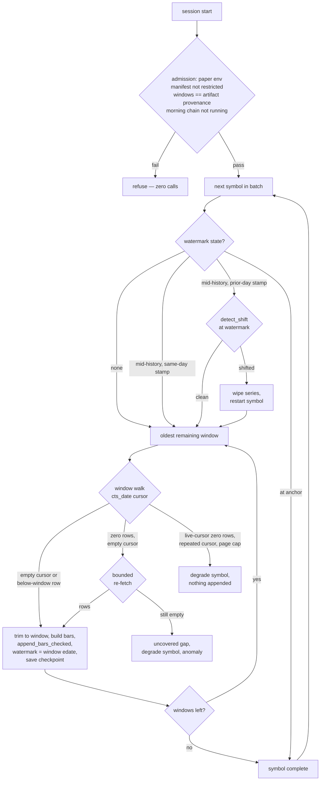
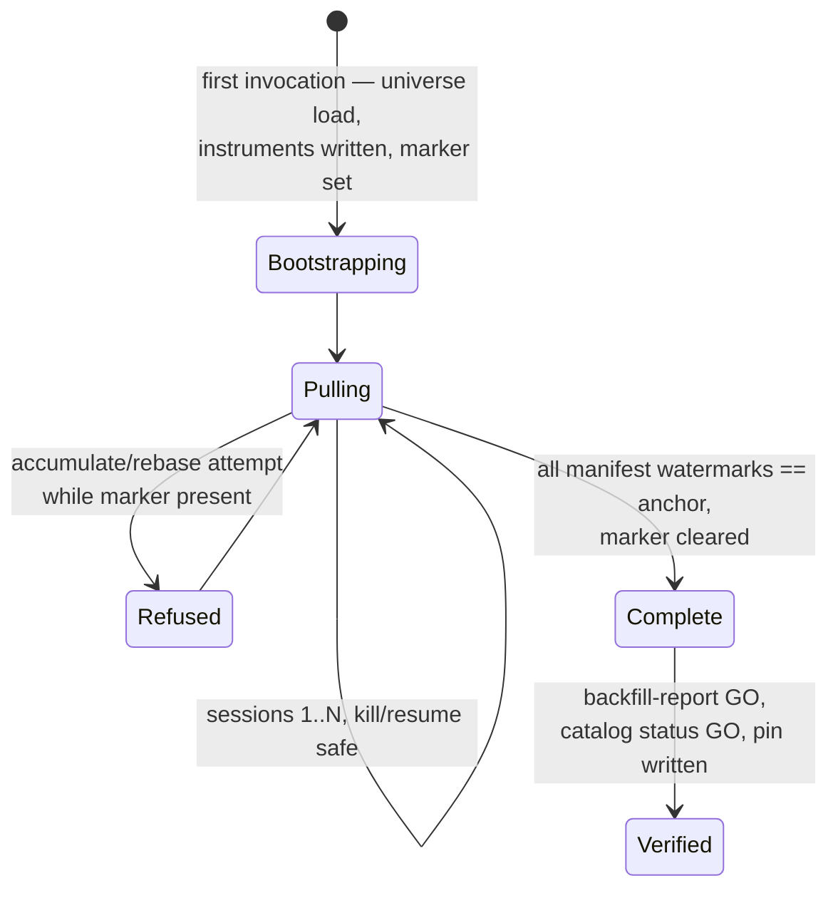

# Daily Catalog 2016-Floor Pull (P3) - Plan

## Goal Capsule

- **Objective.** Execute ladder rung **P3** (`daily-catalog-2016-floor-pull`): build a fresh daily-bar catalog at the 2016-08-01 floor over the frozen 352-member pit universe, pulled from `t8410` in calendar-snapped windows, ending at the frozen anchor 2026-08-12. This catalog is the next lineage's entire bar supply and blocks turn one.
- **Product authority.** The scope plan (`docs/plans/2026-08-10-001-docs-next-strategy-lineage-scope-plan.md` — KD2 floor, KD7/KD8 universe rules, Q4 concurrency identity, R14/R15) and P4's plan + artifact (`docs/plans/2026-08-12-001-feat-pit-universe-depth-walk-t8410-plan.md`, `adapters/nautilus/lab/config/pit-universe-20260812.json` — the measured window mechanism and per-symbol listing evidence) own every definition this plan consumes. This plan owns the backfill mode, the window-pull protocol, resumability, the heal fix, and completion verification.
- **Execution profile.** Turn 1 (implementation scope): offline only — module + bin mode + tests + gate; zero gateway calls. Turns 2+: ~3 attended pull sessions of ~600–800 paced calls each (~1,800–2,100 total, including one 3-call universe bootstrap), then an offline verification + evidence commit closes the rung.
- **Stop conditions.** Stop and report before spending further budget if the first session contradicts the measured window arithmetic (page sizes, calls per window, truncation shape); if IGW00201 throttling persists through bounded backoff at the settled pace; or if the calendar snapshot cannot reproduce the artifact's window plan (fail closed — never re-derive silently).
- **Tail ownership.** Queue close via `lab-next done daily-catalog-2016-floor-pull` after the final gate, never by editing `queue/items.jsonl`. TURN-LOG entry per convention.

---

## Product Contract

### Summary

Extend `ls-ingest` with a windowed `backfill` mode that seeds a fresh catalog home from `t8410` down to the 2016-08-01 floor for the 352 frozen pit-universe members, honoring per-symbol listing dates, resumable at any kill point, guarded so no other ingest mode can silently corrupt the home, and verified by a manifest-aware completeness report.

### Problem Frame

No existing ingest path can acquire this catalog. Both range-mode seeding (how `data/turn4-fresh` was built) and accumulate's first-ever backfill issue one wide `collect_daily` range, and P4 measured that a wide-range `t8410` request serves only the newest ~501 rows with a *clean* empty `cts_date` cursor — the existing paths would append about two years of bars, advance the watermark, and report success over ten missing years. History is reachable only through explicit calendar-snapped windows of ≤450 proven sessions. The catalog is fresh, not an extension: accumulate never fetches below a watermark, so the floor cannot be reached from the existing home, and the new home moves the catalog fingerprint, the universe hash, and the data range for every downstream lab run.

### Requirements

**Pull correctness**

- R1. Each request covers ≤450 proven sessions, window boundaries snapped to proven Trading Sessions, walked oldest-first per symbol; no emitted window spans a single session (degenerate `sdate == edate` requests ignore `sdate`).
- R2. Per-symbol pull range is `[max(2016-08-01, first_served), anchor]` with the anchor frozen at 2026-08-12, the P4 artifact's anchor; `pre_floor` symbols start at the floor, `listed` symbols at their `first_served`.
- R3. Window termination is fail-closed: an empty echoed cursor or a below-window row completes the window; a zero-row page with a live cursor, a repeated cursor, or page-cap exhaustion degrades the symbol (surfaced, non-fatal to the run). Silence is never completion.
- R4. Fetched rows are trimmed to the window by parsed bar timestamp before append.
- R5. The full-range window plan derived from the local calendar snapshot must equal the artifact's `provenance.windows`; a mismatch fails closed before any call is dispatched.

**Catalog integrity**

- R6. Bars append via `append_bars_checked` per completed window only; the per-triple watermark advances to the window's `edate` and the checkpoint saves after every window. On resume, before a symbol's first fetch, the watermark is reconciled forward from the catalog's stored coverage intervals and saved — the parquet append and the checkpoint save cannot be atomic together, and without reconciliation a kill in that gap re-fetches an already-appended window and stalls on the overlap refusal. With it, a kill at any point resumes without refetch and without overlap.
- R7. The checkpoint carries a durable `backfill_incomplete` marker from first write until every manifest symbol's watermark equals the anchor; every bar-writing non-backfill mode — `range` (the default), `accumulate`, and `rebase` — refuses to run on a home carrying the marker. A wide-range pull through any of them on a mid-backfill home would otherwise silently attest a multi-year hole or strand truncated rows that later backfill windows die on.
- R8. A cleanly-empty window (zero rows, empty cursor) never advances the watermark: bounded re-fetch, then record an uncovered gap, degrade the symbol, and report the anomaly.
- R9. A symbol's windows complete within one attended session (symbol-atomic). On a cross-day mid-symbol resume, run the 5-trading-day overlap check (`detect_shift`) at the watermark first: clean → continue; shifted → wipe the series and restart the symbol. The overlap check does not run between same-day windows.
- R10. `heal_daily`'s re-pull is windowed with the same partitioning; a single wide-range heal re-pull is no longer reachable for daily series.
- R11. Instrument definitions for the manifest membership exist in the fresh home before the lab reads it; the first invocation bootstraps them (one full universe load), all later invocations skip the universe load.

**Budget and operations**

- R12. Calls pace at the per-TR rate (t8410 1/s); IGW00201 gets bounded 120 s backoff then symbol degradation; every call, including failures, records to one absolute spend-ledger path shared with the morning chain's invocations.
- R13. The pull never runs concurrently with the morning chain's ingest or a mounted live session — the IGW00201 budget is per-credential and cumulative, and advisory locks are per-catalog-dir so they give no cross-home protection. `LS_TRADING_ENV=paper` is required.
- R14. A `restricted` pit-universe artifact or one with `derived: null` is refused as manifest input.

**Verification and evidence**

- R15. Completion is proven by a manifest-aware per-symbol report: coverage front equals floor-or-listing, tail equals anchor, row count against proven sessions with shortfalls reported as anomalies. Halts legitimately produce missing bars — anomalies are loud, never hard failures and never silently dropped. The uniform `expected_range` form of `catalog status` is not used; it falsely NO-GOes the 108 post-floor listings.
- R16. The watermark-gated `catalog status` form reads GO on the completed home.
- R17. On completion the manifest's content hash is pinned into the catalog (the `MetadataPin` shape), and a committed evidence record plus TURN-LOG entry carry the durable form (`data/` is gitignored).

**Governance**

- R18. Queue transitions run through `lab-next`; the tree stays green at every commit.

### Acceptance Examples

- AE1. Covers R7.
  - **Given** a home mid-backfill (a watermark at 2018-06-01),
  - **When** `LS_INGEST_MODE=accumulate` runs against it,
  - **Then** the run refuses at startup citing the incomplete-backfill marker, and no gateway call is dispatched.
- AE2. Covers R8.
  - **Given** a symbol halted for an entire window,
  - **When** the window returns zero rows with an empty cursor through the bounded retries,
  - **Then** the watermark stays below the window, the symbol degrades with an anomaly line, and the run continues with the next symbol.
- AE3. Covers R9.
  - **Given** a run killed mid-symbol on one day and resumed days later after a corporate action,
  - **When** the resume reaches that symbol,
  - **Then** the overlap check detects the basis shift and the symbol restarts from its range start rather than splicing adjustment bases.
- AE4. Covers R3, R6.
  - **Given** a window whose page returns rows and then a repeated cursor,
  - **When** the walk detects the repeat,
  - **Then** nothing from the suspect window is appended, the watermark holds at the previous window, and the symbol degrades.

### Scope Boundaries

**Deferred to Follow-Up Work**

- Forward accrual past the anchor — hooking the new home into the morning chain and defining the marker's successor semantics. Decided at P6/P7 time.
- `make next` visibility of a second data home: `lab/src/queue/sequences.rs` reads one `LS_DATA_HOME` and its ingest resume text names accumulate; the runbook carries backfill resume commands until a reader exists.
- Registering the backfill refusal literal in the morning preflight registry (`scripts/session-morning.sh`) — the morning chain never runs backfill.

**Outside this rung**

- P5's capture-side filter code (P4 already applied the issue-sequence *rule* at freeze), P6's pre-registration fields, P7's backtest path, minute bars, any new External Data Source.

### Dependencies and Assumptions

- The IGW00201 ceiling is unmeasured by design (`budget_calls: null` in `adapters/nautilus/lab/config/gateway-budget.json`); session sizing rests on P4's clean 583-call day and the drip-feed precedents. The degradation arms (R3, R12) are the actual safety; the session plan is elastic.
- The artifact's in-range windows are immutable facts. The machine-local calendar snapshot may have grown since P4 (new witnessed sessions, resolved Unknown days) but must still reproduce them (R5).
- 2016-08-01 is exactly the first day `KRX_REGULAR_CLOSE = 15:30` (`adapters/nautilus/src/rules.rs`) is correct with no effective-date switch; the floor may never deepen without that switch (scope plan KD2).
- The daily path is `sujung: "Y"` (adjusted) throughout. A fresh pull carries no adjustment-basis splice by construction; R9 keeps that true across pull days.

### Outstanding Questions

None block turn 1; each has a recorded default the implementer follows absent a decision.

- Q1. Catalog home path? Default: `data/next-daily-2016/` (repo root, gitignored), located by the lab via `LS_DATA_HOME`.
- Q2. Session batch composition? Default: manifest order, ~120 symbols per attended session; any prefix is safe (R6).
- Q3. Are instrument definitions written filtered to the manifest or whole-universe? Default: implementer's choice at the `write_instruments` seam; the membership the lab must see is the manifest (R11), and bar fetching is always bounded to it.

---

## Planning Contract

### Key Technical Decisions

- KTD1. **Extend `ls-ingest` with a `backfill` mode; do not build a standalone puller on the P4 walk spine.** The ingest owns the write side: `append_bars_checked`'s overlap refusal, the checkpoint, the parsed-timestamp trim precedent, page-level IGW00201 backoff, the per-TR pacer, the spend ledger, and empty-retry semantics — six documented defenses a new bin would re-earn. `pit_walk` contributes what the ingest lacks — `partition_windows`, `resolve_anchor`, and the fail-closed termination discipline — all reachable via the shared `DailyFetcher` trait (`adapters/nautilus/src/ingest/mod.rs`). The new code is a window-pull loop that keeps rows (P4's `walk_window` discards OHLCV) plus the mode runner.
- KTD2. **Checkpoint-shaped resumability: the standard format plus one marker.** Per-window watermark advance and save give kill-anywhere resume through the existing `ingest-checkpoint.json`. The `backfill_incomplete` marker (R7) rides the same file — precedent: the `shifted` mark outranking the watermark. Format compatibility is exactly what makes the accumulate foot-gun possible, and the marker is what closes it.
- KTD3. **Anchor frozen at 2026-08-12; calendar admission targets the anchor, not `last_closed`.** The lineage needs data only through the reserved band's end (2026-08-07), so the artifact's anchor covers it, keeps listing evidence and pull provenance on one date, makes the pull date-stable regardless of execution day, and lets sessions run in the Unknown morning (a `last_closed` admission target blocks all-morning runs by design).
- KTD4. **Execution as ~3 attended sessions, symbol-batched, sequenced strictly after the morning chain.** ~600–800 calls per session against the P4-calibrated clean day; batches are whole symbols (R9); the shared ledger (R12) is the cross-session spend memory. Session count is elastic — any session may stop early and lose nothing (KTD2).
- KTD5. **Bootstrap instruments once, then skip.** The first invocation runs the universe load (3 calls: `t8430` + 2×`t9945`) to write instrument definitions — the skip-load guard refuses an empty catalog, and a definition-less home makes lab backtests silently empty. Every later invocation sets `LS_INGEST_SKIP_UNIVERSE_LOAD=1`, making universe expansion structurally impossible.
- KTD6. **Verification is a new manifest-aware report.** Per-symbol expected coverage is `[max(floor, first_served), anchor]`, which only the manifest knows; `catalog_status_gated` applies one `expected_range` to every triple and any flag forces NO-GO (the documented PR #234 trap, which would fire on every post-floor listing).

### High-Level Technical Design

Per-session pull flow — admission, resume states, and the fail-closed window arms:

Lifecycle of the fresh home across turns:

### Sequencing

U1 → U2 → U3; U4 and U5 depend on U2/U3 and may land in either order; U6 (attended execution) requires U1–U5 merged and the gate green.

---

## Implementation Units

All paths under `adapters/nautilus/` (the standalone workspace) unless noted.

### U1. Manifest reader and per-symbol window planning

- **Goal:** turn the committed pit-universe artifact plus the calendar snapshot into a verified per-symbol pull plan.
- **Requirements:** R1, R2, R5, R14.
- **Dependencies:** none.
- **Files:** `src/ingest/backfill.rs` (new), `src/reference/pit_walk.rs` (widen visibility of `partition_windows` / `resolve_anchor` / window types as needed), `src/reference/mod.rs`.
- **Approach:**
  1. Parse `lab/config/pit-universe-20260812.json`; refuse `restricted: true` or `derived: null` (R14); extract each symbol's outcome and `first_served`.
  2. Derive the full-range window plan via `partition_windows` at the frozen anchor; assert equality with the artifact's `provenance.windows` (R5).
  3. Per symbol, keep the windows intersecting `[max(floor, first_served), anchor]`, trimming the first window to `first_served`; merge a trailing single-session window into its predecessor (R1).
- **Patterns to follow:** `pit_walk`'s calendar-view handling and artifact schema (`ARTIFACT_SCHEMA_VERSION`).
- **Test scenarios:**
  - A `pre_floor` symbol yields the full 6-window plan; a `listed` symbol's plan starts at the window containing `first_served`, trimmed to it.
  - A symbol with `first_served` at or one session before the anchor yields one window of ≥2 sessions (merge guard) — never `sdate == edate`.
  - `restricted: true` or `derived: null` artifact → refusal.
  - A doctored `provenance.windows` mismatch → fail closed before planning completes.
  - A synthetic calendar with an interior Unknown day → fail closed from the partitioner.
- **Verification:** unit tests green offline; no gateway code touched.

### U2. Windowed pull core — keep rows, fail closed

- **Goal:** one window in, appended verified bars out — or a loud degradation.
- **Requirements:** R3, R4, R6, R8.
- **Dependencies:** U1.
- **Files:** `src/ingest/backfill.rs`, `src/ingest/mod.rs` (share `build_daily_bar` and `append_bars_checked`; no behavior change to existing modes).
- **Approach:**
  1. Page the window on the body `cts_date` cursor via `DailyFetcher`, with `walk_window`'s termination arms (R3) plus parsed-timestamp trim (R4). One page is the expected case per ≤450-session window; `qrycnt` stays 900.
  2. On clean completion: build bars, append, advance the watermark to the window's `edate`, save the checkpoint (R6).
  3. On symbol entry, reconcile the watermark forward from the series' stored coverage intervals before the first fetch (R6) — window trims keep append bounds window-aligned, so stored coverage always ends on a window `edate` and the fast-forward is mechanical.
  4. Zero-row clean window: bounded re-fetch (the `EmptyRetry` semantics), then uncovered gap + degrade + anomaly (R8); the watermark never advances over it.
  5. Errors carry calls-spent (the `WalkError` pattern) so a failed symbol's spend still reaches the ledger.
- **Patterns to follow:** `collect_daily`'s trim and gap taxonomy; `walk_window`'s fail-closed arms; the `ScriptedFetcher` in-module test doubles from `pit_walk.rs`.
- **Test scenarios:**
  - Happy window: rows + empty cursor → trimmed bars appended, watermark at `edate`, checkpoint saved.
  - Rows beyond the window boundaries → trimmed before append; append stays disjoint from the prior window.
  - Repeated cursor / zero-row live cursor / page-cap exhaustion → degrade, nothing appended, watermark unchanged (Covers AE4).
  - Zero-row empty-cursor window → retries, then uncovered gap + degrade (Covers AE2).
  - Simulated kill between windows → resume re-plans from the watermark; no overlap refusal, no refetch of completed windows.
  - Simulated kill after `append_bars_checked` succeeds but before the checkpoint save → resume reconciles the watermark from stored coverage and advances without refetch and without overlap refusal (Covers R6).
  - IGW00201 mid-window → backoff, same cursor retried, bounded, then degrade.
- **Verification:** scripted-fetcher tests green; failure spend visible in the ledger.

### U3. `backfill` mode, bin wiring, and guards

- **Goal:** the operator-facing mode with every admission and refusal arm.
- **Requirements:** R2, R7, R9, R11, R12, R13.
- **Dependencies:** U1, U2.
- **Files:** `src/bin/ls-ingest.rs`, `src/ingest/mod.rs` (`run_backfill`), `src/ingest/checkpoint.rs` (marker field + session stamp), `tests/backfill.rs` (new, wiremock; sibling of `tests/ingest.rs`).
- **Approach:**
  1. `LS_INGEST_MODE=backfill`: manifest-path env var, symbol-batch env var, frozen-anchor calendar admission (KTD3), paper guard, scrub install, per-catalog advisory lock as today.
  2. First-run bootstrap per KTD5; the `backfill_incomplete` marker is set on the first checkpoint write (R7).
  3. Every bar-writing non-backfill mode — `range`, `accumulate`, and `rebase` — refuses on the marker with a distinct refusal literal (Covers AE1).
  4. Cross-day mid-symbol resume per R9, keyed on a session stamp in the checkpoint; wipe-and-restart reuses the heal shape (`delete_bar_series` + watermark clear).
  5. The marker clears only when every manifest symbol's watermark equals the anchor.
  6. Spend ledger via one absolute `LS_SPEND_LEDGER_FILE` path, documented in the runbook and used by both this mode and the morning chain's invocations (R12).
- **Patterns to follow:** `run_accumulate_gated`'s per-triple loop and checkpoint saves; `scripts/turn4-ingest.sh`'s fresh-home + ledger-outside-home pattern; the capture bin's scrub + paper-refusal spine.
- **Test scenarios:**
  - Fresh home, skip-load set → refusal (existing guard asserted for the new mode); bootstrap path writes instruments; marker present after the first window.
  - `accumulate` against a marked home → refusal, zero fetches (Covers AE1); `range` (the default mode) against a marked home → same refusal.
  - Resume across simulated days with shifted overlap rows → wipe-and-restart (Covers AE3); clean overlap → continues mid-symbol; same-day resume runs no overlap check.
  - Batch completes with other symbols pending → marker persists; all symbols at anchor → marker cleared.
  - Stale 0-byte lock present → startup refusal names the lock path.
- **Verification:** `make adapter-check` green; the wiremock suite proves resume-without-refetch end-to-end against a real tempdir catalog.

### U4. Windowed heal

- **Goal:** `heal_daily` can no longer truncate a deep catalog.
- **Requirements:** R10.
- **Dependencies:** U2.
- **Files:** `src/ingest/mod.rs` (`heal_daily`), tests beside the existing heal tests.
- **Approach:** replace the single wide-range re-pull with the U2 window loop over the same `[floor, heal_through]` range. Keep mark-before-wipe atomicity and the three-way empty-re-pull rule (truncated → never complete; empty + was-empty → complete; empty + was-non-empty → retry, never complete) — evaluated over the whole windowed re-pull, not per window: leading empty windows before the first window that serves rows are pre-listing emptiness, never gaps; "empty + was-non-empty → retry, never complete" applies only when every window in the range returns empty; an interior or trailing empty window after rows have been served keeps the R8 gap semantics. Without the whole-range evaluation, a heal of any symbol listed after the floor would read its pre-listing windows as failures and never complete.
- **Patterns to follow:** existing `heal_daily`; `docs/solutions/logic-errors/empty-repull-completing-destructive-heal-destroys-history.md`.
- **Test scenarios:**
  - Heal over a deep synthetic series re-pulls every window and restores the full range — the ~501-row truncation arm is unreachable.
  - Heal of a previously non-empty series listed mid-range (leading windows empty, rows from the listing window onward) completes with the `shifted` mark cleared — pre-listing emptiness is not read as a gap or a retry condition.
  - Mid-heal failure leaves the `shifted` mark set (resume re-heals; never half-healed-unmarked).
  - An empty window during heal on a previously non-empty series → retry, then refuse to complete.
- **Verification:** heal tests green; no wide-range daily fetch call site remains on the heal path.

### U5. Completeness report and pin

- **Goal:** the rung's GO/NO-GO evidence, manifest-aware.
- **Requirements:** R15, R16, R17.
- **Dependencies:** U1, U3.
- **Files:** `src/bin/ls-ingest.rs` (offline `backfill-report` mode) and `src/ingest/backfill.rs`; the committed evidence record at `lab/config/daily-catalog-20160801-20260812.json`.
- **Approach:**
  1. Offline read of catalog + checkpoint + manifest: per symbol, front equals floor-or-listing, tail equals anchor, row count against proven sessions; anomalies (shortfalls, uncovered gaps, degraded symbols) enumerated loud (R15).
  2. Emit the JSON evidence record: provenance (manifest hash, anchor, floor, total calls, session dates), per-symbol verdicts, the anomaly list, and the GO/NO-GO verdict.
  3. On GO: write the `MetadataPin` with the manifest content hash into the catalog (R17) — pinned only from a refusal-free state, per the Universe metadata pin convention.
- **Patterns to follow:** the pit-universe artifact schema; the `MetadataPin` shape.
- **Test scenarios:**
  - Complete synthetic home → GO, zero anomalies, pin written.
  - One symbol short at the tail → anomaly listed, GO withheld, no pin.
  - A listed symbol starting at `first_served` → not flagged as front truncation.
  - A degraded symbol in the checkpoint → surfaced in the report.
- **Verification:** report tests green; the watermark-gated `catalog status` form reads GO on the completed fixture (R16).

### U6. Attended pull execution and rung close

- **Goal:** the live catalog, verified, evidenced, queue closed.
- **Requirements:** R12, R13, R15–R18 (execution of).
- **Dependencies:** U1–U5 merged, gate green, adapter debug binaries rebuilt.
- **Files:** `lab/TURN-LOG.md` (new entry), the U5 evidence record, queue via `lab-next`.
- **Approach:**
  1. Each session runs strictly after the morning chain finishes and with no live mount; one absolute ledger path throughout.
  2. Session 1: bootstrap + first symbol batch; before scheduling session 2, check the measured shape (calls per window, page sizes) against this plan's arithmetic — this is where the Goal Capsule's stop condition is owned.
  3. Sessions 2..N: remaining batches; progress read as a watermark census over `ingest-checkpoint.json`, never exit codes; degraded symbols re-run before the final report.
  4. Close: `backfill-report` GO → watermark-gated `catalog status` GO → pin → commit evidence + TURN-LOG → `lab-next done daily-catalog-2016-floor-pull`.
- **Execution note:** attended operation, not code; evidence-first — no queue close without the committed GO record.
- **Test expectation:** none — attended execution; U5's report is its proof.
- **Verification:** the queue item is gone from `make next`; the evidence record and TURN-LOG entry are committed.

---

## Verification Contract

| Gate | When | Expectation |
|---|---|---|
| `make adapter-check` (redirect to a file and check `MAKE_EXIT`, never pipe to `tail`; `env -u` every `LS_*` first) | every turn-1 commit | 0 failed; baseline grows from 74 result lines / 1,486 passed |
| `make lane-check`, `make todo-check` | every commit | green |
| `make docs-check` | every commit | unchanged — no metadata edits expected |
| root `cargo test` | only if `crates/` is touched (not expected) | green |
| wiremock backfill suite (`tests/backfill.rs`) | with adapter-check | resume-without-refetch and every refusal arm proven |
| `backfill-report` + watermark-gated `catalog status` | rung close | GO + GO on the new home |

Live-session progress is a watermark census over `ingest-checkpoint.json` — `ls-ingest` exits 0 both when caught up and when fully blocked, so exit codes are never evidence.

---

## Definition of Done

- Every manifest symbol's daily watermark equals 2026-08-12, or its degradation was resolved and re-run to the anchor; `backfill_incomplete` is cleared.
- Committed: the evidence record (GO, anomalies enumerated), the TURN-LOG entry, and all turn-1 code with its tests.
- The manifest pin is present in the home; the watermark-gated `catalog status` form reads GO.
- `daily-catalog-2016-floor-pull` is closed via `lab-next done`; no abandoned experimental code remains in the diff.
- The gate is green at every commit — the tree is never red.

---

## Sources

- `docs/plans/2026-08-10-001-docs-next-strategy-lineage-scope-plan.md` — P3's definition, the floor (KD2), the universe rules (KD7/KD8), the concurrency identity (Q4).
- `docs/plans/2026-08-12-001-feat-pit-universe-depth-walk-t8410-plan.md` and `adapters/nautilus/lab/config/pit-universe-20260812.json` — the windowed screening protocol (KTD2 there), the measured page cap and truncation shape, per-symbol listing evidence, the frozen anchor.
- `adapters/nautilus/src/ingest/mod.rs` — `collect_daily` (trim, gap taxonomy, backoff), `append_bars_checked`, `run_accumulate_gated` (watermark discipline, `detect_shift`), `heal_daily` (the wide-range flaw U4 fixes), `DailyFetcher`.
- `adapters/nautilus/src/reference/pit_walk.rs` — `partition_windows`, `resolve_anchor`, `walk_window`'s fail-closed arms, the scripted-fetcher test pattern.
- `adapters/nautilus/src/bin/ls-ingest.rs` — mode dispatch, env contract, skip-load guard, advisory lock; `src/ingest/checkpoint.rs`, `src/ingest/budget.rs`, `src/ingest/pacer.rs`.
- `adapters/nautilus/scripts/turn4-ingest.sh` — the fresh-home seeding precedent (ledger pinned outside the home, lock clearing, IGW00201 outer backstop).
- `docs/solutions/` — `integration-issues/ls-gateway-t8410-single-day-window-ignores-sdate-append-refused.md`, `integration-issues/ls-gateway-igw00201-bulk-minute-ingest-drip-feed.md`, `integration-issues/ls-gateway-igw00201-continuation-page-bursts-vs-paced-single-reads.md`, `logic-errors/re-ingesting-an-overlapping-range-duplicates-catalog-bars.md`, `logic-errors/empty-repull-completing-destructive-heal-destroys-history.md`, `logic-errors/budget-planner-defer-larger-than-budget-stalls-forever.md`, `logic-errors/per-date-gate-on-a-range-op-silently-advances-over-unchecked-dates.md`, `workflow-issues/unbounded-accumulate-ingest-widens-the-catalog-and-moves-the-head-universe.md`, `workflow-issues/bounding-catalog-status-with-an-expected-range-forces-no-go-on-a-mixed-bar-kind-catalog.md`, `conventions/nautilus-parquet-byte-identical-write-overwrites-same-file.md`, `conventions/exchange-rule-constants-need-an-effective-date-switch-before-history-is-acquired.md`.
