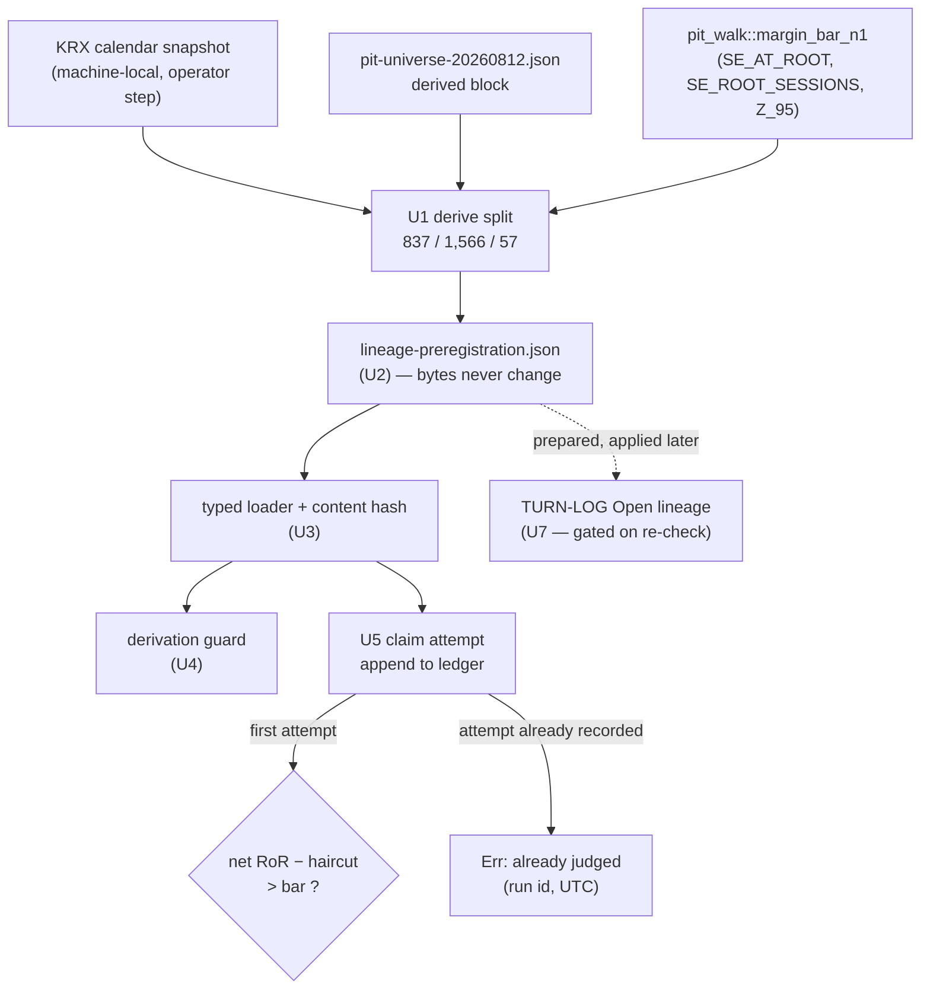

# Next-Lineage Pre-Registration Artifact - Plan

## Goal Capsule

- **Objective.** Freeze the successor daily lineage's terms in a schema-gated, committed artifact **before** its first turn. This is P6 of the ladder in `docs/plans/2026-08-10-001-docs-next-strategy-lineage-scope-plan.md`.
- **Authority.** The origin plan owns the admissibility arithmetic and the pre-registration contract. This plan owns how that contract becomes an executable artifact: file shape, loader, gate tests, and the refusal mechanic. Where the origin's prose and the P4 walk's measured output disagree, the **measured** output wins and the plan records the reconciliation.
- **Execution profile.** Offline. **Zero gateway calls.** No ingest, no backtest, no governed param, no strategy code. If a step appears to need a live call, scope has drifted — stop.
- **Stop conditions.** Stop and report rather than widening scope if U1's reconciliation moves the **specification** or **holdout** session count. Either one moves the margin bar, and the bar propagates into the haircut, the registered effect size, the holding period, and the upgrade-segment floor — all four are derived from it. A moved reserved tail is expected and does not stop the run.
- **Tail ownership.** This plan owns its own gate, commit, and PR. It does **not** open the lineage — see KTD11.

---

## Product Contract

### Summary

Create `adapters/nautilus/lab/config/lineage-preregistration.json` plus a prose companion, a typed loader with a content-hash citation, an append-only judgment ledger that makes a second holdout evaluation impossible, and a derivation guard proving every frozen number reproduces from its inputs. The lineage is **not** opened by this work; U7 prepares the TURN-LOG edit for a later commit gated on a cleared admissibility re-check.

### Problem Frame

The ORB lineage is closed. Its successor cannot start a turn until its terms are frozen, because a load-bearing choice left open after the specification window is observed is not pre-registered — it is a choice made after seeing the data. The origin plan settled which terms matter and computed most of their values. Nothing has yet written them down in a form a program can read, a test can check, or a second evaluation can be refused against.

### Requirements

**The frozen terms**

- R1. Freeze the session ceiling `S_max` and the specification / holdout / reserved split with exact date boundaries, such that the three parts sum to the ceiling.
- R2. Freeze `N_max = 1` on the holdout, and record that `σ_trials` therefore never enters a single judgment's arithmetic — with the condition under which it would.
- R3. Freeze the hypothesized effect size as a ratio to ORB's measured gross edge, derived at the registered power against the **haircut-inclusive hurdle**, and the holding period that ratio implies.
- R4. Freeze the holding period, the directionality, the target trades-per-session, the target session participation, and the stop rule that denominates net RoR. Each carries a named derivation input.
- R5. Freeze the bootstrap block length at no less than the holding period.
- R6. Freeze the survivorship + eligibility haircut as a number with a direction and an application point, so the verdict predicate is executable and two operators reading the same holdout reach the same answer.
- R7. Freeze a finite upgrade schedule whose every scheduled turn is clearable at the registered effect size. Treat exhaustion as a lineage-closure condition.
- R8. Freeze the pre-turn admissibility re-check as a gate rule, and the prospective paper stage as a condition on labelling the lineage successful.
- R9. Freeze the steady-state concurrency the holding period and trades-per-session imply, and the selection breadth it represents against the universe's floor listed count.

**The refusal mechanic**

- R10. Record every holdout evaluation as an attempt — run id, catalog fingerprint, UTC — **before** the evaluation returns a verdict.
- R11. Refuse a second evaluation programmatically once an attempt is recorded. Refusal is a returned error, not a comment in a document.
- R12. Keep the frozen artifact's bytes stable across judgment, so its content-hash citation survives the single judgment.

**Integrity and traceability**

- R13. Derive every frozen number from a named input reachable in-repo. Where a number is citation-reproducible rather than test-reproducible, say which.
- R14. Emit a content-hash citation over the frozen file, so a silent edit cannot masquerade under an old citation.
- R15. Carry a re-derivation trigger naming the conditions that invalidate the freeze.
- R16. State what the freeze does **not** claim: figures that are inferred rather than measured, and the lineage-level multiplicity the finite upgrade cap does not correct for.

**Governance**

- R17. Prepare, but do not apply, the TURN-LOG "Open lineage" edit. The lineage opens in a later commit gated on a cleared pre-turn admissibility re-check.
- R18. Leave `adapters/nautilus/lab/config/preregistration.json` and `adapters/nautilus/lab/config/PREREGISTRATION.md` byte-identical.

### Acceptance Examples

- AE1. **Given** the frozen artifact and a candidate head's holdout result, **when** an operator evaluates the verdict, **then** the predicate `observed net RoR − haircut > bar` resolves to the same boolean for any two operators. *Covers R6.*
- AE2. **Given** a frozen artifact and one recorded attempt, **when** a second evaluation is attempted, **then** it returns an error naming the recorded run id and UTC — **and** this holds even though the operator never wrote a verdict back. *Covers R10, R11.*
- AE3. **Given** the frozen artifact, **when** the derivation guard runs, **then** the split sums to the ceiling, the haircut equals its frozen fraction of the bar, the registered effect size reproduces at the registered power against `bar + haircut`, the holding period is the ceiling of that ratio squared, and the block length is not less than the holding period. *Covers R1, R3, R5, R6, R13.*
- AE4. **Given** a completed single judgment, **when** the artifact is loaded, **then** its content hash is unchanged from the freeze commit. *Covers R12, R14.*

### Scope Boundaries

**In scope.** The artifact, its prose companion, the loader, the judgment ledger, the gate tests, and the prepared-but-unapplied TURN-LOG edit.

**Deferred to follow-up work**

- Opening the lineage. A later commit applies the TURN-LOG edit once the pre-turn admissibility re-check clears.
- Executing the pre-turn admissibility re-check. This plan freezes the rule; the re-check measures the lineage's own ICC, realized trades-per-session, and realized participation on the specification window.
- The strategy specification itself. This freeze fixes the class, the ceiling, and the bar; the specification is frozen on the specification window in a later turn and is the operator's.
- The prospective paper stage under the live designation policy.
- The daily multi-session-hold backtest path (P7, `lab-daily-multi-session-backtest-path`). The freeze does not depend on it, but no turn can run without it.

**Outside this work's identity**

- Any change to the ORB production-ladder pre-registration. It is a different artifact that shares a word. The rung-1 ladder stood down 2026-07-31 and its files stay byte-identical.
- Any new trial bookkeeping beyond the judgment ledger. Spent trials count on the existing append-only ledger.

### Outstanding Questions

- Q1 *(deferred)*. The haircut's magnitude is a pre-registered conservative constant, not an estimate. It cannot be estimated without delisting data the universe structurally lacks. Later evidence can only raise it.
- Q2 *(deferred)*. The forward-accrual clock for the upgrade segments starts at the walk anchor `2026-08-12`. Whether the 15 sessions between ORB's last session and that anchor belong to the reserved quarantine or to the first upgrade segment is recorded as reserved here and can be revisited only before turn one.

---

## Planning Contract

### Key Technical Decisions

- KTD1. **Create a new artifact pair; do not extend the ORB ladder pre-registration.** `lineage-preregistration.json` + `LINEAGE-PREREGISTRATION.md` sit beside `preregistration.json` + `PREREGISTRATION.md`. The existing pair freezes rung dosing and expectation bands for the production ladder; this one freezes a strategy lineage's search terms. They share a word and nothing else. Governs R18.

- KTD2. **Haircut = 0.25 × the holdout bar.** (session-settled: user-directed — chosen over a fixed absolute constant and over two separately-named components: a fraction re-derives automatically if the bar moves, needs no external data, and can only be tightened.) At the bar of `+0.0289065` this is `+0.0072266`, making the verdict hurdle `net RoR > 0.0361331`. The artifact stores the **fraction** as the frozen choice and the product as a derived field, so the guard recomputes the hurdle rather than reading a literal. Governs R6.

- KTD3. **Take the numbers from the P4 walk's derived block, not from the origin plan's prose.** `adapters/nautilus/lab/config/pit-universe-20260812.json` carries `proven_sessions`, `mean_participation`, the concurrency thresholds with their `margin_bar_n1`, and a `margin_note` citation trail, all produced by `reference::pit_walk::derive`. Governs R13.

- KTD4. **The ceiling gap is a date-range mismatch, not a disagreement.** The origin's 2,457 counts `2016-08-01 ..= 2026-08-07`; the walk's 2,460 counts the same floor to its own `2026-08-12` anchor. The three-session delta is exactly the proven sessions in `2026-08-08 ..= 2026-08-12`, and it lands entirely in the reserved tail: the split is **837 specification / 1,566 holdout / 57 reserved**. Both other boundaries are fixed past dates, but that alone does not pin interior counts — U1 asserts the delta against the dated range rather than inferring it. Governs R1.

- KTD5. **Directionality: long-only.** Long/short would halve the sell-tax drag per unit of gross exposure but adds borrow availability, which the SDK cannot answer. Long-only keeps the external data surface at zero. Governs R4.

- KTD6. **Re-derive the effect size and holding period against the haircut-inclusive hurdle, not the bare bar.** (session-settled: user-directed — chosen over keeping the origin's `≥14` / `3.626×` and disclosing the power shortfall: registering a lineage at ~64% power would close a true effect on measurement about a third of the time.) The origin derived its figures at 0.80 power against the bare bar; the haircut raises the hurdle, so the figures must move with it. At `hurdle + z(0.80)·SE(1,566)` the net target is `+0.0485452`; adding ORB's measured `0.061742 R` round-trip cost gives a required gross of `+0.1102872 R`, or **3.8803×** ORB's measured `0.028422 R`. Under √-time scaling the implied horizon is `3.8803² = 15.06`, so the holding period floor is **16 sessions**. Governs R3, R4.

- KTD7. **Target `m = 8`, giving 128 concurrent positions.** The holding period of 16 forces this: at `m = 10` steady-state concurrency is 160, and the walk's derived block carries verified threshold rows only at 70 and 140 — freezing 160 would freeze supply the walk never measured. At `m = 8`, `m × hold = 128` sits under the verified 140 row. The clustering requirement at `m = 8` is bracketed by two computed rows that both clear the 2,460 ceiling (the `m = 4.625` row at 1,891 sessions and the `m = 10` figure at 1,578), so the admission holds without inventing a new table row. Selection breadth is `128 / 244 = 0.525` against the universe's floor listed count. Governs R4, R9.

- KTD8. **Split participation into two named fields.** (session-settled: user-directed — chosen over keeping one field at the measured 0.856 and re-quoting the requirement at ~1,843 sessions.) The clustering table's `p` is the fraction of sessions the strategy trades; a take-top-N-every-session ranking has `p = 1.0` by construction, and 1,578 is that cell. The walk's `mean_participation` of `0.856407` is mean per-symbol **listing depth**, which `pit_walk.rs` documents as an upper bound on tradable participation. The artifact freezes `hypothesis.target_session_participation: 1.0` and records `supply.universe_listing_depth: 0.856407` separately, flagged as a survivorship upper bound. Governs R4, R9.

- KTD9. **Bootstrap block length tied to the hold.** A one-session block assumes independence between blocks; a 16-session hold spans many, which understates the standard error. The guard asserts `block_length_sessions >= holding_period_sessions` rather than a literal, so the two cannot drift apart. Governs R5.

- KTD10. **Refusal is a claim-then-evaluate ledger append, not an operator courtesy.** (session-settled: user-directed — chosen over writing into the artifact with a monotonicity assertion, and over obligating the separate write-back in the Definition of Done.) Evaluation appends an attempt record to an append-only sidecar ledger **before** returning a verdict; a second evaluation finds the attempt and errors. The frozen artifact's bytes never change, so its content-hash citation survives the judgment and the guard's "null in the committed artifact" assertion stays permanently true. This closes the hole where an operator could evaluate, dislike the verdict, revise, and evaluate again without ever seeing an error. The property is git-auditable, not tamper-proof — a revert can still remove the ledger line, and the companion says so. Governs R10, R11, R12.

- KTD11. **The freeze does not open the lineage.** The origin gates opening on a pre-turn admissibility re-check that must refuse to open if the class no longer clears, and places that check upstream of the freeze. (session-settled: user-directed — chosen over honoring the TURN-LOG's freeze-opens-it convention and recording that a failed re-check closes rather than refuses.) U7 prepares the block edit; a later commit applies it once the re-check clears. This keeps the exclusive one-lineage slot and the one-time disjointness reset uncommitted until the class is confirmed admissible. Governs R17.

- KTD12. **`σ_trials` is null per judgment, and the lineage-level multiplicity is stated rather than corrected.** At `N_max = 1` the expected maximum of one draw from a zero-mean null is exactly zero, so dispersion never enters a single judgment. But the schedule permits up to three one-sided judgments of the same lineage, so the lineage-level false-pass rate is roughly three times the per-judgment rate. No lifetime correction is applied — the finite cap is the chosen control — and the artifact records that choice rather than leaving a reader to infer that `null` means "no multiplicity exists". Governs R2, R16.

- KTD13. **Upgrade segments are sized from the registered effect, and the size falls out equal to the holdout.** A segment is only real if the registered effect clears its own `bar + haircut` at the registered power. Solving that at the frozen effect gives **1,566 proven sessions** — identical to the turn-one holdout, because the power calculus is the same. Two turns is therefore roughly **12.8 years of forward accrual** at ~246 sessions a year. This is recorded plainly: turn one is the lineage's only shot within any realistic planning horizon, which is what the origin's own analysis implied. A 500-session segment would carry a post-haircut hurdle of `+0.0639` against a registered effect of `+0.0485` and could never be passed. Governs R7.

- KTD14. **Stop rule: 1.5 × the 1-session (daily) ATR, per position.** This is the width that reproduces ORB's measured cost of `gross − net = 0.028422 − (−0.033320) = 0.061742 R` at its implied 3.73%-of-price stop, and the cost ratio is what the whole admissibility case rests on. Changing the multiple changes `cost_R = 0.0023 / stop_pct` and therefore the required gross edge, so the guard asserts the frozen stop against the frozen cost figure. Governs R4.

### High-Level Technical Design

The frozen artifact is read by two consumers with different rights. The derivation guard reads it to prove the numbers reproduce. The verdict path reads it to resolve a boolean — and claims an attempt in the ledger before it answers.



The claim edge is the one with teeth: the ledger append happens before the verdict is computed, so declining to write a result back does not buy a second look.

The artifact's shape, sketched for orientation — **directional guidance, not a schema specification**; U2 owns the authoritative field set and U4's guard owns the relationships between fields:

```jsonc
{
  "schema_version": 1,
  "frozen_utc": "...",
  "lineage": { "name": "...", "hypothesis_class": "..." },

  "supply": {
    "s_max": 2460,                       // measured, to the walk anchor 2026-08-12
    "s_max_origin_plan": { "sessions": 2457, "to": "2026-08-07" },
    "universe_listing_depth": 0.856407058388766,  // survivorship UPPER bound, not p
    "split": {
      "specification": { "sessions": 837,   "from": "2016-08-01", "to": "2019-12-31" },
      "holdout":       { "sessions": 1566,  "from": "2020-01-02", "to": "2026-05-20" },
      "reserved":      { "sessions": 57,    "from": "2026-05-21", "to": "2026-08-12" }
    },
    "provenance": { "calendar_artifact_id": "...", "calendar_id": "..." }
  },

  "search": {
    "n_max": 1,
    "sigma_trials": null,
    "sigma_trials_trigger": "...",
    "lineage_multiplicity": { "judgments_max": 3, "lifetime_correction": "none — the finite cap is the control" }
  },

  "hypothesis": {
    "effect_size_ratio_to_orb_gross": 3.8803,
    "holding_period_sessions": 16,
    "directionality": "long_only",
    "target_m": 8,
    "target_session_participation": 1.0,
    "steady_state_concurrency": 128,
    "selection_breadth": 0.525,
    "stop_rule": "1.5 x ATR(1 session), per position"
  },

  "verdict": {
    "statistic": "net RoR (sum realized / sum risk_capital)",
    "bootstrap_block_length_sessions": 16,   // >= holding_period_sessions
    "bar": 0.0289065117,
    "haircut_fraction": 0.25,                // the frozen choice
    "haircut": 0.0072266279,                 // derived: fraction x bar
    "predicate": "observed_net_ror - haircut > bar"
  },

  "upgrade_schedule": { "max_turns": 2, "segment_min_sessions": 1566, "turns": [ /* segment + hurdle each */ ] },
  "gates": { "pre_turn_admissibility_recheck": "...", "prospective_paper_stage": "..." },

  "holdout_judged": null,                    // stays null; judgments live in the ledger
  "rederivation_trigger": "..."
}
```

### Assumptions

- The calendar snapshot at `adapters/nautilus/state/krx.calendar.json` is machine-local and gitignored, and CI checks out a tree without it. U1 therefore splits: the count over the real snapshot is an **operator step**, and the committed tests run against injected calendar facts. The split counts are **citation-reproducible** (via the snapshot's `artifact_id` and `calendar_id` recorded in provenance), not test-reproducible.
- The calendar crate exposes no session-count-over-range API, so U1 iterates day by day over ~3,600 days.

---

## Implementation Units

### U1. Reconcile the ceiling and derive the split

**Goal.** Produce the three session counts and their exact date boundaries, and attribute the origin-vs-walk delta to its date range.

**Requirements.** R1, R13. Implements KTD3, KTD4.

**Dependencies.** None.

**Files.**
- `adapters/nautilus/lab/src/lineage_prereg.rs` (new — derivation helpers)
- `adapters/nautilus/lab/src/lib.rs` (module registration)
- `adapters/nautilus/lab/tests/lineage_prereg_derive.rs` (new — `#[ignore]`d operator harness)
- `adapters/nautilus/lab/tests/lineage_prereg_derivation.rs` (new — hermetic; synthetic-fact scenarios only)

**Approach.**
1. Give the derivation helper a calendar-fact injection seam mirroring `nautilus_ls_lab::queue::window::derive_window` (`F: Fn(NaiveDate) -> CalendarDateFact`), so the logic is testable without the snapshot.
2. **Operator step** (`#[ignore]`d harness, run once by hand at freeze time): count proven sessions over `2016-08-01 ..= 2026-08-12` against the real snapshot, partition at the two fixed boundaries, and print the counts plus the snapshot's `artifact_id` and `calendar_id` for transcription into U2.
3. Assert the origin delta by date range: proven sessions in `2026-08-08 ..= 2026-08-12` equals `2460 − 2457`.
4. Recompute the holdout bar from `nautilus_ls::reference::pit_walk::margin_bar_n1` at the derived holdout count.

**Execution note.** Run the operator step and read the numbers out before writing U2. If the specification or holdout count moves off 837 / 1,566, stop and report — the Goal Capsule's stop condition fires, and four downstream frozen figures move with it.

**Test scenarios** *(committed tests use injected synthetic facts; the snapshot run is the operator step)*:
- Against synthetic facts, a boundary date that is not a proven session is rejected rather than silently rounded to a neighbour.
- Against synthetic facts, a closed day at the specification boundary yields no session straddling it.
- Against synthetic facts, the three partitions sum to the ceiling and no session appears in two partitions.
- Against synthetic facts, sessions after the holdout's end land in reserved, never in holdout.
- The delta-attribution helper returns the count for an arbitrary injected sub-range.

**Verification.** The operator step prints 837 / 1,566 / 57 and the two calendar identifiers; the committed tests pass without `adapters/nautilus/state/` present.

---

### U2. Author the frozen artifact

**Goal.** Write `lineage-preregistration.json` with every frozen term.

**Requirements.** R1–R9, R15, R16. Implements KTD2, KTD5–KTD9, KTD12–KTD14.

**Dependencies.** U1.

**Files.**
- `adapters/nautilus/lab/config/lineage-preregistration.json` (new)
- `adapters/nautilus/lab/tests/lineage_prereg_derivation.rs`

**Approach.** Mirror `sample-margin.json`'s shape: `schema_version`, `frozen_utc`, the frozen terms, a `provenance` block, and a `rederivation_trigger`. Record the calendar `artifact_id` / `calendar_id` from U1's operator step as the split's citation. Follow `sample-margin.json`'s `trial_count_basis` precedent for any field whose value carries a caveat: state the caveat in the artifact, not only in the prose companion.

**Execution note.** Draft U4's assertion list before writing a number into the artifact. A number that will not reproduce is a number that should not be frozen.

**Test scenarios.**
- The file parses and every required field is present and non-null, except `holdout_judged` and `sigma_trials`, which are null by design.
- `holdout_judged` is null and stays null — judgments live in the ledger, so a populated record here is a defect at any time.
- The re-derivation trigger names the catalog fingerprint and the universe content hash as invalidating conditions.
- Fields whose figures are inferred rather than measured carry that word in their own text.
- `supply.provenance` carries both calendar identifiers, so the split is citation-reproducible.

**Verification.** The file loads through U3's loader with no error.

---

### U3. Typed loader with content-hash citation

**Goal.** Parse the artifact into typed values and emit a SHA-256 citation over the exact bytes.

**Requirements.** R12, R14.

**Dependencies.** U2.

**Files.**
- `adapters/nautilus/lab/src/lineage_prereg.rs`
- `adapters/nautilus/lab/src/lib.rs`

**Approach.** Mirror `adapters/nautilus/lab/src/dispatch/prereg.rs` — a `load(path)` returning values plus `content_hash`, and a `load_optional` sibling. Reuse `crate::artifacts::manifest::hash_bytes` rather than introducing a second hasher. Expose accessors for the split, the bar, the haircut, and the verdict predicate so callers cannot re-derive the arithmetic locally and drift.

**Patterns to follow.** `adapters/nautilus/lab/src/dispatch/prereg.rs` for the loader and hash shape; `adapters/nautilus/lab/src/margin.rs` for how a frozen config artifact is surfaced to the runner.

**Test scenarios.**
- The committed artifact loads and the content hash is 64 hex characters.
- The same bytes yield the same hash across two loads; a one-field edit yields a different hash.
- A missing file returns a typed error, and `load_optional` returns `None` rather than erroring.
- A file missing a required field returns a typed error naming the field, not a panic.
- The verdict accessor returns the same boolean as the predicate computed by hand from the frozen fields.
- The reserved partition is never returned by any accessor that serves holdout sessions.

**Verification.** Loader is exercised by U4's guard, which reads only through it.

---

### U4. Derivation guard

**Goal.** Prove every frozen number reproduces from its inputs.

**Requirements.** R13, and the arithmetic halves of R1, R3, R5, R6, R7, R9.

**Dependencies.** U3.

**Files.**
- `adapters/nautilus/lab/tests/lineage_prereg_derivation.rs`

**Approach.** Follow `adapters/nautilus/lab/tests/prereg_derivation.rs` — hermetic, reading the committed artifact and reproducing each number from named constants in `nautilus_ls::reference::pit_walk` (`SE_AT_ROOT`, `SE_ROOT_SESSIONS`, `Z_95`, `margin_bar_n1`). Assert relationships, not just literals, so two fields cannot drift apart.

**Test scenarios.**
- The split sums to the ceiling, and the ceiling matches `proven_sessions` in the committed pit-universe artifact.
- The holdout bar reproduces from `margin_bar_n1` at the frozen holdout count.
- The haircut equals `haircut_fraction × bar` to full float precision.
- The registered effect size reproduces from `bar + haircut + z(0.80)·SE` plus ORB's measured cost, divided by ORB's measured gross.
- The holding period equals the ceiling of the registered ratio squared.
- The block length is greater than or equal to the holding period.
- Steady-state concurrency equals `target_m × holding_period` and does not exceed the largest verified threshold row in the pit-universe derived block.
- Selection breadth equals concurrency divided by the walk's `listed_count_min`.
- The frozen stop rule reproduces ORB's measured cost figure.
- Every scheduled upgrade turn's `bar + haircut` sits below the registered effect size — a schedule with an unclearable turn fails.
- The upgrade turn count is a bounded integer.
- Expected-maximum-of-null is exactly zero at `N_max = 1`, and `sigma_trials` is null in that case.
- `target_session_participation` is the clustering-table `p`, distinct from `universe_listing_depth`.

**Verification.** `make adapter-check` is green.

---

### U5. Claim-then-evaluate refusal

**Goal.** Make a second holdout evaluation impossible, not merely discouraged.

**Requirements.** R10, R11, R12. Implements KTD10.

**Dependencies.** U3.

**Files.**
- `adapters/nautilus/lab/src/lineage_prereg.rs`
- `adapters/nautilus/lab/ledger/lineage-holdout-judgments.jsonl` (new — append-only, created on first append)
- `adapters/nautilus/lab/tests/lineage_prereg_derivation.rs`

**Approach.** Follow `adapters/nautilus/lab/src/trials.rs` and its `LEDGER_RELPATH` convention for the append-only shape. The judgment entry point appends an attempt record (run id, catalog fingerprint, UTC) **first**, then computes and returns the verdict. A subsequent call finds the attempt and returns an error. Give the non-consuming path a separate name that cannot produce a verdict over holdout dates — a specification-window dry run.

**Test scenarios.**
- Evaluating against an empty ledger appends exactly one attempt and returns a verdict.
- A second evaluation returns an error whose message carries the recorded run id and UTC.
- The attempt is appended even when verdict computation subsequently fails — a crash mid-verdict does not buy a second look.
- The error is returned, not logged-and-continued; a caller ignoring the result cannot obtain a second verdict.
- A ledger line with a partial payload is treated as a recorded attempt and refuses, rather than being read as absent.
- The frozen artifact's content hash is identical before and after a judgment.
- The specification-window dry run refuses to accept holdout dates.

**Verification.** The refusal path asserts the error, not merely the absence of a verdict.

---

### U6. Prose companion

**Goal.** Explain the freeze in the form the repo's other frozen artifacts use.

**Requirements.** R16, and the narrative halves of R6, R7, R8.

**Dependencies.** U2.

**Files.**
- `adapters/nautilus/lab/config/LINEAGE-PREREGISTRATION.md` (new)

**Approach.** Follow `adapters/nautilus/lab/config/SAMPLE-MARGIN.md`. Explain what each frozen term means, why it takes the value it does, and what the freeze does not claim. State plainly:

- `005930`'s vendor floor is **inferred**, not measured. The observed page cap **is** measured — the walk requested 900 rows and observed 501, and 501 is strictly below 900, which is the condition `pit_walk.rs` names for measured status.
- The refusal is git-auditable, not tamper-proof: a revert can remove a ledger line.
- The split counts are citation-reproducible from the recorded calendar identifiers, not reproducible by a committed test.
- Turn one is effectively the lineage's only shot within a realistic planning horizon (KTD13).

**Test expectation: none** — prose companion, no behavioral change. The numbers it cites are frozen in the artifact that U4's guard checks, but the guard cannot check a prose claim — the inferred-vs-measured wording rests on review (see Risks & Dependencies).

**Verification.** Every number it cites appears in the frozen artifact.

---

### U7. Prepare the TURN-LOG opening edit

**Goal.** Stage the "Open lineage" block edit without applying it.

**Requirements.** R17. Implements KTD11.

**Dependencies.** U2, U4.

**Files.**
- `adapters/nautilus/lab/TURN-LOG.md`

**Approach.** Leave the standing block reading "currently open: NONE". Add a dated entry recording the freeze — the artifact, its content hash, and the frozen terms — and state that the lineage opens in a later commit once the pre-turn admissibility re-check clears. Record in that entry the exact replacement text the later commit will apply to the standing block, so the opening commit is a mechanical edit rather than a fresh judgment.

**Test expectation: none** — documentation edit.

**Verification.** The standing block still reads "currently open: NONE"; the dated entry records the freeze and the prepared replacement text.

---

## Verification Contract

Offline throughout. **Zero gateway calls.** A live call means scope drifted.

| Gate | Command | When |
|---|---|---|
| Adapter workspace | `make adapter-check` (from the repo root; the target's own recipe does the `cd`) | Required — all code lands here |
| Root workspace | `cargo test` | Only if a file under `crates/` is touched. Not expected. |
| Docs projection | `make docs-check` | Cheap; run it |
| Lane guard | `make lane-check` | Cheap; run it |
| Queue guard | `make todo-check` | Cheap; run it |
| Morning chain | `make script-check` | Only if a file under `adapters/nautilus/scripts/` or `src/bin/calendar-fetch-inputs.rs` is touched. Not expected. |

Gate hazards that have bitten this repo before:

- A bare `cargo` from the repo root is a **false green** — the adapter workspace opts out of the root workspace. The tell is a missing `Compiling nautilus-ls` line.
- `make adapter-check | tail` reports **tail's** exit code. Redirect to a file and check the exit code separately.
- Green means **every** `test result:` line reads `0 failed`, not merely a zero exit. The current adapter baseline is 75 result lines / 1,535 passed.
- `env -u` any exported `LS_*` variables first; several false-red the `mount_universe` suite.
- Never run two `cargo` invocations against the same target directory concurrently.

---

## Definition of Done

**Global**

- `lineage-preregistration.json` is committed, loads through its typed loader, and every frozen field is populated except the two null by design.
- The derivation guard passes and asserts relationships between fields, not only literal values.
- A second holdout evaluation returns an error, and the frozen artifact's content hash is unchanged by a judgment.
- The TURN-LOG still reads "currently open: NONE"; the freeze is recorded and the opening edit is staged.
- `preregistration.json` and `PREREGISTRATION.md` are byte-identical to their pre-change state — confirm with a diff, not by memory.
- The committed test suite passes on a tree with no `adapters/nautilus/state/` directory.
- The full gate is green, including `make adapter-check` verified line-by-line.
- The queue item `next-lineage-preregistration-artifact` is closed through `lab-next`, never by editing the JSONL.
- No abandoned scaffolding remains in the diff. Decide explicitly whether U1's derivation helpers stay in `lineage_prereg.rs` after the freeze — U3 and U5 are the module's only post-freeze consumers and neither reads the calendar.

**Per unit**

- U1 — the operator step prints 837 / 1,566 / 57; the committed tests need no snapshot.
- U2 — the artifact carries no figure that the guard cannot reproduce or cite.
- U3 — a byte edit changes the content hash.
- U4 — every frozen number has an assertion, including the effect size, the hold, and every upgrade turn's clearability.
- U5 — the attempt is appended before the verdict; a partial ledger line refuses.
- U6 — every cited number appears in the artifact; inferred figures are named as inferred.
- U7 — the standing block is unchanged and the replacement text is staged.

---

## Risks & Dependencies

- **The reconciliation moves the specification or holdout count.** Low likelihood — the delta is attributed to a dated five-day range — but it would move the bar, and the bar propagates into the haircut, the effect size, the hold, and the upgrade-segment floor. U1 runs first and the Goal Capsule stops the run.
- **Turn one is effectively one-shot.** KTD13's segment floor of 1,566 sessions means each upgrade turn needs ~6.4 years of forward accrual. The schedule is finite and honest, but it is not a realistic second chance. This is a property of the arithmetic, not a defect in the plan — it is recorded so nobody plans around an upgrade that will not arrive.
- **A number gets typed in rather than derived.** The guard is the control, which is why U2's execution note requires the assertion list to be drafted first.
- **Inferred figures presented as measured.** `005930`'s vendor floor is the specific hazard; the page cap is not — it is measured. U6 states both and the guard cannot catch a prose overclaim, so this one rests on review.
- **The refusal is auditable, not tamper-proof.** A revert can remove a ledger line. The plan does not claim otherwise, and U6 says so.

---

## Sources & Research

- `docs/plans/2026-08-10-001-docs-next-strategy-lineage-scope-plan.md` — the ladder, the frozen-field list, the margin-bar table by supply and search budget, the clustering table, and the cost model. The origin for every requirement here.
- `adapters/nautilus/lab/config/pit-universe-20260812.json` — the P4 walk's `derived` block: 2,460 proven sessions, 352 symbols, `listed_count_min` 244, mean listing depth 0.856407, concurrency thresholds at 70 and 140, observed page maximum 501 against a 900-row request.
- `adapters/nautilus/src/reference/pit_walk.rs` — `derive` at `:716`, and the constants the bar reproduces from (`SE_AT_ROOT`, `SE_ROOT_SESSIONS`, `Z_95`, `margin_bar_n1`). Its `max_observed_rows_per_page` doc comment defines when the page cap counts as measured.
- `adapters/nautilus/lab/config/sample-margin.json` — the artifact shape this one mirrors, including how a caveated figure states its own caveat in-band. Note it carries ORB's provenance, not the SE constants.
- `adapters/nautilus/lab/tests/prereg_derivation.rs` — the derivation-guard pattern: hermetic, reproduces frozen numbers from named constants, asserts the content-hash citation.
- `adapters/nautilus/lab/src/dispatch/prereg.rs:146` — `load` and the `content_hash` mechanic.
- `adapters/nautilus/lab/src/trials.rs` — `LEDGER_RELPATH` and the append-only ledger convention U5 follows.
- `adapters/nautilus/lab/src/queue/window.rs` — `derive_window`'s calendar-fact injection seam, the pattern U1 mirrors to stay hermetic.
- `adapters/nautilus/lab/TURN-LOG.md` — the standing "Open lineage" block.
