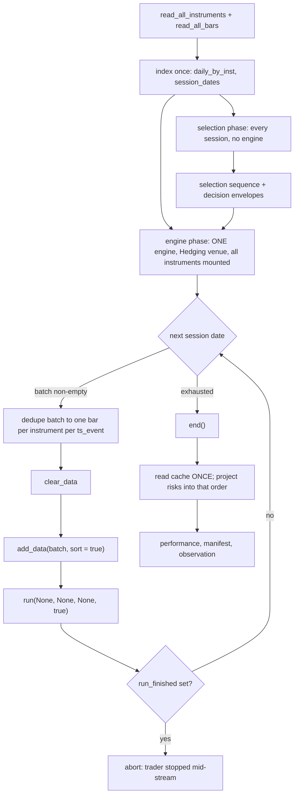
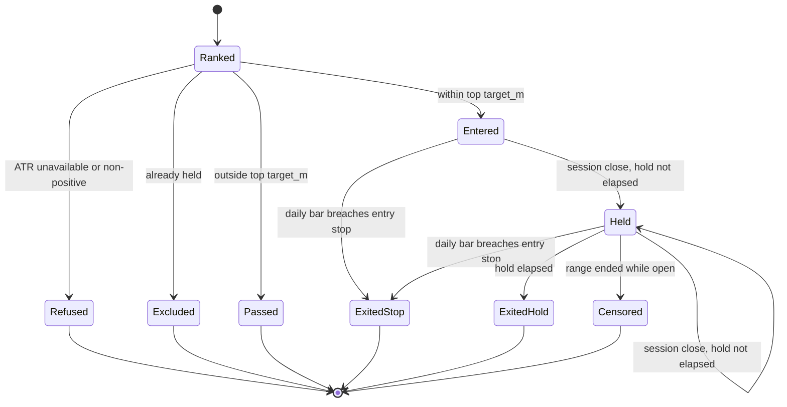

# Daily-Resolution Multi-Session-Hold Backtest Path - Plan

## Goal Capsule

- **Objective.** Give the lab a backtest path that holds a position across multiple sessions at daily resolution. This is P7 of the ladder in `docs/plans/2026-08-10-001-docs-next-strategy-lineage-scope-plan.md`, and the last unbuilt prerequisite before the successor lineage's first turn.
- **Authority.** The origin plan owns the admissibility arithmetic and the prerequisite ladder. `adapters/nautilus/lab/config/lineage-preregistration.json` owns every frozen term — hold, target `m`, concurrency, directionality, stop rule, block length, and the verdict statistic. This plan owns only how a runnable path is built under those terms. Where this plan and the frozen artifact disagree, the artifact wins and this plan is wrong.
- **Execution profile.** Offline. **Zero gateway calls.** No ingest, no live mount, no governed param turn, no dispatch.
- **Stop conditions.** Stop and report rather than widening scope if the work cannot proceed without moving `strategy_code_hash()`, changing the serialized shape of `Manifest.params`, or editing any item inside `adapters/nautilus/lab/src/strategy/orb.rs`. All three are head-identity inputs that fail closed at mount time rather than at test time.
- **Open blockers.** None. P0–P6 are complete and merged at `ea0c076`.

---

## Product Contract

### Summary

Add a daily-resolution, multi-session-hold backtest path to the lab as a second, additive path beside the existing per-session ORB path, driven by nautilus's streaming engine workflow so an open position survives across session boundaries. Ship enough strategy to exercise the path end-to-end, emit the per-session series the frozen verdict statistic and its pre-turn re-check both need, and guard the run registry so a daily run can never be mistaken for an ORB one.

### Problem Frame

`adapters/nautilus/lab/src/runner/backtest.rs` constructs a fresh `BacktestEngine` per session (`:887`, inside `run_engine` at `:878`) and mounts `BarKind::Minute` only (`:475`). That per-day reset is deliberate for ORB — a symbol that reached `Done` yesterday starts clean today — and is gated by `same_thread_sessions_are_independent` in `adapters/nautilus/lab/tests/backtest_run.rs:1002`. It also makes a multi-session hold structurally impossible: no position can outlive `run_engine`.

The successor lineage's terms were frozen at `ea0c076` and require a 16-session hold at 128 steady-state concurrency. Turn one cannot run against a path that resets every day.

Two facts narrow the problem. Daily bars already flow through the runner — `daily_by_inst` builds candidates and derives `session_dates` — so only the engine *mount* is minute-only. And cross-session accumulation already works for scalars: the `positions` vector at `:430` is read at loop top for the equity multiplier. What does not exist is an open position surviving engine teardown.

The frozen pre-registration also records the gap this plan closes on the judgment side: the holdout judgment entry point "takes the observed statistic as a bare number… Binding it needs a typed observation carrying its own date range and catalog fingerprint, and there is no producer to type against until the daily multi-session-hold backtest path exists (P7)."

A third problem is invisible from the runner and was found during planning. The lab's run registry has no strategy partition. `latest_finalized_run` is a bare newest-by-run-id lookup with no strategy or code-hash filter, and it is the params authority for an ORB turn, its range source, its KEEP/REVERT baseline, and the diagnose trial anchor. Because `Manifest.params` is a non-optional `OrbParams`, every daily run must assert some ORB parameter set into that registry. Adding a second strategy to a registry with no partition is the change that makes those consumers wrong.

### Requirements

**The backtest path**

- R1. Hold a position across session boundaries at daily resolution, for the frozen `holding_period_sessions`.
- R2. Mount daily bars into the engine, not minute bars.
- R3. Leave the existing per-session ORB path behaviorally unchanged. A pre-change ORB run and a post-change ORB run over the same catalog and range produce identical positions and an identical `performance.json`.
- R4. Read the engine's **position report** once after the stream ends, never per session — the cache is cumulative across a streaming run. The shared open-position handle of KTD16 is not that read and may be consulted between batches.
- R5. Index the catalog once before the loop, and run the whole engine lifecycle inside one `spawn_blocking` closure.
- R19. The daily venue uses an OMS type that mints a distinct position per open, so a symbol re-entered after a completed hold yields a second position rather than reopening the first.
- R23. Dedupe each session's daily batch to one bar per instrument per distinct `ts_event` before it reaches the engine, and count hold elapsed in distinct session dates from the loop rather than in bar callbacks.

**Identity and comparability**

- R6. `strategy_code_hash()` returns the current ORB value byte-identically after this work, and its signature is unchanged.
- R7. `governed_params_hash` over `OrbParams` is unchanged, and `Manifest.params` keeps its concrete `OrbParams` type and serialized shape.
- R8. Every manifest written before this work still deserializes, and round-trips without losing a field.
- R9. Every input the daily selection derives is scoped to the same pinned range as the run's `catalog_fingerprint`.
- R24. No consumer that resolves "the current run" for one strategy can resolve a run of the other. This covers head selection, turn params adoption, range inheritance, KEEP/REVERT baselines, the trial anchor, and run comparison.

**The strategy**

- R10. Each session, rank the session's tradable candidates and take the top `target_m` from those not already held; hold each position for the frozen hold; long only; exit on the frozen stop rule or at hold expiry.
- R11. When the ATR the stop needs is unavailable **or non-positive**, refuse the entry with a recorded reason. Never enter without a positive stop distance, and never silently skip the gate.
- R12. Risk capital per position is entry-fixed at the stop distance and does not move over the hold.
- R27. Position size is set from an explicit daily-path sizing term, never inherited from `OrbParams`.

**Downstream producers**

- R13. Emit a typed run observation carrying its own `data_range` and `catalog_fingerprint`, sufficient on its own to construct every **run-derived** argument the holdout judgment entry point takes — the run id, the catalog fingerprint, and the observed statistic. The loaded pre-registration, the judgment ledger, and the claim timestamp are supplied by the call site, not by any run artifact.
- R14. Emit a per-session series of `(session_date, Σ realized_pnl, Σ risk_capital, entries, closes)`. Per-session counts alone cannot produce an ICC or a session-block bootstrap over a ratio statistic.
- R21. Declare and apply one session-attribution convention for a trade spanning many sessions.
- R25. Refuse to write the observation when the run's `return_on_risk` is `None`. The frozen statistic is `sum realized / sum risk_capital`; a legacy P&L fallback is not that number.
- R26. Mark a run made with the placeholder ranking signal structurally, not by naming convention, and make a placeholder run unusable as a judgment.
- R15. Leave `adapters/nautilus/lab/config/lineage-preregistration.json` byte-identical. Its content hash is cited; a new field goes in a new artifact.
- R22. Refuse, or exclude with a recorded reason, any position whose hold straddles a recorded adjustment-basis shift on its symbol.

**Governance**

- R16. Do not open the lineage. The `TURN-LOG.md` standing block still reads `currently open: NONE` when this work lands.
- R17. Zero gateway calls.
- R18. The daily path is reachable from a real entry point wired at the composition root, exercised by at least one test that drives the compiled binary.

### Acceptance Examples

- AE1. Covers R1, R4, R19. Given a catalog spanning more than 16 daily sessions, when a symbol is entered, held to expiry, and entered again later, then two distinct positions appear in the run's `performance.json` with two distinct risk values — not one merged position.
- AE2. Covers R3, R6, R7. Given the ORB backtest run before and after this work over the same catalog and pinned range, when their manifests and performance reports are compared, then `strategy_code_hash`, `governed_params_hash`, the position set, and `performance.json` are identical.
- AE3. Covers R11. Given a candidate whose prior ATR is unavailable or exactly zero, when the daily strategy evaluates it, then the entry is refused with a recorded reason and no position opens — the absence of a decision record is itself a defect.
- AE4. Covers R13. Given a finished daily run, when the observation is read, then every run-derived argument the holdout judgment entry point takes is constructible from the observation alone, without re-reading the manifest.
- AE5. Covers R8. Given a manifest written before this work, when it is deserialized by the post-change binary, then it loads with the new field absent and round-trips without gaining or losing a key.
- AE6. Covers R24. Given a daily run finalized after the newest ORB run in one data home, when an ORB turn resolves its prior, its range, its KEEP baseline, and its trial anchor, then none of them resolves to the daily run.
- Origin AE9 (see origin: `docs/plans/2026-08-10-001-docs-next-strategy-lineage-scope-plan.md`). Given an implementer starting turn one, when they run the first daily backtest, then a daily multi-session-hold path is already built rather than discovered to be absent. Traced by U5.

### Scope Boundaries

**In scope.** The daily session loop, the daily strategy sufficient to exercise it, the daily parameter set and its manifest carriage, the entry point, the typed observation, and the registry guards that a second strategy makes necessary.

**Deferred for later**

- The pre-turn admissibility re-check itself. This plan emits its sufficient input; the re-check, its refusal mechanic, and its verdict are separate work gated on measured values.
- The ranking signal that carries the hypothesis. The frozen artifact says the signal is "frozen on the specification window" — that is turn one's act.
- Opening the lineage. A later commit owns the `TURN-LOG.md` standing-block edit; its replacement text is already staged there.
- Retiring the per-session ORB path. See KTD2 for the condition that would justify it.

**Outside this work's identity**

- Any live or paper mount of the daily strategy. The frozen artifact's `prospective_paper_stage` is a separate gate after a clearing holdout judgment.
- Any change to `adapters/nautilus/lab/config/preregistration.json` or `PREREGISTRATION.md` — the production-ladder pair, a different artifact that shares a word.

---

## Planning Contract

### Key Technical Decisions

- KTD1. **One engine over a streaming daily bar stream.** `nautilus-backtest` 0.60.0 documents the workflow in `BacktestEngine::run`: `run(streaming=true)` → `clear_data()` → `add_data(next_batch)` → `end()`. `clear_data` (`engine.rs:974`) resets only data-iteration state and leaves the kernel cache intact, so positions survive across batches. Rejected: a hoisted engine with `reset()` between sessions, which clears the cache and defeats the purpose. Governs R1, R4.

- KTD12. **The daily venue is `OmsType::Hedging`; ORB's venue config is untouched.** Under `OmsType::Netting` — what `backtest.rs:894` builds for ORB — `determine_netting_position_id` returns `PositionId::new(format!("{instrument_id}-{strategy_id}"))`, one constant id per symbol for the whole run. Re-entering a symbol takes the `reopen_position` path, which calls `snapshot_position` to clone the closed position under `{id}-{uuid}` into a serialized blob; `cache.positions()` reads the live index only, so every earlier round trip on that symbol disappears from the run with no diagnostic. Netting also merges concurrent legs, which destroys the entry-fixed stop. Hedging mints a distinct position per open. This is a per-path venue config and costs nothing against R3.

  **Hedging changes the exit contract, and this is the trap.** Under Hedging a fill whose client order id has no cached position mints a *fresh* position, and the netting fallback that would otherwise match the open long is disabled — so an exit submitted without a position id opens an opposite-side position instead of closing the long. The account type does not reject the accidental short. Every daily exit must therefore carry `Some(position.id)`, either through the framework's close-position helper or by threading the id through order submission. ORB's exit at `orb.rs:1330` submits with no position id and relies on `reduce_only`; that pattern is **Netting-only** and must not be copied into the daily strategy. Governs R19, R12, R10.

- KTD2. **Additive second path, not a generalized one.** The daily path is a separate loop reached from a separate binary. The repo's dominant shape for a second behavior is extend-and-delegate (`build_candidates` → `build_candidates_with_today_open`; `from_positions` → `from_positions_with_risk`; `run` → `run_inner`), but it reserves side-by-side surfaces for genuinely different things — `lab-mount-universe` is split from `lab-live` on that reasoning. This path carries a different strategy, params, mount, OMS, and hold semantics. **The seam:** reuse the `pub(crate)` helpers in `backtest.rs` (`build_candidates`, `build_candidates_with_today_open`, `select_prior`, `select_prior_today`, `prior_atr`, `prior_illiq`) at their current signatures; deliberately duplicate the run preamble and tail (advisory lock, range fingerprint assert-and-re-check, venue builder, artifact-writing tail). The condition that would justify collapsing the arms: ORB's runs stop being reproduced, which is not foreseeable while its head is the ladder's pinned identity.

- KTD15. **The daily path uses candidate assembly but not ORB's selection rule.** `select_universe` (`orb.rs:134`) gates on `params.gap_min_pct` and caps at `params.universe_top_n` (default 20 against a frozen `target_m` of 8) — ORB's hypothesis, not this one. Candidate *assembly* is shared (`build_candidates`, which lives outside `orb.rs` and yields `prior_atr` and `prior_turnover`); the *selection rule* is duplicated on the daily side. Rejected: extracting a shared parameterized selector, whose first daily-only knob would land in `orb.rs` and move the head hash. Rejected on the other side: duplicating assembly too, which would let two prior-ATR derivations drift and judge the lineage against a differently-derived universe than the pit walk sized. Governs R9, R10.

- KTD3. **Entry risk is captured by client order id and joined by index into cache-read order, with a reconciliation.** `from_positions_with_risk` (`performance.rs:424-436`) is **index-aligned, not keyed** — `risks.get(i)` — and its doc comment records that a short slice silently leaves trailing positions risk-less. Keying by `PositionId` does not help: the strategy knows only its `ClientOrderId` at submit time, and `Position.opening_order_id` is the join key on the read side. The ledger therefore captures by `ClientOrderId` and is projected into the order produced by U1's single cache read. Do not touch `EntryRiskLedger` (`orb.rs:1140`) and do not extend `EntryRisk` (`performance.rs:80`, `Copy`, struct literal at `orb.rs:1486`) — either edit moves the head hash.

  **Three seam assertions, not two.** Length equality catches truncation and the `Some`-count catches a collapsed cache read, but a projection built in ledger order rather than cache-read order passes both — right length, every slot filled — while attaching every risk to the wrong position. The third assertion closes it: for every index, the position's `opening_order_id` equals the client order id that filled that slot. This costs no new machinery because the key is already on the read side. Governs R12.

- KTD4. **A new `Option<DailyParams>` field on `Manifest`; `params: OrbParams` is untouched.** Every field added to `Manifest` since v1 uses `Option<T>` with `#[serde(default, skip_serializing_if = "Option::is_none")]`, and `research_cli.rs:466` pins the legacy round-trip. Retyping `params` into an enum would change the serialized JSON that `governed_params_hash` hashes, detaching every existing run from the running binary's head. The price of this correct decision is KTD14. Governs R7, R8.

- KTD5. **`strategy_code_hash()` is left untouched; the daily runner calls a sibling function.** Every one of its eight production call sites is ORB-domain with no strategy id in scope (`ladder.rs:86`, `:105`, `:547`, `:637`; `live.rs:2108`, `:2469`, `:2815`; `backtest.rs:310`), so adding a strategy-id parameter buys eight edits that all pass the literal `"orb"` on the most identity-critical function in the crate. R6 then holds by construction rather than by test. Rejected: dispatching the existing function on strategy id. Governs R6.

- KTD14. **Every registry consumer that resolves "the current run" gains a strategy filter, keyed on `Manifest.strategy_id`.** `latest_finalized_run` (`research.rs:105`) is a bare newest-by-run-id lookup with **seven** call sites: the params authority for `turn()` (`research.rs:392`), the range source (`:426`), the KEEP/REVERT baseline (`governed.rs:196`), the diagnose trial anchor (`research.rs:2133`), and the three reporting commands (`report.rs:328`, `:491`, `:1015`) — the last of which reads a run's performance figures against the frozen ORB sample margin. `runs compare` (`research.rs:890`) has no strategy equality check in any mode. Head selection (`ladder.rs:86`, `:105`) filters on code hash, which KTD5 makes sufficient there, but a filter present in one consumer and absent from eight is not a partition.

  **The key must not default to the ORB value.** Both `Manifest.strategy_id` and the run id derive from the parameter set's `strategy_id` (`backtest.rs:299-303`), whose default is `"orb"` (`params.rs:384`). If the daily runner writes `OrbParams::default()` into the non-optional `params` field, every filter here passes the daily run through and the partition is vacuous — the exact silent head-reversion it exists to prevent. U3 owns the discriminator; U8 asserts it is not `"orb"` so the filters cannot be no-ops for the wrong reason. Every filter *is* a no-op against the existing registry, where all eight committed manifests carry `strategy_id: "orb"`. Governs R24.

- KTD6. **The placeholder ranking signal is marked structurally, and the observation itself is the enforcer.** A flag nothing reads is the same weak control as a name, and the judgment entry point this plan does not touch takes a bare number and claims the ledger before evaluating. So the enforcement lives where this plan can build it: the observation exposes a single typed accessor that produces the run-derived judgment arguments, and that accessor **errors when the placeholder marker is set**. Making it the only path to those arguments is what turns the marker into a fail-closed edge against a frozen `judgments_max` of 3 at `n_max = 1`. Governs R26, R13, R10.

- KTD13. **Exit-attribution for session bucketing.** A trade opening on session N and closing on N+16 is attributed to its closing session, so a session bucket's `Σ realized_pnl` and `Σ risk_capital` describe the same trades. This leaves the leading hold-length of sessions empty, which is one bootstrap block. Rejected: entry-attribution, under which a session carries deployed risk with no realized P&L. Related and unstated until now: `end()` does not flatten open positions, and `dominance_fold` (`performance.rs:470`) folds only closed trades, so the roughly 128 positions open at range end drop out of both numerator and denominator — the statistic is computed over `S − hold` effective sessions. Governs R21, R14.

- KTD7. **The session-open equity multiplier is fixed at exactly 1.0 on the daily path, and asserted.** The multiplier at `backtest.rs:449` reads prior sessions' realized P&L at loop top — the one genuine engine-to-selection feedback edge. Compounding is on the no-build list, and preserving it would force the daily loop back into a per-session engine round-trip for no registered benefit.

- KTD8. **The typed observation lands in a new artifact beside the run, not in the frozen pre-registration.** The frozen file's content hash is cited by its loader and by the judgment ledger; a frozen governance artifact stays byte-identical so existing citations survive. Governs R13, R15.

- KTD9. **The stop fails closed on an unavailable or non-positive ATR.** A KRX limit-locked session prints `O=H=L=C`, so `ATR(1)` can be exactly zero — *available*, and passing an `is_some` check. `joined_risk` (`performance.rs:92-100`) returns `(None, None)` on a non-positive `risk_per_share`, which sets `all_have_risk = false` for the whole run and collapses `return_on_risk` to `None`. One bad entry in 837 sessions silently downgrades the run to a P&L-based number under a verdict that names a risk-normalized one. Governs R11, R25.

- KTD10. **Release builds for any real run; daily-only fixtures are cheap.** The documented 5–7 minutes per session is a *minute-bar* cost at roughly 380 bars per symbol-session. A daily-only fixture is about one bar per symbol-session and runs in seconds even in debug — so fixtures must be sized to reach hold expiry, not truncated on a misread of that figure. The 837-session specification window is release-only, and nautilus emits about 8,900 log lines per session that `bypass_logging: true` does not suppress.

- KTD11. **Ranking runs in the pre-engine selection pass, not in a bar callback — and this is forced, not preferred.** `run_impl` delivers one datum at a time, so when bar *k* of *N* arrives the strategy has seen only *k* of the session's bars. A cross-sectional rank computed there is silently partial. Selection is pure over `daily_by_inst` and `open_vol_by_inst` and needs no engine; all instruments are mounted up front to avoid adding instruments mid-stream. Governs R5, R9.

- KTD16. **A shared open-position handle is the authority for both the already-held exclusion and batch membership.** The two are the same question and neither is answerable where the plan first put them: candidate assembly and ranking are pure and run before the engine exists, but the held set is engine state, and R4 forbids a per-session position-report read. The runner therefore clones a handle from the strategy before mounting it — the same shared-handle pattern `run_engine` already uses for the entry-risk ledger at `backtest.rs:905-909` — and reads it between batches. The take-top-`target_m`-minus-held step moves out of the pre-engine selection phase into the per-session pre-batch step. Rejected: deriving the held set statically from entry date plus hold length, which blocks re-entry after an early stop-out and so violates R10. Note that the engine's add-strategy method is a sized generic, so the daily runner is generic over the strategy type rather than taking a boxed factory, and that genericity propagates to the entry point. Governs R10, R4, R23.

### High-Level Technical Design

The daily loop splits the current per-session body into a pure selection phase and a single streaming engine phase.

The position lifecycle is what the per-session reset cannot express today.

Identity boundary — what this work may move and what it may not:

| Value | May move? | Why |
|---|---|---|
| `strategy_code_hash()` and its signature | No | Head identity; eight production sites and a fixture digest. The two `dispatch_cli.rs` head assertions do **not** pin it — they substring-match a prose banner (see U7) |
| Anything inside `strategy/orb.rs` | No | Its bytes *are* the hash — including `EntryRisk`'s literal, `EntryRiskLedger`, `UniverseCandidate`, `select_universe`, `SelectedSymbol` |
| `governed_params_hash(OrbParams)` | No | Head-params identity; hashes serialized `OrbParams` |
| `Manifest.params` type and JSON shape | No | Input to the above |
| `build_candidates` / `build_candidates_with_today_open` | No | In `backtest.rs`, outside every pinned hash — an edit breaks R3 invisibly |
| ORB's venue config (`backtest.rs:888-899`) | No | Changes ORB fills |
| `lab_src_fingerprint` | Yes | A freshness comparison against the running binary; self-heals on rebuild, no pinned literal |
| `universe_sequence_hash` on daily runs | Yes | A new path's runs have no prior baseline to match |
| `lineage-preregistration.json` | No | Content hash cited by its loader and the judgment ledger |

---

## Implementation Units

### U1. Streaming multi-session engine loop

**Goal.** Drive every in-range session through one engine so an open position survives session boundaries, with daily bars mounted and a Hedging venue.

**Requirements.** R1, R2, R4, R5, R19, R23. Implements KTD1, KTD12, KTD7, KTD11, KTD15, KTD16.

**Dependencies.** None. The strategy is supplied by the caller (see Approach), so this unit lands before U4.

**Files.**
- `adapters/nautilus/lab/src/runner/backtest_daily.rs` (new)
- `adapters/nautilus/lab/src/runner/mod.rs` (alphabetical `pub mod` line, after `backtest`)
- `adapters/nautilus/lab/tests/backtest_daily_run.rs` (new — includes a test-only always-enter strategy)

**Approach — selection phase (no engine).**
1. Index the catalog once into `daily_by_inst` and a per-date daily bucket, mirroring `backtest.rs:368-379`. Derive `session_dates` from in-range daily bars as `backtest.rs:412` does.
2. Build candidates per session with `build_candidates`, and rank them. Do **not** call `select_universe` — per KTD15 the daily selection rule is U4's. Emit decision envelopes and collect the selection sequence. Fix the session-open equity multiplier at 1.0 and assert it. This phase produces a *ranked candidate list per session*, not a final take: the take-top-`target_m`-minus-held step needs the held set and therefore runs per session in the engine phase (KTD16).

**Approach — engine phase.**
3. Build one engine. Configure the venue with `OmsType::Hedging` (KTD12) and mount every instrument up front. Mount `BarKind::Daily`, not `BarKind::Minute`. Make the runner **generic over the strategy type** — the engine's add-strategy method is a sized generic, so a boxed factory will not compile — mirroring how `run_engine` takes `selected: Vec<SelectedSymbol>` rather than hard-coding selection. This is what lets U1 land and be tested before `strategy/daily.rs` exists. Clone the strategy's open-position handle before mounting it, per KTD16.
4. Per session, resolve the take from the ranked list minus the held set (read from the handle), then build the batch as **every symbol with an open position plus that session's newly taken symbols**. A held position must receive its daily bar on every session of its hold or the venue cannot price it and the stop never evaluates. Dedupe to one bar per instrument per distinct `ts_event` before submission, recording any divergent duplicate dropped — a surviving value-divergent duplicate delivers two callbacks for one session, which would both shorten the frozen hold and fire the stop check twice.
5. Skip the whole `clear_data` / `add_data` / `run` cycle when the batch is empty — `add_data` errors on an empty slice (`engine.rs:406`). Pass `sort = true` on every `add_data`; `self.sorted = sort` at `:499` is an assignment, not an OR, so the last call in a batch wins.
6. Call `run(None, None, None, true)` — **not** the pinned range. `run_impl` sets `last_ns = start_ns` and calls `set_all_clocks_time` unconditionally at `engine.rs:692-697`, before the `iteration == 0` gate, so passing the range on every batch rewinds every component clock each time. `clear_data` nulls `ts_first`/`ts_last_data` and `add_data` recomputes them per batch, so `None` resolves to that batch's own bounds. Range pinning lives in which bars are added.
7. After the first batch, assert `engine.iteration() > 0`. If the first batch processes zero items the first-iteration block re-runs on the next call — a new run id, a new `backtest_start`, and `initialize_account()` mid-stream.
8. After every batch, check `engine.run_finished()`. A `force_stop` calls `end()` even under `streaming = true` (`engine.rs:642`), and because `iteration != 0` no later `run()` restarts the trader — the loop then routes bars into a stopped trader and finishes green with a truncated position set. Abort with a typed error instead.
9. After the loop, call `end()`, then read positions from the cache exactly once.
10. Keep the whole lifecycle inside one `tokio::task::spawn_blocking` closure with owned data moved in — the catalog and the engine both drive an internal `block_on` and panic from an async context.

**Execution note.** Write the carry-over test first, with the test-only always-enter strategy, and watch it fail against a per-session engine. That test is this unit's reason to exist and it must not depend on U4's ranking, stop, or hold semantics.

**Fixture note.** Each `lab/tests/*.rs` is its own binary and there is no shared test-support module — `write_daily_series` (`backtest_run.rs:848`) and `build_multi_session_fixture` (`:871`) are unreachable from a new file. Budget roughly 60 lines of duplicated scaffold (`json_response`, `mount_token`, `mock_config`, the `t8430` body, `InstrumentProvider::load_domain`, `write_instruments`, `Checkpoint { adjusted_prices: true }`), a new multi-session config function (`multi_cfg` at `:929` is a two-date literal), and a hand-chained daily series long enough to reach hold expiry. Per KTD10 a daily-only fixture is cheap to run — size it to reach expiry.

**Test scenarios** *(tagged S = selection phase, E = engine phase)*:
- S. Selection output — sequence and envelopes — is identical whether the engine phase runs or is skipped, proving the selection pass has no engine dependency.
- S. The equity multiplier is exactly 1.0 on every session.
- E. A position entered on session 1 of a 20-session fixture is still open at session 5 and closes at hold expiry, appearing exactly once.
- E. A position entered on session 1 is stopped out on session 6 by a bar for a symbol that was **not** re-selected on session 6 — proving held symbols stay in the batch.
- E. A symbol entered, held to expiry, and entered again later yields two distinct positions in the cache read.
- E. A session with no bars at all skips the batch cycle without erroring.
- E. A value-divergent duplicate bar at the same `ts_event` mid-hold is deduped, the drop is recorded, and the position still exits at exactly N + hold.
- E. Two symbols entered on different sessions hold concurrently and close on different sessions.
- E. A run over a range with no daily bars returns an empty position set with no partial run written and no staging directory left behind.
- E. Reading the cache once after `end()` yields the same count as summing distinct positions observed across the stream.

**Verification.** The carry-over test reds when `clear_data()` is removed from the loop, when the engine is reconstructed per session, when held symbols are dropped from the batch, and when the venue is switched to `OmsType::Netting`. Prove each by mutation — a coverage-only diff is green before and after.

---

### U2. Entry-risk capture and the index-aligned join

**Goal.** Give every position the entry-fixed risk that opened it, correctly when one symbol holds several positions over the range.

**Requirements.** R12. Implements KTD3.

**Dependencies.** U1 (owns cache-read order).

**Files.**
- `adapters/nautilus/lab/src/artifacts/performance.rs` (new ledger type beside `EntryRisk`)
- `adapters/nautilus/lab/src/runner/backtest_daily.rs` (the projection and the reconciliation)
- `adapters/nautilus/lab/tests/backtest_daily_run.rs`

**Approach.** Capture entry risk keyed by `ClientOrderId` — the only identity the strategy holds at submit time. At the runner seam, project the ledger into the order of U1's single cache read by joining on `Position.opening_order_id`, producing the `Vec<Option<EntryRisk>>` that `from_positions_with_risk` consumes. Assert three things before calling it: `risks.len() == positions.len()`; the count of `Some` entries equals the number of ledger entries that actually opened a position; and for every index, the position's `opening_order_id` equals the client order id that filled that slot. The first catches truncation, the second a collapsed cache read the first would pass, the third a permutation both would pass. Define the second over ledger entries that opened a position — not over every recorded entry — so a venue or risk-engine rejection produces a named run-level diagnostic rather than hard-failing a valid run. Reuse `EntryRisk` unchanged and do not touch `EntryRiskLedger` in `orb.rs`.

**Execution note.** Three distinct failure modes break three different statistics, and only one is the denominator. **Collapse** — several positions on a symbol joining to one risk — makes `Σ risk_capital` wrong and therefore net RoR wrong. **Mis-ordering** is a permutation, leaves `Σ risk_capital` invariant and net RoR unaffected, but corrupts per-trade `realized_r`, `mean_realized_r`, and the per-symbol `max_risk_capital_share` fold. **Truncation** sets `all_have_risk = false` and collapses `return_on_risk` to `None` entirely. Test all three.

**Test scenarios.**
- End-to-end through the engine: a symbol entered, exited, and re-entered over the range appears as two distinct trade records in `performance.json` with two distinct risk values.
- Risk capital recorded at entry is unchanged at exit after a full hold of price movement.
- A deliberately shortened risk slice trips the length assertion rather than silently producing risk-less trailing trades.
- A deliberately collapsed ledger trips the count assertion even though the length assertion passes.
- Ordering: with deliberately distinct per-entry risk values, each position carries its own — verified against a uniform-value fixture that would hide the defect.
- A deliberately permuted projection trips the opening-order-id assertion even though length and count both pass.
- A recorded entry whose order was rejected by the venue produces a named diagnostic, not an aborted run.
- A position with no recorded entry risk resolves to `None` and takes the legacy path rather than panicking.

**Verification.** Every position in an end-to-end daily run carries a non-`None` `risk_capital`, and all three seam assertions are exercised by a failing-then-passing mutation.

---

### U3. Daily parameter set, manifest carriage, and the daily code hash

**Goal.** Carry the daily strategy's parameters and source identity in the run manifest without moving any ORB identity hash.

**Requirements.** R7, R8, R6, R27. Implements KTD4, KTD5.

**Dependencies.** None.

**Files.**
- `adapters/nautilus/lab/src/params_daily.rs` (new)
- `adapters/nautilus/lab/src/lib.rs` (alphabetical `pub mod` line between `params` and `queue`; the header bullet list is narrative-ordered and optional)
- `adapters/nautilus/lab/src/artifacts/manifest.rs` (one new optional field; a sibling daily code-hash function)
- `adapters/nautilus/lab/tests/research_cli.rs` (round-trip tests beside `:466`)

**Approach.** Define `DailyParams` with the frozen terms as defaults and each field carrying `#[serde(default)]` per the `OrbParams` convention. The field list must include, beyond hold and `target_m` and stop multiple and directionality: an **ATR window** (the frozen rule is ATR(1 session) but `prior_atr` at `backtest.rs:710` takes `params.atr_window`, whose ORB default of 14 needs 15 prior bars), a **sizing term** (ORB's `notional_per_position` and `risk_per_trade_krw` must not be inherited), and a **concurrency term or an explicit statement that `target_m` is the only throttle** (ORB's `max_concurrent` defaults to 5 against a frozen steady state of 128). Add a `validate()` mirroring `OrbParams::validate()` (`params.rs:466`) and name its call site at run construction. Add one `Option<DailyParams>` field to `Manifest` with `#[serde(default, skip_serializing_if = "Option::is_none")]`. Add a sibling daily code-hash function; leave `strategy_code_hash()` and its signature untouched.

**Own the registry discriminator.** A daily run must write a `strategy_id` that is **not** `"orb"`, and the daily code hash into `strategy_code_hash`. Both fields derive from the parameter set's `strategy_id` today (`backtest.rs:299-303`, default `"orb"` at `params.rs:384`), so a daily runner that fills the non-optional `params` with `OrbParams::default()` would emit a manifest indistinguishable from an ORB run and make every U8 filter vacuous. This decision lives here rather than in U5 because U8's filters key on it and U8 does not depend on U5.

`DailyParams` belongs on the params side rather than in `strategy/daily.rs` because `artifacts/manifest.rs` already imports `crate::params::OrbParams`; placing it under `strategy/` would create an `artifacts → strategy` dependency for a data type.

**Test scenarios.**
- A manifest JSON literal written before this field deserializes with the field `None` and round-trips without gaining or losing a key.
- A manifest carrying `Some(DailyParams)` round-trips with every field preserved.
- An ORB run's serialized manifest is byte-identical to its pre-change form.
- `governed_params_hash` over `OrbParams::default()` equals its pre-change value, and `strategy_code_hash()` equals the full ORB digest pinned in U7.
- Daily defaults for hold, `target_m`, and directionality are read from the frozen artifact in the test rather than typed in. The stop multiple is prose in that artifact (`"1.5 x ATR(1 session), per position"`), so assert the typed constant against that string rather than parsing a number out of it.
- A `DailyParams` with a hold below the frozen value is rejected by `validate()`, and the call site refuses the run.
- A `DailyParams` with a non-positive ATR window or sizing term is rejected.
- An ORB run carrying `Some(daily_params)` is refused rather than ignored.
- A daily run's manifest carries a `strategy_id` that is not `"orb"` and a code hash that is not the ORB digest.

**Verification.** The legacy round-trip at `research_cli.rs:466` still passes; both identity hashes are unchanged.

---

### U4. The daily strategy

**Goal.** Rank the session candidates, take the top `target_m` from those not already held, hold for the frozen period, long only, exit on the stop or at hold expiry.

**Requirements.** R10, R11, R12, R22, R23, R27. Implements KTD9, KTD12, KTD15, KTD13.

**Dependencies.** U2, U3.

**Files.**
- `adapters/nautilus/lab/src/strategy/daily.rs` (new)
- `adapters/nautilus/lab/src/strategy/mod.rs` (declare the module and its source const, leaving `pub mod orb;` and `ORB_SOURCE` untouched)
- `adapters/nautilus/lab/tests/strategy_daily.rs` (new)

**Approach.**
1. Rank the session's candidates by the placeholder signal, **exclude any symbol already held**, and take the top `target_m` of the remainder. The frozen `selection_breadth` of `128/244` is explicitly a ratio of concurrent positions to the universe's floor listed count, so concurrency is a count of distinct names.
2. Compute the stop at entry from the configured ATR window and multiple; record risk capital as entry-fixed at that distance. Size the position from `DailyParams`'s sizing term.
3. Refuse entry with a typed reason when the ATR is unavailable **or non-positive**, and emit the decision record on the refusal path — that record is the only evidence the gate ran.
4. Track hold elapsed per open position in **distinct session dates supplied by the loop**, never by counting bar callbacks, so a duplicate bar cannot shorten a frozen hold.
5. Fix and document the fill mechanic for both legs. An order submitted in a bar callback is drained and settled at that bar's `ts_init`, so entry fills against that session's daily bar. State whether the exit is a resting stop order matched against the bar's OHLC path or a market exit at the session close — at daily resolution these differ by roughly a full ATR, and the difference lands directly in the numerator of the judged statistic.
6. **Submit every exit with an explicit position id** (KTD12). Under the Hedging venue an exit without one opens a fresh opposite-side position rather than closing the long. Do not copy ORB's `submit_order(order, None, …)` plus `reduce_only` exit at `orb.rs:1330` — it is correct only under Netting.
7. Refuse to enter, or exclude with a recorded reason, any position whose hold would straddle a recorded adjustment-basis shift on its symbol (R22). The catalog is on the vendor's adjusted basis, so a corporate action inside a hold puts entry and exit on different bases and corrupts both the realized P&L and the entry-fixed risk capital. The existing control at `data_quality.rs:84-89` reports shift symbols but never refuses; this is the fail-closed consumer of that report, on the same pattern as the ATR refusal in step 3.
8. Name the placeholder ranking signal in code and carry the placeholder marker into the run (U6 makes it structural).

**Execution note.** Adding the module must not alter `pub mod orb;` or `ORB_SOURCE` — `include_str!("orb.rs")` must resolve to identical bytes. The daily path may call items in `orb.rs` only at their current signatures; if a signature feels wrong for the daily path, copy the logic into `daily.rs` rather than widening it in place.

**Test scenarios.**
- With 12 candidates and `target_m` of 8, exactly 8 enter and the 4 lowest-ranked are refused with a recorded reason.
- A symbol already held is excluded from the take even when it ranks first, and a different name takes its slot.
- A candidate with no prior ATR is refused with a decision record; no position opens.
- A candidate whose ATR is exactly zero — a limit-locked `O=H=L=C` session — is refused on the same path.
- A position opened at session N with the stop unbreached closes at session N + hold, not earlier and not later.
- A daily bar breaching the entry stop closes the position that session, before hold expiry.
- Hold elapsed is unchanged by a duplicate bar delivered for the same session date.
- No short position is ever opened, including when the ranking signal is inverted in a fixture, and an exit closes its own position rather than opening a second one.
- A symbol carrying a recorded adjustment-basis shift inside the prospective hold window is refused, or its position is excluded, with the reason recorded — asserted by the presence of the record, not only by the absence of the trade.
- Risk capital equals quantity × (entry − stop) at entry and is unchanged when read at exit.
- Concurrency reaches `target_m` × hold and does not exceed it, at a **scaled** setting (for example `target_m` of 2 and a hold of 3, giving 6) — the frozen 8 × 16 = 128 would need 128 distinct instruments, and U3 carries the assertion that the defaults match the frozen figures.

**Verification.** `strategy_code_hash()` for `orb` is unchanged; the daily source hash is distinct from it.

---

### U5. The `lab-backtest-daily` entry point

**Goal.** Make the daily path reachable from a real command wired at the composition root.

**Requirements.** R18, R2, R9, and origin AE9. Implements KTD2, KTD10.

**Dependencies.** U1, U4.

**Files.**
- `adapters/nautilus/lab/Cargo.toml` (one `[[bin]]` block, alphabetically after `lab-backtest`)
- `adapters/nautilus/lab/src/bin/lab-backtest-daily.rs` (new — doc comment plus a one-line delegating `main`)
- `adapters/nautilus/lab/src/runner/backtest_daily.rs` (the `main_cli` entry and the hook-taking variant)
- `adapters/nautilus/lab/tests/backtest_daily_run.rs`

**Approach.** Follow the three-step bin recipe: `[[bin]]` block, a thin `src/bin/` file delegating to `runner::backtest_daily::main_cli()`, module already registered in U1. Expose the same two-function shape as `backtest.rs` — a public `run(cfg, start)` plus a `run_inner`-style variant taking a `before_finalize` hook, since that hook is a library seam and is not reachable through `main_cli`. Read config from `LS_DATA_HOME` plus `LS_BTD_*` variables, naming each missing required variable in its error. Hard-error on a malformed numeric variable — do not copy the `unwrap_or(1)` silent default at `backtest.rs:1049`, which `research_cli.rs:430` pins as the anti-pattern. Hold the ingest advisory lock and re-check the range-scoped catalog fingerprint at finalize.

State explicitly what the daily runner writes into the non-optional `Manifest.params`, and why that value cannot be selected as an ORB baseline. U8 is the structural guard; this is the local one.

**Execution note.** The dead-code hazard is the point of this unit: a daily path reachable only from `#[test]` bodies is dead code with a green coverage report. Mark each scenario below as driving the binary or the library.

**Test scenarios.**
- *(binary)* Driving the compiled binary via `env!("CARGO_BIN_EXE_lab-backtest-daily")` over a multi-session fixture lands a finalized run in the registry with a position held across sessions.
- *(binary)* No `LS_DATA_HOME` errors and names that variable.
- *(binary)* A malformed numeric config variable errors rather than defaulting.
- *(library)* A catalog mutated in-range mid-run aborts with no registry residue, via the `before_finalize` seam.
- *(library)* The run refuses to start while the ingest advisory lock is held.

**Verification.** From `adapters/nautilus`, `cargo test -p nautilus-ls-lab --test backtest_daily_run` is green with the binary-driving test named. A bare `cargo build --bin lab-backtest-daily` is not the check — lab bins need `-p nautilus-ls-lab`, and a binary that compiles and does nothing satisfies a build check.

---

### U6. Typed run observation and the per-session series

**Goal.** Emit an observation sufficient on its own to construct a holdout judgment and to feed the pre-turn admissibility re-check.

**Requirements.** R13, R14, R15, R21, R25, R26. Implements KTD8, KTD13, KTD6.

**Dependencies.** U2, U5.

**Files.**
- `adapters/nautilus/lab/src/artifacts/observation.rs` (new)
- `adapters/nautilus/lab/src/artifacts/mod.rs` (filename const plus a `write_observation` delegating to `write_json`, matching `write_manifest` / `write_performance` / `write_data_quality`)
- `adapters/nautilus/lab/src/runner/backtest_daily.rs` (the producer — computes the series and calls the writer)
- `adapters/nautilus/lab/src/lib.rs` and `adapters/nautilus/lab/tests/artifacts.rs` (the "same four artifacts" prose invariant, now conditionally five)
- `adapters/nautilus/lab/tests/backtest_daily_run.rs`

**Approach.** Carry the run id, the pinned `data_range`, the `catalog_fingerprint`, the observed net RoR, the placeholder marker, the censored-position count, and a per-session series of `(session_date, Σ realized_pnl, Σ risk_capital, entries, closes)` under KTD13's exit-attribution. The series — not per-session counts, and not per-session RoR — is what a session-block bootstrap over a ratio statistic needs, because the ratio must be re-formed inside each resample. It is also the sufficient input from which the re-check derives ICC. Refuse to write when `return_on_risk` is `None`. Do not add a field to `lineage-preregistration.json`; confirm its hash with a diff.

Expose the run-derived judgment arguments — run id, catalog fingerprint, observed statistic — through **one typed accessor**, and have that accessor return an error when the placeholder marker is set (KTD6). Making it the only path to those arguments is what converts the marker from a flag nothing reads into a fail-closed edge. The loaded pre-registration, the ledger, and the claim timestamp are the call site's to supply and are deliberately not carried here.

**Execution note.** Realized participation is the fraction of sessions the strategy *trades*. That is not the frozen `universe_listing_depth`, which is a survivorship-biased upper bound on per-symbol listing depth. The frozen artifact records them as different quantities on purpose.

**Test scenarios.**
- Every run-derived argument the holdout judgment entry point takes is constructible from the observation alone, without re-reading the manifest.
- A placeholder-marked observation yields no judgment arguments — the accessor errors rather than returning a usable tuple.
- The observation's `data_range` equals the run's pinned range and its `catalog_fingerprint` equals the manifest's.
- The per-session `Σ risk_capital` summed over all sessions equals `performance.json`'s risk-capital total — a closure check against a dropped or double-counted session.
- Per-session `closes` sum to the closed-position count, and the censored count accounts for the difference against total positions.
- A run whose `return_on_risk` is `None` writes no observation and says why.
- A run with zero in-range sessions or zero trades yields a defined result rather than a division artifact.
- A run aborted at the finalize fingerprint re-check leaves no observation in a finalized run directory.
- A placeholder-signal run carries the placeholder marker.
- An ORB run writes no observation — asserted positively, since the existing artifact test never asserts the set is exactly four.

**Verification.** `shasum -a 256` of `lineage-preregistration.json` still reads `0ecd9d11…`.

---

### U7. Identity-preservation guards

**Goal.** Make an accidental identity move a test failure rather than an `exit 71` discovered at mount time.

**Requirements.** R3, R6, R7, R8. Implements KTD5, KTD3.

**Dependencies.** U3, U5.

**Files.**
- `adapters/nautilus/lab/tests/identity_guards.rs` (new)

**Approach.** Pin what must not move. No production edit is required here — KTD5 leaves `strategy_code_hash()` untouched, so this unit is guards only.

**The existing head assertions do not pin the hash.** `dispatch_cli.rs:798` and `:877` assert `stdout.contains("7571abef")`, but the live-mount diagnostic prints that short digest as fixed prose on every invocation (`live.rs:2822`, `:2962` — "the documented head 7571abef…"), so both pass unchanged after any `orb.rs` edit. `paired_power.rs` compares fixture JSON to the literal, not the binary; `rung_report.rs` compares a report field to the function's own return value. No committed test pins the running binary's computed hash today. This unit adds the first one: a direct equality against the full digest `7571abefd715cfa0095ac04ba566f165b6e536cfcb7f86f4a8b88dcf2240133c` (recorded at `tests/fixtures/paired-arms-closed-trades.json:10`). Without it this unit would guard nothing.

**Execution note.** Run the ORB reproduction as a real before-and-after comparison over one fixture catalog, not as an argument from inspection. R3 is the requirement most likely to be believed rather than verified.

**Test scenarios.**
- `strategy_code_hash()` equals the full digest `7571abef…133c` by direct equality, and its signature is unchanged. This is the assertion that did not previously exist.
- `governed_params_hash(&OrbParams::default())` equals its pre-change value.
- An ORB backtest over a fixed fixture produces the same position set and the same `performance.json` before and after this work.
- `build_candidates` and `build_candidates_with_today_open` are unchanged — they sit outside every pinned hash, so an edit breaks R3 invisibly.
- ORB's venue config at `backtest.rs:888-899` is unchanged, including `OmsType::Netting`.
- The existing `same_thread_sessions_are_independent` test passes unmodified — it is not co-opted for the daily path.
- A daily run's code hash differs from the ORB value.
- The two `dispatch_cli.rs` head assertions and the seven occurrences in `tests/fixtures/paired-arms-closed-trades.json` pass unchanged — noting that the former are prose-banner substring checks and prove nothing about the computed hash on their own.

**Verification.** `make adapter-check` green line-by-line, with the ORB reproduction diff shown empty.

---

### U8. Registry strategy partition

**Goal.** Make it impossible for a consumer resolving "the current ORB run" to resolve a daily run.

**Requirements.** R24. Implements KTD14. Depends on U3's discriminator.

**Dependencies.** U3, U7 — U8 appends guard tests to `tests/identity_guards.rs`, which U7 creates.

**Files.**
- `adapters/nautilus/lab/src/runner/research.rs` (`latest_finalized_run` and its callers; `compare`)
- `adapters/nautilus/lab/src/runner/governed.rs` (the KEEP/REVERT baseline)
- `adapters/nautilus/lab/src/runner/report.rs` (the three reporting commands at `:328`, `:491`, `:1015`)
- `adapters/nautilus/lab/src/dispatch/ladder.rs` (head selection, belt-and-braces beside the code-hash filter)
- `adapters/nautilus/lab/tests/identity_guards.rs`

**Approach.** Give `latest_finalized_run` a strategy filter defaulting to the running binary's strategy, keyed on `Manifest.strategy_id` (U3 owns the discriminator), and thread it through all **seven** consumers that trust it: `turn()`'s params adoption, range inheritance, `decide_keep_or_revert`, the diagnose trial anchor, and the three reporting commands — one of which reads a resolved run's performance figures against the frozen ORB sample margin. Make `compare` refuse a cross-strategy pair in every mode rather than relying on the incidental param-diff and code-hash guards. Add the same predicate at head selection, keeping the two filter chains verbatim-identical — their doc comment is load-bearing.

A filtered lookup must read **every** manifest rather than only the newest, using the skip-on-unreadable pattern already at `ladder.rs:88`; a strict read would turn a previously-succeeding lookup into a hard error the first time an old manifest fails to parse.

**The trial ledger's missing strategy field is deferred, not in scope here.** `TrialRecord` has no strategy field, so trial counts merge the two lineages. That is a schema change to an append-only governance ledger with its own re-derivation implications, and R24 is satisfied for this unit by partitioning the *anchor* resolution. Stage the ledger change as its own queue item through `lab-next` rather than widening this unit.

Every filter is a no-op against the existing registry, where all eight committed manifests carry `strategy_id: "orb"`, so this unit cannot change any ORB behavior.

**Execution note.** Nothing structurally separates the two strategies' data homes — the separation is one `LS_DATA_HOME` slip deep, and every failure this unit guards is silent.

**Test scenarios.**
- A daily run finalized after the newest ORB run does not become the ORB turn's resolved prior params.
- The same daily run is not the ORB turn's inherited range source.
- The same daily run is not the KEEP/REVERT baseline.
- The same daily run is not the diagnose trial anchor.
- None of the three reporting commands, invoked with no explicit run id, resolves the daily run.
- A daily manifest's `strategy_id` is not `"orb"` — without this the filters would pass for the wrong reason.
- `compare` given one ORB run and one daily run refuses in every mode, naming the mismatch.
- An unreadable older manifest is skipped rather than failing the lookup.
- With only ORB runs present, every consumer resolves exactly as it did before this unit.

**Verification.** The whole existing dispatch and research suite passes unchanged, proving the filters are no-ops on a single-strategy registry.

---

## Verification Contract

Offline throughout. **Zero gateway calls.** A live call means scope drifted.

| Gate | Command | When |
|---|---|---|
| Adapter workspace | `make adapter-check` (from the repo root) | Required — all code lands here |
| Root workspace | `cargo test` | Only if a file under `crates/` is touched. Not expected. |
| Docs projection | `make docs-check` | Cheap; run it |
| Lane guard | `make lane-check` | Cheap; run it |
| Queue guard | `make todo-check` | Cheap; run it |
| Morning chain | `make script-check` | Only if `adapters/nautilus/scripts/` or `src/bin/calendar-fetch-inputs.rs` is touched. Not expected. |

Gate hazards that have bitten this repo before:

- A bare `cargo` from the repo root is a **false green** — the adapter workspace opts out of the root workspace. The tell is a missing `Compiling nautilus-ls` line.
- `make adapter-check | tail` reports **tail's** exit code. Redirect to a file and check `MAKE_EXIT` separately.
- Green means **every** `test result:` line reads `0 failed`, not merely a zero exit. The baseline at `ea0c076` is 77 result lines / 1,581 passed.
- `env -u` every exported `LS_*` variable first; several false-red the `mount_universe` suite.
- Never run two `cargo` invocations against the same target directory concurrently. A `SIGKILL`'d run wedges `target/debug/incremental` — clear that directory, not the whole target.
- A test binary plateaued with no output at 0% CPU is macOS `syspolicyd`, not a failure. Sample it; kill and re-run.

Three verifications the gate cannot perform on its own:

- **Mutation, not coverage.** U1's carry-over gate and U7's reproduction check are green before and after a coverage-only diff. Prove each by mutating the code it guards.
- **The ORB reproduction comparison.** Run one ORB backtest over a fixed fixture before the branch and once after, and diff the position set and `performance.json`.
- **The registry no-op claim.** U8's filters are asserted no-ops; the evidence is the existing dispatch and research suites passing unchanged, not the new tests alone.

---

## Definition of Done

**Global**

- A position opens on one session and closes a full hold later, counted once, proven over a fixture longer than the hold.
- A symbol entered, exited, and re-entered over the range appears as two distinct trade records in `performance.json`.
- `strategy_code_hash()`, its signature, `governed_params_hash` over `OrbParams`, and the serialized shape of `Manifest.params` are all unchanged — verified, not asserted from memory.
- Nothing inside `strategy/orb.rs`, `build_candidates`, `build_candidates_with_today_open`, or ORB's venue config was edited.
- An ORB run over a fixed fixture produces an identical position set and identical `performance.json` before and after.
- Every pre-existing manifest still deserializes and round-trips.
- The daily path is reachable from `lab-backtest-daily` and a test drives the compiled binary.
- The observation carries the per-session series and refuses to exist when `return_on_risk` is `None`.
- No ORB-path consumer can resolve a daily run.
- `lineage-preregistration.json` hashes to `0ecd9d11…`; `preregistration.json` and `PREREGISTRATION.md` are byte-identical to their pre-change state.
- `TURN-LOG.md` still reads `currently open: NONE`.
- The full gate is green, `make adapter-check` verified line-by-line.
- The queue item `lab-daily-multi-session-backtest-path` is closed through `lab-next`, never by editing the JSONL, and after the gate — the fingerprint is whole-tree.
- No abandoned scaffolding remains. The placeholder ranking signal is not scaffolding; it is named, marked, and retained deliberately.

**Per unit**

- U1 — the carry-over test reds under each of the four mutations named in its Verification.
- U2 — both seam assertions are exercised by a failing-then-passing mutation.
- U3 — the legacy round-trip passes, an ORB manifest is byte-identical, and `validate()` has a named call site.
- U4 — a zero ATR refuses the entry; a held symbol is excluded from the take; a hold straddling a basis shift is refused or excluded with a record; no short ever opens.
- U5 — the compiled binary is driven by a test; no config variable defaults silently.
- U6 — the run-derived judgment arguments are constructible from the observation alone, and a placeholder-marked observation refuses to produce them.
- U7 — the ORB reproduction diff is empty and every pinned literal is unchanged.
- U8 — the existing dispatch and research suites pass unchanged.

---

## Risks & Dependencies

- **An adjustment-basis rewrite lands inside a hold.** The daily catalog is on the vendor's adjusted basis, which the vendor rewrites at corporate actions. A position entered before a split and held across it has its entry on one basis and its exit on another — a 2:1 rewrite books a −50% "realized" loss on a flat position, and the entry-fixed risk capital was computed on the pre-splice basis. Numerator and denominator are both corrupted, per position, silently. ORB is structurally immune because it never holds overnight; a 16-session hold at 128 concurrency is maximally exposed. The existing control (`data_quality.rs:84-89`) is report-only and never refuses. **R22 is the mitigation** and it is a genuine addition to this path, not a restatement of an existing guard.

- **An identity hash moves by accident.** The highest-consequence failure: the symptom is not a test failure but `lab-live --mount` exiting 71 later, with the head silently resolving to `OrbParams::default()`. U7 converts it into a test failure. KTD5 removes the largest vector by leaving the function alone.

- **A daily run is read as an ORB run.** The registry has no strategy partition and `Manifest.params` cannot express "this run has no `OrbParams`", so every daily run asserts a fictitious ORB parameter set. U8 is the mitigation; without it the failure is silent at five consumers.

- **The streaming workflow is documented but unproven here.** KTD1 rests on the nautilus doc comment and on `clear_data` leaving the cache intact. The repo's existing empirical result — a fresh engine per session is independent — explicitly does not cover this workflow. U1's execution note makes the carry-over test the first thing built.

- **A silent downgrade from the frozen statistic.** One non-positive ATR sets `all_have_risk = false` for the entire run and turns `return_on_risk` into `None`, which the performance code documents as a legacy P&L fallback rather than an error. KTD9 refuses the entry and R25 refuses the observation, so the run fails loudly instead of reporting the wrong statistic.

- **The placeholder ranking signal is mistaken for the hypothesis.** KTD6 makes this structural rather than nominal: a flagged observation is not a valid judgment input. The residual risk is that the marker is removed rather than the signal replaced, which review must catch.

- **Run cost at the specification window.** 837 sessions in a debug build is not viable and the log volume is not suppressible through config. Release is mandatory for a real run. This does not bound fixture size — see KTD10.

- **Concurrency at steady state is an upper bound.** 128 is `target_m` × hold under full participation; the realized number contends for the same risk budget and is visible only at the run. Under KTD12 it is at least reachable; under Netting it was structurally unreachable.

---

## Deferred / Open Questions

### From 2026-08-15 review

- **Is the streaming loop actually required, or would a single non-streaming pass do?** KTD1 records only the reset-per-session variant as rejected. It never evaluates feeding one `add_data` over the whole range and calling `run(None, None, None, false)` once. That alternative would drop six streaming-specific hazard guards — the empty-batch skip, `sort = true` on every call, the `None` range that avoids the clock rewind, the iteration assertion, the run-finished check, and per-batch dedupe — each of which is a place to get it wrong. KTD7 and KTD11 remove every engine-to-selection feedback edge that would justify batching; the genuine cost is that the loop is what supplies session dates to the hold counter (R23) and the held set to the per-session take (KTD16). Resolve this before building U1, because it changes U1's shape entirely. Deferred rather than decided: the reviewer's proposed fix asks for "the concrete reason streaming is still required," and that reason is not established.

---

## Sources & Research

- `docs/plans/2026-08-10-001-docs-next-strategy-lineage-scope-plan.md` — the P0–P7 ladder; origin R11 and AE9 govern this work.
- `adapters/nautilus/lab/config/lineage-preregistration.json` and its prose companion — every frozen term, the verdict statistic, the 16-session bootstrap block, and the pre-turn re-check the observation feeds.
- `adapters/nautilus/lab/src/runner/backtest.rs` — `run_sessions` at `:353`, the per-session loop at `:436`, the minute-only mount at `:475`, the venue at `:888-899`, `run_engine` at `:878` with the per-session engine at `:887`, the symbol-keyed risk join at `:928`, and `prior_atr` at `:710`.
- `adapters/nautilus/lab/src/artifacts/performance.rs` — `EntryRisk` at `:80`, `joined_risk` at `:92-100`, the index-aligned join at `:424-436` with its short-slice doc at `:411-412`, and `dominance_fold` at `:470`.
- `nautilus-backtest` 0.60.0 `src/engine.rs` — the streaming workflow, the unconditional clock reset at `:692-697`, the empty-batch guard at `:406`, the `sorted` assignment at `:499`, the `iteration == 0` gate at `:700`, and the `force_stop` path at `:642`.
- `nautilus-execution` 0.60.0 `src/engine/mod.rs:2913` and `nautilus-common` 0.60.0 `src/cache/mod.rs:4684` — why Netting collapses position identity and hides reopened round trips.
- `docs/solutions/architecture-patterns/head-identity-hash-is-file-scoped-so-live-only-wiring-forces-a-rebaseline.md` — why `strategy_code_hash()` cannot move, and every site pinned to its current value.
- `docs/solutions/architecture-patterns/multi-session-nautilus-backtest-fresh-engine-and-catalog-bucketing.md` — the governing doc for `run_sessions`; catalog bucketing, the single `spawn_blocking` requirement, and the minute-bar build cost.
- `docs/solutions/architecture-patterns/a-safety-escape-hatch-wired-to-none-at-the-composition-root-is-dead-code-its-unit-tests-still-pass.md` — the dead-code hazard U5 guards against.
- `docs/solutions/logic-errors/prior-atr-absent-silently-disables-the-armed-or-width-gate.md` — why the stop must fail closed.
- `docs/solutions/logic-errors/re-ingesting-an-overlapping-range-duplicates-catalog-bars.md` — why a value-divergent duplicate survives read-side dedup and must be handled before `add_data`.
- `docs/solutions/conventions/coverage-only-change-is-verified-by-mutation-not-by-the-gate.md` — why U1 and U7 are proven by mutation.
- `adapters/nautilus/lab/tests/research_cli.rs:466` — the legacy manifest round-trip precedent U3 mirrors; `:430` pins the no-silent-default rule.
- `adapters/nautilus/lab/tests/backtest_run.rs:848` — `write_daily_series`; unreachable from a new test binary, hence U1's fixture note.
- `CONCEPTS.md` — Strategy lineage, Lineage closure, Search budget, Head identity, Return-on-risk.
