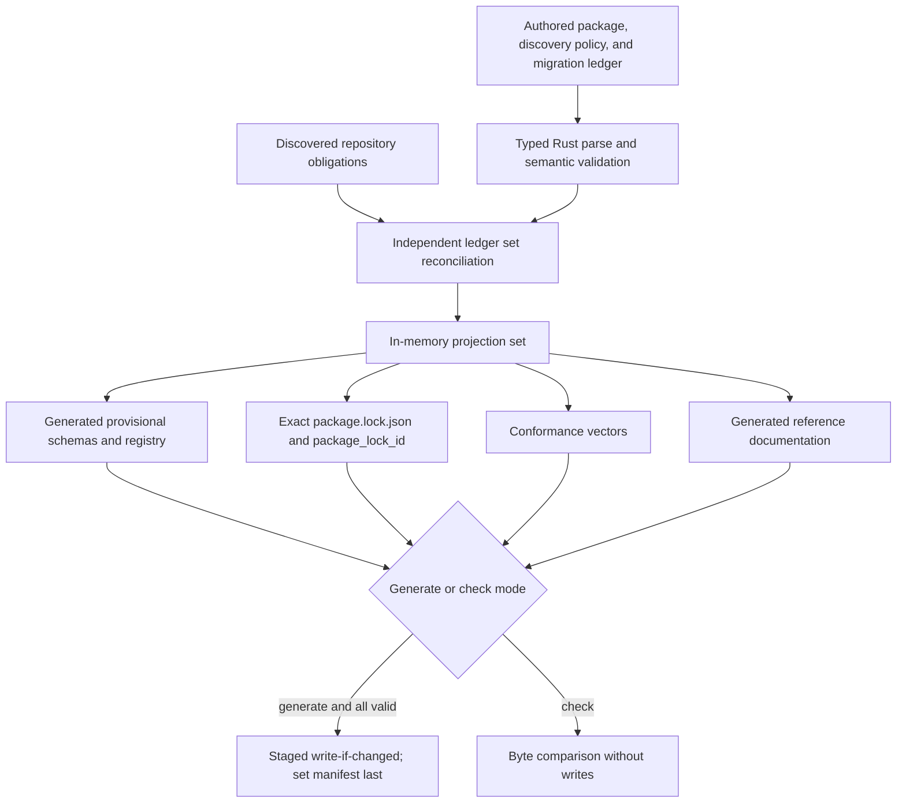
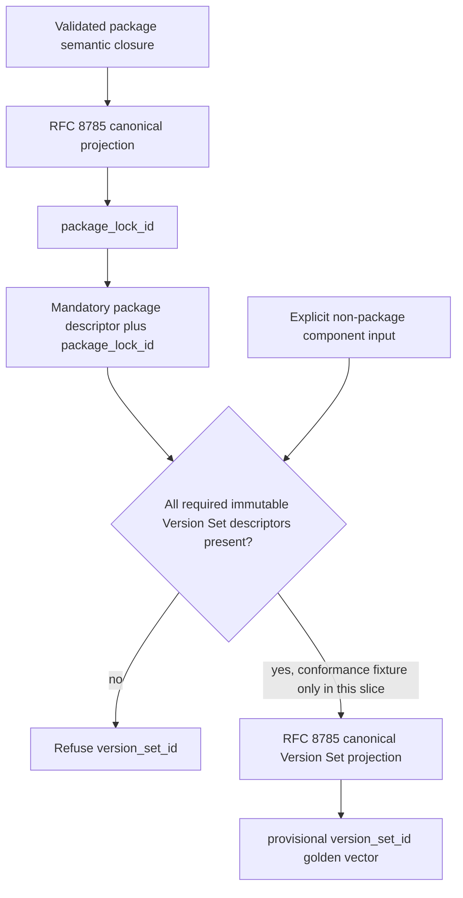
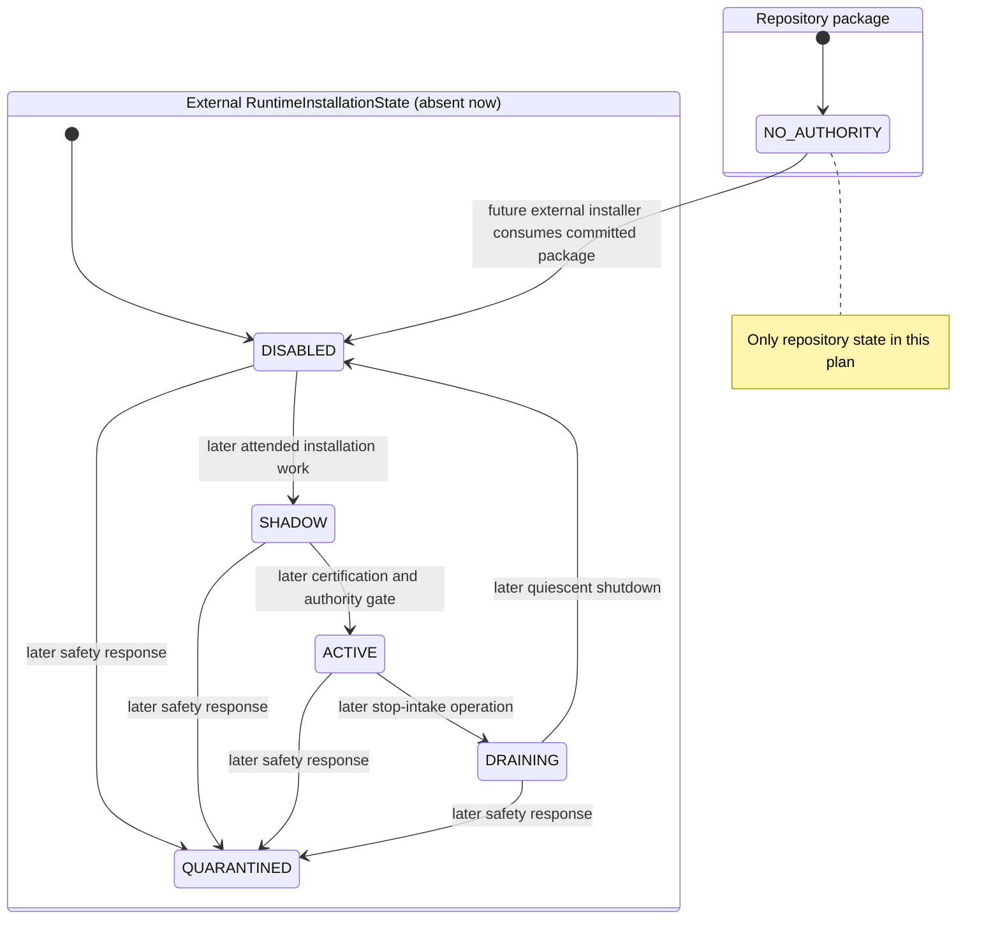

# Repository Engineering Package foundation - Plan

## Goal Capsule

- **Objective:** Establish the inactive, repository-resident foundation for portable engineering capabilities: typed package and contract schemas, a complete Migration Ledger, a deterministic exact lock and package identity, Version Set conformance vectors, provenance/state schemas, validation tooling, documentation, and offline gates.
- **Authority hierarchy:** The user-authored resolutions of GitHub issues 283-286 govern product behavior; this Product Contract preserves those decisions; Key Technical Decisions govern implementation; repository instructions and ADRs govern local integration. If those sources conflict, stop instead of weakening the resolved safety boundary.
- **Execution profile:** Code work in the root Cargo workspace, offline and deterministic. Work proceeds in U-ID dependency order, keeps package activation eligibility at `none`, creates no Runtime Installation state, and leaves all current skills, aliases, workers, and run-state consumers operationally authoritative.
- **Stop conditions:** Stop if implementation would require installing or activating a Runtime Bundle, creating external state, handling credentials, granting execution/publication authority, inventing immutable runtime pins that do not exist, or raising the workspace above Rust 1.75 without a separately approved decision.
- **Tail ownership:** The implementation workflow owns code, generated artifacts, tests, documentation, the full applicable offline gate, cleanup of abandoned approaches, and a reviewable commit. It does not activate, publish, retire, or transfer authority.

---

## Product Contract

### Summary

Add a new `.repository-engineering/` package whose human-authored manifest and Migration Ledger describe this repository's engineering surface while generated schemas and an exact lock make that description portable and reproducible.
The package is deliberately inert: it defines the contract required by a future external Runtime Bundle without installing one, running capabilities, moving operational state, or changing which legacy implementation is authoritative.

### Problem Frame

The repository currently has 36 local capability definitions, 25 Claude compatibility aliases, two specialized worker definitions, ignored state consumers, and additional instruction/config and global-cleanup obligations, but no single machine-readable inventory or portable package boundary.
That makes migration vulnerable to silent omission and makes it impossible for a future Runtime Bundle to prove exactly which repository policy, schemas, workflows, and adapters it was built to execute.

The first slice must create the declaration and verification substrate before execution begins.
The central safety problem is semantic: a valid declaration must never be mistaken for an implementation, certification, activation, or authority transfer.

### Key Decisions

- PD1. **Keep three deployment units: a repository package, an external Runtime Bundle, and an optional authority-free Orca UI plugin.** This prevents repository metadata or UI integration from becoming the execution authority. **Governs R1, R2, R4.** *(session-settled: user-directed — chosen in issue 286 over a monolithic or plugin-owned system.)*
- PD2. **The first slice is declarative and ineligible for activation; it does not install, activate, execute, publish, retire, access credentials, or mutate external state.** The repository package declares no authority, while actual Runtime Installation lifecycle state remains external and absent. **Governs R3, R6, R17.** *(session-settled: user-approved — the user confirmed the inactive first implementation slice.)*
- PD3. **Populate the Migration Ledger with every known obligation now, while creating only contract envelopes and references rather than pretend semantic ports.** Completeness is established without claiming parity that has not been proved. **Governs R7-R10, R18.** *(session-settled: user-approved — the user explicitly confirmed a complete initial ledger and deferred semantic ports.)*

### Requirements

**Package and authority boundary**

- R1. Commit a repository-owned `.repository-engineering/package.toml` that declares stable repository/package identity, compatibility, schema locations, contract registries, Migration Ledger location, activation eligibility, and discovery-policy location using only TOML 1.0-compatible syntax.
- R2. Keep runtime installation, mutable operational state, secrets, credentials, raw logs, machine-local paths, and Orca UI state outside the repository package and outside every generated artifact.
- R3. The committed package validates only with `activation_eligibility = none`, contains no active capability or worker authority, keeps every ledger row legacy-authoritative, and permits no implemented/certified/authority-transferred/retirement-complete combination. It exposes no install, activate, launch, lease, execute, broker, publish, merge, retire, or state-mutation operation.
- R4. Model the repository package, future Runtime Bundle, and optional Orca plugin as distinct components; the plugin is UI-only and neither package metadata nor repository validation is an attested runtime authority.

**Contracts, provenance, and lifecycle vocabulary**

- R5. Define versioned, closed schemas for the package manifest, exact lock, Capability Contract, Worker Role Contract and result, Migration Ledger, artifact/evidence pointer, Attempt Event, Attempt Checkpoint, Attempt Record, state migration/handoff, external `RuntimeInstallationState`, and provisional complete Version Set fixture input. The lifecycle schema is portable vocabulary only; no installation-state instance exists in this slice.
- R6. Keep declaration, implementation, certification, and authority as separate closed fields and enforce their valid combinations; a schema-valid capability or worker envelope alone never becomes runnable or authoritative.
- R7. Capability envelopes preserve typed inputs and outcomes, autonomy classes `A0`-`A4` and `AX`, safety overlays, refusal/`HELD` behavior, touched-path and evidence obligations, human gates, deterministic executor references, knowledge references, worker roles, and scenario/parity references without embedding executable prompts or commands.
- R8. Worker Role envelopes preserve typed assignments/results, fresh-context isolation, concurrency class, cancellation, idempotency, and result validation without choosing ACP, OpenCode, PTY, or another worker protocol.
- R9. Attempt schemas are storage-neutral and credential-free, use immutable digest-bound artifact references, distinguish non-success and recovery states explicitly, and define schema versioning, UTC timestamp, event ordering, checkpoint, and monotonic lifecycle invariants without writing an actual attempt. Authority, evidence, and provenance records contain no generic payload-bearing free-form field or arbitrary metadata map; they use typed identifiers, enums, and artifact descriptors. Any retained human-readable description is explicitly public non-sensitive text with the limits in the Planning Contract, is excluded from identity, and is escaped in generated documentation. Diagnostics never echo rejected values, snippets, nested parser text, panic payloads, or host paths.

**Migration completeness**

- R10. The initial Migration Ledger inventories every obligation discovered from the implementation-time tree plus all explicitly declared external cleanup assumptions. The research snapshot at commit `98bbcfa7` found 36 local capabilities, 25 Claude aliases, two worker roles, two ignored run-state consumer families, active instruction/config references, and global cleanup assumptions; those counts are orientation, not a normative limit. Any delta is reconciled through reviewed ledger rows and recorded in the implementation change rather than hidden by changing an expected count.
- R11. Every ledger row has a stable logical ID, source kind and normalized repository-relative locator, source digest where a tracked source exists, current authority, exactly one disposition (`PORT`, `MERGE`, `REPLACE_WITH_EXECUTOR`, `RETIRE`, or `GLOBAL_CLEANUP`), migration state, and successor/parity/absence references required by that disposition.
- R12. Completeness validation starts from the complete `git ls-files` set, partitions every tracked path into a classified obligation source, a narrow reviewed exclusion, or an unclassified failure, then independently compares discovered logical inventory with the ledger. It fails on missing, extra, duplicate, renamed, case-colliding, unresolved, orphaned, unclassified, or invalidly classified rows; generated-artifact self-diff is not evidence of inventory completeness. Source kinds, normalization, exclusions, and one-discoverer-per-kind ownership live in a versioned policy whose digest is identity-bearing. Explicit ignored-state consumer families remain declared inputs because they are outside the tracked-file census.

**Exact lock and identity**

- R13. Generate and commit `.repository-engineering/package.lock.json` offline from validated authored inputs plus the discovered inventory. The lock separates an identity-bearing normative closure from non-identity build provenance: the normative closure records exact source, discovery policy, provisional schema registry, cross-record conformance-corpus, artifact and compatibility digests plus explicit disabled optional components; build provenance records generator/dependency and CI workflow/action pins without making advisory CI policy part of package semantics.
- R14. Make generated lock bytes reproducible: UTF-8 without BOM, LF line endings, deterministic object and array ordering, one trailing newline, and no timestamps, absolute paths, locale, network results, environment values, floating tags, mutable branches, or unresolved placeholders.
- R15. Compute `package_lock_id` as `sha256:<lowercase-hex>` over a versioned, domain-separated RFC 8785 canonical projection of the normative lock partition that excludes the ID itself and derivative documentation; formatting-only TOML/JSON changes do not affect it, while every identity-bearing semantic input, exact pin, digest, disposition, discovery rule, schema, semantic-validation rule, or policy change does.
- R16. Define and test a provisional `version_set_id` algorithm against visibly non-operational built-in conformance fixtures, with `package_lock_id` and its package artifact descriptor as mandatory inputs. Normal `generate` and `check` may reproduce only those committed fixture vectors; the production library and CLI cannot accept caller-supplied Version Set inputs or mint an operational ID. The provisional algorithm carries no compatibility promise and must be reviewed when the first independent Runtime Bundle consumes it. Do not emit a real operational `version_set_id` until all required Runtime Bundle binaries, schemas, sandbox/image, certified policy, workflows, and adapters are present with immutable descriptors; missing required components fail and optional components are represented explicitly as disabled.

**Tooling, documentation, and gates**

- R17. Provide deterministic, network-free repository commands for generation and non-writing check mode. The tool reports bounded aggregate diagnostics containing only stable path, logical ID, field, error code, and remediation class; enforces authored/generated size, nesting, collection, string, and finding-count limits; and follows a staged replacement protocol with a generated-set manifest written last. Validation failures write nothing, and an interrupted replacement is detected and repaired by the next run rather than accepted as coherent.
- R18. Generate provisional JSON Schema Draft 2020-12 projections under a `v0` namespace, a digest-bound current schema registry, language-neutral structural and cross-record fixtures, algorithm-only conformance vectors, a generated-set manifest, and a repository-package reference page from the validated Rust model. Rust semantic validation remains authoritative; no separate portable semantic-profile language is frozen in this slice. Clearly label each artifact as authored, generated, authoritative, advisory, provisional, or fixture-only and show legacy versus successor authority for every inventory obligation. Until an independent Runtime Bundle validates the contract, changed `v0` schema bytes update the registry digest and `package_lock_id`; promotion to immutable `v1` identifiers and a compatibility/deprecation policy is a later explicit decision.
- R19. Integrate package checks into the root workspace and an advisory GitHub `pull_request` workflow pinned by immutable action SHAs, without changing the eight-step resumable gate driver or reaching the standalone Nautilus adapter workspace. The workflow never uses `pull_request_target`, secrets, environments, OIDC, privileged chaining, or writable cross-trust caches; it has minimal permissions, disables persisted checkout credentials, uses hosted runners and `--locked`, and statically validates these properties. It is credential-free least-privilege validation, not a security sandbox: hosted jobs retain outbound network access for arbitrary build scripts and tests.

### Key Flows

- F1. Package generation
  - **Trigger:** A maintainer changes an authored package, ledger, contract reference, or tracked inventory source.
  - **Steps:** Discover logical inventory; parse typed authored inputs; validate cross-references, authority, paths, and compatibility; stage schemas, lock, conformance outputs, and docs; replace outputs only after full validation; write the identity-bearing set manifest last.
  - **Outcome:** Validation failures preserve the prior coherent set, while interruptions leave an invalid set manifest state that check mode detects and the next generation repairs.
  - **Covered by:** R1-R18.
- F2. Drift and completeness check
  - **Trigger:** Local gate or CI runs check mode.
  - **Steps:** Re-discover inventory; validate ledger set equality; regenerate outputs in memory; byte-compare every committed generated artifact without writing.
  - **Outcome:** Exit success only when both inventory completeness and generated artifacts are current.
  - **Covered by:** R12-R14, R17-R19.
- F3. Identity derivation
  - **Trigger:** A validated package closure is ready to lock.
  - **Steps:** Build the typed normative lock projection; normalize paths and set-like sequences; canonicalize per RFC 8785; compute the domain-separated SHA-256 digest; insert only `package_lock_id` into the repository lock while keeping build provenance outside the preimage.
  - **Outcome:** Package identity is stable across presentation changes and sensitive to every semantic dependency.
  - **Covered by:** R13-R16.
- F4. Future Runtime Bundle conformance
  - **Trigger:** A future independently built Runtime Bundle consumes the published schemas and identity vectors.
  - **Steps:** Validate the same structural and semantic fixtures; bind the package descriptor and `package_lock_id`; supply an explicit complete Version Set component closure; reject incomplete or mutable descriptors; reproduce the golden identity.
  - **Outcome:** Only a complete, independently validated runtime set can acquire an operational `version_set_id`; this slice produces provisional fixture vectors only and never activates them.
  - **Covered by:** R4-R6, R9, R16, R18.
- F5. Day-two inventory maintenance
  - **Trigger:** A maintainer adds, renames, moves, or removes a tracked capability, alias, worker, instruction/config source, or declared ignored-state consumer.
  - **Steps:** Run check to obtain the stable candidate ID, normalized locator, and digest; author or update the ledger row with a reviewed disposition and authority state; run generation; then run non-writing check.
  - **Outcome:** New inventory remains fail-closed until a human chooses its disposition, while generation never invents or overwrites that judgment.
  - **Covered by:** R10-R12, R17.

### Acceptance Examples

- AE1. **Deterministic clean generation.** Given two clean checkouts at the same commit, when generation runs offline, then lock, schemas, conformance vectors, and reference documentation are byte-identical. Covers R13-R18.
- AE2. **Presentation invariance and semantic sensitivity.** Given equivalent authored TOML with reordered keys/comments/line endings, `package_lock_id` is unchanged; changing one digest, disposition, stable ID, immutable pin, or effective policy value changes it. Covers R14-R15.
- AE3. **Independent completeness.** Given a lock and generated docs that self-diff cleanly but one repository capability is absent from the ledger, check mode fails with a located missing-row error. Covers R10-R12, R17.
- AE4. **Aggregate fail-closed validation.** Given extra, duplicate, case-colliding, Unicode-colliding, escaping/symlinked path, unsupported-version, unknown-field, external `$ref`, unresolved-reference, or resource-limit inputs, validation reports a bounded set of independent redacted findings and writes nothing. Covers R5, R9, R11-R12, R17.
- AE5. **Inert committed package.** Given the real authored package, validation proves activation eligibility is `none`, its active contract/worker registries are empty, every row remains legacy-authoritative, every authority-transfer tuple is rejected, and no runtime or mutation operation is representable. Covers R2-R4, R6.
- AE6. **Truthful Version Set identity.** Given the real package and normal CLI/library surface, no caller-supplied or operational `version_set_id` can be requested or produced; given the committed built-in non-operational fixture corpus, generation and check reproduce stable provisional vectors, changing only `package_lock_id` changes the vector, and changing one component digest changes it. Covers R16.
- AE7. **Optional component determinism.** Given an absent optional Orca UI or ACP/OpenCode adapter, the built-in Version Set fixture input accepts only an explicit disabled representation; omitting a required runtime/policy component fails. Covers R4, R16.
- AE8. **Credential-free provenance and diagnostics.** Given Attempt, package, or ledger fixtures containing a canary token, raw prompt/log, generic payload field, arbitrary metadata map, environment dump, or absolute state path, validation fails; the canary and rejected value are absent from generated documentation, stdout, stderr, structured findings, and fatal parse diagnostics. Typed digest-bound evidence pointers and bounded public non-sensitive descriptions pass. Covers R2, R5, R9, R17-R18.
- AE9. **Failure and interruption behavior.** Given a valid committed generated set and an authored validation error, generation writes nothing; given interruption at any replacement boundary, check mode rejects the incomplete set and the next generation deterministically repairs it before writing the set manifest last. Covers R17.
- AE10. **Consumer clarity.** Given the generated reference page, a human or agent can see every migration obligation and separately read its declaration, implementation, certification, current authority, and successor state without inferring execution readiness from schema validity. Covers R6, R10-R11, R18.
- AE11. **Provisional portable validation contract.** Given a Rust semantic validator rule, provisional schema byte, or cross-record fixture change, the registry and `package_lock_id` change; structural and cross-record corpora detect extra, missing, renamed, duplicated, or modified vectors. No artifact claims immutable `v1` compatibility before independent-consumer promotion. Covers R13, R15, R18.
- AE12. **Untrusted pull request posture.** Given the committed workflow, a static policy test proves pull-request-only execution, immutable actions, minimal permissions, disabled persisted credentials, no secrets/OIDC/privileged trigger/writable cross-trust cache, hosted runners, and locked dependency resolution; documentation explicitly states that outbound egress remains possible. Covers R19.
- AE13. **Envelope fidelity without semantic porting.** Given conformance-only fixtures derived from the `implement-tr` capability and both current worker definitions, Capability and Worker Role envelopes round-trip their typed fields, safety/refusal behavior, evidence obligations, assignments/results, isolation, cancellation, and idempotency without embedding prompts, commands, or a worker protocol. The fixtures remain outside active registries and confer no implementation, certification, or authority. Covers R1, R7-R8.

### Scope Boundaries

**In this slice**

- Typed Rust model and semantic validation for the package, contracts, ledger, provenance/state envelopes, lock, and built-in provisional Version Set fixtures.
- Exhaustive initial Migration Ledger and inert authored package.
- Deterministic generated lock, schemas, conformance fixtures, documentation, check command, and offline CI/gate integration.
- Package maintenance parity for humans and agents: inspect, generate, validate, explain failures, and check drift through the same committed inputs and commands.

**Deferred to the Runtime Bundle and migration waves**

- Clone installation, `installation_id`, activation or lifecycle mutation, external state stores, legacy state import, leases, PTY/ACP/OpenCode workers, sandbox execution, inference brokers, verification, publication, signed attestations, SBOM generation, parity runs, authority transfer, Orca UI, and retirement.
- Semantic ports for the 36 capabilities and two worker roles; the ledger keeps those future waves explicit while legacy implementations remain authoritative.

**Never agent-authorized by this package**

- Receiving reusable secrets, self-certifying or activating a feature branch, weakening autonomy/sandbox policy, approving or merging its own work, force-pushing, changing repository rulesets or secrets, executing attended-sensitive work unattended, performing operator-only or real-money operations, or bypassing the separate Retirement Gate.

### Dependencies and Sources

- GitHub issue [286](https://github.com/sunkeunchoi/korea-adapter-sdk-ls/issues/286) and its [full resolution](https://github.com/sunkeunchoi/korea-adapter-sdk-ls/issues/286#issuecomment-5301999781) define the deployment split, package/lock boundary, lifecycle, and Version Set.
- GitHub issues [283](https://github.com/sunkeunchoi/korea-adapter-sdk-ls/issues/283), [284](https://github.com/sunkeunchoi/korea-adapter-sdk-ls/issues/284), and [285](https://github.com/sunkeunchoi/korea-adapter-sdk-ls/issues/285) define the Runner/contract envelope, autonomy and Attempt Record vocabulary, and exhaustive migration model.
- `docs/research/2026-08-14-repository-capabilities-acp-portability.md` in research commit `98bbcfa7` records the source inventory and portability matrix; implementation must verify the current tree rather than trusting counts alone.
- `docs/adr/0012-rust-owned-metadata-schema-authority.md` requires Rust types to remain schema authority; host-neutral JSON Schema is generated, never maintained in parallel.
- `docs/adr/0009-rust-first-permanent-tooling.md` supports a permanent Rust implementation.
- `docs/solutions/design-patterns/build-runtime-hash-parity-via-shared-include.md`, `docs/solutions/architecture-patterns/change-tracker-baseline-clean-self-diff.md`, and `docs/solutions/architecture-patterns/gate-over-diff-inherits-diff-scope-blind-spot.md` require one identity implementation, deterministic aggregate artifacts, and an independent inventory-completeness arm.
- [RFC 8785](https://www.rfc-editor.org/rfc/rfc8785.html) defines the JSON Canonicalization Scheme used by both identities.
- [JSON Schema Draft 2020-12](https://json-schema.org/draft/2020-12) defines the generated schema dialect; application `schema_version` remains separate from `$schema`.
- [OCI content descriptors](https://specs.opencontainers.org/image-spec/descriptor/) ground the `media_type`/`digest`/`size` artifact reference and `sha256:<hex>` spelling.
- [Cargo manifest versus lockfile](https://doc.rust-lang.org/cargo/guide/cargo-toml-vs-cargo-lock.html) grounds the authored-manifest/generated-lock distinction.
- Official crate documentation for [`toml` 0.8.23](https://docs.rs/crate/toml/0.8.23/source/Cargo.toml), [`schemars` 1.2.2](https://docs.rs/schemars/1.2.2/schemars/), [`jsonschema` 0.33.0](https://docs.rs/crate/jsonschema/0.33.0), and [`serde_json_canonicalizer` 0.3.2](https://docs.rs/crate/serde_json_canonicalizer/0.3.2) supplies the Rust 1.75-compatible implementation envelope and the explicit JCS compatibility check.

---

## Planning Contract

### Key Technical Decisions

- KTD1. **Create `crates/ls-repository-engineering` as a publish-disabled, isolated tooling leaf in the root workspace.** Cross-repository package governance does not belong in TR-specific `ls-metadata` or runtime `ls-core`; the new crate imports no repository runtime/domain crate, no production crate depends on it, and the future Runtime Bundle consumes committed artifacts rather than linking this crate. A `cargo metadata` boundary test enforces that direction while preserving the two-workspace architecture. Governs U1-U6.
- KTD2. **Make closed Rust serde types and semantic validators authoritative, then generate provisional structural contracts and language-neutral fixtures.** Every authority-bearing structure uses explicit `schema_version`, closed enums, and unknown-field rejection. Draft 2020-12 schemas use provisional `v0` identifiers registered to current content digests; Rust validators plus structural and cross-record fixtures carry uniqueness, path, authority, lifecycle, and other rules JSON Schema cannot express. A portable semantic-profile language waits for its first independent consumer. This satisfies ADR 0012 without creating a second speculative authority. Governs U1, U5.
- KTD3. **Separate human-authored policy from generated evidence.** `package.toml`, `discovery-policy.toml`, one aggregate `migration-ledger.toml`, and `README.md` are reviewed authored inputs; `package.lock.json`, `schemas/v0/*.schema.json`, conformance vectors, and the reference page are generated. The ledger generator never overwrites dispositions. Governs U2-U5.
- KTD4. **Partition the complete tracked tree and compare ledger set equality independently of regeneration.** Discovery begins with `git ls-files`, assigns each path to exactly one obligation discoverer or a narrow reviewed exclusion, and fails on every residual unclassified path; explicit ignored-state consumer families and global cleanup assumptions remain declared inputs. The discovery-policy digest is identity-bearing, so expanding or narrowing the observation boundary changes the package. Governs U2, U4.
- KTD5. **Use one RFC 8785 semantic-canonicalization module for `package_lock_id` and provisional `version_set_id` vectors.** Typed identity projections include an explicit scheme/version and sorted set-like arrays, reject non-I-JSON numeric forms and duplicate keys, and exclude the emitted identity field, timestamps, host data, and derivative docs. Schema-registry, discovery-policy, cross-record conformance-corpus, and algorithm-only vector digests enter the normative closure; generator/dependency/workflow provenance lives in the non-identity lock partition. Governs U3, U5-U6.
- KTD6. **Mint only `package_lock_id` from the real package and restrict Version Set computation to built-in provisional fixtures.** A full Version Set requires the package artifact descriptor plus `package_lock_id` and an explicit complete component closure. Normal `generate` and `check` reproduce only the committed non-operational fixture vectors; no public library or CLI input accepts an arbitrary Version Set. Operational minting and compatibility freeze wait for independently pinned Runtime Bundle, sandbox, policy, workflow, and adapter descriptors. Governs U3, U5.
- KTD7. **Stage the complete output set and write an identity-bearing generated-set manifest last.** Validation failures write nothing. Per-file replacements may be interrupted, so check mode treats a missing/stale set manifest as an incomplete transaction and the next generate run repairs the set before writing a new manifest; independent semantic failures remain aggregated with path and logical-ID context. Governs U4-U5.
- KTD8. **Treat repository validation as advisory build tooling and preserve legacy operational authority.** Humans and agents have context/action parity only for package maintenance commands; neither the CLI, generated lock, nor a feature-branch workflow can certify or activate itself. A future attested Runtime Bundle must independently consume the schemas and golden vectors before authority transfer. Governs U1-U6.
- KTD9. **Integrate through the existing root workspace rather than adding a ninth gate-run step.** Root `cargo test` executes real-package and dependency-boundary tests, `make docs`/`make docs-check` include the package projection, and a dedicated credential-free least-privilege immutable-SHA-pinned pull-request workflow runs the focused non-writing check. The hosted job is not a security sandbox and retains outbound egress. CI workflow/action pins are advisory build provenance rather than package semantics, and the existing resumable gate state-machine contract remains unchanged. Governs U5-U6.
- KTD10. **Pin the schema toolchain to Rust 1.75-compatible releases and prove the full graph at that MSRV before model authoring.** Add `toml = "=0.8.23"` with parse-only features, `schemars = "=1.2.2"`, `serde_json_canonicalizer = "=0.3.2"`, and dev-only `jsonschema = "=0.33.0"` with default features disabled; retain the existing workspace `serde_json`, `serde_yaml`, and `sha2 0.10` lines. U1 begins by resolving and building the complete pinned dependency graph, including transitives, on Rust 1.75. Schemars generation uses explicit Draft 2020-12/deserialization settings, the workflow-policy test parses YAML with the existing workspace parser rather than raw-line matching, and the JCS crate must pass Rust 1.75 plus official vectors because it declares no MSRV. Any incompatibility stops for an explicit MSRV/toolchain decision rather than triggering an unpinned substitution or hand-rolled replacement. Governs U1, U3, U6.

### High-Level Technical Design

The first slice has one authoritative typed model, two independent validation arms, and several deterministic projections.



The identity branch distinguishes a repository package from an operational execution set.



The package declares `activation_eligibility = none`; a separate external installation state owns the lifecycle vocabulary and has no instance in this slice.



These diagrams define component and decision boundaries, not implementation signatures.

### Output Structure

```text
.repository-engineering/
  README.md                         authored/generated boundary and commands
  package.toml                      authored inert package manifest
  discovery-policy.toml             authored versioned inventory boundary
  migration-ledger.toml             authored exhaustive dispositions
  package.lock.json                 generated exact closure and package_lock_id
  schemas/v0/*.schema.json          generated provisional host-neutral schemas
  schema-registry.json               generated current ID-to-digest registry
  conformance/v0/*                  generated/golden non-operational fixtures
  generated-set.json                generated completeness manifest, written last
crates/ls-repository-engineering/
  Cargo.toml
  src/lib.rs
  src/schema.rs
  src/inventory.rs
  src/validator.rs
  src/identity.rs
  src/lock.rs
  src/generate.rs
  src/cli.rs
  src/main.rs                       thin exit-code adapter
  tests/authored_package.rs
  tests/inventory.rs
  tests/determinism.rs
  tests/cli.rs
docs/reference/repository-engineering-package.md  generated package/ledger reference
```

### Implementation Constraints and Sequencing

- U1 defines the closed vocabulary before authored data or hashes can stabilize.
- U2 establishes the complete real inventory and the inert authored package before lock generation.
- U3 defines canonical identity over the validated model; it must not hash raw TOML or pretty-printed lock bytes.
- U4 builds reusable validation, confinement, staging, diagnostic, and byte-comparison infrastructure against injected fixture projections after the model, inventory, and identity seams are independently testable.
- U5 supplies the production schema, conformance, lock, and documentation projections, then completes the real `generate`/`check` output set after all normative inputs exist.
- U6 integrates the focused check into existing workspace and CI boundaries, records non-identity build provenance, and regenerates the final lock/set manifest without touching the adapter or gate-run state machine.
- All input and output references use a portable repository-relative path grammar and no-follow traversal beneath the resolved repository root. Absolute, `..`, Windows drive/UNC/backslash, ambiguous separator, Unicode-normalization collision, trailing-dot/space alias, case-collision, C0/C1 control characters, Unicode format or bidirectional-control characters, symlinked input/output parent, and external `file:`/HTTP `$ref` forms fail closed. Diagnostics escape every non-printable path code point.
- Identifiers use a constrained ASCII grammar. Identity-bearing integers outside the I-JSON safe range are strings; negative zero and duplicate JSON keys are rejected. Generic payload strings and arbitrary maps are absent from authority/evidence records; retained descriptions are public non-sensitive text, are escaped in projections, and are excluded from identity.
- Schema `$ref` resolution uses only the committed local registry and never fetches the network. JSON Schema `format` annotations are supplemented by Rust semantic validation for digests, identifiers, URIs, timestamps, paths, and cross-record uniqueness.
- Input and projection resource limits are deterministic and schema-versioned so an untrusted branch cannot turn validation into unbounded memory, CPU, filesystem, or log consumption:

  | Dimension | Limit |
  |---|---:|
  | Repository-relative path | 1,024 UTF-8 bytes |
  | One authored input file | 2 MiB |
  | Total authored input set | 16 MiB |
  | One generated artifact | 8 MiB |
  | Total staged generated set | 64 MiB |
  | Structural nesting depth | 64 |
  | Entries in one collection | 10,000 |
  | Generic typed string | 64 KiB |
  | Public description | 4 KiB |
  | Tracked paths examined | 100,000 |
  | Reported findings | 256 |

  Parsing, discovery, validation, projection, and diagnostics enforce the relevant limit before allocating or emitting beyond it; boundary tests cover exactly-at-limit and one-over-limit cases.

### System-Wide Impact

- **Root workspace:** Adds a seventh crate and updates `Cargo.toml`, `Cargo.lock`, `ARCHITECTURE.md`, and the root architecture data flow. No SDK public API or LS transport behavior changes.
- **Repository authoring:** Introduces a strict authored/generated boundary under `.repository-engineering/`; future capability migration work must update the ledger through reviewed dispositions before generating the lock.
- **Agent and human parity:** Both use the same manifest, ledger, schemas, docs, and deterministic CLI results. No UI-only or agent-only maintenance operation is introduced.
- **Trust boundary:** CI proves repository consistency only. It does not attest the CLI binary, certify a branch, create an installation, or grant Runtime Bundle authority.
- **State lifecycle:** Attempt and external Runtime Installation lifecycle records gain portable schemas, but the repository package owns no lifecycle state and no operational state instance, directory, importer, writer, or transition endpoint exists in this slice.
- **Adapter boundary:** The new crate has no dependency on `ls-core`/`ls-sdk` and no path into `adapters/nautilus/`; the standalone adapter gate remains unchanged.

### Risks and Mitigations

| Risk | Consequence | Mitigation |
|---|---|---|
| Schema-valid is read as runnable or authoritative | Premature execution or authority transfer | Separate declaration/implementation/certification/authority fields, empty active registries, real-package inertness tests, and explicit generated documentation |
| Inventory self-diff misses an omitted source | A capability or state obligation disappears from migration | Partition the complete tracked tree, fail on every unclassified residual path, and compare the discovered obligation set with the ledger |
| Identity omits a dependency or hashes presentation bytes | False parity or unnecessary identity churn | Typed declared closure, RFC 8785 semantic projection, domain separation, official/golden vectors, and mutation/invariance tests |
| Package-only digest is mislabeled as Version Set | A partial configuration appears execution-certified | Real package emits only `package_lock_id`; complete fixture-only inputs exercise `version_set_id` |
| Generated artifacts partially update on interruption | Lock, schemas, and docs describe different states | Stage outputs, write the generated-set manifest last, reject incomplete transactions, and repair deterministically on the next generation |
| Closed schemas accidentally carry secrets or commands | Repository stores sensitive or authority-bearing data | Eliminate generic payload fields and arbitrary maps, use typed artifact pointers, classify descriptions as public text, and add negative secret/command/runtime-path fixtures |
| New dependencies silently raise MSRV | Root workspace no longer builds on Rust 1.75 | Pin compatible versions and run the focused workflow on Rust 1.75 |
| Feature-branch validator certifies itself | Repository consistency is confused with runtime trust | Mark CLI/CI advisory and require future independently built attested Runtime Bundle conformance before activation |
| Migration discovery reads mutable developer-global state | Different machines produce different locks | Discover only committed repository surfaces; encode global cleanup assumptions as reviewed declared-only ledger rows |
| A new source root is invisible to both ledger and discoverer | Completeness passes over an incomplete observation boundary | Begin from `git ls-files`, require every path to be classified or narrowly excluded, and digest that policy |
| Untrusted authored data escapes paths or leaks through diagnostics | CI reads/writes outside the repo or publishes secrets in logs | No-follow path confinement for inputs/outputs plus value-free bounded diagnostics and canary tests |
| Untrusted PR workflow gains ambient authority | Contributor code reaches credentials, OIDC, caches, or privileged events | Pull-request-only hosted workflow, minimal permissions, immutable actions, no persisted credentials/secrets/OIDC/privileged triggers, and a static policy test; explicitly do not claim network isolation |

### Resolved During Planning

- **Identity available now:** Emit `package_lock_id`; reproduce only provisional built-in `version_set_id` fixtures; omit caller-supplied and operational Version Set identity until the full immutable closure exists and an independent consumer reviews the algorithm.
- **Validator trust:** The new CLI is repository build/check tooling only. A future separately built and attested copy may become part of the Runtime Bundle after its own release decision.
- **Optional components:** Encode each optional component deterministically as selected with an immutable descriptor or explicitly disabled; environment absence never decides identity.
- **Ledger shape:** Use one aggregate human-authored TOML ledger for atomic review and deterministic set reconciliation; do not create 36 schema-valid placeholder contracts.
- **Lifecycle ownership:** The repository package declares activation eligibility only; mutable `DISABLED`/`SHADOW`/`ACTIVE`/`DRAINING`/`QUARANTINED` state belongs to a future external Runtime Installation.
- **Replacement semantics:** Validation failures preserve the prior set, while process interruption is detected by the last-written generated-set manifest and repaired on the next run; the plan does not claim impossible multi-file filesystem atomicity.

---

## Implementation Units

### U1. Establish the typed package and contract model

- **Goal:** Create the Rust-owned vocabulary and host-neutral schema authority without introducing runtime operations.
- **Requirements:** R1-R9.
- **Dependencies:** none.
- **Files:** `Cargo.toml`; `Cargo.lock`; `crates/ls-repository-engineering/Cargo.toml`; `crates/ls-repository-engineering/src/lib.rs`; `crates/ls-repository-engineering/src/schema.rs`; `crates/ls-repository-engineering/tests/schema.rs`; `crates/ls-repository-engineering/tests/fixtures/schema/`; `crates/ls-repository-engineering/tests/fixtures/fidelity/`.
- **Approach:** Before model authoring, resolve and build the exact KTD10 dependency graph on Rust 1.75 and stop for an explicit decision if any direct or transitive dependency is incompatible. Then add a publish-disabled root-workspace tooling leaf. Define closed serde types for each R5 envelope, stable ASCII IDs, explicit application schema versions, external installation lifecycle/autonomy/disposition/status enums, typed artifact references, and tagged non-success outcomes. Generate provisional structural schemas with explicit Schemars Draft 2020-12/deserialization settings; keep cross-record semantics in Rust plus language-neutral fixtures. Keep all operational methods and runtime dependencies absent, and enforce leaf direction from `cargo metadata`.
- **Patterns:** Follow `crates/ls-metadata/src/schema.rs` and `validator.rs` for typed authority and located errors, `adapters/nautilus/lab/src/lineage_prereg.rs` for unknown-field rejection, and `adapters/nautilus/lab/src/agent/envelope.rs` for tagged outcomes.
- **Test Scenarios:** Every positive envelope fixture parses and reserializes deterministically; unknown fields, unsupported versions, duplicate IDs, invalid enum combinations, absent typed worker results, invalid attempt transitions, generic payload fields, arbitrary metadata maps, raw-log/command/credential-shaped fields, and unsafe references fail with located errors. Schemas meta-validate as Draft 2020-12 against structural fixtures, while cross-record fixtures separately prove Rust-only rules. Conformance-only fixtures derived from `implement-tr` and both current worker definitions round-trip without loss, remain outside active registries, and confer no parity or authority. Mutating every authority field still cannot represent first-slice implementation, certification, activation, transferred authority, or completed retirement; a committed public-API and CLI-surface inventory fixture contains no install/activate/launch/lease/execute/broker/publish/merge/retire/state-write symbol and fails on drift; `cargo metadata` proves the crate remains an isolated tooling leaf.
- **Agent-native verification:** An agent can inspect the same schema and validation diagnostics as a human, but no schema or CLI surface exposes execution authority or a hidden UI-only action.
- **Verification:** The complete pinned dependency graph and crate compile on Rust 1.75, schema tests are green, and the byte-compared public-API and CLI-surface inventory proves no install/activate/execute/publish/state writer is exposed.

### U2. Author the inert package and exhaustive Migration Ledger

- **Goal:** Capture the complete current engineering surface and its migration dispositions while leaving legacy implementations authoritative.
- **Requirements:** R1-R4, R6-R12.
- **Dependencies:** U1.
- **Files:** `.repository-engineering/package.toml`; `.repository-engineering/discovery-policy.toml`; `.repository-engineering/migration-ledger.toml`; `.repository-engineering/README.md`; `crates/ls-repository-engineering/src/inventory.rs`; `crates/ls-repository-engineering/tests/authored_package.rs`; `crates/ls-repository-engineering/tests/inventory.rs`.
- **Approach:** Define source kinds, narrow reviewed exclusions, and one-discoverer ownership in a versioned policy. Partition the complete `git ls-files` set, discover stable logical obligations from tracked skill definitions, `skills-lock.json`, Claude aliases and workers, and maintained instruction/config references, and fail on every residual unclassified path. Represent ignored-state consumer families and global cleanup assumptions as declared-only rows rather than probing developer-global state. Author one reviewed disposition for every row, set activation eligibility to `none`, keep active contract/worker registries empty, and record legacy authority plus scenario/parity obligations for later waves. Require `.repository-engineering/README.md` to document the day-two add/rename/remove → inspect candidate → choose disposition → generate → check flow; generation never creates or overwrites dispositions.
- **Patterns:** Follow `crates/ls-trackers/tests/decommission_audit.rs` for exact tracked inventory set checks and `metadata/trs/*.yaml` plus `tr-index.yaml` for stable per-item identity and cross-reference validation, while retaining the aggregate ledger selected by KTD3.
- **Test Scenarios:** The real tree reconciles exactly to the implementation-time discovered capability, alias, worker, run-state-consumer, instruction/config, and declared-cleanup sets; the 36/25/2 research counts are asserted only by a snapshot fixture tied to commit `98bbcfa7`, not as a current-tree limit. Alias targets resolve many-to-one correctly; omission, extra row, duplicate, rename, case/Unicode collision, a new capability-shaped file under an unknown root, any unclassified tracked path, missing/duplicate discoverer, dangling successor, bad disposition/state pair, or changed source/policy digest fails. A day-two fixture proves the diagnostic supplies the candidate ID/locator/digest and the gate returns green only after a human-authored disposition plus regeneration. The real package has activation eligibility `none`, retains legacy authority, and does not trust an ignored `phase: complete` marker without its durable outcome evidence.
- **Agent-native verification:** Both agent and human inventory views show the same current authority, disposition, successor, and parity obligations; a ledger row cannot silently transfer authority.
- **Verification:** The committed ledger covers every discovered and declared obligation exactly once and reports legacy authority without creating placeholder semantic contracts.

### U3. Implement deterministic identity and lock construction

- **Goal:** Build exact package identity and provisional fixture-only Version Set identity machinery while refusing to overclaim an operational Version Set.
- **Requirements:** R13-R16.
- **Dependencies:** U1, U2.
- **Files:** `crates/ls-repository-engineering/src/identity.rs`; `crates/ls-repository-engineering/src/lock.rs`; `crates/ls-repository-engineering/tests/determinism.rs`; `crates/ls-repository-engineering/tests/fixtures/identity/`; `.repository-engineering/conformance/v0/`.
- **Approach:** Implement typed normative/provenance lock partitions and identity projections before emitting the real lock. Canonicalize through the exact-pinned JCS implementation from KTD10, domain-separate each identity, exclude the output ID and derivative docs, and bind provisional Version Set fixtures to the package descriptor and `package_lock_id`. Expose built-in fixture reproduction only through `generate`/`check`; accept no caller-supplied Version Set input in the normal CLI or public library, and retain explicit disabled records for optional components.
- **Patterns:** Reuse `sha2` and the repository's sorted relative-path hashing discipline in `adapters/nautilus/lab/fingerprint_core.rs`, while closing its documented dependency-set blind spot with the declared lock closure; follow `crates/ls-trackers/src/cli.rs` for deterministic pretty JSON and trailing-newline behavior.
- **Test Scenarios:** Repeated and shuffled-set construction is byte-identical; TOML/JSON whitespace, comments, object-key order, and line endings do not change identity; sequence-array reordering and every normative closure mutation do, while build-provenance-only changes do not; official RFC 8785 vectors, non-BMP key ordering, duplicate-key rejection, negative-zero rejection, large-number strings, and NFC/NFD behavior pass; recursive self-hash is impossible; incomplete Version Set fixtures return no ID; a complete labeled fixture returns its golden ID; changing only `package_lock_id` changes `version_set_id`; missing required versus disabled optional components behave distinctly; normal CLI help and public API inventory contain no Version Set minting surface.
- **Agent-native verification:** Structured `generate` and `check` diagnostics explain included closure entries, drift, and refusal reasons without exposing secrets, host paths, or environment-derived inputs; no third identity command exists.
- **Verification:** The identity/lock engine passes provisional built-in golden vectors without emitting an operational ID; the normal production surface cannot accept arbitrary Version Set inputs, and a language-independent future consumer can reproduce the fixture algorithm before deciding whether to freeze it.

### U4. Compose validation, generation, and non-writing check commands

- **Goal:** Give maintainers and agents one deterministic entry point that validates completeness and keeps all projections coherent.
- **Requirements:** R12-R17.
- **Dependencies:** U1-U3.
- **Files:** `crates/ls-repository-engineering/src/validator.rs`; `crates/ls-repository-engineering/src/generate.rs`; `crates/ls-repository-engineering/src/cli.rs`; `crates/ls-repository-engineering/src/main.rs`; `crates/ls-repository-engineering/tests/cli.rs`.
- **Approach:** Keep the binary as a thin exit-code adapter over injectable library paths. Build shared `generate` and `check` pipeline infrastructure that enforces deterministic resource limits, no-follow confinement, parsing, discovery, reconciliation, validation, staging, redacted diagnostics, and byte comparison. Exercise the pipeline with injected fixture projections in this unit; U5 supplies the complete production projection set and final command composition. Return bounded value-free machine-readable findings plus concise redacted human diagnostics and distinct success/drift/input-error exits.
- **Patterns:** Follow `crates/ls-trackers/src/main.rs` and its injectable CLI paths, `crates/ls-metadata` aggregate `ValidationReport`, and `ls-docgen --check` drift behavior.
- **Test Scenarios:** Fixture projections prove staged write, no-write comparison, stale/missing/extra artifact detection, and missing/stale set-manifest rejection. Multiple independent authored errors aggregate only to the 256-finding cap; fatal manifest parse prevents dependent work; every resource limit passes exactly at the boundary and fails one unit over before excess allocation or output. Validation failures preserve prior bytes; interruption at every replacement boundary is detected and repaired. Nested working directory, symlinked input/output parent, Windows/UNC/backslash/trailing-dot/space forms, control/format/bidirectional path characters, external `$ref`, locale/time/environment variation, and network-disabled execution follow the specified fail-closed behavior; diagnostics escape non-printable path characters, and canary values never appear on stdout, stderr, structured output, or panic/fatal parse paths.
- **Agent-native verification:** Structured findings carry stable artifact, path, logical ID, field, and remediation class so an agent can repair the same failures a human sees; neither command can trigger runtime actions.
- **Verification:** Pipeline integration tests with injected projections prove stable exits, no-write comparison, replacement-failure behavior, cwd independence, bounded resources, and offline determinism; production complete-output verification belongs to U5.

### U5. Project schemas, conformance artifacts, and reference documentation

- **Goal:** Publish the validated model in forms future runtimes and current maintainers can consume without duplicating authority.
- **Requirements:** R5-R6, R9, R16, R18.
- **Dependencies:** U1-U4.
- **Files:** `.repository-engineering/package.lock.json`; `.repository-engineering/schemas/v0/*.schema.json`; `.repository-engineering/schema-registry.json`; `.repository-engineering/conformance/v0/*`; `.repository-engineering/generated-set.json`; `docs/reference/repository-engineering-package.md`; `ARCHITECTURE.md`; `CONTEXT-MAP.md`; `CONCEPTS.md`; `Makefile`; `crates/ls-repository-engineering/tests/determinism.rs`.
- **Approach:** Generate provisional Draft 2020-12 schemas, the current ID-to-digest registry, separate structural and cross-record fixtures, provisional built-in identity golden triples, generated-set manifest, first real package lock, and package/ledger reference page from the validated model. Bind the independently enumerated conformance corpus without hashing package-specific expected outputs into their own preimage. Supply the production projections to U4's pipeline so `generate` writes the complete set and its manifest last while `check` regenerates in memory and compares without mutation. Extend `make docs` and `make docs-check` to regenerate/check this projection. Update architecture to seven root crates and identify repository engineering as isolated cross-repository tooling within the SDK/root workspace, not a third bounded context or Runtime Bundle.
- **Patterns:** Follow `ls-docgen` for generated reference docs and byte-drift checking. Keep the expanded `CONCEPTS.md` entries glossary-sized and put normative rules in the Product Contract and schemas.
- **Test Scenarios:** Generated schemas use provisional `v0` identifiers and local-only `$ref`; changing schema bytes updates the registry digest and `package_lock_id` without claiming immutable compatibility. Structural fixtures match JSON Schema and cross-record fixtures match the Rust validator; extra, missing, renamed, duplicated, or modified conformance entries fail corpus enumeration. Public descriptions are escaped in generated documentation. Docs enumerate every ledger obligation and distinguish declaration/implementation/certification/authority; production generate followed by check succeeds; two generations are byte-identical; docs-check reports drift without writing.
- **Agent-native verification:** Documentation supplies the same canonical references and authority distinctions to humans and agents, and the future consumer handoff explicitly requires independent conformance before activation.
- **Verification:** Generated schemas, vectors, and docs match the committed bytes and architecture documentation accurately shows the new crate without changing the two-context dependency direction.

### U6. Add focused workspace and CI gates

- **Goal:** Make package drift and MSRV failure visible on every relevant change without altering runtime or adapter gates.
- **Requirements:** R17-R19.
- **Dependencies:** U1-U5.
- **Files:** `Makefile`; `.github/workflows/repository-engineering-check.yml`; `Cargo.toml`; `Cargo.lock`; `ARCHITECTURE.md`; `.repository-engineering/package.lock.json`; `.repository-engineering/generated-set.json`.
- **Approach:** Add `make repository-engineering-check` as a convenience wrapper around non-writing check mode. Let root `cargo test` own real-package completeness, dependency-boundary, lock, and workflow-policy tests, and let existing `make docs-check` own documentation drift. Parse the workflow structurally with the workspace's existing `serde_yaml` dependency rather than raw-line matching. Add a pull-request-only hosted workflow using Rust 1.75, immutable action SHAs, minimal permissions, disabled persisted credentials, no secrets/OIDC/privileged chaining/writable cross-trust cache, and `--locked`; record its pins in the lock's non-identity build provenance and emit the final lock/set manifest after this provenance exists. Validate locked dependency sources/checksums, reject mutable git refs and path dependencies escaping the workspace, and leave `scripts/gate-run.sh`/`scripts/gate-run-check.sh` unchanged. Treat the workflow as credential-free least-privilege validation, not a network-isolated sandbox.
- **Patterns:** Follow the repository's root workspace test integration and offline gate posture; improve on existing symbolic Action references by using the immutable pin rule resolved in issue 286.
- **Test Scenarios:** The focused Make target is green on the committed tree and red for ledger, lock, schema, vector, set-manifest, or docs drift; a static workflow-policy test proves the R19 trigger/permission/credential/cache/runner/action/locked-resolution constraints; Rust 1.75 resolves only committed locked sources/checksums with no mutable or escaping dependencies; root `cargo test` includes authored-package and tooling-leaf tests; the existing eight-step gate self-test remains unchanged. Do not claim Cargo offline flags prevent arbitrary test/build-script network access unless CI adds real egress isolation.
- **Agent-native verification:** CI and local commands expose identical check behavior and neither path has credentials or mutation permissions.
- **Verification:** The dedicated workflow and full applicable root-workspace gate pass. Adapter and morning-script checks run only if the implementation unexpectedly touches a surface covered by their repository applicability rules; no gate-driver state schema changes.

---

## Verification Contract

| Gate | Applicability | Proves |
|---|---|---|
| `cargo test --locked -p ls-repository-engineering` | After U1-U6 | Typed schemas/Rust semantics, inventory, identity, staged replacement, redaction/path/resource limits, CLI, dependency-boundary, workflow-policy, and real-package scenarios pass |
| `make repository-engineering-check` | After U6 and before commit | Authored package validates, ledger is complete, and lock/schemas/vectors/docs are current without writes |
| `make docs` | After authored package or documentation model changes | Regenerates all metadata and repository-engineering projections |
| `cargo test --locked` | Final root-workspace gate | All seven root crates remain green from the committed dependency closure and the real-package integration tests run |
| `cargo test -p ls-core` | Final repository gate | Existing metadata and policy cross-checks remain green |
| `make docs-check` | Final repository gate | All committed generated docs match their authoritative models |
| `make lane-check` | Final repository gate | Existing offline smoke lane guard remains green |
| `make todo-check` | Final repository gate | No retired dated TODO artifact is introduced |
| `make adapter-check` then `make script-check` | Only if touched files reach adapter or morning-script surfaces | The standalone adapter or live-path harness remains green when repository applicability rules require it |
| Dedicated Rust 1.75 GitHub workflow | PR | New dependency graph and focused package check preserve declared MSRV under the credential-free least-privilege R19 policy with immutable action pins; outbound egress remains possible |

The repository-engineering commands are network-free after normal dependency acquisition and require no LS credentials. The hosted pull-request job has no credentials or privileged token path but is not network-isolated from arbitrary build scripts or tests.
No live smoke applies because this feature changes repository tooling, not an LS TR or Runtime Bundle.

---

## Definition of Done

### Global

- R1-R19 and AE1-AE13 are satisfied with no install, activation, execution, credential, publication, retirement, or external-state code path.
- The committed package has activation eligibility `none`, the full initial Migration Ledger reconciles exactly, legacy implementations remain authoritative, and no placeholder semantic contracts claim parity.
- Lock, provisional schema registry, structural/cross-record conformance corpus, set manifest, and documentation outputs are deterministic, generated from one typed authority, and protected by non-writing drift checks.
- The real package exposes `package_lock_id` only; `version_set_id` is limited to provisional built-in non-operational fixture vectors with no compatibility promise or caller-supplied minting surface.
- The full applicable offline gate and the Rust 1.75 workflow are green, and the worktree contains no abandoned experimental dependency, fixture, schema, command, or duplicate implementation.

### Per Unit

- **U1:** Every required envelope has a closed versioned Rust model, provisional structural schema, Rust semantic rule coverage, positive/negative fixtures, and source-derived non-authoritative fidelity fixtures; the isolated tooling leaf contains no runtime authority.
- **U2:** The real authored package, discovery policy, and exhaustive ledger pass exact logical inventory reconciliation and first-slice authority invariants.
- **U3:** Package identity and provisional fixture-only Version Set identity pass canonicalization, mutation, provenance-partition, package-binding, invariance, and completeness vectors with no caller-supplied or operational minting surface.
- **U4:** Generate and check share one confined, resource-bounded, redacting pipeline proven with injected projections; validation failures preserve prior outputs and interruptions are detected and repaired.
- **U5:** Provisional schema registry, conformance corpus, complete production projections, real lock, set manifest, docs, architecture, and vocabulary are coherent, deterministic, and visibly distinguish authority states.
- **U6:** Focused local/CI checks run on Rust 1.75 with locked dependency provenance and the R19 credential-free least-privilege posture, while the existing gate-run state machine and adapter boundary remain unchanged.
