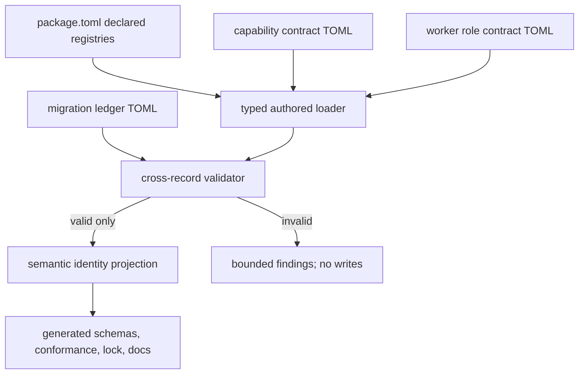
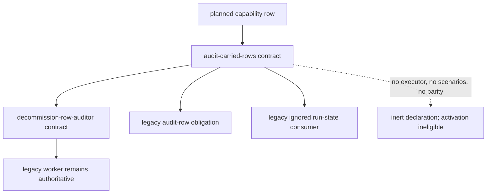

# First semantic Capability and Worker Role migration wave - Plan

## Goal Capsule

- **Objective:** Extend the inert Repository Engineering Package created by PR #292 with one truthful, host-neutral Capability Contract for `audit-carried-rows` and one Worker Role Contract for its directly coupled `decommission-row-auditor`, while keeping both successors unimplemented, uncertified, inactive, parity-unproved, and non-authoritative.
- **Authority hierarchy:** The user-approved resolutions of issues #283-#286 and the hard boundaries in this plan govern product behavior; the foundation plan and current Rust model govern integration; legacy skills, workers, deterministic validators, and ignored run-state consumers remain operationally authoritative. If a successor declaration would contradict a legacy safeguard or imply readiness, stop rather than weaken the boundary.
- **Execution profile:** Offline Rust and authored-TOML work on the repository at `main` commit `20d66d3`, using an already-installed Rust 1.96.0 toolchain. Set `CARGO_NET_OFFLINE=true`, pass Cargo's `--offline` flag, and propagate the offline environment through Make wrappers; stop with a bounded remediation if the pinned toolchain or any dependency is not already cached. The implementation may change repository files and regenerate deterministic projections, but it must not execute either capability candidate, access credentials or a gateway, read ignored run state, install a Runtime Bundle, activate anything, publish, mutate GitHub or other external state, retire sources, transfer authority, or mint an operational `version_set_id`.
- **Stop conditions:** Stop if the selected contract cannot represent a dependency or outcome without claiming implementation/parity; if U0 has not resolved and recorded the mutable-ledger knowledge-reference policy from Deferred / Open Questions; if any selected source digest has drifted and the semantic effect is not reviewed; if a test requires credentials, the old sibling repository, ignored run state, or network access; if generation would require hand-editing a generated artifact; if an active registry, executor, Runtime Installation, runtime command, authority transfer, or evidence claim becomes necessary; or if unrelated failures cannot be separated from this slice.
- **Tail ownership:** The implementation workflow owns only the local authored files, Rust schema/validation/generation changes, generated projections, offline tests, and documentation listed here. Publishing, PR creation, merge, activation, execution, certification, parity, state import, authority transfer, and retirement remain outside this plan.

---

## Product Contract

### Summary

Create the first semantic migration declaration after the repository-engineering foundation by registering exactly one existing capability and its directly coupled worker as authored contracts.
Select `audit-carried-rows` with `decommission-row-auditor`, because that pair has a bounded local artifact model, a committed manifest/record format/validator, explicit `HELD` and unverifiable outcomes, and no required publication or merge authority.
Although its output is a prerequisite for eventual decommission, the capability itself is the resumable-sweep/fresh-worker coordination wave identified as wave 4 in issue #285, not the wave-6 retirement or deletion operation.
The declaration records the legacy dependencies and future evidence obligations without executing the workflow or asserting implementation, certification, parity, activation, or successor authority.

### Problem Frame

PR #292 established Rust-owned schemas, a complete migration ledger, deterministic package identity, and inactive generated projections, but it intentionally authored no semantic contract instances and kept every migration row `unported`.
The first migration wave must prove that a real legacy workflow can be described and cross-validated without turning a declaration into operational authority.
The main risk is not file creation; it is allowing a registered contract, an evidence obligation, or a `planned` ledger row to be read as proof that a successor exists or is safe to run.

### Key Decisions

- PD1. **Select `audit-carried-rows` and `decommission-row-auditor` as the first pair.** Their durable artifacts and fail-closed outcomes are already defined and validated locally, whereas the promotion pair combines credentialed paper activity, GitHub publication, and prohibited auto-merge behavior. **Governs R1-R4.**
- PD2. **Treat contract registration as declaration, never activation.** New declared registries are separate from the existing active registries, which remain empty under `activation_eligibility = none`. **Governs R5, R10, R15, R18.** *(session-settled: user-directed — required by the hard boundary that activation eligibility stays none and legacy sources remain authoritative.)*
- PD3. **Represent unresolved successor, parity, and evidence states explicitly.** The two selected ledger rows become `planned` with replacement IDs and `parity_not_proven`; contract state remains `declared/unported/uncertified/legacy/not_started`, executors and scenario references remain absent, and evidence obligations are not evidence. **Governs R6-R13.** *(session-settled: user-directed — required by the hard boundary that a valid contract cannot imply implementation, certification, activation, or parity.)*
- PD4. **Keep the selected capability dependency-complete by naming legacy dependencies rather than porting them.** `audit-row` and the ignored audit sweep state remain separate legacy-authoritative ledger obligations, and the worker remains legacy-authoritative even though its successor role contract is declared. **Governs R7, R11, R12.**

### Candidate Evaluation

| Criterion | `audit-carried-rows` + `decommission-row-auditor` | `promote-trs` + `tr-promoter` |
|---|---|---|
| Highest legacy authority surface | Local worktree mutation plus an optional attended A3 paper-readonly row; absence of credentials truthfully yields `unverifiable` and a human acceptance gate. | A3 paper smokes, A2 branch/draft-PR publication, and legacy automatic merge behavior classified AX/prohibited by issue #284. |
| Direct dependency closure | Tracked manifest, record format, per-row recipe, worker definition, roll-up report, and committed validator are identifiable; `audit-row` and ignored run state can remain explicit legacy dependencies. | Depends on `promote-tr`, live smoke maps, metadata/evidence mutation, ignored resume state, GitHub issue/PR operations, and merge/sync behavior. |
| Evidence model | Per-row credential-free records and a deterministic roll-up validator already distinguish confirmed, refuted, unverifiable, and assumption-accepted states. | Focused Evidence exists per TR, but the sweep still depends on credentialed demonstrations and lacks a standalone deterministic audit that can justify automated publication or merge. |
| Safe first declaration | Can be declared at A3 with `executor = absent`, human gates, empty scenario references, and no run; local artifacts make future parity scenarios concrete. | A faithful declaration would either preserve prohibited auto-merge semantics or redesign the workflow; issue #285 forbids hiding material redesign inside a parity claim. |
| Decision | **Selected as the smallest dependency-complete semantic slice.** | Deferred until publication/merge is decomposed, auto-merge is removed, and its A3/A2 evidence and authority boundaries have separate reviewed contracts. |

### Requirements

**Selection and authority boundary**

- R1. Add exactly one authored Capability Contract with ID `audit-carried-rows` and exactly one authored Worker Role Contract with ID `decommission-row-auditor`; do not author contracts for `promote-trs`, `tr-promoter`, `audit-row`, or any other obligation in this wave.
- R2. Record the selection rationale above in durable package documentation so a future migration does not infer that the promotion pair was omitted accidentally.
- R3. Keep `activation_eligibility = none`, `active_capability_contracts = []`, `active_worker_roles = []`, both optional components disabled, and every selected contract state exactly `declared/unported/uncertified/legacy/not_started`.
- R4. Do not add a Runtime Bundle, runtime installation state instance, executor, host adapter, command surface, execution path, credential path, GitHub mutation, publication step, source retirement, authority transfer, or operational Version Set input/output.

**Authored contract model**

- R5. Extend `package.toml` with path-explicit declared contract registries that are structurally and semantically distinct from active registries. Each registration has exactly one stable ID and one repository-relative authored TOML path, rejects duplicates/case collisions/type mismatches/orphans, rejects a symlink or junction at every ancestor and leaf component, and grants no authority.
- R6. Author `.repository-engineering/contracts/capabilities/audit-carried-rows.toml` with the exact semantic field values in the Planning Contract, including A3 autonomy, scoped credential boundaries, host-neutral coordination and resume semantics, no caller inputs, closed outcomes, touched paths, separated legacy/successor evidence status, an unresolved external-source requirement, human gates, no executor, digest-bound knowledge references, field-group provenance, explicit legacy-authority dependencies, the selected worker role, and no scenario references.
- R7. Add `legacy_authority_dependencies` to the Rust-owned Capability Contract vocabulary and set it exactly to `capability--audit-row` and `run-state-consumer--audit-carried-rows`. These references assert that a future successor still depends on legacy-authoritative behavior/state; they do not port, import, activate, or grant authority to those dependencies.
- R8. Author `.repository-engineering/contracts/workers/decommission-row-auditor.toml` with the exact semantic field values in the Planning Contract: one required `row_id` assignment; a successful result containing `row_id`, closed `verdict`, and digest-bound `record`; a required assignment correlation on every terminal result; fresh-context isolation; bounded parallelism; cancellation, idempotency, and result validation required; digest-bound knowledge references and field-group provenance; and the same inert contract state.
- R9. Extend typed fields with a closed `allowed_values` domain where needed, using `confirmed`, `refuted`, and `unverifiable` for the worker's success verdict. Interpret Worker Role `result_fields` as the successful result payload. Add a required common `assignment_id: stable_id` to every variant of the closed `WorkerResult` envelope and require this role's value to equal `row_id`, including for `HELD`, cancellation, policy violation, failure, and recovery. Do not represent the legacy worker's prose or prompt as executable contract content.

**Ledger, successor, parity, and evidence truth**

- R10. Change only `capability--audit-carried-rows` and `worker-role--decommission-row-auditor` from `migration_state = "unported"` to `migration_state = "planned"`; keep their locators, source digests, `current_authority = "legacy"`, and `disposition = "PORT"` unchanged; add the matching `replacement_contract`; keep `parity_reference` absent; replace `absence_reason = "successor_not_implemented"` with `absence_reason = "parity_not_proven"`.
- R11. Keep `capability--audit-row` and `run-state-consumer--audit-carried-rows` exactly `unported`, legacy-authoritative, without replacement or parity references, and with `successor_not_implemented`; do not read or import `.compound-engineering/runs/audit-carried-rows`.
- R12. Keep `capability--promote-trs`, `worker-role--tr-promoter`, `capability--promote-tr`, and `run-state-consumer--promote-trs` byte-for-byte unchanged as ledger rows and keep their successor/parity state absent and unproved.
- R13. Treat `evidence_obligations` and `human_gates` as requirements for a future implementation/parity campaign, not as satisfied evidence. Record the committed audit report and manifest-defined 26-record corpus as validated legacy-only evidence with a deterministic aggregate digest, while successor implementation evidence remains absent, parity remains unproved, and certification remains uncertified. Legacy evidence must never satisfy a successor predicate. Keep `scenario_references = []`, `parity_reference` absent, implementation `unported`, certification `uncertified`, and executor absent until separate evidence exists.

**Schema authority, identity, and generated consequences**

- R14. Keep Rust types and semantic validators authoritative. Human-authored inputs are the package manifest, migration ledger, and two contract TOML files; every JSON Schema, registry, conformance artifact, exact lock, generated-set manifest, and reference page is generated and must never be hand-edited.
- R15. Add the two validated contract semantic references to the normative exact-lock closure, sorted deterministically by stable ID/path. Contract identity includes coordination, credential boundary, external-source requirement, evidence status, terminal correlation, and semantic-claim provenance fields plus every other operational semantic field, but excludes `public_description`; TOML comments, key order, whitespace, and presentation-only description changes do not change the contract semantic digest or `package_lock_id`.
- R16. Regeneration must update the affected package-manifest, capability-contract, worker-role-contract, and exact-lock schema projections; schema registry; structural and cross-record conformance artifacts and manifest; package lock; generated-set manifest; and repository-engineering reference page. The built-in fixture-only version-set vector must remain non-operational and byte-identical unless an independently justified schema-algorithm change is approved.
- R17. Generated documentation must show declared and active registries separately, render only the selected two ledger rows as `planned` with their replacements and `parity_not_proven`, and render all other rows with no successor declaration. Treat `public_description` as non-normative purpose text and derive adjacent implementation, certification, parity, activation, authority, and retirement statements exclusively from validated typed state; state prominently that planned/declaration/evidence obligations do not mean implemented, certified, active, parity-proven, or authoritative.

**Negative safety and deterministic verification**

- R18. Add generic negative tests that reject any nonempty active registry, non-`none` activation, selected optional component, non-null executor, implemented/certified/successor/retired selected state, parity reference before `parity_proven`, missing or mismatched planned replacement, false absence reason, unresolved/wrong-kind contract or worker references, incomplete coordination/terminal-correlation/provenance records, legacy evidence used as successor proof, an external-source requirement with an invented locator/digest or readiness status, stale knowledge digests, external/absolute/repository-escaping/symlink-component contract or touched paths, duplicate/case-colliding registrations, or imported run state. Keep wave-specific assertions out of reusable validators: a real-package regression must prove that only the two selected rows changed and every other ledger row retained its pre-wave locator, digest, disposition, authority, and successor/parity state.
- R19. Add negative tests proving an evidence obligation, human gate, knowledge reference, generated schema, empty/placeholder scenario list, or contradictory `public_description` cannot satisfy or obscure parity, certification, readiness, or authority validation.
- R20. Add determinism tests proving registry order, set-like claim/evidence/cohort order, and TOML presentation changes preserve identity; ordered phase changes and semantic coordination, credential, external-source, evidence-status, provenance, terminal-correlation, dependency, ledger, schema, or conformance changes alter identity; build-provenance-only changes do not alter identity; two generations are byte-identical; check mode is non-writing; and interrupted/obsolete projection handling remains repairable.
- R21. Preflight that Rust 1.96.0 is already installed without triggering rustup installation, then run only the applicable repository gates with `CARGO_NET_OFFLINE=true` and Cargo's `--offline` flag. Propagate the offline environment through Make wrappers and stop if any toolchain component or dependency is absent. No test or inspection may execute `audit-carried-rows`, `decommission-row-auditor`, `promote-trs`, `tr-promoter`, `audit-row`, `promote-tr`, a live smoke, or any credentialed/external operation.
- R22. Keep successor operational semantics host-neutral: no agent-host name, host-specific worker protocol, command surface, or host state path may appear outside explicitly legacy-only `knowledge_references`, `touched_paths`, provenance, or unavailable external-source declarations. Verify the exact authored pair with an expectation test rather than a brittle repository-wide token denylist.

### Key Flows

- F1. Authored contract registration
  - **Trigger:** An implementer adds the two contract TOML files and declared registry entries.
  - **Steps:** Load the package; walk each registered path from the verified repository root without following a symlink or junction at any ancestor or leaf; parse the Rust-owned contract type; validate ID/path/type uniqueness; validate digest-bound knowledge references with the same component-by-component confinement; then validate ledger and dependency links.
  - **Outcome:** The package contains two discoverable, source-reconciled declarations but no active or executable entry point; any invalid record, unresolved semantic claim, or path escape fails before projections are written.
  - **Covered by:** R3-R9, R14.
- F2. Cross-record reconciliation
  - **Trigger:** Generation or check mode composes the authored package.
  - **Steps:** Match each planned ledger replacement to exactly one declared contract of the correct kind; resolve the capability's worker role and legacy-authority dependencies; validate complete coordination, credential scope, unavailable external-source state, legacy/successor evidence separation, provenance coverage, and terminal correlation; assert inert states, absent parity references, and absent satisfied-successor-evidence or readiness claims while allowing populated legacy evidence, `evidence_obligations`, and `human_gates`; use the real-package regression, rather than reusable validation, to assert that every non-selected ledger row is unchanged.
  - **Outcome:** The two planned rows are truthful and dependency-complete while all operational authority remains legacy.
  - **Covered by:** R10-R13, R18-R19.
- F3. Deterministic projection
  - **Trigger:** All authored inputs pass validation.
  - **Steps:** Generate schemas and conformance artifacts in memory; compute presentation-invariant contract semantic references including coordination, scoped credentials, evidence, provenance, external-source, and correlation semantics; build the normative closure and exact lock; render truthful documentation; atomically replace the generated set with its manifest last.
  - **Outcome:** Repeated generation is byte-identical, check mode is non-writing, and the new `package_lock_id` identifies the declared semantic slice without producing an operational `version_set_id`.
  - **Covered by:** R14-R17, R20-R21.

### Acceptance Examples

- AE1. **Declared but inactive:** Given both authored contracts and their package registrations, when check mode runs, then it succeeds only while both active registries remain empty and both contract states remain inert.
- AE2. **Truthful planned row:** Given `capability--audit-carried-rows` is `planned`, when its replacement is missing, points to the worker contract, carries a parity reference, or retains `successor_not_implemented`, then validation fails before writing.
- AE3. **Legacy dependency stays authoritative:** Given the selected capability names `capability--audit-row` and `run-state-consumer--audit-carried-rows`, when either dependency is changed to planned/successor authority or ignored run state is introduced as an authored artifact, then validation fails.
- AE4. **Worker result is closed:** Given the authored worker role contract, when its verdict domain contains an unknown value or omits one of `confirmed/refuted/unverifiable`, then the authored-contract expectation test fails without adding audit-specific vocabulary to generic validation; a future `HELD` result remains represented by the existing tagged WorkerResult envelope, not a fabricated verdict.
- AE5. **Obligation is not proof:** Given evidence obligations and human gates are populated, when a validator attempts to infer parity, certification, implementation, activation, or authority from them, then the negative test fails that implementation.
- AE6. **Presentation-invariant identity:** Given a contract TOML with only comments, whitespace, key order, or `public_description` changed, when package identity is recomputed, then the semantic contract digest and `package_lock_id` remain unchanged.
- AE7. **Semantic identity change:** Given a change to autonomy, overlay, outcome, touched path, worker role, legacy dependency, allowed verdict, replacement, or absence status, when package identity is recomputed, then `package_lock_id` changes.
- AE8. **No execution reachability:** Given the final crate and CLI public surface, when its symbols and help output are inspected, then no install/activate/execute/dispatch/worker/credential/publish/merge/retire operation exists and the fixture-only Version Set path still rejects caller-controlled operational input.
- AE9. **Complete coordinator declaration:** Given the authored capability, when any manifest-coverage, cohort-bound, phase, checkpoint-owner, resume, serial-roll-up, or terminal-condition clause is removed or changed, then the authored expectation or semantic validator fails and package identity changes without executing the workflow.
- AE10. **Provenance constrains parity:** Given a field group marked `successor_requirement` or `unavailable_unproved`, when later evidence attempts to count it as observed legacy parity without a separately reviewed redesign decision, then validation fails.
- AE11. **Unavailable old source remains truthful:** Given the external-source requirement, when it gains a locator/digest/readiness claim in this wave or its absence is treated as success, then validation fails; the package never opens the sibling checkout.
- AE12. **Legacy evidence is not successor evidence:** Given the trustworthy-green legacy artifact set, when it is used to advance successor implementation, certification, or parity, then validation fails even though its aggregate digest and validator status are current.
- AE13. **All terminal results correlate:** Given any success or non-success `WorkerResult`, when `assignment_id` is absent or differs from the assigned `row_id`, then schema/semantic validation fails.
- AE14. **Host-neutral successor semantics:** Given the exact authored pair, when an agent-host name, host-specific protocol, command, or runtime-state path appears in an operational semantic field outside a legacy-only path/reference/provenance field, then the authored expectation fails.

### Success Criteria

- The package validates with exactly one declared capability and one declared worker, zero active entries, and the selected two ledger rows as the only `planned` rows.
- Generated artifacts and reference documentation truthfully distinguish declaration, implementation, certification, parity, activation, authority, and retirement.
- Contract and ledger semantic changes participate in deterministic package identity while presentation-only contract changes do not.
- Every applicable offline gate passes on Rust 1.96.0 without reading credentials, ignored state, the sibling migration-source repository, or the network.
- Every legacy-derived field group cites a digest-bound source, every successor redesign stays labeled as such, and unavailable source facts remain unproved rather than invented.
- The contract fully declares manifest coverage, cohort limits, resume phases, serial roll-up, terminal correlation, and host-neutrality without introducing an executor or runtime protocol.

### Scope Boundaries and Deferred Work

This plan deliberately defers:

- Runtime Bundle design, implementation, installation, activation, and Runtime Installation state.
- Capability or worker execution, host adapters, worker protocol selection, runtime orchestration implementation, cancellation transport, or deterministic executor creation. This wave records host-neutral coordination semantics only.
- Import, migration, abandonment, or deletion of ignored `.compound-engineering/runs` state.
- Scenario catalog authoring, shadow runs, parity demonstrations, Parity Records, certification, or evidence collection.
- Attended A3 credentials, paper gateway access, live/realtime validation, or maintainer acceptance of unverifiable audit rows.
- GitHub publication, draft PR creation, issue mutation, branch pushing, review authority, merging, or automatic synchronization.
- Authority transfer, rollback enablement, archived source snapshots, retirement gates, legacy skill/worker deletion, repository decommission, or global Compound Engineering cleanup.
- Any semantic redesign of `promote-trs`, removal of its automatic merge behavior, or contracts for `promote-tr`, `tr-promoter`, or promotion run state.
- Operational Version Set construction or `version_set_id` minting; the existing fixture-only vector remains algorithm conformance only.

### Dependencies

- Repository baseline `20d66d3` from merged PR #292.
- Existing Rust crate `crates/ls-repository-engineering` and its generated projection protocol.
- Legacy semantic sources at their ledger-recorded digests: `.agents/skills/audit-carried-rows/`, `.agents/skills/audit-row/`, and `.claude/agents/decommission-row-auditor.md`.
- Tracked audit assets: `docs/migration-source/audit/manifest.yaml`, `.agents/skills/audit-carried-rows/references/record-format.md`, `docs/migration-source-extraction-ledger.md`, and `crates/ls-trackers/tests/decommission_audit.rs`.
- Rust 1.96.0 as pinned by `rust-toolchain.toml`.

### Sources

- [Issue #283: Repository Engineering Layer architecture](https://github.com/sunkeunchoi/korea-adapter-sdk-ls/issues/283)
- [Issue #284: Repository Improvement Loop autonomy contract](https://github.com/sunkeunchoi/korea-adapter-sdk-ls/issues/284)
- [Issue #285: semantic migration and retirement strategy](https://github.com/sunkeunchoi/korea-adapter-sdk-ls/issues/285)
- [Issue #286 full resolution](https://github.com/sunkeunchoi/korea-adapter-sdk-ls/issues/286#issuecomment-5301999781)
- [Merged PR #292](https://github.com/sunkeunchoi/korea-adapter-sdk-ls/pull/292)
- `AGENTS.md`, `CONCEPTS.md`, `.repository-engineering/README.md`, `.repository-engineering/package.toml`, `.repository-engineering/migration-ledger.toml`
- `docs/plans/2026-08-17-1017-feat-repository-engineering-package-foundation-plan.md`
- `docs/adr/0009-rust-first-permanent-tooling.md`, `docs/adr/0012-rust-owned-metadata-schema-authority.md`
- `docs/solutions/design-patterns/build-runtime-hash-parity-via-shared-include.md`, `docs/solutions/architecture-patterns/change-tracker-baseline-clean-self-diff.md`, `docs/solutions/architecture-patterns/gate-over-diff-inherits-diff-scope-blind-spot.md`

---

## Planning Contract

### Key Technical Decisions

- KTD1. **Use the audit pair and model its highest applicable autonomy as A3.** The capability is a wave-4 resumable coordinator that can perform local A1 mutations and may encounter an attended paper-readonly row; A3 plus explicit human gates and an absent executor truthfully captures the upper bound without turning it into a wave-6 retirement action or authorizing a run. **Governs R1-R4, R6.**
- KTD2. **Add declared registries as typed ID/path entries alongside, not inside, active registries.** This makes authored contracts discoverable while preserving the invariant that active arrays are empty and activation eligibility is none. **Governs R5, R14-R15.**
- KTD3. **Use authored TOML contracts and compute their lock references from typed semantic identity projections.** Registry entries carry paths, not hand-maintained contract digests; the loader parses and validates authored TOML, while package and contract identity projections sort set-like registries/fields, preserve sequence-bearing fields, and exclude `public_description`. **Governs R5-R6, R8, R14-R16.**
- KTD4. **Add one generic legacy-dependency field and one generic typed-value domain rather than capability-specific validation vocabulary.** `legacy_authority_dependencies` makes unresolved legacy prerequisites machine-readable, and `allowed_values` closes stable-ID result domains without adding an audit-specific enum to the package schema. **Governs R7-R9, R11.**
- KTD5. **Use `planned + replacement + parity_not_proven` for a declared successor.** `unported + successor_not_implemented` remains the absence state; `parity_proven` remains impossible without a digest-bound parity reference; neither state changes current authority. **Governs R10-R13, R17-R19.**
- KTD6. **Bind contract semantics and semantic validation rules into the normative lock closure.** Both contract references are sorted set-like inputs to `package_lock_id`; build provenance remains outside identity, and the fixture-only Version Set vector remains independent. **Governs R14-R16, R20.**
- KTD7. **Render actual ledger and contract state instead of a first-slice blanket sentence.** The generated reference page derives declaration and migration cells from validated records so two planned rows do not make every row appear planned or implemented. **Governs R17.**
- KTD8. **Represent coordinator behavior declaratively, without selecting a runtime protocol.** Add a generic host-neutral coordination structure for complete coverage, fresh assignments, cohort limits, orchestrator-owned checkpoints, resume reconciliation, serial roll-up, and terminal conditions; executor, transport, and dispatch implementation remain absent. **Governs R6, R15, R18, R20, R22.**
- KTD9. **Separate semantic provenance and legacy evidence from successor proof.** Identity-bearing claim records distinguish `legacy_observed`, `successor_requirement`, and `unavailable_unproved`; a deterministic artifact-set reference records the existing trustworthy-green legacy corpus but cannot advance successor implementation, parity, or certification. **Governs R6, R8, R13, R15, R18-R20.**
- KTD10. **Replace the unscoped credential overlay with a typed boundary.** Package state, checkpoints, committed records, and diagnostics remain credential-free; any future paper-readonly executor is separately attended, minimum-credential, and blocked from implementation or activation until its sourcing, isolation, redaction, and environment controls are reviewed. **Governs R3-R6, R18-R19.**
- KTD11. **Make assignment correlation part of every terminal worker result.** The common closed result envelope carries `assignment_id`, and this role binds it to `row_id`, so success and non-success outcomes are independently attributable before any host protocol exists. **Governs R8-R9, R15, R18, R20.**
- KTD12. **Prove expressibility before changing Rust authority.** A read-only, out-of-tree contract draft precedes U1 and must reconcile every field against the legacy sources and the exact tables below; any missing semantic home is a stop-and-replan condition, not an invitation to improvise during schema implementation. **Governs all implementation units.**

### Exact Authored Contract Fields

#### Capability Contract: `audit-carried-rows`

| Field | Required value |
|---|---|
| `schema_version` | `v0` |
| `capability_id` | `audit-carried-rows` |
| `public_description` | Stable, non-sensitive purpose text: the capability audits all carried/discard rows and produces credential-free per-row records plus a roll-up gate. Lifecycle and authority statements are rendered from typed state, not authored here. |
| `state` | `declaration = declared`, `implementation = unported`, `certification = uncertified`, `authority = legacy`, `retirement = not_started` |
| `autonomy` | `A3` |
| `safety_overlays` | Exactly `no_external_mutation`, `human_gate`, `path_confined`, `redacted_diagnostics`, normalized in enum order for identity. Credential scope is represented by `credential_boundary`, not an ambiguous overlay. |
| `credential_boundary` | Credential-free scopes are exactly package/authored state, checkpoints, committed records, and diagnostics. The current executor is absent. A future executor may be only separately attended, minimum-credential, and paper-readonly; credential sourcing, process/environment isolation, redaction, and trading-environment selection must be separately reviewed before implementation or activation. |
| `inputs` | Empty; the legacy orchestrator is state-driven and accepts no caller argument. Tracked manifest/ledger inputs are knowledge references, not invented caller parameters. |
| `outcomes` | Exactly `succeeded`, `held`, `cancelled`, `policy_violated`, `failed`, `recovery_required`. |
| `coordination_semantics` | `coverage = complete_manifest_reconciliation`; `assignment = fresh_worker_per_row`; knowledge/discard rows use the parallel cohort; behavioral rows use bounded parallelism with `max_concurrency = 2`; checkpoint owner is orchestrator-only; phases are exactly `discovering`, `dispatching`, `rolling_up`, `gate_computed`, `complete`; resume skips completed rows only after record revalidation, reconciles orphan records as objective facts, and maps branch/checkpoint mismatch to `held`; roll-up is serial after every row is terminal; `succeeded` requires complete coverage plus a passing committed validator, unresolved rows map to `held`, and inconsistent persisted state maps to `recovery_required`. No executor or transport is selected. |
| `touched_paths` | Exactly `.compound-engineering/runs/audit-carried-rows`, `docs/migration-source/audit/records`, `docs/migration-source/audit/decommission-audit-report.md`, and `docs/migration-source-extraction-ledger.md`. The ignored path is declared as legacy operational scratch, never imported into the package. |
| `evidence_obligations` | Exactly `per-row-credential-free-records`, `roll-up-gate-report`, `decommission-audit-validator-pass`, and `source-coverage-reconciliation`; these remain unsatisfied obligations. |
| `evidence_status` | Legacy evidence is `available_validated` and references the report plus the manifest-defined 26-record corpus through a sorted artifact-set aggregate digest, with `crates/ls-trackers/tests/decommission_audit.rs` as its validation basis. Successor implementation evidence is `absent`, parity is `unproved`, and certification is `uncertified`; `legacy_evidence_satisfies_successor = false`. |
| `human_gates` | Exactly `attended-paper-readonly-session` and `unverifiable-maintainer-acceptance`; neither gate is exercised in this wave. |
| `executor` | Absent/null. |
| `knowledge_references` | Digest-bound tracked file references to `.agents/skills/audit-carried-rows/SKILL.md`, `.agents/skills/audit-row/SKILL.md`, `.agents/skills/audit-carried-rows/references/record-format.md`, `docs/migration-source/audit/manifest.yaml`, `docs/migration-source-extraction-ledger.md`, and `crates/ls-trackers/tests/decommission_audit.rs`. Digests must match regular tracked files at implementation time. |
| `external_source_requirements` | One entry with ID `korea-broker-sdk-ls`, purpose `per-row-old-source-audit`, required phase `dispatching`, status `unavailable_unproved`, and absent locator/digest. If unavailable before dispatch, the capability outcome is `held`; if a row-specific claim cannot be checked after dispatch begins, its worker verdict is `unverifiable`. The package never resolves or opens this source in this wave. |
| `legacy_authority_dependencies` | Exactly `capability--audit-row` and `run-state-consumer--audit-carried-rows`. |
| `worker_roles` | Exactly `decommission-row-auditor`. |
| `scenario_references` | Empty; no scenario catalog or parity record exists. |
| `semantic_claims` | Identity-bearing claim groups exactly as listed in the Capability Semantic Claim Provenance table below. |

##### Capability Semantic Claim Provenance

| Field group | Claim status | Source basis |
|---|---|---|
| `coordination_semantics`, `inputs`, `outcomes`, `worker_roles` | `legacy_observed` | `.agents/skills/audit-carried-rows/SKILL.md` sections 1-6 and `.agents/skills/audit-row/SKILL.md` final-return contract. |
| `autonomy`, `human_gates`, `safety_overlays`, `touched_paths`, `legacy_authority_dependencies` | `legacy_observed` | The audit skill prerequisite/resume/roll-up boundaries, record-format safety rules, and the migration ledger. |
| `credential_boundary` | `successor_requirement` | Legacy attended-paper and secret-safety constraints motivate the boundary, but its typed executor split is a successor design and is not legacy parity. |
| `external_source_requirements[*].purpose` | `legacy_observed` | `.claude/agents/decommission-row-auditor.md` requires read access to the old source for each row. |
| `external_source_requirements[*].status`, locator, digest | `unavailable_unproved` | This declaration-only wave neither accesses nor snapshots the sibling checkout. |
| `evidence_status.legacy` | `legacy_observed` | The committed trustworthy-green report, manifest-defined record corpus, and validator. |
| `evidence_status.successor`, `state`, `executor`, `scenario_references` | `successor_requirement` | The inert migration boundary in this plan; these fields make no legacy-behavior claim. |

#### Worker Role Contract: `decommission-row-auditor`

| Field | Required value |
|---|---|
| `schema_version` | `v0` |
| `role_id` | `decommission-row-auditor` |
| `public_description` | Stable, non-sensitive purpose text: one fresh worker audits exactly one manifest row and returns a validated credential-free result. Lifecycle and authority statements are rendered from typed state, not authored here. |
| `state` | `declaration = declared`, `implementation = unported`, `certification = uncertified`, `authority = legacy`, `retirement = not_started` |
| `assignment_fields` | Required `row_id: stable_id`. |
| `result_fields` | Successful payload fields: required `row_id: stable_id`; required `verdict: stable_id` with allowed values `confirmed`, `refuted`, `unverifiable`; required `record: artifact_reference`. Non-success terminal states use `WorkerResult`, including `held.reason`. |
| `terminal_result_correlation` | Every `WorkerResult` variant requires `assignment_id: stable_id`; for this role it must equal the assigned `row_id`. Successful results continue to carry `row_id` and must match the same value. |
| `fresh_context_required` | `true` |
| `concurrency` | `bounded_parallel`; the capability, not the worker, applies the legacy behavioral-row throttle. |
| `cancellation_supported` | `true` as a successor contract requirement, not a claim that legacy cancellation parity is proved. |
| `idempotency_key_required` | `true`; `row_id` is the stable assignment key, while resume behavior remains unimplemented. |
| `result_validation_required` | `true`; validation implementation and parity remain deferred. |
| `knowledge_references` | Digest-bound tracked references to `.claude/agents/decommission-row-auditor.md`, `.agents/skills/audit-row/SKILL.md`, and `.agents/skills/audit-carried-rows/references/record-format.md`. |
| `semantic_claims` | Identity-bearing claim groups exactly as listed in the Worker Semantic Claim Provenance table below. |

##### Worker Semantic Claim Provenance

| Field group | Claim status | Source basis |
|---|---|---|
| `assignment_fields`, `result_fields`, `fresh_context_required`, `concurrency`, `result_validation_required` | `legacy_observed` | `.claude/agents/decommission-row-auditor.md`, `.agents/skills/audit-row/SKILL.md`, and the record format. |
| `terminal_result_correlation`, `cancellation_supported`, `idempotency_key_required` | `successor_requirement` | Desired host-neutral successor guarantees; no legacy parity is claimed. |
| `state` | `successor_requirement` | The inert migration boundary in this plan, not a claim about legacy worker implementation state. |

### Exact Ledger Changes and Protected Rows

| Logical row | Required post-wave state | Change status |
|---|---|---|
| `capability--audit-carried-rows` | `planned`, replacement `audit-carried-rows`, no parity reference, `parity_not_proven`, current authority `legacy`, disposition `PORT`, current locator/digest unchanged. | Modified. |
| `worker-role--decommission-row-auditor` | `planned`, replacement `decommission-row-auditor`, no parity reference, `parity_not_proven`, current authority `legacy`, disposition `PORT`, current locator/digest unchanged. | Modified. |
| `capability--audit-row` | `unported`, no replacement/parity, `successor_not_implemented`, legacy authority, current locator/digest/disposition unchanged. | Protected invariant. |
| `run-state-consumer--audit-carried-rows` | `unported`, no replacement/parity, `successor_not_implemented`, legacy authority, current locator/disposition unchanged. | Protected invariant. |
| `capability--promote-trs` | Entire row unchanged and unported. | Protected comparison invariant. |
| `worker-role--tr-promoter` | Entire row unchanged and unported. | Protected comparison invariant. |
| `capability--promote-tr` | Entire row unchanged and unported. | Protected dependency invariant. |
| `run-state-consumer--promote-trs` | Entire row unchanged and unported. | Protected dependency invariant. |

### Cross-Record Invariants

| Invariant | Failure meaning |
|---|---|
| Every declared registry entry resolves from the verified repository root to one regular tracked TOML file whose parsed ID and contract kind match the registration, with no symlink or junction at any ancestor or leaf component. | Undiscoverable, ambiguous, substituted, or repository-escaping contract. |
| Declared IDs and paths are unique under exact and case-folded comparison; no contract file is unregistered and no registration is orphaned. | Platform-dependent or hidden contract inventory. |
| Active registries are empty and disjoint from declared registries while activation is none. | Declaration has leaked into activation. |
| Every declared contract passes `validate_first_slice_contract_state`, has no executor, and has no scenario reference in this wave. | Implementation/readiness/parity implication. |
| Every `planned` row has one type-correct declared replacement, no parity reference, and `parity_not_proven`; every `unported` row has no replacement/parity and `successor_not_implemented`. | Successor or parity state is false or ambiguous. |
| The capability's one worker role resolves to the declared worker and its planned ledger row; the worker remains legacy-authoritative and unimplemented. | Worker coupling is missing or falsely transferred. |
| Capability coordination declares complete manifest reconciliation, the exact two dispatch cohorts and behavioral bound, orchestrator-only checkpoints, the five ordered resume phases, serial roll-up, and closed terminal conditions without naming an executor or transport. | The contract can hash as complete while omitting load-bearing legacy coordination. |
| Every `legacy_authority_dependencies` ID resolves to a ledger row that remains legacy-authoritative and below `parity_proven`; for this capability the set is exactly the two protected audit dependencies. | Dependency was omitted, silently migrated, or falsely made ready. |
| Knowledge references resolve within the repository to tracked regular files, carry current digests/media types, and never point to ignored state, generated build output, an absolute path, a symlink, or the sibling source checkout. | Non-reproducible, sensitive, or disappearing evidence basis. |
| Every `touched_paths` entry is normalized and repository-relative, has no absolute prefix, `..` escape, symlink, or junction component, and is never opened by declaration validation; ignored operational paths are permitted only as inert declarations. | The stated mutation boundary can escape the repository or import operational state. |
| Evidence obligations, human gates, and knowledge references never satisfy implementation, certification, parity, activation, or authority predicates. | Requirements are being misread as proof. |
| Legacy evidence carries a current sorted artifact-set digest and validator basis but cannot satisfy successor evidence, parity, or certification; successor evidence remains explicitly absent/unproved. | Real legacy proof was erased or falsely promoted into successor readiness. |
| Every operational field group has exactly one semantic-claim status and source basis; later parity may cite only `legacy_observed` claims unless a separately reviewed redesign changes the comparison basis. | Desired successor behavior can be mislabeled as observed legacy parity. |
| The unresolved external-source requirement has no locator or digest, is never opened, and maps absence to `held` or row-level `unverifiable`, never success. | An unavailable source has been invented, imported, or treated as proven. |
| Every terminal worker result carries an assignment ID equal to this role's `row_id`, including `held`, cancellation, policy violation, failure, and recovery. | Parallel or resumed outcomes cannot be independently attributed. |
| Contract registries and semantic references participate in normative identity; `public_description` and build provenance do not, and generated lifecycle/authority statements come only from validated typed state. | Package identity is incomplete, presentation-sensitive, or shadow authority has entered prose. |
| Successor operational semantics contain no agent-host name, host protocol, command, or runtime-state path; host-specific tokens are permitted only in explicitly legacy-only paths, knowledge references, provenance, or unavailable-source declarations. | The first semantic contract is coupled to the host it is meant to replace. |
| Every set-like registry and contract collection is normalized by stable ID/path or enum order, while assignment/result field order and other declared sequences remain identity-bearing. | Equivalent sets hash differently or meaningful ordering is erased. |

### Architecture and Data Flow

### System-Wide Impact

- **Authored package interface:** `PackageManifest` gains declared contract registries, while the active registry fields and activation policy retain their current meaning and values.
- **Schema interface:** The provisional v0 capability/worker schemas gain generic legacy-dependency and allowed-value semantics; this is an intentional pre-v1 schema change and updates registry/lock identity without compatibility claims.
- **Semantic interface:** The provisional schemas also gain generic coordination, credential-boundary, external-source, evidence-status/artifact-set, semantic-claim, and terminal-correlation structures. Exact audit phases and IDs remain authored data, not reusable Rust vocabulary.
- **Validation path:** `load_authored_package`, inventory reconciliation, first-slice state validation, and repository composition share one typed contract set; no generated JSON becomes an independent authority.
- **Identity path:** Package registry normalization and contract semantic projections feed the exact lock, while public descriptions, raw TOML presentation, build provenance, and fixture-only Version Set output stay outside operational semantics.
- **Consumer impact:** The only consumers remain offline `generate` and `check` plus tests/documentation. The crate and CLI gain no runtime, worker-launch, credential, publication, or state-import operation.
- **Failure propagation:** Authored parse, digest, or cross-record failures produce bounded value-free findings before projection replacement; a valid old generated set remains intact until the full new set is valid.

### Authored and Generated File Consequences

**New human-authored files**

- `.repository-engineering/contracts/capabilities/audit-carried-rows.toml`
- `.repository-engineering/contracts/workers/decommission-row-auditor.toml`

**Modified human-authored package files**

- `.repository-engineering/package.toml`
- `.repository-engineering/migration-ledger.toml`
- `.repository-engineering/README.md`

**Modified Rust authority and tests**

- `crates/ls-repository-engineering/src/schema.rs`
- `crates/ls-repository-engineering/src/inventory.rs`
- `crates/ls-repository-engineering/src/validator.rs`
- `crates/ls-repository-engineering/src/identity.rs`
- `crates/ls-repository-engineering/src/repository.rs`
- `crates/ls-repository-engineering/tests/schema.rs`
- `crates/ls-repository-engineering/tests/inventory.rs`
- `crates/ls-repository-engineering/tests/authored_package.rs`
- `crates/ls-repository-engineering/tests/determinism.rs`
- `crates/ls-repository-engineering/tests/cli.rs`
- `crates/ls-repository-engineering/tests/fixtures/schema/package-manifest.valid.json`
- `crates/ls-repository-engineering/tests/fixtures/fidelity/audit-carried-rows.capability.json`
- `crates/ls-repository-engineering/tests/fixtures/fidelity/decommission-row-auditor.worker.json`

**Generated files expected to change only through `generate`**

- `.repository-engineering/schemas/v0/package-manifest.schema.json`
- `.repository-engineering/schemas/v0/capability-contract.schema.json`
- `.repository-engineering/schemas/v0/worker-role-contract.schema.json`
- `.repository-engineering/schemas/v0/exact-lock.schema.json`
- `.repository-engineering/schema-registry.json`
- `.repository-engineering/conformance/v0/structural.json`
- `.repository-engineering/conformance/v0/cross-record.json`
- `.repository-engineering/conformance/v0/manifest.json`
- `.repository-engineering/package.lock.json`
- `.repository-engineering/generated-set.json`
- `docs/reference/repository-engineering-package.md`

`.repository-engineering/conformance/v0/version-set-vector.json` is expected to remain byte-identical and fixture-only.
All other schema files are expected to remain byte-identical; an unexpected diff is a stop-and-explain condition rather than something to accept mechanically.

### Risks and Mitigations

| Risk | Mitigation |
|---|---|
| A declared registry is reused as an active registry. | Separate Rust fields, separate generated documentation, empty-active negative tests, and no runtime consumer. |
| `planned` is read as implemented or parity-proven. | Closed cross-record state table, exact `parity_not_proven`, absent executor/scenarios/parity reference, and negative tests for every upward state. |
| The selected capability hides unresolved legacy dependencies. | Machine-readable `legacy_authority_dependencies` plus protected-row assertions for `audit-row` and ignored run state. |
| The coordinator contract omits behavior that later parity needs. | Identity-bearing host-neutral coordination declares complete coverage, cohorts, resume phases, checkpoint ownership, serial roll-up, and terminal conditions without choosing a runtime. |
| Legacy behavior and successor redesign are conflated. | Require one closed provenance status and source basis per operational field group; parity may use only `legacy_observed` claims absent a separately reviewed redesign decision. |
| Existing trustworthy-green evidence is erased or mistaken for successor proof. | Digest-bind the legacy artifact set separately and keep successor implementation evidence absent, parity unproved, and certification uncertified. |
| The old source checkout is silently assumed available. | Declare an unavailable/unproved external-source requirement with no locator/digest and fail-closed `held`/`unverifiable` outcomes; never open it in this wave. |
| Non-success worker results lose row attribution. | Require assignment correlation on every closed result variant and bind it to `row_id`. |
| Credential-free is interpreted as either too broad or too weak. | Replace the overlay with explicit credential-free scopes and require a later attended-executor security review before implementation or activation. |
| Host-specific concepts leak into successor semantics. | Permit them only in legacy-only paths/references/provenance and enforce the exact pair with a host-neutral fidelity expectation. |
| The worker contract overstates legacy result fidelity. | Mark it as the desired successor schema, keep implementation/parity unproved, distinguish successful payload from generic `HELD`, and defer adapter/result conformance. |
| Presentation prose contradicts readiness state or churns package identity. | Keep `public_description` purpose-only and non-normative; exclude it from semantic identity; derive adjacent lifecycle and authority statements exclusively from validated typed state. |
| Knowledge references become stale or escape the repository. | Validate tracked regular files, current digests, normalized repository paths, symlink refusal, and no ignored/sibling/build-output references. |
| Regeneration accidentally mints runtime identity or reaches credentials. | Keep the built-in Version Set vector fixed and caller-independent; run only offline Rust/check commands; inspect CLI surface. |
| Unrelated user files are overwritten. | Limit edits to the exact files above, preserve the existing untracked plan and `hf.txt`, and inspect `git status` before and after generation. |

### Sequencing

Each unit must leave its focused tests green and a reviewable diff before the next unit begins.
Do not regenerate committed projections until U3 validation is complete, because validation failures must not replace the last coherent generated set.
Repository-level generated-exactness gates (`check`, `make repository-engineering-check`, and `make docs-check`) are expected to remain red after U2 changes authored inputs and until U4 regenerates the coherent projection set. U2 and U3 are gated only by their listed focused tests; the repository-level exactness gates become mandatory and green in U4.

---

## Implementation Units

### U0. Prove the selected pair is expressible before changing schema authority

- **Goal:** Catch missing semantic vocabulary while changes are still a disposable draft rather than Rust/schema/test rework.
- **Requirements:** R1-R13, R22, KTD12.
- **Files:** None. Draft only in an OS-created temporary directory outside the repository; do not add ignored state or retain the draft as an authority source.
- **Approach:** First resolve the Deferred / Open Questions choice for the migration ledger: either remove it from `knowledge_references` because the legacy capability writes it, or retain it with an explicit reviewed identity-changing re-pin policy; record the chosen rule for U2 documentation and do not begin U1 until it is settled. Then draft both contract TOML documents from the exact field and provenance tables; reconcile every operational field to its cited legacy source; exercise the planned generic shapes for coordination, credential boundaries, external-source absence, evidence separation, semantic claims, and terminal correlation; present the checklist for review, then discard the scratch files. U2 persists the approved field-to-source reconciliation and knowledge-reference rule in `.repository-engineering/README.md`. Stop and revise this plan if any behavior needs host-specific structure or cannot be represented without implying implementation, parity, or authority.
- **Test scenarios:** Every exact field has one typed home; every behavioral field group has one claim status/source basis; all host-specific tokens occur only in permitted legacy-reference fields; absent executor/source/evidence states serialize without placeholders; the worker's common terminal correlation covers every closed result variant.
- **Verification:** Human review of the scratch draft against the exact tables and source sections; no repository diff and no network, credential, sibling-checkout, or ignored-state access.
- **Dependencies:** None.

### U1. Add inert declared-contract registration and semantic field vocabulary

- **Goal:** Give the Rust schema authority a non-active way to register authored contracts and enough generic vocabulary to state legacy dependencies and closed worker verdicts.
- **Requirements:** R3-R9, R13-R15, R18, R20, R22.
- **Files:** `crates/ls-repository-engineering/src/schema.rs`, `crates/ls-repository-engineering/src/validator.rs`, `crates/ls-repository-engineering/tests/schema.rs`, `crates/ls-repository-engineering/tests/fixtures/schema/package-manifest.valid.json`, `crates/ls-repository-engineering/tests/fixtures/fidelity/audit-carried-rows.capability.json`, `crates/ls-repository-engineering/tests/fixtures/fidelity/decommission-row-auditor.worker.json`.
- **Approach:** Add a closed declared-contract registration type carrying ID and repository path; add `declared_capability_contracts` and `declared_worker_roles` to `PackageManifest`; add generic identity-bearing structures for coordination semantics, scoped credential boundaries, external-source requirements, evidence status/artifact sets, and semantic claims to `CapabilityContract`; add `legacy_authority_dependencies`; add an empty-by-default closed `allowed_values` list to `TypedField`; add common required `assignment_id` correlation to every `WorkerResult` variant; preserve unknown-field rejection and all existing inert-state validation. Keep audit-specific phases, verdicts, and source IDs in authored data/expectation fixtures rather than Rust enums.
- **Test scenarios:** Valid empty and one-entry declared registries; active registry still rejected; unknown fields/schema versions rejected; generic coordination collections and semantic-claim statuses round-trip with closed status enums; artifact-set members sort deterministically; unavailable external sources reject locator/digest/readiness fields; allowed values reject duplicates/invalid stable IDs; every WorkerResult variant requires assignment correlation; capability/worker fidelity fixtures encode the exact authored expectations without changing authority state.
- **Verification:** `CARGO_NET_OFFLINE=true cargo +1.96.0 test --offline --locked -p ls-repository-engineering --test schema`.
- **Dependencies:** U0.

### U2. Load and author the selected pair, then make only the two planned ledger transitions

- **Goal:** Create the two human-authored semantic contracts, register them, and express the exact successor/parity status in the migration ledger.
- **Requirements:** R1-R13, R18-R19, R22.
- **Files:** `.repository-engineering/contracts/capabilities/audit-carried-rows.toml`, `.repository-engineering/contracts/workers/decommission-row-auditor.toml`, `.repository-engineering/package.toml`, `.repository-engineering/migration-ledger.toml`, `.repository-engineering/README.md`, `crates/ls-repository-engineering/src/inventory.rs`, `crates/ls-repository-engineering/tests/inventory.rs`, `crates/ls-repository-engineering/tests/authored_package.rs`.
- **Approach:** Extend `AuthoredPackage` to load registered contract files, knowledge references, and legacy evidence artifact sets through a bounded path walker that starts at the verified repository root and rejects a symlink or junction at every ancestor and leaf component; compute the record-corpus aggregate digest from the manifest-defined, path-sorted member set; validate registered kind/ID/path, semantic-claim sources, and knowledge/evidence digests; author the exact contract and provenance tables above; update exactly the two selected ledger rows; persist the approved field-to-source reconciliation and document authored-versus-generated, declared-versus-active, legacy-evidence-versus-successor-proof, and host-neutral-field handling in `.repository-engineering/README.md`. Before real-package validation, stage exactly the two new contract TOML paths, verify their index entries and `git diff --cached --name-only`, and stop if any unrelated path is staged; keep generated artifacts unstaged until U4 regeneration and review. Preserve selected source locators/digests and all protected rows.
- **Test scenarios:** The real package loads one capability and one worker; missing/orphan/wrong-kind/duplicate/case-colliding/oversized paths fail with bounded codes; parent-directory and leaf symlinks/junctions for contract, knowledge, and evidence paths fail without reading external bytes; stale knowledge or aggregate legacy-evidence digests fail; the external source remains unavailable/unproved with no locator/digest and is never opened; the authored worker expectation requires exactly `confirmed`, `refuted`, and `unverifiable` plus assignment correlation on every terminal state; every exact field group has one provenance status and source; a real-package regression proves every non-selected ledger row is unchanged; ignored state is never opened or added to authored package contents.
- **Verification:** `CARGO_NET_OFFLINE=true cargo +1.96.0 test --offline --locked -p ls-repository-engineering --test inventory --test authored_package`.
- **Dependencies:** U1.

### U3. Enforce successor, dependency, parity, evidence, and authority invariants before writes

- **Goal:** Make the semantic slice fail closed across package, contracts, ledger, worker coupling, and legacy dependencies.
- **Requirements:** R3-R19, R21-R22.
- **Files:** `crates/ls-repository-engineering/src/inventory.rs`, `crates/ls-repository-engineering/src/validator.rs`, `crates/ls-repository-engineering/src/repository.rs`, `crates/ls-repository-engineering/tests/schema.rs`, `crates/ls-repository-engineering/tests/inventory.rs`, `crates/ls-repository-engineering/tests/authored_package.rs`, `crates/ls-repository-engineering/tests/cli.rs`.
- **Approach:** Replace the current inventory rule that globally requires `unported` with the closed planned/unported state table, then add generic cross-record validation for declared registrations, type-correct replacements, worker resolution, legacy-authority dependencies, inert contract states, empty active/scenario/executor fields, coordination completeness, credential-boundary scope, external-source absence, evidence separation, semantic-claim coverage, terminal correlation, touched-path confinement, and obligation-not-proof rules. Keep selected-row and unchanged-row identities plus exact host-neutral/audit-vocabulary expectations in real-package fidelity tests rather than encoding candidate-specific IDs or phases in reusable validators. Run all validation before creating a projection set and emit only bounded value-free diagnostics.
- **Test scenarios:** One generic negative test per R18/R19 class; a planned row with missing replacement, wrong contract kind, parity reference, wrong absence reason, successor authority, or unresolved dependency fails; incomplete coordination, unscoped credentials, invented external-source locators/digests, missing/duplicate provenance, legacy evidence used as successor proof, or mismatched terminal correlation fail; absolute, repository-escaping, or symlink-component touched paths fail without being opened; evidence obligations and contradictory public descriptions do not advance or obscure typed state; the exact authored-pair test rejects host-specific operational semantics outside permitted legacy-only fields; the real-package regression proves exactly the two selected rows changed and all other ledger rows retained their pre-wave facts; check/generate on invalid authored inputs writes nothing; CLI/public surface exposes no runtime operation.
- **Verification:** `CARGO_NET_OFFLINE=true cargo +1.96.0 test --offline --locked -p ls-repository-engineering --test schema --test authored_package --test cli`.
- **Dependencies:** U2.

### U4. Bind contract semantics into package identity, regenerate projections, and close offline gates

- **Goal:** Make the selected semantic slice deterministic, identity-bearing, truthfully documented, and fully checked without adding runtime reachability.
- **Requirements:** R2, R14-R22.
- **Files:** `crates/ls-repository-engineering/src/schema.rs`, `crates/ls-repository-engineering/src/identity.rs`, `crates/ls-repository-engineering/src/repository.rs`, `crates/ls-repository-engineering/tests/determinism.rs`, `crates/ls-repository-engineering/tests/authored_package.rs`, `crates/ls-repository-engineering/tests/cli.rs`, all generated files listed in the Planning Contract, and `docs/reference/repository-engineering-package.md` through generation only.
- **Approach:** Add sorted capability/worker semantic references to `NormativeLockClosure`; normalize set-like declared registries, provenance claims, evidence members, and coordination cohorts in the package identity projection while preserving ordered phases and assignment/result fields; create presentation-excluding contract identity projections; include contract paths in structural conformance and the new rules in cross-record conformance; render provenance, unavailable external sources, legacy-versus-successor evidence, and actual declared/active/ledger states; generate once after tests pass; verify expected generated diffs and version-set-vector stability; run the complete applicable offline gate.
- **Test scenarios:** Registry/TOML ordering and public description changes preserve identity; a contradictory public description neither changes identity nor alters or obscures the adjacent canonical typed-state banner; coordination, credential boundary, external-source, evidence-status, provenance, terminal-correlation, dependency, ledger, and conformance changes alter identity; evidence member order does not; build provenance does not; generate twice is byte-identical; check mode is non-writing; obsolete generated outputs are removed only through the staged protocol; generated docs show exactly two planned rows, legacy evidence explicitly separated from absent successor evidence, and no readiness/authority claim.
- **Verification:** All commands in the Verification Contract, plus a final `git diff --check` and exact changed-file review against this plan.
- **Dependencies:** U3.

---

## Verification Contract

Run from the repository root with no credential files sourced. First inspect `rustup toolchain list` and stop with a bounded remediation unless Rust 1.96.0 is already installed; do not invoke a command that could trigger toolchain installation. Export `CARGO_NET_OFFLINE=true` for the entire gate run and retain Cargo's explicit `--offline` flag on direct Cargo commands. A missing cached dependency or toolchain component is a stop condition, never permission to access the network.

| Gate | Command | Applicability and proof |
|---|---|---|
| Focused schema and semantic tests | `CARGO_NET_OFFLINE=true cargo +1.96.0 test --offline --locked -p ls-repository-engineering` | Required; proves typed parsing, negative invariants, identity, generator, and CLI behavior. |
| Lint | `CARGO_NET_OFFLINE=true cargo +1.96.0 clippy --offline --locked -p ls-repository-engineering --all-targets -- -D warnings` | Required; keeps new schema/validator paths warning-free. |
| Generate authored projections | `CARGO_NET_OFFLINE=true cargo +1.96.0 run --offline --locked -q -p ls-repository-engineering -- generate` | Required once after U3; the only permitted writer for generated files. |
| Non-writing exact check | `CARGO_NET_OFFLINE=true cargo +1.96.0 run --offline --locked -q -p ls-repository-engineering -- check` | Required after generation; proves committed projections are exact without writes. |
| Repository wrapper | `CARGO_NET_OFFLINE=true make repository-engineering-check` | Required; matches the repository/CI entry point and must inherit the offline environment. |
| Documentation generation | `CARGO_NET_OFFLINE=true make docs` | Required; regenerates both metadata docs and repository-engineering projections without network access. |
| Root workspace | `CARGO_NET_OFFLINE=true cargo +1.96.0 test --offline --locked --workspace --no-fail-fast` | Required; catches workspace integration regressions without gateway access. |
| Core regression | `CARGO_NET_OFFLINE=true cargo +1.96.0 test --offline --locked -p ls-core` | Required by the repository gate contract; remains offline. |
| Documentation drift | `CARGO_NET_OFFLINE=true make docs-check` | Required after the full workspace test and must inherit the offline environment. |
| Lane safety guard | `CARGO_NET_OFFLINE=true make lane-check` | Required offline guard; must not invoke a live gateway. |
| Legacy TODO guard | `CARGO_NET_OFFLINE=true make todo-check` | Required repository hygiene check. |
| Diff hygiene | `git diff --check` | Required; also inspect `git status --short` and preserve unrelated untracked files. |

`make adapter-check` is not applicable because the planned files do not reach `ls-sdk`, `ls-core`, or `adapters/nautilus`.
`make script-check` is not applicable because no adapter script or `calendar-fetch-inputs` argument/state-root path changes.
If the actual implementation expands into either scope, both gates become mandatory in the documented order (`adapter-check` before `script-check`).

No behavioral skill evaluation, live smoke, sibling-repository audit, GitHub check, or credentialed command is applicable or permitted for this declaration-only wave.

---

## Definition of Done

- D1. Exactly the two selected authored contracts exist, are registered only as declared, and contain the exact fields and inert states specified here.
- D2. Exactly the two selected ledger rows are `planned` with type-correct replacements and `parity_not_proven`; their legacy authority/source facts are unchanged; every protected dependency and promotion row is unchanged.
- D3. `audit-row` and audit run state are explicit legacy-authority dependencies, not silently ported, read, imported, or treated as package evidence.
- D4. Active registries remain empty, activation eligibility remains none, optional components remain disabled, executors/scenarios/parity references remain absent, and no runtime or external mutation surface exists.
- D5. Rust-owned schemas and validators reject every accidental authority/readiness/evidence claim listed in R18-R19 before any generated write.
- D6. Contract semantics, registrations, ledger state, schema registry, and conformance rules participate in deterministic package identity; presentation-only descriptions and build provenance do not.
- D7. All generated artifacts are produced by the Rust generator, expected diffs are explained, the fixture-only Version Set vector is unchanged, and generated documentation truthfully distinguishes absent, declared, planned, implemented, certified, parity-proven, active, authoritative, and retired states.
- D8. Every required command in the Verification Contract passes under Rust 1.96.0 without credentials, network-dependent behavior, ignored state, capability/worker execution, or external mutation.
- D9. The final diff contains only the exact authored/Rust/test/generated files justified by this plan, preserves unrelated untracked files, and contains no abandoned experimental code or hand-edited generated output.
- D10. Runtime execution, state migration, parity/certification, activation, publication, authority transfer, source retirement, and the promotion pair remain explicitly deferred for separately reviewed waves.
- D11. The capability contract declares complete manifest coverage, exact cohort bounds, ordered resume phases, orchestrator-owned correlation/checkpoints, serial roll-up, and terminal conditions without an executor, transport, or host protocol.
- D12. Every operational field group has one identity-bearing provenance status/source basis; the unavailable sibling source has no invented locator/digest; and only `legacy_observed` claims are eligible for future legacy-parity evidence absent a reviewed redesign.
- D13. The trustworthy-green legacy report and 26-record artifact set validate independently from explicitly absent successor implementation evidence, unproved parity, and uncertified status; no legacy artifact advances successor state.
- D14. Every terminal worker result is attributable to `row_id`, credential-free scopes are explicit, and exact-pair fidelity tests prove successor operational semantics remain host-neutral outside legacy-only reference fields.

---

## Deferred / Open Questions

### From 2026-08-17 review

- **Legacy output is also a digest-bound source** — Capability Contract knowledge references and touched paths (P1, adversarial and whole-document cross-model reviewers, confidence 75)

  Normal operation of the still-authoritative legacy sweep can invalidate repository-engineering identity because it writes the migration ledger while the new contract also digest-binds that file as a knowledge source. Before implementation, decide whether that mutable output should leave the knowledge-reference set or remain with an explicit reviewed re-pin policy for every identity-changing update.
