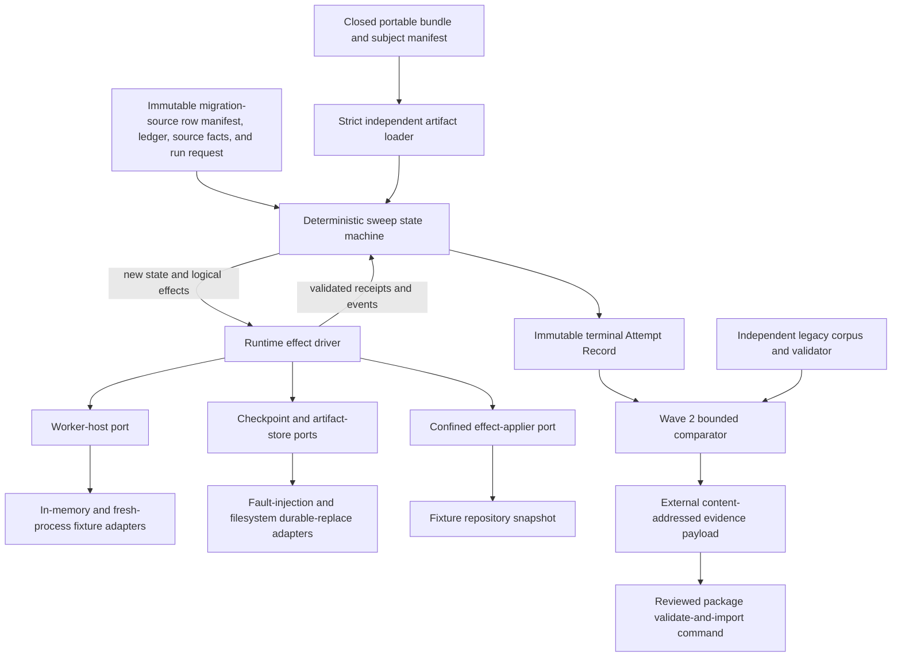
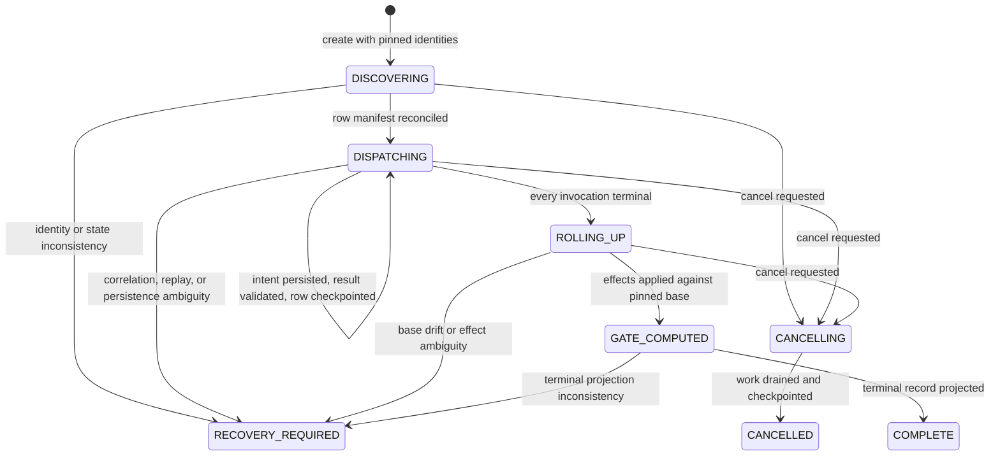
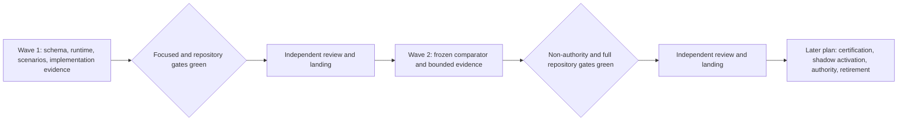

# Audit successor runtime and bounded evidence - Plan

## Goal Capsule

| Field | Contract |
|---|---|
| Objective | Implement an inactive, host-neutral successor for `audit-carried-rows` and `decommission-row-auditor`, then produce scope-explicit offline comparison evidence in a separately reviewed wave. |
| Authority hierarchy | The authored contracts and Migration Ledger state are normative for successor claims; the pinned legacy skills, worker definition, audit corpus, and `crates/ls-trackers/tests/decommission_audit.rs` remain the independent legacy basis; this plan cannot grant operational authority. |
| Execution profile | Two ordered code waves. Wave 1 adds the standalone runtime seam, portable Worker Role bundle, durable checkpoints, and implementation evidence. Wave 2 adds the bounded offline comparator and evidence artifact. Both waves are credential-free and inactive. |
| Stop conditions | Stop if implementation requires reading or importing ignored legacy run state, accessing credentials or a live/paper environment, activating a Runtime Installation, weakening terminal correlation, sharing evaluator code with the legacy oracle, or labeling bounded evidence as global parity or certification. |
| Landing strategy | Land and review Wave 1 before Wave 2 begins. Each wave must be independently green and reviewable; do not combine their diffs or lifecycle claims. If comparison exposes a Wave 1 defect, stop Wave 2, land a separately reviewed Wave 1.x correction, and restart Wave 2 from newly pinned identities. |
| Tail ownership | The executor of this plan owns implementation and verification only. Wave 2 evidence is a required input to a later shadow-activation or certification decision, but activation, authority transfer, retirement, and operational installation require later plans and approvals. |

---

## Product Contract

### Summary

Build the first callable successor behind an inactive repository boundary.
The successor consists of a deterministic audit-sweep coordinator, injected worker and storage ports, a portable `decommission-row-auditor` role bundle, strict result correlation, and recoverable external checkpoints.
After that implementation lands, build a separate read-only comparator that records exactly which frozen offline semantics agree with the independent legacy corpus and which operational dimensions remain unproved.

### Problem Frame

The first semantic migration wave declared the capability and Worker Role but intentionally supplied no executor, scenario catalog, checkpoint runtime, or successor evidence.
The current validators reinforce that declaration-only state by rejecting implemented contracts and every executor, scenario, or successor-evidence reference.
The generic success envelope also lacks the payload needed to enforce the declared row correlation rule, and the generic terminal `AttemptRecord` cannot represent the mutable state of a 26-row concurrent sweep.

The next step must prove that the successor seam can execute and recover without implying that it is installed, certified, active, authoritative, or ready to retire the legacy path.
Full parity is not available in this scope because the old sibling source is unavailable, ignored legacy checkpoints are not imported, no independent legacy dispatch trace exists, and the assurance-rung A3 attended paper-readonly gate is excluded.

### Key Decisions

- **Use two ordered review waves.** Wave 1 implements the inactive successor and Wave 2 generates bounded offline evidence. Combining them would let evidence design conceal executor defects and blur what was reviewed. Governs R1-R3, R24. (session-settled: user-approved — chosen over a combined implementation-and-parity change: separate review preserves truthful lifecycle and evidence boundaries.)
- **Keep the evidence claim narrower than global parity.** Wave 2 may prove agreement only for its complete pinned corpus and named dimensions. It must leave parity and certification unchanged. Governs R22-R24. (session-settled: user-approved — chosen over certifying from offline fixtures: live assurance-rung A3 evidence, legacy-state continuity, and independent dispatch evidence remain outside scope.)
- **Defer every operational authority change.** Runtime Installation, activation, credentials, authority transfer, rollback, retirement, legacy-state import, and the promotion pair stay out. Governs R2-R4, R24.

### Requirements

**Wave and authority boundaries**

- R1. Deliver Wave 1 and Wave 2 as separate ordered change sets with a mandatory review and green-gate boundary between them. If Wave 2 exposes a Wave 1 defect, stop evidence work, land a separate reviewed and green Wave 1.x correction, then re-pin the package lock, implementation subjects, migration-source row manifest, and artifact-set digests before restarting Wave 2.
- R2. Keep the Repository Engineering Package inert, `activation_eligibility = none`, active registries empty, optional host adapters disabled, and all mutable execution state outside `.repository-engineering/`.
- R3. Wave 1 may set both selected contracts to `implemented` only after their callable component, portable Worker Role bundle, closed result validator, scenarios, and digest-bound implementation evidence all exist; certification remains `uncertified`, authority remains `legacy`, and retirement remains `not_started`.
- R4. Keep the two Migration Ledger rows `planned` and `parity_not_proven` with no `parity_reference`; do not change dependency, activation, authority, or retirement rows in either wave.

**Execution semantics**

- R5. A run request must name an explicit attempt ID, idempotency key, package lock, implementation-subject manifest, contract/executor/scenario identities, immutable repository snapshot, migration-source row manifest, ledger inputs, source-availability facts, output root, and positive global concurrency bound; recovery must also pin the caller-observed head or ancestor digest.
- R6. The coordinator must preserve complete migration-source row-manifest reconciliation, the ordered phases `discovering → dispatching → rolling_up → gate_computed → complete`, stable row-manifest ordering, effective behavioral concurrency equal to `min(configured_global_limit, 2)`, and serial roll-up after every invocation is terminal.
- R7. The Worker Role bundle must bind the pinned legacy knowledge, one-row assignment schema, credential-free safety rules, verdict vocabulary, record format, and closed result schema without embedding a host command, agent name, credential, absolute path, or runtime installation.
- R8. Each dispatch must have a fresh worker-instance receipt and a stable logical `assignment_id` equal to the row ID. Uncertain recovery within one attempt retains the original invocation identity; further work requires a child attempt with new attempt and invocation identities while preserving the logical assignment ID.
- R9. Every terminal variant must match the expected attempt and assignment before mutation; a success additionally requires `assignment.row_id = envelope.assignment_id = success.row_id = parsed_record.row_id`, after which the coordinator computes the canonical digest from validated bounded record bytes and verifies the claimed reference.
- R10. Only a validated `succeeded` invocation with a durable matching record completes a row; `held`, `cancelled`, `policy_violated`, `failed`, and `recovery_required` terminate an invocation but leave its row unresolved.
- R11. A successful worker verdict of `unverifiable` completes that row audit, but unresolved rows or an unavailable required source produce capability outcome `held`; a correctly executed NOT-GREEN audit is not capability `succeeded`.
- R12. Identical replay of a terminal result must revalidate and no-op, while a stale, unknown, or conflicting replay must not overwrite state and must end in `recovery_required`.
- R13. Dispatch must be bounded by the configured positive global in-flight limit rather than by an eagerly spawned task set. The validator accepts any positive limit; the state machine requests at most two concurrent invocations, and the driver additionally caps live tasks at the configured limit. Completed results are keyed by row and rolled up in migration-source row-manifest order.
- R14. Cancellation must serialize with result ingestion through a persisted sequence fence, count only results durably accepted before that fence, signal and drain all in-flight work, quarantine every later delivery regardless of claimed completion time, and require a child attempt that carries only validated completed-result capsules.

**Checkpoint and effect safety**

- R15. Use a distinct caller-supplied successor state root and repository snapshot root; the runtime must never discover, read, import, write, or delete `.compound-engineering/runs/audit-carried-rows`.
- R16. Persist assignment intent before dispatch and bind each versioned JSON checkpoint to the attempt lineage, monotonic sequence, phase, implementation subject and package identities, migration-source row-manifest and base-ledger digests, per-row invocation/result-capsule state, cancellation fence, and prepared/applied roll-up effects.
- R17. Write each immutable checkpoint generation once with create-new semantics, then replace only a head pointer containing sequence, generation digest, and parent digest while holding a crash-released exclusive lock across read/validate/transition/publish; never delete the stable lock file, and on ambiguous replacement accept only an exact revalidated old or new head or return `recovery_required`.
- R18. Resume must pin the caller-observed head or ancestor, revalidate the checkpoint chain and every completed result capsule, and reconcile an orphan only when its attempt/assignment/invocation match a persisted dispatch intent and the capsule proves the full common terminal envelope plus receipt. A `succeeded` capsule must additionally prove bounded record bytes/reference and the coordinator-computed digest. A bare record is quarantined; host recovery returns only `never_started`, `running`, `terminal`, or `unknown`, and `unknown` forbids redispatch.
- R19. Treat accepted-result capsule persistence and orchestrator checkpoint persistence as two recoverable steps, not one atomic transaction; workers cannot mutate final records, the ledger, the report, or the gate directly.
- R20. Prepare an ordered roll-up plan whose unique confined entries bind effect ID, relative target, expected-before digest or absence, deterministic after bytes/digest, and base-ledger digest; resume applies `before`, checkpoints an already durable `after`, rejects every other state, never deletes or traverses symlinks, and never synthesizes maintainer acceptance.

**Evidence and portability**

- R21. Bind implementation evidence separately for the capability and Worker Role to an immutable implementation-subject manifest over the executor descriptor, complete portable role bundle, source artifact set, scenario catalog, conformance vectors, and validation basis; exclude evidence references and lifecycle fields from that subject identity.
- R22. Wave 2 must compare a nonempty, complete, digest-bound frozen corpus only for normalized `legacy_observed` semantics and must test successor-only durability, cancellation, correlation, freshness, and confinement as conformance rather than legacy parity.
- R23. The offline evidence payload must bind its schema and comparator policy, deterministic invocation ID, the landed Wave 1 package lock, subject identities, migration-source row-manifest and artifact-set digests, adapter/configuration facts, complete expected and observed row sets, normalized per-case results, exclusions, failures, and cancellations; the importing package command computes its external reference digest over canonical payload bytes.
- R24. A perfect bounded comparison must leave global parity `unproved`, certification `uncertified`, authority `legacy`, retirement `not_started`, the ledger without a parity reference, and all activation surfaces unchanged.
- R25. Both waves must supply positive and negative portable semantic vectors that the standalone runtime consumes without linking `ls-repository-engineering`. The runtime remains audit-specific through this plan and may become a shared successor platform only after a second capability and a production host validate the seam against their requirements.
- R26. All persisted envelopes must use closed, versioned, strict typed decoding with bounded fields and diagnostics; checkpoints and evidence must contain no credentials, raw environment, raw command line, unrestricted stderr, implicit current directory, or wall-clock ordering.
- R27. Add a dedicated standalone-runtime verification path to the existing repository-engineering Make/CI surface and update architecture, context-map, concepts, generated schemas, exact lock, generated-set manifest, and reference documentation without touching SDK or adapter behavior.

### Actors

- A1. **Repository Engineering Package:** Validates authored contracts and evidence references, generates portable projections, and remains incapable of execution or activation.
- A2. **Successor coordinator:** Owns deterministic sweep state, scheduling decisions, correlation, checkpoints, roll-up planning, and terminal outcome projection.
- A3. **Worker host and worker instance:** A caller-supplied adapter starts or recovers one fresh worker invocation and returns a closed terminal envelope; the portable role bundle defines the agent-facing work.
- A4. **Checkpoint and artifact store:** Persists credential-free versioned state and confined artifacts through replace-and-revalidate semantics.
- A5. **Offline comparator:** Reads pinned legacy and successor inputs and may write only its confined evidence output.
- A6. **Maintainer/reviewer:** Reviews the implementation wave before the evidence wave and retains every activation, acceptance, authority, and retirement decision.

### Key Flows

- F1. New inactive sweep
  - **Trigger:** A caller supplies a valid run request and an empty explicit successor state root.
  - **Actors:** A2, A3, A4.
  - **Steps:** Validate every identity and input; persist the initial checkpoint; classify the complete migration-source row manifest; persist assignment intent before each bounded dispatch; ingest and correlate terminal results; persist validated records and checkpoints; prepare and apply confined roll-up effects; compute the gate; project an immutable terminal Attempt Record.
  - **Outcome:** The run ends with a truthful capability outcome and durable evidence while no installation or authority state changes.
  - **Covered by:** R2, R5-R13, R16-R20.
- F2. Crash and resume
  - **Trigger:** Execution stops after any dispatch, record, checkpoint, or effect boundary.
  - **Actors:** A2, A3, A4.
  - **Steps:** Re-open and verify the caller-pinned head chain; revalidate completed result capsules; reconcile only self-correlating capsule orphans; ask the host port to classify uncertain dispatches; resume only before-state effects and checkpoint already durable after-state effects.
  - **Outcome:** The caller observes the old complete generation, the new complete generation, or `recovery_required`; partial state never becomes a fresh run.
  - **Covered by:** R12, R15-R20.
- F3. Durable cancellation
  - **Trigger:** A cancellation request arrives before terminalization.
  - **Actors:** A2, A3, A4.
  - **Steps:** Serialize cancellation with ingestion; persist the sequence fence; stop dispatch; signal each in-flight invocation; count only results already durably accepted; quarantine all later deliveries; drain all work; persist the cancelled terminal record.
  - **Outcome:** No background work survives the run. A child attempt retains the parent link, semantic subject identities, and only validated completed-result capsules while allocating new invocation identities for unresolved rows.
  - **Covered by:** R10, R14, R16.
- F4. Bounded offline comparison
  - **Trigger:** Wave 1 is reviewed and its identities plus the frozen legacy corpus are pinned.
  - **Actors:** A1, A5, A6.
  - **Steps:** Validate the independent legacy corpus and frozen migration-source row manifest; run successor cases over identical normalized inputs; run successor-only conformance cases; require a nonempty complete case set; render one deterministic scope-explicit artifact; verify normative lifecycle inputs are byte-identical before and after.
  - **Outcome:** Reviewers receive bounded evidence without a parity, certification, activation, authority, or retirement transition.
  - **Covered by:** R1, R21-R25.

### Acceptance Examples

- AE1. Successful row correlation
  - **Covers:** R8-R10.
  - **Given:** Assignment `L4`, the expected attempt, and a durable record whose parsed `row_id` is `L4`.
  - **When:** A success envelope carries the same assignment, success-payload row, verdict, record reference, digest, and a unique worker-instance receipt.
  - **Then:** The coordinator marks `L4` complete once and persists the correlated record state.
- AE2. Conflicting replay
  - **Covers:** R12, R18.
  - **Given:** `L4` is terminal with a validated `confirmed` record.
  - **When:** The same logical assignment returns a different verdict, record digest, terminal variant, or worker receipt.
  - **Then:** No completed state is overwritten and the attempt becomes `recovery_required`.
- AE3. Crash between record and checkpoint
  - **Covers:** R17-R19.
  - **Given:** A fully correlated accepted-result capsule is durable but the terminal row checkpoint was not acknowledged.
  - **When:** The attempt resumes.
  - **Then:** The capsule and persisted dispatch intent are independently validated and reconciled, while a bare record is quarantined and requires host recovery or `recovery_required`.
- AE4. Poisoned legacy state
  - **Covers:** R15, R26.
  - **Given:** The legacy run-state directory is an unreadable canary and the successor roots are explicit temporary directories.
  - **When:** New, resume, cancellation, and comparison flows run.
  - **Then:** Every flow succeeds or fails for successor reasons, and the injected store/effect ports' recorded open/stat paths prove that the legacy prefix was never inspected or modified.
- AE5. Unavailable old source
  - **Covers:** R10-R11.
  - **Given:** The external source requirement is `unavailable_unproved`.
  - **When:** Each affected Worker Role invocation returns a valid `unverifiable` record and every invocation terminates.
  - **Then:** The records count as completed row audits, the roll-up identifies unresolved evidence, and the capability outcome is `held`.
- AE6. Ambiguous checkpoint replacement
  - **Covers:** R17-R18.
  - **Given:** Replacement succeeds but the supported directory-sync or canonical re-open step reports failure.
  - **When:** The coordinator handles the storage result and then resumes.
  - **Then:** It preserves artifacts, records no acknowledgement, and returns `recovery_required`; a later recovery revalidates which complete generation the pointer names.
- AE7. Bounded comparison agrees
  - **Covers:** R22-R24.
  - **Given:** Every case in the pinned nonempty corpus has equal normalized legacy and successor outcome/blocker semantics.
  - **When:** The comparator writes its evidence artifact.
  - **Then:** The artifact reports agreement for those cases and exclusions while parity, certification, authority, retirement, ledger, and activation bytes remain unchanged.
- AE8. Vacuous or incomplete comparison
  - **Covers:** R22-R24.
  - **Given:** The expected case set is empty, missing one row, contains an extra row, or omits an unexplained difference.
  - **When:** The comparator evaluates completion.
  - **Then:** Evidence generation fails and cannot emit a passing or parity-like verdict.

### Success Criteria

- The inactive successor completes the full offline scenario catalog through both in-memory and one-process-per-assignment fixture hosts.
- Process-level fault injection at every declared checkpoint and effect boundary yields one valid old/new generation or `recovery_required`, never silent reset or last-write-wins; it does not claim device-level power-loss or lost-fsync proof.
- Wave 1 can truthfully project both contracts as implemented while every certification, activation, parity, authority, and retirement signal remains unchanged.
- Wave 2 emits deterministic nonempty evidence and proves by byte comparison that it cannot mutate normative lifecycle or legacy artifacts.
- Wave 2 evidence becomes a required input to a named later shadow-activation or certification decision. It retires uncertainty only for the pinned corpus and compared dimensions; host/model certification, assurance-rung A3 evidence, legacy-state continuity, and old-source reasoning parity remain required separately, and any implementation-subject change invalidates the evidence.

### Scope Boundaries

**Deferred for later**

- Runtime Installation packaging, an operational CLI, activation, `DISABLED/SHADOW/ACTIVE` state, leases, claims, or deployment outside the repository.
- A production Orca, PTY, ACP, or model-provider adapter; pinned agent/model certification; cross-platform descendant-process termination; and operational Version Set minting.
- Credentials, live or paper gateway access, assurance-rung A3 attended evidence, maintainer acceptance events, or any automatic acceptance of `unverifiable` rows.
- Reading, importing, transforming, abandoning, or deleting ignored legacy run state.
- Access to the unavailable sibling old source and parity of agent audit reasoning against that source.
- Authority transfer, rollback, retirement, deletion of legacy skills/agents, or repository decommission.
- `promote-trs`, `promote-tr`, `tr-promoter`, and their run state.
- Treating the audit-specific standalone runtime as a shared successor platform before a second capability and production host validate the seam.

**Outside this plan's identity**

- SDK/TR behavior, LS gateway behavior, the Nautilus adapter, trading strategy execution, or any external mutation.

### Dependencies and Sources

- The declared pair in `.repository-engineering/contracts/capabilities/audit-carried-rows.toml` and `.repository-engineering/contracts/workers/decommission-row-auditor.toml`.
- The pinned legacy skills and role definition under `.agents/skills/audit-carried-rows/`, `.agents/skills/audit-row/`, and `.claude/agents/decommission-row-auditor.md`.
- The frozen migration-source row manifest, record format, 26-record corpus, report, extraction ledger, and independent validator under `docs/migration-source/` and `crates/ls-trackers/tests/decommission_audit.rs`.
- `docs/plans/2026-08-17-1017-feat-repository-engineering-package-foundation-plan.md` and `docs/plans/2026-08-17-1643-feat-first-semantic-contract-migration-wave-plan.md`.
- [Issue #283: Repository Engineering Layer architecture](https://github.com/sunkeunchoi/korea-adapter-sdk-ls/issues/283), [Issue #285: semantic migration and retirement strategy](https://github.com/sunkeunchoi/korea-adapter-sdk-ls/issues/285), and [Issue #286: repository automation boundary](https://github.com/sunkeunchoi/korea-adapter-sdk-ls/issues/286).
- [Rust 1.96 `Command`](https://doc.rust-lang.org/1.96.0/std/process/struct.Command.html), [`OpenOptions::create_new`](https://doc.rust-lang.org/std/fs/struct.OpenOptions.html#method.create_new), [`File::sync_all`](https://doc.rust-lang.org/std/fs/struct.File.html#method.sync_all), and [`rename`](https://doc.rust-lang.org/1.96.0/std/fs/fn.rename.html).
- [Tokio 1.52 `JoinSet`](https://docs.rs/tokio/1.52.3/tokio/task/struct.JoinSet.html), [`spawn_blocking`](https://docs.rs/tokio/1.52.3/tokio/task/fn.spawn_blocking.html), and [`Child`](https://docs.rs/tokio/1.52.3/tokio/process/struct.Child.html).
- [Serde closed-container guidance](https://serde.rs/container-attrs.html), [Schemars Draft 2020-12 settings](https://docs.rs/schemars/1.2.2/schemars/generate/struct.SchemaSettings.html), and [SLSA provenance model](https://slsa.dev/spec/v1.2/provenance).
- `docs/solutions/architecture-patterns/legacy-shadow-enforced-adoption-gate-playbook.md`, `docs/solutions/logic-errors/empty-repull-completing-destructive-heal-destroys-history.md`, `docs/solutions/logic-errors/status-only-gate-is-not-evidence-and-all-over-empty-is-true.md`, `docs/solutions/workflow-issues/shell-script-live-path-needs-stubbed-binary-tests.md`, and `docs/solutions/architecture-patterns/offline-makefile-guard-test-via-real-recipe-shim.md`.

---

## Planning Contract

### Key Technical Decisions

- KTD1. **Create `tools/repository-engineering-runtime/` as a standalone Cargo workspace that consumes one closed portable artifact bundle and never links `ls-repository-engineering`.** A versioned bundle manifest enumerates and digest-binds the complete transitive closure. Before use, the loader recomputes every listed member digest and rejects missing, mismatched, unlisted, absolute, escaping, or symlink-resolved members, unresolved references, and repository-discovery fallback. This keeps execution out of the inert tooling crate and lets a copied bundle run with the source repository poisoned or absent. The root workspace excludes the nested package, while the existing repository-engineering Make/CI entry invokes its locked tests. Governs R2, R25, R27.
- KTD2. **Split the deep runtime module into a deterministic sweep state machine and an effect-driving shell.** The state machine consumes validated events and returns new semantic state plus logical requested effects. The driver persists effect intent, invokes host/storage/effect ports, and feeds validated receipts back as events. Only the driver sees Tokio, subprocesses, paths, environment, clocks, or storage handles. An in-memory/fault adapter and a one-process-per-assignment fixture adapter make the seams observable. Governs R5-R20.
- KTD3. **Define implemented per contract type as a callable inactive component, not a runnable installation.** Capability implemented means the state machine and driver can execute the complete portable protocol through their ports. Worker Role implemented means the closed self-contained bundle is materialized in a fresh process, receives the real assignment, and returns output accepted by the real validator. Fixture evidence must exercise that bundle and protocol rather than inject canned coordinator-side verdicts. Neither state proves reasoning quality, old-source parity, host/model certification, or assurance-rung A3 safety. Governs R2-R4, R7, R21.
- KTD4. **Use closed audit-specific assignment and success payloads instead of generic JSON.** Extend the common terminal envelope with attempt, invocation, assignment, and worker-instance identity, then make the audit success payload carry row ID, verdict, and record artifact/digest. Every non-success variant keeps the common correlation fields. This repairs the current unenforceable contract without introducing arbitrary payload maps. Governs R7-R12, R25-R26.
- KTD5. **Keep mutable sweep checkpoints separate from immutable terminal Attempt Records.** Each complete JSON generation is create-new and immutable; only a small compare-and-revalidate current pointer is replaced. Starting a new run and recovering an existing run are distinct operations, so missing recovery state never becomes an empty run. Governs R15-R20.
- KTD6. **Treat checkpoint publication as a platform storage protocol with a caller-pinned chain.** The v0 adapter accepts only a single-host trusted Unix local filesystem that provides same-filesystem replacement, supported directory sync, and crash-released locking; network, distributed, and overlay filesystems are unsupported and fail before mutation. The adapter owns the stable lock, immutable generations, same-directory temporary head creation, file sync, replace, supported directory sync, and canonical re-open. Ambiguous replacement is accepted only after exact old/new head revalidation. A caller-observed head or ancestor detects rollback within the chain; rollback of the entire state root and device-level power-loss durability are otherwise outside the guarantee because no local file protocol or process fault harness can prove them alone. Governs R5, R17-R18.
- KTD7. **Use bounded task ownership and serialized cancellation in the runtime driver.** Keep the `JoinSet` population at or below the explicit positive in-flight limit, wait before adding work, never use an unbounded result queue, and drain every task after cancel or abort. A future production process adapter must implement `cancel_and_reap`; the fixture adapter is descendant-free because Tokio can reap a direct child but cannot portably kill an arbitrary process tree. Governs R13-R14.
- KTD8. **Persist assignment intent before host dispatch and accept at-least-once terminal delivery through immutable result capsules.** One attempt has at most one invocation per row; uncertain recovery retains that invocation, while further work requires a child attempt with new invocation identities. Logical assignment identity remains the row ID across the lineage. Identical replay is safe, conflicting replay is inconsistent state, and recovery accepts only a self-correlating capsule plus its dispatch intent. Governs R8-R12, R16-R19.
- KTD9. **Prepare roll-up effects from the pinned base state before applying them.** The executor stores an ordered effect plan and checkpoints each confined idempotent application; it cannot silently recompute over a changed ledger or manufacture maintainer acceptance. This preserves the legacy serial roll-up without pretending that record and ledger files form a transaction. Governs R6, R19-R20.
- KTD10. **Keep the legacy oracle and both comparison normalizers independent.** Wave 2 must not extract, link, or share successor evaluator code with `crates/ls-trackers/tests/decommission_audit.rs`, and legacy normalization cannot reuse successor normalization. The comparator includes row coverage, verdict/record semantics, outcome, blockers, roll-up, credential, and path rules while excluding timestamps, temporary paths, scheduling order, and host diagnostics. Governs R22-R24.
- KTD11. **Represent offline agreement as a distinct staged evidence kind that cannot advance lifecycle fields.** The comparator has read ports for pinned inputs and one caller-owned external output. It cannot write `.repository-engineering/`; a reviewed package command validates and imports the immutable payload by external digest. Its typed result says `global_parity_eligible = false`, lists exclusions, rejects empty/incomplete case sets, and has no API for contracts, ledger, registries, certification, authority, or retirement. Governs R21-R24.
- KTD12. **Use strict JSON for runtime state and evidence.** The locked TOML dependency is parse-only, while Serde/JSON already support dependency-minimal closed decoding. Every persisted type denies unknown fields, rejects duplicate/missing/trailing/unsupported data by direct typed deserialization, and uses explicit Draft 2020-12 schemas only as a secondary portable check. Governs R16-R18, R23, R25-R26.
- KTD13. **Keep time and scheduling out of semantic identity.** Monotonic persisted sequences order transitions; stable run/row facts derive assignment and idempotency identity; injected wall clock and invocation IDs are bounded annotations. Reports sort by migration-source row-manifest identity rather than completion order. Governs R5-R6, R8, R16, R23, R26.
- KTD14. **Separate implementation-subject identity from package-release identity.** A generated subject manifest covers executor, role bundle, source set, schemas, scenarios, and conformance vectors while excluding evidence and lifecycle-reference fields. Wave 1 evidence binds that subject; the post-transition package lock binds subject plus evidence. Wave 2 evidence binds the landed Wave 1 package lock; the resulting Wave 2 lock may then bind the imported evidence reference. This avoids self-referential or predecessor evidence. Governs R5, R16, R21, R23.

### High-Level Technical Design

The topology has one semantic core and adapters that can be replaced without changing contract behavior.

The coordinator follows a fail-closed state machine.

The two waves have a hard landing boundary.

These diagrams define module and lifecycle boundaries, not method signatures.

### Implementation Constraints and Sequencing

- The standalone workspace uses Rust 1.96.0 and edition 2021 with exact versions already resolved by the root lock where applicable: Tokio 1.52.3, Serde 1.0.228, and serde_json 1.0.150. Do not add `async-trait`; prefer a statically generic runtime over adapter types whose async operations are `Send`.
- The state machine owns no filesystem path discovery. It uses opaque root-scoped artifact/effect IDs; the driver receives canonical explicit roots and immutable references. Adapters reject absolute, escaping, symlinked, or cross-device replacement paths before access.
- All successor filesystem access flows through the injected store/effect ports. Test adapters record every path opened or inspected so the legacy-state exclusion is observed directly rather than inferred from permission failures.
- Wave 1 confinement covers caller-owned roots on a trusted local filesystem with no hostile concurrent ancestor replacement. Hardened descriptor-rooted operations for an adversarial local filesystem are deferred and must not be implied by path validation.
- The async driver keeps at most the configured number of live `JoinSet` tasks. It records results by stable row ID and drains after cancellation; completion order never changes checkpoints, roll-up, reports, or evidence.
- Do not use `spawn_blocking` for cancellable workers. A filesystem adapter may isolate serialized blocking durability work, but it cannot describe that operation as abortable.
- A future command-based host must clear its environment, restore an explicit allowlist, use a canonical absolute executable, avoid a shell, and redact argv/environment/stderr. The descendant-free fixture process additionally runs in a newly created confined empty working directory with null stdin, byte-bounded stdout/stderr protocol readers, and a per-invocation deadline; timeout or output overflow triggers kill-and-reap. This plan does not claim process-tree cancellation.
- Checkpoint replacement never truncates the canonical file, never places its temporary file under `/tmp`, never locks the inode that will be replaced, and never treats flush, close, or rename alone as a durability guarantee.
- The v0 filesystem durability profile supports only a single-host trusted Unix local filesystem. Network, distributed, overlay, Windows, and hostile-filesystem substrates fail before mutation and require a later adapter and evidence set. Process-kill fault injection verifies declared protocol boundaries but does not claim device-level power-loss or lost-fsync durability.
- Runtime decoding goes directly from bytes to closed typed structs and consumes the complete JSON stream. JSON Schema validation is a portable secondary check with explicit Draft 2020-12 and local in-memory references.
- Limits for one input, total bundle bytes, nesting, vector cardinality, record bytes, checkpoint generations, and diagnostic count must be explicit and tested at the boundary and one over it.
- The output root is credential-free and size-bounded. Diagnostics use stable codes plus escaped logical IDs and paths; they never include raw artifact content, environment, command lines, or unrestricted host output.
- U1-U6 are Wave 1. U7-U8 are Wave 2. U7 cannot start until Wave 1 is reviewed, landed, and used as its pinned baseline.

### System-Wide Impact

- **Workspace topology:** Adds a third Cargo workspace under `tools/repository-engineering-runtime/`; the root and Nautilus workspaces remain independent and unchanged in dependency direction.
- **Repository Engineering Package:** Replaces declaration-only blanket guards with closed state-combination validation and learns digest-bound executor, role-bundle, scenario, implementation-evidence, and bounded-evidence references without gaining execution methods.
- **Portable contract surface:** Adds a closed transitive bundle manifest, implementation-subject manifest, success payloads, checkpoint/evidence schemas, and positive/negative semantic vectors for an independent consumer.
- **Lifecycle meaning:** Capability implemented proves the complete protocol through injected ports. Worker Role implemented proves that the real portable bundle can execute in a fresh process and satisfy the real validator. Neither proves reasoning quality, host/model certification, old-source parity, or assurance-rung A3 safety; generated docs and `CONCEPTS.md` record this distinction.
- **State lifecycle:** Adds external caller-owned successor checkpoints and terminal Attempt Records in tests/fixtures only; no Runtime Installation or repository-owned mutable state exists.
- **Legacy behavior:** Keeps the legacy skill/agent, ignored run state, extraction ledger, report, corpus, and independent validator untouched as authority and comparison inputs.
- **Agent parity:** Humans and future agent hosts receive the same role bundle, assignment, result, checkpoint, evidence, and failure contracts. No human-only execution action or UI-only context is introduced.
- **CI and docs:** Extends the existing repository-engineering check workflow and generated reference page; root SDK/adapter and live-smoke paths remain unaffected.

### Risks and Mitigations

| Risk | Consequence | Mitigation |
|---|---|---|
| `implemented` is read as installed or certified | Premature operational use | Closed lifecycle table, required component evidence, empty active registries, `activation_eligibility = none`, disabled host adapters, generated state banners |
| Fixture workers are mistaken for Worker Role implementation | False successor claim | Require the portable role bundle and closed validator as evidence; fixture-only completion blocks the state flip |
| Evidence refers to the lock that includes itself | Stale or impossible implementation identity | Separate the evidence-free implementation subject from the final package lock; bind Wave 2 to the landed Wave 1 lock |
| Crash recovery silently restarts or overwrites history | Duplicate work or lost evidence | Separate create/recover operations, complete generations, stable lock, replace/revalidate protocol, exhaustive fault injection, `recovery_required` on ambiguity |
| Assignment replay changes an accepted row | Corrupted verdict or record attribution | Four-way success correlation, attempt/invocation checks, digest revalidation, identical no-op, conflict rejection |
| Bounded concurrency still creates unbounded pending tasks | Resource exhaustion or cancellation leaks | Cap the owned task set before spawn, bounded result transport, join/drain every task, migration-source row-manifest-order projection |
| Cancellation leaves descendants running | External mutation after terminalization | Descendant-free fixture adapter now; require `cancel_and_reap` at the port; defer production process-tree semantics |
| Worker and checkpoint writes are treated as one transaction | Orphans or uncertain commits are misclassified | Content-addressed records, intent-before-dispatch, orphan reconciliation, separate checkpoint sequence |
| Roll-up replays over a changed ledger | Wrong re-disposition or gate | Pin base digest, persist prepared effects, apply idempotently, fail on drift, never invent acceptance |
| Successor reads ignored legacy state | Hidden import or dual authority | Separate explicit roots, poisoned canary tests, no discovery/import API, source-level namespace guard |
| Comparison shares code with the legacy oracle | Circular evidence | Preserve the independent Rust test unchanged and duplicate normalization at the comparator boundary |
| Empty or partial corpus passes | Vacuous parity claim | Require exact nonempty case/row-set equality and fail on missing, extra, or unexplained differences |
| Offline agreement is called parity/certification | Lifecycle overclaim | Distinct evidence type, `global_parity_eligible = false`, immutable lifecycle hash checks, no mutation port |
| Checkpoints or diagnostics leak credentials | Repository exposure | Closed credential-free schemas, environment/argv exclusion, sentinel scans, bounded value-free errors |
| Durable replace differs by platform | False power-loss guarantee | Inject platform operation, test ambiguity, document guarantees, defer OS-specific hardening |
| Entire state root is rolled back | A locally valid older head is mistaken for current | Require the caller to pin an observed head or ancestor; state that rollback without an external token is outside the local-store guarantee |
| Trusted-root path checks are read as hostile-filesystem containment | Symlink/ancestor races escape the claimed boundary | Use opaque root-scoped IDs, scope Wave 1 to caller-owned trusted roots, and defer hardened descriptor-rooted operations |
| Standalone runtime drifts from generated semantics | Independent consumer accepts invalid contracts | Portable positive/negative vectors, package identity pinning, Make/CI crosscheck without linking the tooling crate |

### Resolved During Planning

- **Implementation state:** Flip the Worker Role first after its real bundle is materialized in a fresh process and accepted by the real validator, then flip the capability after its implemented worker dependency and full protocol pass validate. A scripted result that bypasses the bundle leaves both states unchanged.
- **Checkpoint format:** Use closed JSON snapshots because the locked TOML dependency is parse-only and JSON permits strict dependency-minimal decoding.
- **Concurrency:** Accept any explicit positive per-run global in-flight limit and define effective invocation concurrency as `min(configured_global_limit, 2)`. Do not encode an arbitrary default into semantic identity.
- **Cancellation:** Initial subprocess tests use descendant-free fixture workers. Production process-tree termination and host certification are deferred.
- **Legacy mutable ledger:** Preserve the existing README policy: the touched-path declaration is semantic, not a knowledge-reference digest. Roll-up tests operate on a pinned fixture copy and never rewrite the committed ledger during this inactive wave.
- **Evidence state:** Wave 2 records scoped agreement in a separate field and artifact type. It does not populate the Migration Ledger's parity reference or advance `EvidenceStatus.parity`.
- **Rollback:** Wave 2 is additive and reverts by removing only its imported content-addressed evidence reference/artifact and regenerating projections. Wave 1 reverts as one coherent set: both state flips, executor/role references, implementation evidence, runtime check, and generated state; validators reject every mixed or dangling rollback state.

---

## Implementation Units

### U1. Open the closed lifecycle and result vocabulary for inactive implementation

- **Goal:** Let the package represent an implemented-but-uncertified legacy-authority pair and enforce the correlation/state facts the runtime will depend on.
- **Requirements:** R2-R4, R8-R12, R21, R25-R26; KTD3-KTD4, KTD12.
- **Files:** `crates/ls-repository-engineering/src/schema.rs`, `crates/ls-repository-engineering/src/validator.rs`, `crates/ls-repository-engineering/src/inventory.rs`, `crates/ls-repository-engineering/src/identity.rs`, `crates/ls-repository-engineering/tests/schema.rs`, `crates/ls-repository-engineering/tests/inventory.rs`, `crates/ls-repository-engineering/tests/authored_package.rs`, and the relevant schema/conformance fixtures.
- **Approach:** Replace the blanket first-slice rejection with a closed state table. Permit only declared + implemented + uncertified + legacy + not-started + inactive when type-correct executor, role-bundle, scenario, and component-evidence references are all present and digest-valid. Add attempt/invocation/assignment/receipt identity and a closed audit success payload to the common terminal model. Add only the digest-bound successor implementation reference shapes needed for Wave 1 while keeping global parity binary and unchanged; bounded-evidence reference shapes remain absent until U8. Extend artifact inventory, identity normalization, confinement, symlink rejection, and no-write-before-validation rules to every Wave 1 reference.
- **Test Scenarios:** Accept the exact inactive implemented combination; reject implemented without each required artifact; reject certified, active, successor-authority, retired, or parity-proven combinations; reject arbitrary payloads and unknown result variants; reject missing or mismatched common terminal identities; reject success without row/verdict/record/receipt; reject stale digests, escaping paths, symlinks, duplicate references, and evidence that claims lifecycle authority.
- **Verification:** Focused schema, inventory, authored-package, identity, and no-write tests pass while the real authored pair remains unported until U6.
- **Dependencies:** None.

### U2. Generate portable executor, role, checkpoint, and conformance contracts

- **Goal:** Give the independent runtime everything needed to validate inputs and outputs without linking the tooling crate.
- **Requirements:** R5, R7-R9, R16, R21, R25-R27; KTD1, KTD3-KTD5, KTD12-KTD14.
- **Files:** `crates/ls-repository-engineering/src/generate.rs`, `crates/ls-repository-engineering/src/lock.rs`, `crates/ls-repository-engineering/src/repository.rs`, `crates/ls-repository-engineering/tests/determinism.rs`, `crates/ls-repository-engineering/tests/cli.rs`, `.repository-engineering/executors/audit-carried-rows.toml`, `.repository-engineering/roles/decommission-row-auditor.toml`, `.repository-engineering/scenarios/audit-carried-rows/implementation.toml`, generated `.repository-engineering/runtime-bundle.json`, `.repository-engineering/implementation-subjects/audit-carried-rows.json`, `.repository-engineering/schemas/v0/`, `.repository-engineering/conformance/v0/`, `.repository-engineering/schema-registry.json`, `.repository-engineering/package.lock.json`, and `.repository-engineering/generated-set.json`.
- **Approach:** Author a host-neutral executor descriptor and portable Worker Role bundle that bind the existing knowledge, assignment/result schemas, record format, and safety policy without naming a process or installation. Generate the complete transitive runtime bundle manifest and the evidence-free implementation subject. Generate explicit Draft 2020-12 schemas plus positive and negative semantic vectors for package binding, strict decode, lifecycle state, terminal correlation, checkpoint identity/transitions, replay, and confinement. Add their identities to the exact lock and generated-set protocol. Keep scenario vectors deterministic, credential-free, and separate from any claim that they were executed.
- **Test Scenarios:** A consumer target with no dependency on `ls-repository-engineering` accepts every positive vector and rejects each negative vector; reordered set-like fields preserve identity; ordered phases and semantic changes alter identity; unknown/duplicate/missing/trailing checkpoint fields fail; generated refs are local; generation is byte-stable; check mode writes nothing; executor and role descriptors contain no command, host, credential, absolute path, or activation field.
- **Verification:** Generator/determinism/CLI tests pass; generate-twice is byte-identical; generated runtime-bundle and implementation-subject identities remain separate and internally consistent; the non-linking consumer target reproduces every vector's expected verdict.
- **Dependencies:** U1.

### U3. Build the deterministic audit-sweep coordinator

- **Goal:** Implement the deep semantic module for migration-source row-manifest reconciliation, dispatch decisions, terminal ingestion, roll-up planning, gate computation, and terminal projection.
- **Requirements:** R5-R14, R16, R18-R20, R26; KTD2, KTD4-KTD5, KTD8-KTD9, KTD13.
- **Files:** root `Cargo.toml` workspace exclusion, `tools/repository-engineering-runtime/Cargo.toml`, `tools/repository-engineering-runtime/Cargo.lock`, `tools/repository-engineering-runtime/src/lib.rs`, `tools/repository-engineering-runtime/src/bundle.rs`, `tools/repository-engineering-runtime/src/model.rs`, `tools/repository-engineering-runtime/src/machine.rs`, `tools/repository-engineering-runtime/src/ports.rs`, `tools/repository-engineering-runtime/tests/bundle.rs`, and `tools/repository-engineering-runtime/tests/machine.rs`.
- **Approach:** Create the standalone workspace and strict closed-bundle loader. The loader confines every member to the copied bundle root, recomputes all manifest-bound digests before decoding, rejects unlisted members, and never discovers a replacement from the repository. Implement a pure typed state machine that accepts validated events and emits new state plus logical effects. Model invocation state separately from row completion, preserve stable migration-source row-manifest order, key accepted results by row, enforce replay/correlation rules, prepare roll-up effects from the base digest, and project an immutable terminal Attempt Record. Keep the driver, async, filesystem, subprocess, wall clock, and diagnostics outside this unit.
- **Test Scenarios:** Empty/duplicate/malformed migration-source row manifests; missing/extra/stale input rows; exact 26-row reconciliation; source unavailable; confirmed/refuted/unverifiable mixtures; all terminal variants; wrong attempt/invocation/assignment/payload/record IDs; reused receipts; identical and conflicting replay; non-vacuous gate success; NOT-GREEN held outcome; base-ledger drift; ordered phases and report rows despite shuffled completion. Mutated, truncated, missing, unlisted, absolute, escaping, and symlink-resolved bundle members fail closed; unresolved references cannot fall back to repository discovery; a complete in-memory sweep succeeds from a copied bundle with the source repository absent and with it present but unreadable.
- **Verification:** Standalone coordinator tests pass through an in-memory port set with no filesystem, environment, network, credentials, or legacy-state access; the runtime completes from a copied generated bundle with the source repository absent or poisoned and without importing the tooling crate; dependency guards prove the core cannot import adapter modules or `ls-repository-engineering`; the root workspace test proves the nested-workspace exclusion where it is introduced.
- **Dependencies:** U2.

### U4. Implement durable checkpoints, artifacts, resume, and confined effects

- **Goal:** Make every state and effect boundary restartable without pretending that multiple files commit atomically.
- **Requirements:** R15-R20, R26; KTD2, KTD5-KTD6, KTD8-KTD9, KTD12-KTD13.
- **Files:** `tools/repository-engineering-runtime/src/adapters/mod.rs`, `tools/repository-engineering-runtime/src/adapters/checkpoint_fs.rs`, `tools/repository-engineering-runtime/src/adapters/artifact_fs.rs`, `tools/repository-engineering-runtime/src/adapters/effect_fs.rs`, `tools/repository-engineering-runtime/tests/support/fault_store.rs`, `tools/repository-engineering-runtime/tests/checkpoint_recovery.rs`, and `tools/repository-engineering-runtime/tests/effect_recovery.rs`.
- **Approach:** Implement immutable create-new result capsules/checkpoint generations, a never-deleted sibling lock, and a replaceable digest-linked head pointer with explicit create versus recover entrypoints. Implement effect entries with unique targets and before/after reconciliation. This unit owns storage and effect primitives only; host recovery and the driver arrive in U5, and their filesystem-backed integration is proven in U6.
- **Test Scenarios:** Inject failure at generation create-new, partial write, file sync, head replace, directory sync, canonical re-open, and cleanup; assert an exact old/new head or `recovery_required`. Cover stale temp files, cross-filesystem temp rejection, chain regression, caller-pinned head mismatch, unsupported/unknown/duplicate/trailing/truncated/oversized JSON, disk-full/permission failures, two orchestrators, capsule-before-head and head-before-acknowledgement crashes, missing/changed capsule, bare-record quarantine, and every before/after/other effect state.
- **Verification:** Recovery tests prove no silent fresh initialization, in-place truncation, last-write-wins, or cross-root access; credential and path sentinels remain unread and unmodified.
- **Dependencies:** U3.

### U5. Drive bounded workers and durable cancellation through injected hosts

- **Goal:** Exercise fresh-worker, backpressure, result, and cancellation behavior without selecting an operational agent platform.
- **Requirements:** R7-R14, R18, R26; KTD2, KTD4, KTD7-KTD8, KTD13.
- **Files:** `tools/repository-engineering-runtime/src/driver.rs`, `tools/repository-engineering-runtime/src/worker_host.rs`, `tools/repository-engineering-runtime/src/bin/fixture-worker.rs`, `tools/repository-engineering-runtime/tests/support/scripted_host.rs`, `tools/repository-engineering-runtime/tests/support/subprocess_host.rs`, and `tools/repository-engineering-runtime/tests/driver.rs`.
- **Approach:** Use a statically generic driver over host and store adapters. Persist each logical effect intent before invocation, keep the owned task set at or below the explicit positive global bound, set effective invocation concurrency to `min(configured_global_limit, 2)`, and feed receipts back to the state machine by row. Permit one invocation per row per attempt. Host recovery reports `never_started`, `running`, `terminal`, or `unknown`; unknown never redispatches. The fixture adapter starts one canonical absolute descendant-free process per assignment with a cleared allowlisted environment, no shell, a newly created confined empty working directory, null stdin, byte-bounded stdout/stderr protocol readers, and a per-invocation deadline. Timeout or output overflow invokes cancel-and-reap. Persist the cancellation sequence fence, call cancel-and-reap, quarantine all post-fence deliveries, and drain every task before terminalization.
- **Test Scenarios:** A configured global limit of one permits at most one invocation; a limit above two still permits at most two; every positive limit is accepted; no hidden queued task growth occurs. Cover fresh receipt per invocation; one process per assignment; cancel before dispatch, while waiting, during work, after result/before checkpoint, and during roll-up; child kill/reap and join errors; panic/transport failure cannot fabricate a verdict; late success cannot resurrect cancelled work. Repository credential canaries, inherited-cwd probes, blocked-input workers, oversized/infinite output, and hung workers prove the subprocess boundary; environment/argv/stderr and credential sentinels never enter state or diagnostics.
- **Verification:** The same coordinator suite passes through in-memory and subprocess fixture hosts; task/process counters return to zero after every terminal outcome; no production Orca/PTY/ACP/model adapter or runtime installation is introduced.
- **Dependencies:** U4.

### U6. Bind implementation evidence and land Wave 1 truthfully

- **Goal:** Prove the capability core and Worker Role bundle are both present, then make only the allowed implementation-state transition.
- **Requirements:** R1-R4, R21, R25-R27; KTD1, KTD3, KTD12, KTD14.
- **Files:** both selected authored contracts, `.repository-engineering/package.toml`, `.repository-engineering/evidence/implementation/decommission-row-auditor.json`, `.repository-engineering/evidence/implementation/audit-carried-rows.json`, `tools/repository-engineering-runtime/tests/end_to_end.rs`, runtime source/scenario references, `crates/ls-repository-engineering` validators/tests/generator, `Makefile`, `.github/workflows/repository-engineering-check.yml`, `ARCHITECTURE.md`, `CONTEXT-MAP.md`, `CONCEPTS.md`, and generated lock/schema/conformance/docs artifacts.
- **Approach:** Run the real 26-row offline scenarios with the generated portable role bundle and closed validator through both fixture hosts, including filesystem-backed resume and cancellation. Generate evidence against the evidence-free implementation subject. Flip the Worker Role first after its bundle test, then the capability after its implemented dependency and protocol test. Generate the final package lock over subject, evidence, and lifecycle state. Require the runtime check through the existing repository-engineering Make/CI surface and review the exact state banner. Leave package activation, active registries, optional adapters, ledger rows, parity reference, certification, authority, retirement, legacy state, and legacy artifacts unchanged.
- **Test Scenarios:** Capability evidence without Worker Role evidence cannot flip the capability; role-bundle evidence without callable coordinator cannot flip the capability; scripted-host evidence that bypasses the portable role bundle or closed validator flips neither; missing/stale source, scenario, schema, or validation-basis digest fails; real-package docs show implemented/uncertified/legacy/inactive; source-unavailable scenario ends held with valid unverifiable row records; byte assertions protect every deferred lifecycle and ledger field.
- **Verification:** All Wave 1 focused and repository gates pass; the diff contains no Wave 2 comparator/evidence implementation; Wave 1 receives independent review and lands before U7 begins.
- **Dependencies:** U5.

### U7. Build the read-only bounded offline comparator

- **Goal:** Compare the complete frozen legacy-observed corpus with successor semantics without sharing evaluator code or gaining mutation authority.
- **Requirements:** R1, R22-R26; KTD10-KTD13.
- **Files:** `tools/repository-engineering-runtime/src/comparison/mod.rs`, `tools/repository-engineering-runtime/src/comparison/legacy.rs`, `tools/repository-engineering-runtime/src/comparison/successor.rs`, `tools/repository-engineering-runtime/src/bin/bounded-audit-comparison.rs`, comparator policy and nonempty case catalog under `.repository-engineering/scenarios/audit-carried-rows/`, `tools/repository-engineering-runtime/tests/comparison.rs`, and side-specific mutation fixtures under `tools/repository-engineering-runtime/tests/fixtures/comparison/`.
- **Approach:** Start from the reviewed Wave 1 identities. Preserve and run `crates/ls-trackers/tests/decommission_audit.rs` as the independent legacy validator. Normalize pinned legacy records/report and successor outputs in separately owned modules for only the `legacy_observed` dimensions, then run successor-only conformance dimensions separately. Give the comparator read-only inputs plus one caller-owned external evidence output and no repository-package writer. Derive deterministic payload identity from pinned inputs and normalized results while excluding any external digest field.
- **Test Scenarios:** Positive gate, missing/extra/malformed/duplicate/stale/wrong-ID rows, credential sentinel, refuted/unverifiable mixtures, maintainer-acceptance fixtures, source gap, ledger drift, differing order/timestamps/temp paths, unexplained semantic diff, empty corpus, partial corpus, and attempted writes outside the evidence root. Mutation tests prove the unchanged legacy oracle catches a legacy-side defect and the independent comparator catches a successor-side defect.
- **Verification:** The independent legacy validator and comparator suites both pass from the Wave 1 baseline; comparator success/failure leaves hashes of contracts, ledger, registries, lifecycle fields, and legacy artifacts unchanged. A successor defect stops Wave 2 and cannot be repaired inside its diff; evidence resumes only after a reviewed Wave 1.x correction and identity re-pin.
- **Dependencies:** U6 plus the reviewed and landed Wave 1 baseline.

### U8. Publish bounded evidence without advancing parity or authority

- **Goal:** Commit one deterministic scope-explicit evidence artifact and project its truthful limits through the package and docs.
- **Requirements:** R4, R21-R27; KTD10-KTD12, KTD14.
- **Files:** content-addressed payload under `.repository-engineering/evidence/bounded/audit-carried-rows/`, the two selected contracts' bounded-evidence references, package validate-and-import command plus schema/validator/inventory/identity/generator tests, generated `.repository-engineering/` artifacts, `docs/reference/repository-engineering-package.md`, and architecture/context documentation if the evidence surface changes their boundary descriptions.
- **Approach:** Generate the immutable payload in a caller-owned external directory only after the exact nonempty expected case set completes. Bind the landed Wave 1 lock and every subject, input, adapter/configuration, normalized result, and exclusion. Introduce the bounded-evidence reference shapes, lifecycle-neutral validation, inventory/identity rules, and conformance fixtures only in this wave. Use the reviewed package command to validate the payload, compute its external digest over canonical bytes, import it at a create-new content-addressed path, attach the distinct bounded-evidence references, and regenerate projections. Assert `global_parity_eligible = false` and leave every global lifecycle field and legacy byte unchanged.
- **Test Scenarios:** Deterministic re-run is byte-identical; missing/extra cases, unexplained differences, stale identities, or excluded required dimensions refuse a passing artifact; perfect agreement cannot satisfy the global parity validator; lifecycle before/after snapshots are byte-identical; generated docs state compared and excluded dimensions without readiness language.
- **Verification:** All Wave 2 focused and repository gates pass; the final diff contains no Wave 1 refactor and receives its own independent review.
- **Dependencies:** U7.

---

## Verification Contract

Run every command without sourcing `.env.*`, credentials, ignored legacy state, or a live/paper gateway.
The implementation may resolve dependencies during its normal build workflow, but all behavioral tests and repository checks must be self-contained and require no network service.

| Gate | Command | Units | Proof |
|---|---|---|---|
| Package-focused tests | `cargo +1.96.0 test --locked -p ls-repository-engineering` | U1-U2, U6, U8 | Closed schemas, lifecycle table, reference validation, identity, generation, and real-package state. |
| Package lint | `cargo +1.96.0 clippy --locked -p ls-repository-engineering --all-targets -- -D warnings` | U1-U2, U6, U8 | Warning-free package changes. |
| Standalone runtime tests | `cargo +1.96.0 test --locked --manifest-path tools/repository-engineering-runtime/Cargo.toml --all-targets` | U3-U8 | Coordinator, adapters, fault matrix, worker lifecycle, comparator, and evidence behavior. |
| Standalone runtime lint | `cargo +1.96.0 clippy --locked --manifest-path tools/repository-engineering-runtime/Cargo.toml --all-targets -- -D warnings` | U3-U8 | Warning-free independent workspace. |
| Independent legacy oracle | `cargo +1.96.0 test --locked -p ls-trackers --test decommission_audit` | U7-U8 | Frozen legacy corpus/report/ledger semantics remain independently green. |
| Projection generation | `cargo +1.96.0 run --locked -q -p ls-repository-engineering -- generate` | U2, U6, U8 | Only the package generator writes schemas, conformance, exact lock, generated-set manifest, and docs. |
| Non-writing package check | `cargo +1.96.0 run --locked -q -p ls-repository-engineering -- check` | U2, U6, U8 | Committed projections match authored inputs without writes. |
| Repository-engineering wrapper | `make repository-engineering-check` | U2-U8 | Existing CI-facing entry checks the inert package and independent runtime without changing deployment authority. |
| Root workspace | `cargo +1.96.0 test --locked --workspace --no-fail-fast` | U1-U3, U6, U8 | Root integration stays green; U3 proves the nested workspace exclusion where it is introduced, while the standalone runtime remains separately covered. |
| Core regression | `cargo +1.96.0 test --locked -p ls-core` | U6, U8 | Required repository gate stays green. |
| Documentation generation | `make docs` | U2, U6, U8 | Metadata and repository-engineering references regenerate coherently. |
| Documentation exactness | `make docs-check` | U2, U6, U8 | Generated docs match committed state. |
| Lane guard | `make lane-check` | U6, U8 | Offline lane safety remains intact. |
| Legacy TODO guard | `make todo-check` | U6, U8 | Queue remains the sole staging location. |
| Diff hygiene | `git diff --check` and exact `git status --short` review | Every unit | No malformed diff, unrelated overwrite, hand-edited generated file, or abandoned experiment. |

`make adapter-check` is not applicable because no planned change reaches `ls-sdk`, `ls-core`, or `adapters/nautilus`.
`make script-check` is not applicable because no adapter script or `calendar-fetch-inputs` input changes.
If implementation expands into either scope, both become mandatory in the documented order.

Wave 1 must pass every applicable gate above before review and landing, with U7-U8 absent.
Wave 2 repeats the complete applicable gate from the reviewed Wave 1 baseline and adds the independent legacy oracle plus before/after lifecycle hashes.
The final `repository-engineering-check` recipe must run the package's non-writing `check` followed by the standalone runtime's locked all-target test command; `.github/workflows/repository-engineering-check.yml` runs that recipe plus both package and runtime clippy commands on every path that can change the bundle, runtime, contracts, scenarios, or evidence.
No live smoke, credential check, sibling-repository access, Runtime Installation action, or behavioral certification command is permitted in this plan.

---

## Definition of Done

- D1. Wave 1 and Wave 2 exist as separate reviewed change sets, and Wave 2 is based on the landed Wave 1 identity.
- D2. `tools/repository-engineering-runtime/` is an independently locked workspace that consumes portable artifacts without linking `ls-repository-engineering` or adding execution to the inert package.
- D3. The deterministic state machine is separated from the effect-driving shell; only the driver touches worker, storage, artifact, clock/ID, cancellation, and effect ports, and host/Tokio details do not enter semantic state.
- D4. The portable Worker Role bundle binds the pinned audit knowledge, one-row assignment, verdict and record format, credential boundary, and closed result rules without a host command or installation.
- D5. Every success enforces four-way row correlation plus attempt, invocation, receipt, and digest validation; every other terminal variant enforces common attempt/assignment correlation.
- D6. Identical replay is idempotent, conflicting or stale replay fails closed, and invocation terminality never masquerades as row completion.
- D7. Dispatch concurrency is exactly the lower of the positive caller limit and two, result ordering is deterministic, cancellation drains all work, and no fixture task or process survives terminalization.
- D8. Create-new JSON generations and their digest-linked head pointer bind every required identity and per-row/effect state; recovery pins an observed head/ancestor and never silently initializes, overwrites, or trusts a partial generation.
- D9. On the declared single-host trusted Unix local-filesystem profile, durable replacement and effect fault tests observe one valid old/new state or `recovery_required` at every process-level boundary; worker record plus checkpoint is never described as one transaction, and the evidence makes no device-level power-loss claim.
- D10. Successor state and fixture effects use explicit confined roots, and poisoned-canary tests prove ignored legacy run state is never read, imported, mutated, or deleted.
- D11. Roll-up uses the pinned base ledger, records prepared/applied effects, preserves serial gate semantics, and never invents maintainer acceptance.
- D12. Both contracts are implemented only after independent capability and Worker Role evidence validates; they remain declared, uncertified, legacy-authority, not-retired, and inactive.
- D13. Active registries remain empty, `activation_eligibility` remains none, optional production host adapters remain disabled/absent, and both ledger rows remain planned with parity not proven and no parity reference.
- D14. The unchanged legacy validator remains an independent oracle; successor code does not import or share its evaluation logic.
- D15. Wave 2 uses an exact nonempty corpus, separates legacy-observed comparison from successor-only conformance, and rejects missing, extra, or unexplained results.
- D16. The bounded evidence artifact binds all subjects, inputs, configuration, results, exclusions, failures, cancellations, and hashes and explicitly sets `global_parity_eligible = false`.
- D17. Perfect bounded agreement leaves parity, certification, activation, authority, retirement, the Migration Ledger, and legacy artifacts byte-identical.
- D18. Generated schemas, semantic vectors, exact lock, generated-set manifest, reference docs, architecture docs, Make target, and CI describe the implemented but inactive boundary truthfully.
- D19. Every required gate passes without credentials, live/paper access, ignored-state import, sibling-source access, or external mutation.
- D20. The final diffs preserve the user's unrelated untracked files and contain no abandoned experimental code, hand-edited generated output, or cross-wave changes.
- D21. The runtime passes from a copied closed bundle with the source repository unavailable or poisoned, and unresolved transitive references cannot fall back to repository discovery.
- D22. Implementation and bounded evidence follow the acyclic subject → evidence → final-lock identity graph; imported evidence is content-addressed and no artifact hashes a field containing its own digest.
- D23. Wave 2 can revert by removing its additive evidence references/artifacts and regenerating, while Wave 1 reverts only as one coherent contract/runtime/evidence/generated-state set; validators reject all mixed rollback states.

## Deferred / Open Questions

### From 2026-08-18 review

- **Implemented state may overclaim audit capability** — Product Contract — R3 implementation transition and Success Criteria (P0, adversarial-document-reviewer, confidence 75)

  Later activation work could inherit an implemented lifecycle claim even though no successor has independently audited a real row. The fixture path proves bundle loading, process isolation, terminal correlation, and schema-valid output, but it does not interpret the audit knowledge or demonstrate audit reasoning. Decide whether protocol-complete fixture execution is sufficient for implemented status or whether the Worker Role must remain unported until a real offline evaluator exists.

- **Roll-up cancellation cutover remains undefined** — F3 — Durable cancellation / U5 — Drive bounded workers (P1, feasibility-reviewer, confidence 75)

  Cancellation after one roll-up effect becomes durable could leave a partially mutated repository snapshot that a child attempt cannot reconcile. Child attempts retain completed-result capsules but not the parent's prepared or applied effect state. Decide whether cancellation is rejected after the effect cutover, finishes the prepared plan, or transfers effect state into recovery.
