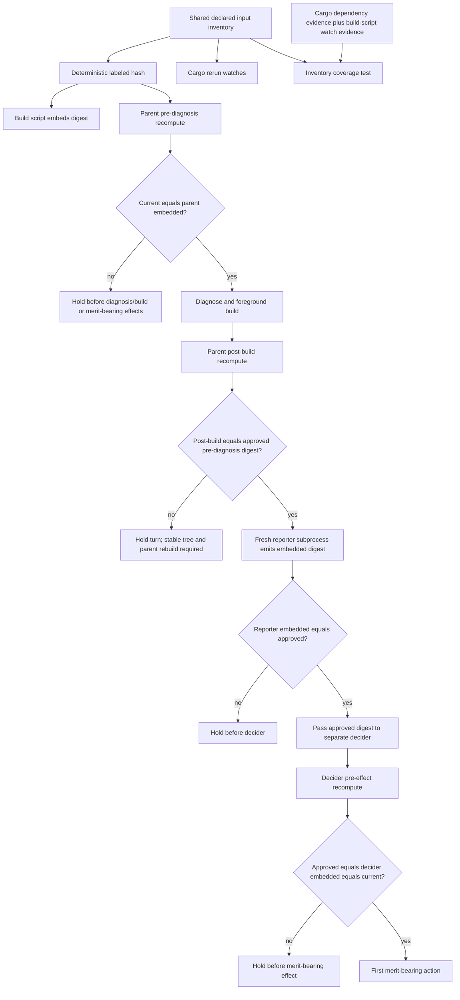

# Root SDK/Core Fingerprint Closure - Plan

## Goal Capsule

Make the lab binary's embedded source fingerprint change whenever an authoritative root-workspace SDK/core input capable of changing that binary changes. Build-time embedding, runtime recomputation, Cargo rebuild watches, and the governed parent/child freshness checks must all consume one declared input inventory so they cannot drift into a false-green verdict.

This plan closes only the root `ls-sdk`/`ls-core` prerequisite. Extending the fingerprint to the adapter's `nautilus-ls` source and the calendar crate remains the next queue item.

---

## Product Contract

### Problem

`adapters/nautilus/lab/fingerprint_core.rs` currently hashes `adapters/nautilus/lab/src/**` and `adapters/nautilus/lab/Cargo.toml`. The lab binary also compiles against root path dependencies `crates/ls-sdk` and `crates/ls-core`, including metadata embedded by `crates/ls-core/build.rs`. A change on that root path-dependency axis can therefore leave the embedded digest unchanged and let the governed strategy path accept a stale binary.

The same fingerprint also has two lifecycle gaps: Cargo watch declarations are separate from the hash input set, and the governed parent reuses the pre-build digest after a foreground build. Those gaps can preserve a stale verdict even after the root closure is enumerated.

### Requirements

- **R1 — Root SDK/core closure:** The fingerprint changes for any content, membership, or build-resolution change in the declared root SDK/core closure: lab sources and manifest; fingerprint machinery; root workspace manifest; `ls-sdk` sources and manifest; `ls-core` sources, manifest, and build script; `metadata/error-catalog.yaml`; `metadata/constraints/**`; and the standalone adapter workspace manifest, lockfile, and Rust toolchain declaration.
- **R2 — One inventory:** Build-time embedding, runtime recomputation, and Cargo rerun watches derive from one shared, typed inventory. No consumer maintains a second path list.
- **R3 — Deterministic and relocatable digest:** The digest is based on stable logical labels and relative paths, not absolute checkout paths or filesystem enumeration order. File, directory, and entry boundaries are unambiguous.
- **R4 — Fail-closed inputs:** A declared input that is missing, unreadable, the wrong type, a symlink, or another special node prevents a trusted fingerprint verdict. Duplicate logical labels, duplicate normalized physical paths, and overlapping file/tree declarations are rejected.
- **R5 — Governed lifecycle freshness:** One parent-approved digest is pinned across the pre-diagnosis tree, the parent binary, the post-build tree, a fresh reporter binary, and the decider binary. The decider recomputes immediately before its first merit-bearing effect. A mutation observable at any validation boundary halts before strategy side effects; the remaining filesystem change after the final read is an explicit TOCTOU residual because this workflow does not own a repository-wide mutation lock.
- **R6 — Compatibility:** Preserve the external environment constant `LAB_SRC_FINGERPRINT`, CLI output `fingerprint: <hex>`, and persisted field `lab_src_fingerprint`; update nearby descriptions to state that the value represents the declared lab build-input fingerprint.
- **R7 — Closure coverage proof:** An automated coverage test compares the declared root local-source inventory with Cargo's repository-local dependency evidence and compares its non-source entries with the root core build script's emitted rebuild-watch paths. A synthetic undeclared source or build-script input must make the checker fail, so a newly compiled or embedded root input cannot silently remain outside the fingerprint.
- **R8 — Truthful boundary and handoff:** Adapter `nautilus-ls` source, calendar source, `adapters/nautilus/nautilus-ls-calendar/Cargo.toml`, root `Cargo.lock`, generated target output, dev-only dependencies, and ambient build configuration remain outside this prerequisite and are proven or documented as explicit residuals. Root `Cargo.lock` is a valid negative control only while governed lab builds resolve exclusively through the standalone adapter workspace, whose manifest, lockfile, and toolchain declaration are covered by R1. Documentation and queue state explicitly preserve the later adapter/calendar extension and the separate morning-preflight manifest residual.

### Key Decision

- **KD1 — Close the root path-dependency blind spot before broadening the adapter fingerprint.** `session-settled: user-approved` · Governs R1, R5, R8. This deliberately lands the prerequisite as its own bounded change. Bundling the later `nautilus-ls`/calendar extension would obscure whether the current cross-workspace false-green was actually removed and would enlarge the operational change before its foundation is certified.

### Acceptance Signals

- Changing one byte in every declared input class changes the recomputed digest and makes an older governed binary refuse before diagnosis/build or merit-bearing strategy effects.
- Adding, removing, or renaming a file in any declared tree—lab sources, `ls-sdk` sources, `ls-core` sources, or `metadata/constraints/**`—changes the digest.
- Modifying any declared input and rebuilding without cleaning recompiles the lab binary and makes its embedded digest equal the runtime-recomputed digest.
- The same fixture tree at two absolute paths produces the same digest.
- A mutation during the foreground build makes the post-build digest differ from the pre-diagnosis approved digest and halts before child interrogation; a later mutation is caught by the decider's pre-effect validation.
- Mutating adapter source, calendar source, or root `Cargo.lock` does not change this prerequisite digest.
- The standalone adapter workspace gate passes.
- The governed build launches from the standalone adapter workspace; a root-workspace build cannot satisfy the governed build-location check.

### Out of Scope

- Hashing `adapters/nautilus/src/**`, `adapters/nautilus/nautilus-ls-calendar/src/**`, or `adapters/nautilus/nautilus-ls-calendar/Cargo.toml`.
- Connecting `LAB_SRC_FINGERPRINT` to the shell freshness preflight or adding a comparison CLI for `session-morning.sh`.
- Fixing the shell preflight's omission of `crates/ls-sdk/Cargo.toml` and `crates/ls-core/Cargo.toml`; that residual is queued separately.
- Hashing generated artifacts under any `target/` directory or the root workspace `Cargo.lock`.
- Fingerprinting ambient build configuration such as compiler flags, alternate Cargo profiles or features, and command-line toolchain overrides; the governed path's fixed build invocation is the operational control for those inputs.
- Changing the fingerprint's compatibility names or its persisted schema.

---

## Planning Contract

### Context and Research

The plan follows the repository's established build/runtime parity pattern in `docs/solutions/design-patterns/build-runtime-hash-parity-via-shared-include.md`: the build script and runtime include the same dependency-light implementation. It extends that pattern from a shared hash loop to a shared inventory because two callers sharing an algorithm can still drift when their path lists differ.

Cargo's generated dependency file for `lab-research` confirms that the binary reaches root `ls-sdk`, root `ls-core`, the core build script's metadata inputs, adapter source, and calendar source. This prerequisite selects the root SDK/core subset required by KD1, then supplements Cargo's source-file evidence with build-resolution inputs Cargo dependency files do not reliably enumerate: manifests, the standalone workspace lockfile, and the pinned toolchain.

The repository learnings materially shape the boundaries:

- `docs/solutions/architecture-patterns/runtime-consuming-repo-root-metadata-build-embed-and-dual-registry.md` requires source-of-truth metadata to be represented in both build invalidation and runtime certification.
- `docs/solutions/architecture-patterns/gate-over-diff-inherits-diff-scope-blind-spot.md` requires the closure test to inspect what is compiled rather than trust a hand-maintained touched-file scope.
- `docs/solutions/workflow-issues/cross-workspace-gate-blind-spot-sdk-preflight-changes-redden-adapter.md` requires `make adapter-check` because root SDK/core changes reach the standalone adapter even though root `cargo test` does not.
- `docs/solutions/conventions/coverage-only-change-is-verified-by-mutation-not-by-the-gate.md` requires mutation-based proof for the newly covered classes; a green unchanged tree is not evidence that the closure moved.
- `docs/solutions/workflow-issues/first-run-of-a-new-guard-prove-the-binary-then-discharge-its-residual.md` requires documentation to state what the widened fingerprint certifies and what remains outside it.

External research is unnecessary: the behavior and failure mode are directly observable in the repository's Cargo graph, generated dependency evidence, and existing governed-run tests.

### Key Technical Decisions

- **KTD1 — Model inputs as one typed, labeled inventory.** The shared core owns both inventory construction and hashing. Entries distinguish files from directory trees, carry stable repo-relative logical labels, and are projected into build watches. This removes the current three-way drift risk between embedding, recomputation, and rerun declarations. Governs R1–R4.
- **KTD2 — Include authoritative sources and resolution inputs governing the selected root SDK/core closure, not outputs.** The root closure includes the root `Cargo.toml`, standalone adapter `Cargo.toml`, adapter `Cargo.lock`, and adapter `rust-toolchain.toml` because they control the selected root crates' compilation and resolution; it includes the core build script's metadata sources because their generated values enter the binary. It excludes generated `target/` output and the root lockfile because the standalone adapter workspace resolves from its own lock. Adapter/calendar package sources and the calendar package manifest remain explicitly deferred under KD1, so this is not a claim of complete binary resolution coverage. Governs R1, R8.
- **KTD3 — Hash logical namespace, node kind, relative path, and bytes with explicit boundaries.** Sorting occurs on logical paths before hashing, and the serialization distinguishes files, directories, empty trees, and entry boundaries. This prevents absolute-worktree instability, enumeration-order instability, and collisions between identically named paths in different roots. Governs R3.
- **KTD4 — Reject ambiguous filesystem nodes and identities.** The traversal accepts only declared regular files and directory trees of regular files/directories. Symlinks and special nodes fail rather than escape the repository closure, introduce cycles, or certify a platform-dependent target. Duplicate normalized physical paths and overlapping file/tree declarations fail even when their logical labels differ, keeping the certification boundary unambiguous. Governs R4.
- **KTD5 — Fix the production trust root and inject fixture roots only in tests.** Build-time and merit-bearing runtime callers resolve the identical inventory from the compiled manifest anchor; an environment variable cannot redirect production certification to an arbitrary tree. Unit tests call the shared logic with an injected fixture root. Process-boundary tests self-spawn a dedicated integration-test helper mode that calls the same parent and decider implementations with an explicit fixture root; production entry points do not compile or accept that redirecting interface. Governs R2, R3, R7.
- **KTD6 — Pin one authorization digest across diagnosis, build, reporter, and decider.** Before diagnosis, the parent requires `current == parent embedded` and records that value as approved. After the foreground build it recomputes and requires `post-build == approved` before launching a reporter; a changed tree holds the turn even if Cargo built it consistently. A later turn cannot pass the pre-diagnosis gate until the tree is stable and the parent binary is rebuilt. The reporter's embedded value must equal approved. The parent passes approved into the separate decider invocation, which requires `approved == decider embedded == current` immediately before its first merit-bearing action. This closes observable during-build and parent-to-decider windows without pretending to provide a repository-wide lock. Governs R5.
- **KTD7 — Treat Cargo dependency and rebuild-watch evidence as coverage oracles, not the runtime inventory.** Integration tests read the built lab binary's dependency file to discover repository-local `crates/**` sources and inspect the root core build script's emitted rebuild-watch paths to discover non-source build inputs. Explicit checks cover manifests, lockfile, and toolchain classes those oracles omit. Production behavior stays deterministic and independent of generated build output. Governs R7.
- **KTD8 — Preserve compatibility names as historical labels.** Existing machine-readable and persisted identifiers remain stable; human-facing comments and documentation define their widened meaning. Governs R6.

### High-Level Technical Design

This sketch is an architectural constraint, not implementation syntax.

### System-Wide Impact

- **Build invalidation:** `adapters/nautilus/lab/build.rs` emits rerun watches for every inventory entry, including directories so additions, removals, and renames invalidate the embedded value. Invalid inventory state is a build error rather than a partial digest.
- **Runtime resolution:** `adapters/nautilus/lab/src/fingerprint.rs` exposes the embedded value and recomputes from the compiled repository anchor. The old process-level two-path override surface is replaced by a test-only fixture-root seam that cannot redirect a merit-bearing run.
- **Governed control flow:** `adapters/nautilus/lab/src/runner/governed.rs` pins the pre-diagnosis digest, rejects a changed post-build tree, validates a distinct reporter subprocess, and passes the approved digest into the decider. The decider validates before configuration, prior-run reads, stage logging, runtime creation, or `turn`; every mismatch uses the existing HELD/stale path before merit-bearing side effects. Startup scrub/calendar output that precedes governed dispatch is non-merit-bearing.
- **Compatibility:** scripts, persisted reports, and child output continue to see the existing names and line format from R6.
- **Cross-workspace validation:** all implementation and integration tests run in the standalone adapter workspace; the root workspace remains unaffected except as a fingerprinted source.
- **Queue lifecycle:** the blocked `build-rs-fingerprint-nautilus-ls` entry is superseded through `lab-next`, not edited by hand, with a successor that records this prerequisite as satisfied and retains the later adapter/calendar extension.

### Risks and Mitigations

- **False confidence from an incomplete inventory:** Mitigate with Cargo dependency evidence, build-script rebuild-watch evidence, explicit resolution complements, per-class mutations, and negative controls that make the intended boundary executable.
- **Digest churn from machine-specific paths or traversal order:** Mitigate with KTD3 and a relocated-fixture equality test.
- **Symlink escape or recursive traversal ambiguity:** Mitigate with KTD4 and explicit failure tests.
- **Cargo rebuild loop or missed directory membership change:** Derive watches from the inventory and test the projection itself; never watch generated output.
- **Operational false red from transient mutation:** The governed path intentionally fails closed. Its error names the changed inventory class without printing file contents or credentials, and the operator rebuilds/retries only after the tree stabilizes.
- **Final-read TOCTOU:** A repository mutation after the decider's last fingerprint read is not preventable without a shared writer lock the repository does not have. Mitigate by placing validation immediately before the first merit-bearing action and document the guarantee as boundary-observable rather than atomic.
- **Ambient build configuration:** Compiler flags, profiles, features, and command-line toolchain overrides are not file inventory entries. Keep the governed build invocation fixed; a caller-selected build shape remains outside this prerequisite's certification boundary.
- **Scope drift into the later adapter/calendar work:** Negative controls and queue handoff preserve KD1's boundary; documentation must not claim full binary dependency closure.

### Resolved During Planning

- The adapter workspace `Cargo.toml`, `Cargo.lock`, and `rust-toolchain.toml` are included as build-resolution inputs even though adapter source is deferred.
- `metadata/error-catalog.yaml` and `metadata/constraints/**` are included because `crates/ls-core/build.rs` embeds their authoritative values.
- The root `Cargo.lock` remains excluded because this standalone build resolves with `adapters/nautilus/Cargo.lock`.
- The calendar package manifest remains deferred with calendar source; including the adapter workspace resolution shell does not certify every package in that workspace.
- Missing or ambiguous inputs fail closed; permissive skipping would recreate the false-green class.

### Deferred Follow-Ups

- Extend the inventory to adapter `nautilus-ls` and calendar source after this prerequisite is certified.
- Decide and implement how the shell freshness preflight consumes the embedded fingerprint.
- Add `crates/ls-sdk/Cargo.toml` and `crates/ls-core/Cargo.toml` to the shell preflight's extra freshness inputs; its current source list is not a complete closure.

---

## Implementation Units

### U1 — Shared root SDK/core inventory, hash, and rebuild projection

**Traces:** R1, R2, R3, R4, R6, R7, R8; KTD1–KTD5, KTD7, KTD8

**Files:**

- `adapters/nautilus/lab/fingerprint_core.rs`
- `adapters/nautilus/lab/build.rs`
- `adapters/nautilus/lab/src/fingerprint.rs`
- `adapters/nautilus/lab/Cargo.toml`
- `adapters/nautilus/lab/src/runner/research.rs`
- `adapters/nautilus/lab/tests/fingerprint_closure.rs` (new)
- `adapters/nautilus/lab/tests/support/fingerprint_fixture.rs` (new shared test support)

**Approach:** Replace the source-directory-plus-manifest function boundary with the shared root-relative inventory. Keep hashing dependency-light so `build.rs` and runtime can continue including the same file. Make inventory validation, deterministic traversal, logical labeling, hashing, and watch projection facets of the same model. Preserve the public compatibility surfaces while correcting their descriptions.

The integration test lexically normalizes the built `lab-research` dependency file, classifies repository-local inputs, filters to KD1's root `crates/**` subset, and explicitly subtracts documented adapter/calendar and generated-output exclusions. It uses that evidence as an independent oracle for root crate sources. It separately captures the root core build script's emitted rebuild-watch paths and requires every repository-local non-source path to be covered by the inventory. Manifests, the adapter lockfile, and the toolchain remain explicit complements because neither oracle owns them. Neither generated evidence source becomes production runtime input. The shared fixture helper constructs a complete synthetic repository closure for both U1 and U2 tests.

**Test scenarios:**

- Production inventory recomputation equals the build-embedded digest on an unchanged tree.
- Table-driven one-byte mutations change the digest for lab source, lab manifest, lab build script, fingerprint core, SDK source/manifest, core source/manifest/build script, root manifest, adapter workspace manifest/lock/toolchain, error catalog, and a constraint YAML.
- File addition, removal, and rename in each declared tree—lab sources, SDK sources, core sources, and constraints metadata—each change the digest.
- Mutating each declared input class followed by an ordinary incremental build, without cleaning, recompiles the lab binary and makes its embedded digest equal runtime recomputation.
- Reordered inventory declarations and directory enumeration yield the same digest; copying a fixture to a different absolute path yields the same digest.
- Duplicate labels, duplicate normalized physical paths, overlapping declarations, missing inputs, file/directory type mismatches, unreadable nodes, symlinks, and special nodes return an error rather than a digest.
- The watch projection exactly covers all declared entries and has no independent extras.
- Cargo dependency evidence finds no selected root `crates/**` source outside the appropriate declared directory entries and confirms each declared inventory root appears as a Cargo watch dependency.
- A synthetic dependency file with an extra `crates/new/src/lib.rs` proves the coverage checker turns red rather than merely accepting the current graph.
- Synthetic build-script watch evidence with an undeclared repository-local data input proves the non-source coverage checker turns red.
- Mutating adapter source, calendar source, the calendar package manifest, root `Cargo.lock`, generated output under a `target/` directory, or `crates/ls-sdk-test-support/**` leaves the digest unchanged.

**Verification outcome:** The embedded value, runtime recomputation, watch list, and coverage oracle agree on one explicit root SDK/core boundary, including membership changes and failure modes.

### U2 — Close governed parent/build/child mutation windows

**Depends on:** U1

**Traces:** R4, R5, R6; KTD5, KTD6, KTD8

**Files:**

- `adapters/nautilus/lab/src/runner/governed.rs`
- `adapters/nautilus/lab/src/runner/research.rs`
- `adapters/nautilus/lab/tests/governed_cli.rs`
- `adapters/nautilus/lab/tests/support/fingerprint_fixture.rs` (shared with U1)

**Approach:** Resolve the production inventory from the fixed compiled anchor and require the governed build to run from the standalone adapter workspace. Retain the early stale-parent refusal and record its digest as the sole approval for the turn. After a successful foreground build, recompute and hold immediately if the tree differs from that approval; do not invoke the fingerprint reporter in that case. Validate the reporter subprocess, then pass the approved digest into the distinct decider subprocess. Production subprocesses remain anchored to the compiled repository. Integration tests self-spawn a helper mode in the test executable that invokes the same parent and decider implementations with an explicit fixture root, preserving process timing without exposing a production override. Make the decider's three-way approval/embedded/current check the first action inside governed child handling, before configuration, prior-run reads, stage logging, runtime creation, or `turn`. Route every inventory error and mismatch through the existing held/stale control flow.

**Test scenarios:**

- Mutating an SDK/core source, a declared manifest or lockfile, or embedded metadata makes a stale governed parent halt before invoking diagnosis/build side effects.
- A build stub that mutates a declared input after the parent's first check makes pre- and post-build digests differ; the parent holds before invoking the reporter or decider even if the build incorporated the mutation.
- A wrapper invokes the integration-test helper subprocess to report the fixture digest, mutates the complete fixture after reporting, then invokes the helper's decider mode against the same shared implementation. The decider returns `StaleBinary`, with no stage-log, trial, or runtime-creation side effects.
- A production-anchor test proves the ordinary `lab-research` entry point ignores the removed path overrides and cannot be redirected to the fixture tree.
- A build-location test proves governed foreground builds use the standalone adapter workspace and reject a root-workspace invocation.
- A fresh unchanged tree completes the existing parent-to-child handoff without altering output compatibility.
- A missing, wrong-type, or symlinked declared input produces HELD and no strategy flip.

**Verification outcome:** The same approved digest spans diagnosis, build, reporter, and decider, and no tested observable mutation window can carry unapproved code into a merit-bearing strategy action.

### U3 — Document the certified boundary and hand off residual work

**Depends on:** U1, U2

**Traces:** R6, R8; KD1, KTD8

**Files:**

- `docs/solutions/design-patterns/build-runtime-hash-parity-via-shared-include.md`
- `queue/items.jsonl` (changed only through `lab-next`)

**Approach:** Update the solution to distinguish shared hashing from the stronger shared-inventory guarantee, replace its obsolete warning that `fingerprint_core.rs` must stay outside the hash, list the newly certified root SDK/core boundary, and state the excluded adapter/calendar and shell-preflight residuals. After focused tests and `make adapter-check` pass, use `lab-next` to add the adapter/calendar successor first, then supersede `build-rs-fingerprint-nautilus-ls` by that existing successor; add or preserve a distinct follow-up for the shell preflight's missing root manifests. Do not hand-edit queue JSONL.

**Test expectation:** None for prose. Queue behavior is verified through the queue CLI and repository gates.

**Verification outcome:** Operators and future agents cannot mistake this prerequisite for full adapter dependency closure, and the next work remains discoverable through `make next`.

---

## Verification Contract

### Focused Checks

- `cd adapters/nautilus && cargo test -p nautilus-ls-lab --test fingerprint_closure`
- `cd adapters/nautilus && cargo test -p nautilus-ls-lab --test governed_cli`
- `cd adapters/nautilus && cargo test -p nautilus-ls-lab fingerprint`

The mutation matrix is load-bearing: for each newly covered class, the test must first demonstrate equality on the unchanged fixture, then mutate only that class and demonstrate inequality or a fail-closed result. A green production tree alone does not certify coverage.

### Repository Gates

- `make adapter-check`
- `make docs-check`
- `make todo-check`
- `make next`
- Inspect the queue's all-items view through `lab-next` and confirm the old item's `superseded_by` target plus both residual successor entries.

`make script-check` is not required because this plan does not change `adapters/nautilus/scripts/**` or `calendar-fetch-inputs`; if implementation crosses that boundary, run it after `make adapter-check` as required by repository policy.

### Observable Gate Outcomes

- All focused fingerprint and governed CLI tests pass in the standalone adapter workspace.
- The adapter workspace compiles the widened build script and all dependent crates without a cross-workspace regression.
- Generated documentation remains synchronized, no retired TODO file is introduced, and the queue's all-items view proves the old item points to an existing adapter/calendar successor while the morning-manifest residual is independently discoverable. `make next` remains a report smoke because an active window or resumable sequence may hide ordinary queue entries.
- `git diff` contains no generated `target/` artifacts, no unrelated formatting churn, and no changes to the user-owned untracked plan files.

---

## Definition of Done

- [ ] U1's single shared inventory drives embedded hashing, runtime hashing, and rerun watches.
- [ ] Every R1 input class is mutation-tested, and R8 exclusions are negative-controlled.
- [ ] Invalid or ambiguous filesystem inputs fail closed at build and runtime.
- [ ] Cargo dependency evidence and build-script rebuild-watch evidence prevent new root source or non-source inputs from silently escaping the inventory.
- [ ] U2 closes pre-build, during-build, and parent-to-child mutation windows before strategy side effects.
- [ ] Fixture-root subprocess tests use a test-only helper path while production entry points remain fixed to the compiled repository anchor.
- [ ] Governed builds enforce the standalone adapter workspace boundary, and ambient build-configuration exclusions are documented as residuals.
- [ ] Compatibility identifiers and output formats from R6 remain unchanged.
- [ ] Documentation states the exact certification boundary and residuals without claiming full adapter closure.
- [ ] Queue state is updated only through `lab-next`, preserving the later adapter/calendar extension and the shell-manifest residual.
- [ ] Focused tests and all required repository gates in the Verification Contract pass.
