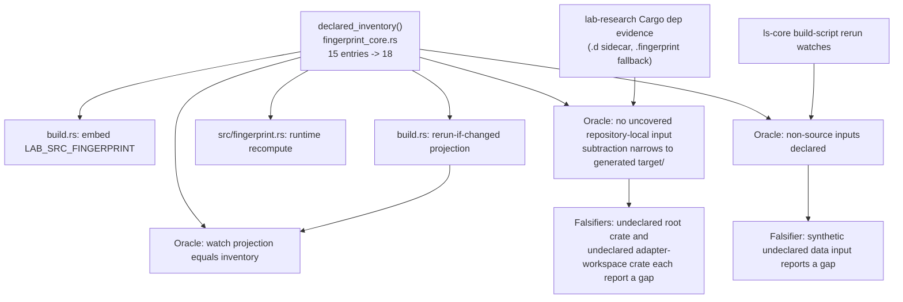
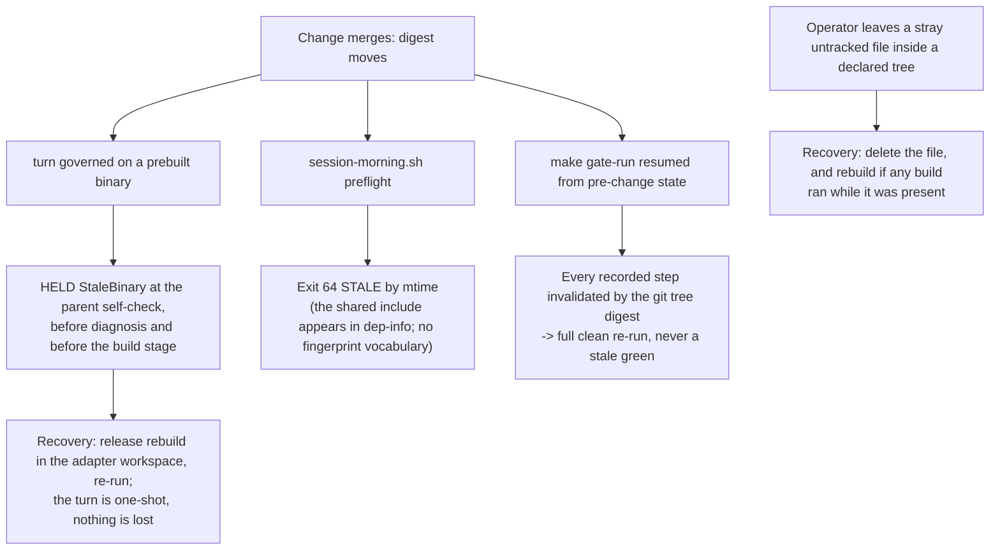

# Adapter and Calendar Fingerprint Closure - Plan

## Goal Capsule

- **Objective:** A merit-bearing governed strategy verdict can never be produced by a lab binary whose repository-local compiled source — the adapter and calendar packages today, any crate added later — no longer matches the repository. Anyone can check this without knowing the fingerprint's internals: mutate any source inside a declared tree, run a governed turn on the binary built before that mutation, and observe a refusal instead of a flip.
- **Means:** Extend the shared declared-input inventory to the two deferred package sources and delete the coverage oracle's package-specific deferral list (KTD1, KTD3).
- **Authority:** The normalized truth is the lab binary's own Cargo dependency evidence, not a hand-maintained path list. Where the oracle names a repository-local input no declaration covers, the oracle wins and the inventory is wrong. The rule binds in that direction only: declaring more than the oracle observes is permitted (KTD4).
- **Stop conditions:** Stop and report rather than proceed if the widened oracle reports an uncovered repository-local input that this plan does not declare, or if a mutation of a newly declared class leaves the digest unchanged.
- **Tail ownership:** This plan owns the documentation rewrite and the queue closeout. It does not own the morning shell preflight's freshness inputs (R8).

---

## Product Contract

### Summary

Close the last package-level blind spot in the lab's declared build-input fingerprint by declaring `adapters/nautilus/src`, `adapters/nautilus/nautilus-ls-calendar/src`, and the calendar package manifest, and by replacing the coverage oracle's package-specific deferral list with a single generated-artifact rule. After this change a future repository-local crate that the lab compiles but nobody declares fails the gate instead of being silently uncertified.

### Problem Frame

`LAB_SRC_FINGERPRINT` certifies a declared inventory in `adapters/nautilus/lab/fingerprint_core.rs`, which `adapters/nautilus/lab/build.rs` embeds and `adapters/nautilus/lab/src/fingerprint.rs` recomputes. The root SDK/core closure landed with two packages deliberately deferred: the `nautilus-ls` adapter source and the `nautilus-ls-calendar` leaf. `adapters/nautilus/lab/Cargo.toml` declares both as path dependencies, so both are compiled into `lab-research`; a change in either can move the binary's behavior while the embedded digest stays equal, and the governed turn accepts it.

The blind spot is structural, not incidental. The coverage oracle in `adapters/nautilus/lab/tests/fingerprint_closure.rs` reads the binary's real Cargo dependency evidence and would already catch these packages, except that a hard-coded deferral predicate subtracts them first. That same predicate makes any future repository-local crate invisible for as long as somebody keeps adding roots to it.

### Requirements

**Boundary closure**

- R1. The digest changes for any content or membership change under `adapters/nautilus/src`, `adapters/nautilus/nautilus-ls-calendar/src`, or `adapters/nautilus/nautilus-ls-calendar/Cargo.toml`.
- R2. The coverage oracle requires every repository-local compiled input named by the lab binary's Cargo dependency evidence to be covered by a declared inventory entry, with no package-specific exception. The rule binds both evidence sources the oracle reads — the binary's dependency sidecar and the Cargo fingerprint fallback — so the closure does not depend on which format survives in a build directory. The only permitted subtraction is generated build output under `adapters/nautilus/target`, which cannot be source-declared.
- R3. These stay outside the certified boundary and are proven so: root `Cargo.lock`, generated output under any `target/` directory, dev-only dependency sources such as `crates/ls-sdk-test-support`, and the operator-local KRX calendar snapshot state under `adapters/nautilus/state`.

**Proof**

- R4. Each newly declared class is proven by mutation, one class at a time, on an otherwise unchanged fixture: first show equality on the unchanged fixture, then mutate only that class and show the digest moves; mutate a retained exclusion and show it does not.
- R5. The permanent synthetic falsifiers keep proving that an undeclared repository-local source and an undeclared build-script data input are reported as gaps. After R2 they are the mechanism that makes a future local crate fail closed, so one falsifier plants its undeclared source inside the adapter workspace — the shape the deleted deferral arms used to hide.
- R6. A mutation of the newly declared adapter source makes a stale governed parent refuse before diagnosis or build, exercised through the governed CLI path and not only through the digest.

**Truthfulness and handoff**

- R7. `docs/solutions/design-patterns/build-runtime-hash-parity-via-shared-include.md` states the closed boundary, the surviving exclusions, and the operator-facing consequences: which recovery applies to a stray untracked file inside a declared tree, that the morning preflight's freshness axis and the governed fingerprint now disagree on adapter-binary edits, and that a new repository-local crate must be seeded into the shared test fixture as well as declared.
- R8. Queue state changes flow through `lab-next`. The `session-morning-root-manifest-freshness` item stays open and untouched; `session-morning.sh` is not edited by this plan.
- R9. The compatibility surfaces are unchanged: the environment constant `LAB_SRC_FINGERPRINT`, the CLI line `fingerprint: <hex>`, and the persisted field `lab_src_fingerprint`.

### Key Decisions

- KD1. Close the boundary permanently instead of declaring only the two deferred packages. `session-settled: user-approved` · Governs R1, R2, R5. Keeping the deferral list would leave the same blind-spot class open for the next crate.
- KD2. The KRX calendar snapshot state stays outside the boundary, while the calendar package *source* comes inside. `session-settled: user-approved` · Governs R3. The snapshot is operator-local, gitignored, credential-refreshed state carrying its own `artifact_id` identity; declaring it would give one artifact two competing identities and make ordinary calendar ingest invalidate every governed binary.
- KD3. The morning shell preflight's missing root manifests remain a separate queue item. `session-settled: user-approved` · Governs R8. This plan certifies a compiled-input boundary; the shell protocol is a different oracle with a different scope.

### Success Criteria

- A binary built from the widened inventory on an unchanged tree refuses a governed turn once one newly declared input is mutated, and the digest it refuses on differs from the pre-change value. The pre-change binary's own refusal is not the proof: it refuses because the shared inventory file was already a declared input before this change.
- Deleting the two package roots from the deferral predicate leaves the coverage oracle green with no new exception added anywhere.
- The adapter-workspace falsifier fails against the pre-change deferral predicate and passes after it, so the deletion is proven rather than assumed.

### Scope Boundaries

- No change to the governed pinning protocol, the parent/build/reporter/decider sequence, or any HELD exit code.
- No change to the digest framing scheme. `adapters/nautilus/src/bin/**` is declared as part of its parent tree rather than excluded (KTD4).
- No ignore-list, allow-list, or exclusion predicate inside the inventory (KTD5).
- No edit to `adapters/nautilus/scripts/**`, so `make script-check` is not triggered.

#### Deferred to Follow-Up Work

- Add `crates/ls-sdk/Cargo.toml` and `crates/ls-core/Cargo.toml` to the morning preflight's freshness inputs — the existing `session-morning-root-manifest-freshness` queue item (R8).
- Replace the `canonicalize().unwrap()` in the closure test's watch-path parser with the `Result` shape its sibling helper already uses, so a declared input deleted mid-run fails as an assertion rather than a panic.
- Give the freshness divergence this change creates its own queue item: an edit under `adapters/nautilus/src/bin/**` moves the declared digest but never reaches the morning preflight's dependency evidence, so the two oracles disagree. The existing preflight item covers a different residual (two root manifests) and does not own this one.

---

## Planning Contract

### Key Technical Decisions

- KTD1. **Declare three entries: two trees and one file.** `session-settled: user-approved` · Governs R1. Add a tree for `adapters/nautilus/src`, a tree for `adapters/nautilus/nautilus-ls-calendar/src`, and a file for `adapters/nautilus/nautilus-ls-calendar/Cargo.toml`. Do not add an entry for the adapter package manifest: `adapters/nautilus/Cargo.toml` is one file carrying both `[package] name = "nautilus-ls"` and the `[workspace]` table, and it is already declared as the workspace manifest, so a second entry fails the inventory's duplicate-normalized-path check. Entry labels are hashed, so the names are a one-time choice.
- KTD2. **Do not bump the digest framing version.** The framing string denotes the framing scheme, which is unchanged, and the entry count is already framed into the digest — widening the inventory moves the digest by construction. A version bump would imply a format change that reviewers would look for and not find.
- KTD3. **Reframe the oracle's deferral predicate as a generated-artifact rule.** `session-settled: user-approved` · Governs R2, R5. The predicate in `adapters/nautilus/lab/tests/fingerprint_closure.rs` carries three roots today; the two package roots are deleted and only `adapters/nautilus/target` survives, because build-script output such as the `ls-core` generated metadata legitimately appears in dependency evidence and has no source form. Rename the predicate to say generated-artifact exclusion rather than deferral, and rewrite the failure message so it no longer offers "explicitly deferred" as a legitimate state.
- KTD4. **Accept the `src/bin` over-declaration rather than declaring the compiled subset file by file.** Governs R1. The lab compiles the `nautilus_ls` lib target only, so declaring the whole `adapters/nautilus/src` tree covers 13 binary sources the lab never links. Per-file declarations would re-open the membership blind spot that tree hashing exists to close. The cost is real and operator-facing rather than negligible: `adapters/nautilus/scripts/session-morning.sh` runs four of those binaries as prebuilt calendar paths every session morning and registers one of their refusal literals, so a calendar-binary hotfix invalidates every governed lab binary until it is rebuilt. Accept it because the alternative re-opens a correctness hole to save a rebuild, and record it as an operator consequence (R7).
- KTD5. **No exclusion predicate inside the inventory.** Governs R3, R7. Tree hashing covers every regular file, so a stray untracked file inside a declared tree moves the digest. The recovery is to delete the stray file — and to rebuild as well if any build ran while it was present, because the declared tree is a rebuild watch, so a stray that existed at build time is embedded in the digest and its deletion is itself a stale-binary refusal until the binary is rebuilt. An ignore predicate would be exactly the second input list that the shared-include design exists to forbid; the documented recovery replaces it.
- KTD6. **Make the retained exclusions executable, not just documented.** Governs R3, R4. The snapshot exclusion (KD2) becomes a negative control in the mutation matrix, which requires the shared fixture to seed a snapshot path. The three previously deferred paths move from the negative-control list into the positive matrix, and the two new trees join the membership matrix.
- KTD7. **Rewrite the pattern documentation inside this change, not after it.** Governs R7. Three passages become false on merge: the two "does not certify" bullets for adapter and calendar source, the sentence stating that the adapter/calendar extension remains separate work, and the coverage-proof clause listing adapter/calendar mutations as negative controls. Keep the following sentence about the morning preflight residual verbatim — it is the documentation anchor for KD3. Also re-anchor the stale quotation of this document in `docs/solutions/workflow-issues/first-run-of-a-new-guard-prove-the-binary-then-discharge-its-residual.md`, which cites a sentence the previous rewrite already removed.

### High-Level Technical Design

One inventory feeds three consumers and is policed by three independent oracles. The change edits the inventory and one oracle's subtraction; nothing else in the topology moves.

The digest moves once for every existing binary. That surfaces in three places, none of them a wrong verdict, because `lab_src_fingerprint` is stamped into manifests and interpolated into the KEEP verdict string but never equality-tested; every persisted comparator keys on `catalog_fingerprint`, `strategy_code_hash`, `governed_params_hash`, or a git-derived tree digest instead. A fourth surface is not caused by the merge at all: a stray untracked file inside a declared tree, which KTD5 owns.

### System-Wide Impact

- **Build invalidation.** Two new directory watches mean any adapter or calendar edit re-runs the lab build script and relinks all six lab binaries. This lengthens `make adapter-check` and the per-PR adapter-check workflow on adapter-only changes. It is the same coupling `crates/ls-core/src` already imposes.
- **Freshness-oracle divergence.** An edit under `adapters/nautilus/src/bin/**` moves the declared digest but does not appear in the lab binary's dependency evidence, so the morning preflight's mtime axis reports fresh while a governed turn refuses. R7 documents the divergence; KD3 keeps the shell side out of scope.
- **Root workspace and other CI.** Untouched. Root `cargo test` cannot see the standalone adapter workspace, and the repository-engineering and freshness-cadence workflows never enter it. `make docs` is unaffected.
- **Governed consumers.** Unchanged. The governed runner performs opaque digest equalities, the research runner prints the value, and the backtest runners stamp it; none enumerates inventory membership.

### Risks and Mitigations

- **Fixture fail-closed on a future crate.** Validation errors on a missing declared input, so a contributor who declares a new crate without seeding the shared fixture reddens every fixture-based test with a message about an untrustworthy inventory rather than about their omission. Mitigate by documenting the coupling (R7).
- **Confusing red from a deleted declared input.** The closure test's watch-path parser canonicalizes and unwraps, so deleting a declared input between build and test panics instead of asserting. The exposed surface roughly triples. Mitigate by deferring the `Result` conversion as named follow-up work and by re-running after a rebuild.
- **Coverage-only edits are gate-invisible.** Deleting deferral arms and re-polarizing assertions leaves the suite green either way. Mitigate with R4's one-class-at-a-time mutation discipline and by extending the existing permanent falsifiers rather than taking a one-time measurement.
- **First run of a widened guard.** A green turn alone does not prove the binary in hand carries the widened inventory. Mitigate with a content assertion: the recomputed digest must differ from the pre-change value.

---

## Implementation Units

### U1. Widen the declared inventory

**Goal:** Make the digest cover the adapter and calendar package sources and the calendar manifest.

**Requirements:** R1, R9; KTD1, KTD2, KTD4

**Files:**

- `adapters/nautilus/lab/fingerprint_core.rs`
- `adapters/nautilus/lab/src/fingerprint.rs`

**Approach:**

1. Record the pre-change digest before touching anything: run the lab binary's own `fingerprint` subcommand in the adapter workspace and keep the emitted hex. The inventory file is itself a declared input, so the old value is unrecoverable the moment the edit lands, and both the first-run proof and U5's TURN-LOG line need it.
2. Add the three entries from KTD1 to `declared_inventory()`. Both new declarations are overlap-safe: `adapters/nautilus/src` is a sibling of the already-declared lab source tree, and the calendar manifest sits beside rather than inside the calendar source tree.
3. Leave the framing string and every hashing, validation, and watch-projection function untouched (KTD2).
4. Update the two stale scope claims in the machinery's own comments: the module doc comment in `adapters/nautilus/lab/src/fingerprint.rs` and the `declared_inventory()` doc comment in `adapters/nautilus/lab/fingerprint_core.rs`, both of which still say the value certifies the declared root SDK/core inventory. Do not touch `EMBEDDED`, `recompute`, `recompute_from_root`, or the compiled-root resolution (R9).

**Patterns to follow:** The existing `FingerprintInput::tree` / `::file` constructor pairs in `declared_inventory()`. Label style matches the existing hyphenated logical labels.

**Test scenarios:**

- The inline parity test in `adapters/nautilus/lab/src/fingerprint.rs` still shows runtime recomputation equal to the embedded value after a rebuild.
- Validation accepts the widened inventory: no duplicate label, no duplicate normalized path, no tree/file overlap.

**Verification:** A rebuilt `lab-research` reports a `fingerprint:` value that differs from the pre-change value, and runtime recomputation equals it.

### U2. Close the coverage oracle and re-polarize the control matrices

**Goal:** Make the oracle demand every repository-local compiled input, and make both the new inclusions and the retained exclusions executable.

**Depends on:** U1

**Requirements:** R2, R3, R4, R5; KTD3, KTD5, KTD6

**Files:**

- `adapters/nautilus/lab/tests/fingerprint_closure.rs`
- `adapters/nautilus/lab/tests/support/fingerprint_fixture.rs`

**Approach:**

1. Delete the two package roots from the deferral predicate, keep the generated `adapters/nautilus/target` root, and rename the predicate and the oracle's failure message per KTD3.
2. Move `adapters/nautilus/src/lib.rs`, `adapters/nautilus/nautilus-ls-calendar/src/lib.rs`, and `adapters/nautilus/nautilus-ls-calendar/Cargo.toml` out of the negative-control list and into the positive mutation matrix. The remaining negative controls are the root lockfile, generated output, and the dev-only test-support source.
3. Add the two new trees to the membership matrix so an add, rename, or remove inside either tree moves the digest.
4. Add positive presence assertions to the dependency-evidence oracle for the two new package sources, mirroring the existing root SDK and core assertions, so the oracle proves it actually sees them.
5. Add the KRX snapshot negative control (KD2), which requires seeding `adapters/nautilus/state/krx.calendar.json` in the shared fixture. This is the only fixture change the plan needs: the fixture already materializes both new source trees and the calendar manifest, because they are today's negative controls.
6. Add a second synthetic falsifier mirroring the existing undeclared-crate one but planting its source inside the adapter workspace, and require it to fail against the pre-change deferral predicate. The existing falsifier plants at a root-workspace path the deleted arms never subtracted, so it is green either way and cannot gate the deletion.
7. Widen the Cargo-fingerprint fallback decoder to the adapter and calendar packages, resolving their relative paths against the adapter package roots, and extend its found-packages assertion to the four-package set. Leaving it at the root pair would make the closure conditional on which evidence format survives in a build directory, and would red the new presence assertions from step 4 whenever the fallback is selected (R2).

**Execution note:** Prove each newly declared class per R4, then confirm the retained exclusions still do not move the digest. The suite is green before and after the deferral deletion, so mutation is the only evidence that the surviving assertions still catch what the deleted arms named.

**Test scenarios:**

- Appending a byte to a file under `adapters/nautilus/src` moves the digest; the same for the calendar source tree and for the calendar manifest.
- Adding, renaming, and removing a member inside each new tree moves the digest, and restoring the tree returns the original digest.
- Appending to the root lockfile, to generated output under `target/`, to the dev-only test-support source, and to the seeded KRX snapshot leaves the digest unchanged.
- The dependency-evidence oracle reports no uncovered repository-local input against the real `lab-research` evidence, and its assertions confirm adapter and calendar sources are present in that evidence.
- With the fallback evidence path forced, the oracle still resolves all four repository-local packages and reports no uncovered input — the existing fallback test grows from the root pair to the four-package set.
- The root-workspace falsifier still reports exactly its undeclared crate, and the new adapter-workspace falsifier reports its own — the second is what proves the deleted arms mattered.
- The build-script watch falsifier still reports an undeclared repository-local data input.
- The watch projection still equals the declared inventory, now including the two new trees.

**Verification:** The oracle passes with a subtraction list containing only generated output, and every newly covered class fails the suite when mutated in isolation.

### U3. Echo the new class on the governed refusal path

**Goal:** Prove the widened boundary reaches the governed refusal, not only the digest.

**Depends on:** U1

**Requirements:** R6

**Files:**

- `adapters/nautilus/lab/tests/governed_cli.rs`

**Approach:** Add an adapter source path to the stale-parent matrix that today covers a root SDK source, the adapter lockfile, and the error catalog. No other governed test needs changing: the fixture-based mutation and validation tests key on inputs the fixture already seeds, and the remaining tests use the real repository root and are inventory-agnostic.

**Test scenarios:**

- Mutating the fixture's adapter source makes a stale governed parent exit with the stale-binary code and the stale-parent message, with no build invoked.
- The existing during-build and post-report mutation tests still hold before the reporter and before decider side effects.

**Verification:** The governed CLI suite passes with the adapter source class exercised on the refusal path.

### U4. Rewrite the certified-boundary documentation

**Goal:** Leave no sentence claiming the adapter and calendar extension is future work, and record the operator-facing consequences of the closed boundary.

**Depends on:** U1, U2, U3

**Requirements:** R7; KTD5, KTD7

**Files:**

- `docs/solutions/design-patterns/build-runtime-hash-parity-via-shared-include.md`
- `docs/solutions/workflow-issues/first-run-of-a-new-guard-prove-the-binary-then-discharge-its-residual.md`

**Approach:**

1. Promote adapter source, calendar source, and the calendar manifest into the certified-boundary list, and delete their "does not certify" bullets.
2. Replace the sentence stating that the adapter/calendar extension remains separate work with a statement that the boundary is closed and carries no package-specific deferral. Keep the following sentence about the morning preflight residual verbatim (KD3).
3. Rewrite the coverage-proof clause to carry the complete retained-exclusion set — root `Cargo.lock`, generated output under any `target/` directory, dev-only dependency sources, and the KRX snapshot state — and state separately that the coverage oracle's only subtraction is generated output under `adapters/nautilus/target`. State that the synthetic falsifiers are now what makes an undeclared local crate fail closed.
4. Add a distinct "does not certify" bullet for the KRX snapshot *state*, so no reader reads the certified calendar *source* as covering both.
5. Record the four operator-facing consequences: the stray-untracked-file recovery in full — delete the file, and rebuild too if any build ran while it was present (KTD5); an edit to any adapter binary under `src/bin` invalidates every governed lab binary and needs a release rebuild before the next governed turn, including the four the morning chain runs (KTD4); the morning preflight's freshness axis and the governed fingerprint therefore disagree on those edits; and a new repository-local crate must be seeded into the shared test fixture as well as declared, or every fixture test fails closed on the missing input.
6. Re-anchor the stale quotation of this document in the first-run-of-a-new-guard learning, which cites a sentence removed by the previous rewrite.

**Test expectation:** none — prose only. The documented claims are the ones U2 makes executable.

**Verification:** No sentence in either document contradicts the shipped boundary, and the morning-preflight residual anchor survives.

### U5. Close out the queue and record the digest transition

**Goal:** Leave the work discoverable and the digest move explained.

**Depends on:** U1, U2, U3, U4

**Requirements:** R8

**Files:**

- `adapters/nautilus/lab/TURN-LOG.md`
- `queue/items.jsonl` (through `lab-next` only)

**Approach:**

1. Add a TURN-LOG governance line recording the widening and both digests — the pre-change value U1 step 1 recorded and the new one — matching the precedent for prior fingerprint transitions. This is what tells a later reader why a KEEP verdict's hash moved while `strategy_code_hash` did not.
2. Stage the freshness-divergence residual through `lab-next add`, then close `fingerprint-nautilus-ls-calendar-closure` through `lab-next done`. The existing `session-morning-root-manifest-freshness` item is a different residual and does not own the divergence this change creates.
3. Confirm through the queue's all-items view that `session-morning-root-manifest-freshness` remains open and unedited (R8).

**Test expectation:** none — queue behavior is verified through the queue CLI and the repository gates.

**Verification:** `make next` reports the successor state, and the queue's all-items view shows both the untouched preflight item and the newly staged divergence item.

---

## Verification Contract

### Focused checks

| Command | Proves |
|---|---|
| `cd adapters/nautilus && cargo test -p nautilus-ls-lab --test fingerprint_closure` | U1, U2: the widened inventory, the closed oracle, the re-polarized matrices, and both falsifiers |
| `cd adapters/nautilus && cargo test -p nautilus-ls-lab --test governed_cli` | U3: the new class refuses on the governed path |
| `cd adapters/nautilus && cargo test -p nautilus-ls-lab fingerprint` | Build/runtime parity after the inventory change |

The mutation matrix is load-bearing: run it per R4. A green tree is not evidence that the boundary moved.

### Repository gates

- `make adapter-check` — mandatory; the closure and governed tests live in the standalone adapter workspace, which root `cargo test` cannot build. `--workspace` is what reaches the lab member crate.
- `make docs-check`, `make todo-check`, `make next`.
- `make script-check` is not required: this plan touches neither `adapters/nautilus/scripts/**` nor the calendar input parser. Run it after `make adapter-check` only if implementation crosses that boundary.

### First-run proof of the widened guard

Rebuild `lab-research` in the adapter workspace and record the recomputed digest. The proof of the widened boundary is that this value differs from the pre-change value U1 step 1 recorded; a green governed turn on an unverified binary is not that proof.

### Observable gate outcomes

- The dependency-evidence oracle passes with generated output as its only subtraction.
- Mutating adapter source, calendar source, or the calendar manifest reds the closure suite; mutating the root lockfile, generated output, the dev-only test-support source, or the seeded snapshot does not.
- `git diff` carries no generated `target/` artifacts, no unrelated formatting churn, and no hand edit to `queue/items.jsonl`.

---

## Definition of Done

- [ ] The inventory declares adapter source, calendar source, and the calendar manifest, and declares no second entry for the dual-purpose adapter workspace manifest.
- [ ] The coverage oracle's subtraction list contains only generated build output, and its failure message no longer offers a deferred state.
- [ ] Every newly declared class is mutation-proven in isolation, and every retained exclusion is a negative control, including the KRX snapshot state.
- [ ] The synthetic falsifiers still report an undeclared local source and an undeclared build-script data input, and the adapter-workspace falsifier reds against the pre-change predicate.
- [ ] A mutated adapter source makes a stale governed parent refuse before diagnosis or build.
- [ ] The pattern documentation states the closed boundary, the surviving exclusions, the stray-file recovery, the freshness-oracle divergence, and the fixture-seeding coupling; the morning-preflight residual anchor is intact; the stale cross-reference is re-anchored.
- [ ] Compatibility identifiers and output formats are unchanged.
- [ ] The closure item is closed through `lab-next`, the divergence residual is staged through `lab-next add`, the preflight item is untouched, and the TURN-LOG records both digests.
- [ ] A rebuilt `lab-research` reports a recomputed digest that differs from the recorded pre-change value, and that transition is what proves the widened guard is in the binary (Verification Contract, first-run proof).
- [ ] Focused checks and the required repository gates pass, and no experimental or dead-end code remains in the diff.
