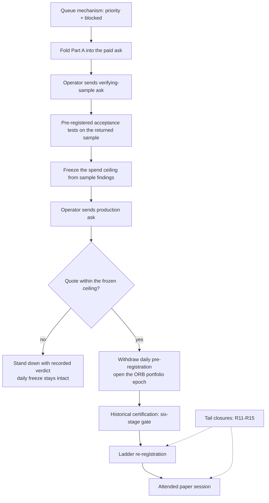
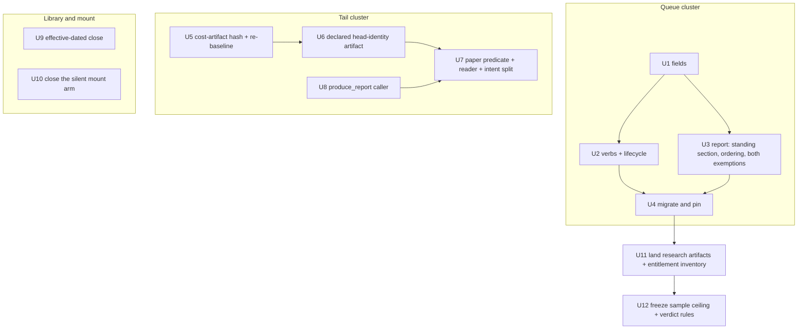

# ORB Licensed-Sample Verdict Arc - Plan

## Goal Capsule

- **Objective.** The operator holds a decisive, admissible verdict on whether an opening-range mechanism has a tradable edge on KRX — reached under a spend ceiling fixed before money is committed — and `make next` names the arc's live blocker on every run until that verdict exists.
- **Means.** Acquire a bounded verifying sample first, derive the ceiling from what it proves, then make the production ask; close the licence-independent defects that gate the arc's tail during that loop (KTD11, KTD12).
- **Product authority.** Epic #241's twelve closed decision tickets are the product contract for the arc's tail. This plan owns the arc's spine, its blocker set, and the queue mechanism that drives it; per-stage implementation contracts for #241's thirty-five acceptance conditions are not active scope.
- **Open blockers.** The arc's head is operator-owned: #255's information-request package is authored and unsent, and #248's `may_begin` is false on two shape-determining licence terms. No agent act shortens that lead time. Every requirement outside the Procurement group is unblocked today.
- **Execution profile.** Mixed. The queue mechanism and the tail closures are ordinary gated code turns. Procurement is attended and human-owned. No lineage is opened by this plan.
- **Stop conditions.** A quote above the frozen ceiling (stand down per R9). Evidence that a verifying sample cannot be bought separately from production history (the approach's premise fails — return to the head decision). Any tail closure that turns out to require a frozen-artifact amendment outside the recorded re-registration protocol.
- **Tail ownership.** The implementer runs the gate green and moves queue state through `lab-next`, never by editing `queue/items.jsonl`.
- **Product Contract preservation.** Changed: R11, R14, R15 — each was written against a mis-stated code fact and is corrected here (R15's target arm, R14's fail-open framing, R11's display-vs-refusal silence); see KTD10, KTD11, KTD14. Restructured, no scope change: R1–R19 keep their meaning and IDs; R20–R32 are additions research surfaced as gaps, not re-scopings.

---

## Product Contract

### Summary

Route the stalled ORB program to a decisive verdict by buying a bounded verifying sample before a production licence, deriving a pre-registered spend ceiling from that sample, and opening the #241 portfolio epoch only if the quote clears it. Give the work queue a priority marker and a blocked state so `make next` drives the arc's frontier instead of housekeeping, and close the licence-independent defects that would otherwise sabotage the arc's final stage after the money is spent.

### Problem Frame

The program is at a standstill that no existing queue item names. `adapters/nautilus/lab/TURN-LOG.md:7` records no open lineage: ORB was declared CLOSED on 2026-08-11, and the successor `daily-resolution-v1` pre-registration was frozen on 2026-08-15 and deliberately not opened. Three items in `queue/items.jsonl` are neither done nor superseded, and two of them are morning-chain freshness residuals. So `make next` currently answers a question nobody is asking.

The closure was a detectability verdict, not a profitability one. `CONCEPTS.md:284` fixes the consequence: a closed lineage "cannot be reopened by acquiring data: only a larger hypothesized effect, or a resolution with a deeper supply, changes the answer." The ceiling term in that rule is a probed property of the LS gateway's rolling minute window — roughly 237 KRX sessions — not of intraday resolution itself. That is the wall, and it is a supplier wall.

Meanwhile the destination is fully specified and the arithmetic is unfriendly. #252 registers the hurdle as a derivation: `0.10 / 2.845` = 0.0351 net RoR. ORB's best figure ever is v34's +0.0398 **zero-cost**; arming the transaction-cost model took v35 to −0.0006. #242 rules every one of those numbers inadmissible on separate grounds — the universe metadata's as-of date (`20260723`) post-dates every backtest window (`20260518..20260722`).

And the arc's final stage rests on machinery that cannot execute it. `adapters/nautilus/lab/config/preregistration.json:7` requires "at least 3 clean paper sessions" for rung-0 re-qualification. `is_clean_session` refuses any non-live lane at `adapters/nautilus/lab/src/dispatch/ladder.rs:397`, and the paper mount records `trading_env: "paper"` at `adapters/nautilus/lab/src/runner/live.rs:2446`. A paper session can therefore never be clean, the counter can never reach one, and the field itself is an unread `Option<String>` at `adapters/nautilus/lab/src/dispatch/prereg.rs:119`. Separately, `produce_report` at `adapters/nautilus/lab/src/dispatch/tracking.rs:152` has zero non-test callers, so no clean session can be accrued at rung 2 either. These are contradictions, not gaps, and they are invisible until the moment an operator tries to run the session the whole arc exists to reach.

### Key Decisions

- **The arc opens as a new search epoch under #241, never as a reopening of the ORB lineage.** (session-settled: user-directed — chosen over opening `daily-resolution-v1` or deferring the epoch decision: the closure rule forecloses reopening, so v35 donates a hypothesis and no evidence.) Governs R16, R19.
- **`daily-resolution-v1` stays frozen and unopened until the quote clears the ceiling.** (session-settled: user-directed — chosen over withdrawing it up front: withdrawal plus a price-driven stand-down would leave no strategy program at all, and the freeze is the only fallback that exists.) Governs R9, R17, R18.
- **Priority is a first-class queue concept, not an encoding.** (session-settled: user-directed — chosen over recording deadlines on arc items or retiring the two housekeeping residuals: `deadline` means a clock and drives a completion prompt, and the residuals are undone work.) Governs R1.
- **Blocked is a queue state carrying its unblock condition.** (session-settled: user-directed — chosen over pinning the head anyway: a pinned externally-blocked item would print as the report's only `next:` for months.) Governs R2, R3, R4, R5.
- **Success is a decisive verdict under a pre-declared spend ceiling.** (session-settled: user-directed — chosen over "a certified head reaching an attended paper session": no ORB configuration has ever approached the 0.0351 hurdle net of costs, and a criterion with no terminal for refutation writes acceptance conditions nobody can meet.) Governs R6, R9.
- **The verifying sample precedes the production ask.** (session-settled: user-directed — chosen over sending the production ask now: a ceiling derived from published list prices is a number with no evidence behind it, which is the same defect the frozen v2 rung-1 band carried.) Governs R6, R7.
- **Sample evidence scopes the sample; completeness comes in writing.** Recorded in the repo as a convention after #243's ten-row observation proved a sample-endpoint artifact. Governs R8.
- **Licence-independent tail defects close during the procurement loop, not after it.** They gate the arc's final stage regardless of which data is bought, and discovering them after payment is the expensive ordering. Governs R11, R12, R13, R14, R15.
- **Exactly one queue item holds priority at a time.** (session-settled: user-directed — chosen over a priority arc whose items inherit it, or a pre-declared bounded count: the scarcest form needs no grouping concept and no underivable number, and it mirrors the one-lineage-at-a-time discipline.) Governs R1.
- **Rung-0 re-qualification gets its own paper-cleanliness predicate; the frozen text stands.** (session-settled: user-directed — chosen over amending the frozen condition or dropping the paper clause: escalation and re-qualification ask different questions, and this is the only path that needs no re-registration dispatch on a frozen artifact.) Governs R11.
- **Every paid acquisition act is bounded before it happens.** (session-settled: user-directed — chosen over a single production ceiling or one total programme ceiling: a lone production ceiling leaves the arc's first spend ungoverned, and a total fixed now could only come from the price list this approach distrusts.) Governs R6.

### Actors

- A1. **Operator** — sole and attended. Signs, sends, negotiates, and pays; freezes both ceilings; holds the re-registration nonce; runs the attended session. The only actor who can advance the arc's head.
- A2. **Agent** — everything else: folding Part A into the paid ask, the pre-registered acceptance tests, the queue mechanism, the tail closures, and every backtest.
- A3. **Vendor counterparties** — KRX for bulk historical and the index licence, Koscom for feeds. They run two licensing regimes that answer the derived-data question oppositely, and the stricter one governs historical bars.

### Requirements

**Queue mechanism**

- R1. A queue item can carry a priority marker, and `lab-next report` selects a priority item ahead of the existing deadline-then-file-order sort; at most one item holds the marker, so setting it elsewhere clears it.
- R2. A queue item can carry a blocked state recording the condition that would unblock it, and a blocked item is never offered as the report's `next:`.
- R3. A blocked item stays visible in the report as standing work with its unblock condition, so a priority item survives blockage without producing an unreachable offer.
- R4. A blocked item is exempt from deadline staleness and from the reconciliation completion prompt, so work awaiting an external party is never asked to confirm it is done.
- R5. Every open item whose parkedness exists only as prose in `notes` is migrated to the blocked state with its recorded unblock condition.
- R20. `lab-next` gains verbs that set and clear the priority marker and the blocked state on an existing item, so no queue transition requires hand-editing `queue/items.jsonl`.
- R21. `done` clears the priority marker and `supersede` transfers it to the superseder, so the arc's frontier survives the transition its head item has already taken four times.
- R22. A blocked item is excluded from the reconciliation auto-close pass as well as from the confirmation prompt.
- R23. Standing work is sourced before the window filter, so a blocked item renders whatever window is derived; only the offer stays window-gated.
- R24. Every blocked item's unblock condition names an act an identified actor can perform, so a blocked item always retains a reachable path back to actionable.
- R31. `QueueItem` rejects unknown fields, so a mistyped priority or blocked key is a loud refusal rather than a silent default to neither.

**Procurement and the spend ceiling**

- R6. No paid acquisition act proceeds without a ceiling frozen before it: the verifying sample's derives from the published sample prices, and the production ask's derives from the verifying sample's findings rather than a price list.
- R7. The verifying-sample ask is scoped to the obligations whose answers determine the arc's shape or supply a registered rule's value, not to production history.
- R8. Completeness facts a sample cannot establish are obtained in writing from the vendor and are never inferred from sample contents.
- R9. A quote above the applicable frozen ceiling stands the arc down with a recorded verdict, ingests nothing, and leaves `daily-resolution-v1`'s freeze intact.
- R10. The content-hash publication term and the post-termination derived-evidence retention right are answered before any archive or verdict-register design is committed.
- R25. An entitlement inventory over the credentials and free per-service applications the repo already holds runs before either ceiling is frozen.
- R26. Each ceiling-input finding is labelled measured, source-silent, or unreachable, and no ceiling input rests on a completeness property.
- R27. A quote is evaluated as one aggregate against the frozen ceiling for that act; a partial or per-product buy is a new pre-registration act, never a negotiation.
- R28. A partial vendor response, a non-response, and a sample that answers only some scoped obligations each resolve to a recorded verdict rather than a branch back into the ask.
- R32. The licensed-sample request package and its public-pass findings land in the repository before the paid ask is sent, so R7 and R8 have a repo-side subject.

**Licence-independent tail closure**

- R11. Rung-0 re-qualification refuses on the existing `REREGISTER_REFUSED` path until a paper-lane cleanliness predicate distinct from `is_clean_session` counts the sessions the frozen file at `adapters/nautilus/lab/config/preregistration.json:7` requires, while a chain-epoch repair after a defect stays nonce-gated.
- R12. `produce_report` gains a production caller, so a clean session can be accrued at rung 2 at all.
- R13. `KRX_REGULAR_CLOSE` is effective-dated before any session predating 2016-08-01 is ingested, together with the pre-2016 unknown calendar days that would otherwise stop a deeper backfill at the first of them.
- R14. Head identity is a declared, hash-identified artifact rather than a derivation over gitignored run manifests, and the transaction-cost configuration is inside that identity.
- R15. The mount refuses rather than proceeds when neither a metadata artifact nor a head metadata hash is present — the arm at `adapters/nautilus/lab/src/runner/mount_universe.rs:437`, which emits no diagnostic at all and whose harm the module doc already states at `:399-401`.
- R29. `KRX_REGULAR_CLOSE`'s three consumer classes — bar stamping, ingest range bounds, and the watermark tail — are verified as separate defects with separate blast radii.
- R30. The lab's hardcoded 15:00 time-flat is reconciled with the effective-dated close, because before 2016-08-01 that literal is the close itself.

**Epoch governance**

- R16. The arc opens as a new search epoch in which v35's six kept levers enter as one named candidate configuration and no v35 number is cited as evidence.
- R17. `daily-resolution-v1`'s withdrawal is a recorded governance act taken when the quote clears the ceiling, not before.
- R18. The withdrawal record states whether the one-time selection-tax reset the daily freeze spent is available to this epoch.
- R19. The verdict's evidence is admissible only when every derived input's knowledge time precedes every session it is evaluated against.

### Key Flows

- F1. The arc spine
  - **Trigger:** A1 accepts this plan and the queue mechanism lands.
  - **Actors:** A1, A2, A3
  - **Steps:** Build the priority and blocked concepts, then pin the arc → A2 folds Part A's returns into the paid ask and runs the free service applications → A1 sends the verifying-sample ask → A2 runs the pre-registered acceptance tests against what returns → A1 fixes the ceiling from those findings → A1 sends the production ask → the quote either clears the ceiling or does not.
  - **Outcome:** Either the epoch opens on verified licensed history, or the arc stands down with a recorded verdict and the daily freeze intact.
  - **Covered by:** R1, R2, R6, R7, R8, R9, R17
- F2. Report selection under priority and blocked
  - **Trigger:** Any `make next` run while the arc is pinned.
  - **Actors:** A1, A2
  - **Steps:** The report derives the window and reads in-flight sequences → a window-compatible in-flight sequence still outranks items → among items, a priority item that is not blocked is offered as `next:` → a blocked priority item renders as standing work with its unblock condition and the top unblocked item is offered beneath it.
  - **Outcome:** The arc's state is legible on every run and the offer is always actionable.
  - **Covered by:** R1, R2, R3, R4

### Acceptance Examples

- AE1. **Covers R1, R2, R3.**
  - **Given** the arc is pinned and its head item is blocked awaiting the vendor,
  - **When** the operator runs `make next`,
  - **Then** the report shows the blocked head as standing work with its unblock condition and offers the top unblocked item as `next:`.
- AE2. **Covers R4.**
  - **Given** a blocked item whose recorded deadline has passed,
  - **When** the report reconciles,
  - **Then** the item is neither dropped from the actionable view nor asked to confirm completion.
- AE3. **Covers R6, R9.**
  - **Given** a quote above the ceiling frozen for that act,
  - **When** the arc reaches that procurement verdict,
  - **Then** it stands down with a recorded verdict, acquires nothing, and `daily-resolution-v1` remains frozen and available.
- AE4. **Covers R11.**
  - **Given** two finalized paper sessions run through the dispatch gate with zero limit events,
  - **When** the operator attempts a rung-0 re-qualification to rung 1,
  - **Then** it is refused on the `REREGISTER_REFUSED` path naming the shortfall — today it succeeds on the nonce alone.
- AE8. **Covers R11.**
  - **Given** a chain recorded defective and zero clean paper sessions,
  - **When** the operator re-registers as a chain-epoch repair,
  - **Then** the repair proceeds nonce-gated, because the requalification refusal must not strand a defective chain.
- AE9. **Covers R11.**
  - **Given** no paper sessions at all,
  - **When** the paper-lane predicate folds over the session set,
  - **Then** it reports a shortfall rather than passing vacuously.
- AE10. **Covers R21.**
  - **Given** the priority holder is superseded,
  - **When** the report next runs,
  - **Then** the superseder holds the marker and no run falls back to the housekeeping residuals.
- AE11. **Covers R22.**
  - **Given** a blocked item whose declared completion artifact already exists on disk,
  - **When** the report reconciles,
  - **Then** the item is not auto-closed and its unblock condition still renders.
- AE12. **Covers R3, R23.**
  - **Given** a blocked item whose window is `open-attended` and a derived window of known-closed,
  - **When** the operator runs `make next`,
  - **Then** the item still renders as standing work, and only the offer respects the window.
- AE13. **Covers R15.**
  - **Given** neither a metadata artifact nor a head metadata hash,
  - **When** the mount universe is produced,
  - **Then** it refuses rather than mounting an untagged candidate set.
- AE5. **Covers R13.**
  - **Given** an ingest range whose earliest session predates 2016-08-01,
  - **When** the daily bar for such a session is stamped,
  - **Then** the close instant reflects that session's effective close rather than a flat 15:30.
- AE6. **Covers R19.**
  - **Given** a derived input whose knowledge time falls after any evaluated session,
  - **When** the verdict's evidence is assembled,
  - **Then** the verdict is refused as inadmissible rather than reported with a caveat.
- AE7. **Covers R1.**
  - **Given** one item already holds the priority marker,
  - **When** priority is set on a second item,
  - **Then** the first item no longer holds it and the report offers exactly one priority item.

### Success Criteria

- A refutation is a complete success. The arc has a defined terminal for "ORB has no edge on a decade of point-in-time data," and reaching it closes ORB on profitability rather than detectability — which the current record cannot do.
- Each frozen ceiling is citable to what was knowable when it was frozen — the sample's to published sample prices, the production ask's to sample findings.
- `make next` renders the arc's live blocker on every run until the arc closes, whatever window is derived and whether or not a sequence holds the offer slot; no run offers a blocked item as `next:`.
- No number produced in the v35 epoch appears anywhere in the verdict's evidence chain.
- The tail closures are demonstrable before the production ask is sent, so the attended paper session is reachable on the day the head is certified rather than discovered to be unreachable then.

<!-- ce-section: work-relationships -->
### How This Work Fits Together

This plan owns one area: the arc's spine, its blocker set, and the queue mechanism that drives it. The breakdown below is the current understanding of the surrounding work, not a committed roadmap.

- Per-stage implementation contracts for #241's thirty-five acceptance conditions
  - Depends on this plan for sequencing and on #248's N2, N5, N6 and N10 as planning inputs
  - Still to decide whether they land as one effort or one per contract
- Point-in-time universe and Two-Tier simulation construction
  - Depends on the verifying sample for auction phase, VI timestamps, halt and resume, and book depth
  - Enables the six-stage certification gate
- The `daily-resolution-v1` lineage
  - Can proceed independently of this plan, and is deliberately not proceeding
  - Depends on this arc's procurement verdict for whether it is withdrawn or revived
- The `#256` identity-key decision
  - Depends on the verifying sample's code-reassignment and code-change facts
  - Shares the effective-dated alias table with the store design either way

### Scope Boundaries

**Deferred for later**

- Opening `daily-resolution-v1`, running its turn one, or writing its strategy specification.
- Per-stage implementation contracts for #241's thirty-five acceptance conditions.
- Tier-2 replay-engine construction, which the verifying sample's fidelity answers gate.
- The ceiling's numeric value, which A1 fixes from the sample findings.

**Outside this arc's identity**

- Reopening the ORB lineage. Foreclosed by the closure rule in `CONCEPTS.md`; this arc is a new epoch.
- Live capital, unattended operation, ETF or ETN orders, and derivatives — #241's exclusions, inherited unchanged.
- Any widening of the #255 public-catalog eligibility leg beyond instrument eligibility.

### Dependencies / Assumptions

- The arc's head requires A1 to sign and send. The external lead time is unbounded and nothing in this plan shortens it.
- **Assumption.** KRX and Koscom sell a verifying sample separable from production history. #255's public pass found samples published for all six product codes; no purchase has verified that.
- **Assumption, load-bearing.** A licensed intraday sample lifts ORB's obtainable-sample ceiling far above the LS gateway's ~237 sessions. The whole arc rests on this; if it fails, the closure rule's verdict stands unchanged.
- ORB is an opening-range mechanism and is undefinable on daily bars, so the licence buys intraday history specifically. This is why the daily freeze is not a substitute.
- The two licensing regimes answer the derived-data question oppositely and the stricter governs historical bars, so a route may be dropped entire rather than negotiated.

### Outstanding Questions

**Deferred to Planning**

- Whether the three new `lab-next` verbs share one subcommand with flags or land as three, and their exact names.
- Whether the declared head-identity artifact lives beside the pre-registration in `adapters/nautilus/lab/config/` or in the gitignored state root, given it must not carry a data-state identity in a committed file.
- What the sample ceiling's number is, and whether the entitlement inventory lowers it.

### Sources / Research

- `CONCEPTS.md` — Strategy lineage, Lineage closure, Search budget, External Data Source.
- `adapters/nautilus/lab/TURN-LOG.md` — the standing open-lineage block.
- `adapters/nautilus/lab/config/LINEAGE-PREREGISTRATION.md`, `adapters/nautilus/lab/config/lineage-preregistration.json` — the frozen, unopened successor terms.
- `adapters/nautilus/lab/config/PREREGISTRATION.md`, `adapters/nautilus/lab/config/preregistration.json` — the ORB ladder freeze, the stand-down, and the re-entry protocol.
- `adapters/nautilus/lab/src/dispatch/ladder.rs`, `adapters/nautilus/lab/src/dispatch/prereg.rs`, `adapters/nautilus/lab/src/dispatch/tracking.rs` — rung machinery, the pre-registration loader, and the unreachable report writer.
- `adapters/nautilus/lab/src/queue/mod.rs`, `adapters/nautilus/lab/src/runner/next.rs` — the item schema and the report's selection rule.
- `adapters/nautilus/src/rules.rs`, `adapters/nautilus/src/ingest/mod.rs` — the flat close constant beside the date-switched tick ladder, and the production reads of it.
- `docs/plans/2026-08-10-001-docs-next-strategy-lineage-scope-plan.md` — the successor lineage's prerequisites and its licensed-source stop condition.
- `docs/solutions/conventions/vendor-sample-endpoint-evidence-describes-the-sample-not-the-product.md` — why sample evidence scopes the sample.
- `docs/solutions/conventions/backtest-derivable-vs-live-calibrated-bands.md`, `docs/solutions/conventions/suspend-vs-amend-frozen-governance-artifacts.md` — the cost-model and frozen-artifact precedents.
- `docs/solutions/conventions/exchange-rule-constants-need-an-effective-date-switch-before-history-is-acquired.md` — R13's pre-authored spec: the defect, the ~1,630-session impact, the consumer split, and the in-window rule-change table.
- `docs/solutions/architecture-patterns/head-identity-hash-is-file-scoped-so-live-only-wiring-forces-a-rebaseline.md` — why an `orb.rs` edit forces a same-unit re-baseline, and the five prose sites that move with it.
- `docs/solutions/architecture-patterns/a-safety-escape-hatch-wired-to-none-at-the-composition-root-is-dead-code-its-unit-tests-still-pass.md` — R12's defect shape one generation earlier; a comment naming an entry point is a claim, not an entry point.
- `docs/solutions/logic-errors/status-only-gate-is-not-evidence-and-all-over-empty-is-true.md` — why the paper predicate needs a presence requirement rather than a bare fold.
- `docs/solutions/conventions/option-none-collapsing-refusal-and-empty-result.md` — why R15 is fixed in the library with a closed outcome type, not in the print statement.
- `docs/solutions/architecture-patterns/retiring-a-feature-flag-arm-makes-its-behavior-newly-live.md`, `docs/solutions/architecture-patterns/making-a-failure-graceful-can-delete-the-signal-that-detected-it.md` — the arm-deletion and detector-deletion audits R15 and R11 must pass.
- `docs/solutions/logic-errors/budget-planner-defer-larger-than-budget-stalls-forever.md` — the liveness invariant behind R24: a skip mechanism must guarantee every skipped item a reachable future state.
- Epic #241 and its closed decision tickets #242–#254; the open task #255 and decision #256.

---

## Planning Contract

### Key Technical Decisions

- KTD1. **Priority and blocked are additive optional fields at `QUEUE_SCHEMA_VERSION = 1`; no version bump.** `Queue::read_all` gates on strict version equality and every mutator reads before writing, so a bump makes all committed lines unreadable and the queue unrewritable through its own edit surface. Governs R1, R2, R31.
- KTD2. **Blocked is its own field, never an overload of `sequence`.** `sequence` already carries the paused-sequence label and the only existing staleness exemption; overloading collapses two states into one rendering. Governs R2, R4.
- KTD3. **The blocked exemption is wired at both `QueueItem::is_stale` and `next.rs`'s `deadline_passed`.** The second helper deliberately drops the sequence exemption, so exempting only the first leaves blocked items prompted for completion. Governs R4, R22.
- KTD4. **Standing work renders in its own report section between `reconciled:` and `next:`, exempt from the executable-offer guard.** A blocked head has no executable line by construction, and the existing structural guard is scoped to the offer sections. Governs R3, R23.
- KTD5. **A window-compatible in-flight sequence keeps the `next:` slot; priority orders items only.** Promoting priority above sequences would lose the resume-safety property the sequence offer exists for. Governs R1.
- KTD6. **Three new mutator verbs rather than more `add` flags.** `add` writes only at creation and the store has no field-editing mutator; the repo already recorded the missing-verb hole in a queue item's own notes. Governs R5, R20, R21.
- KTD7. **The paper-lane predicate is a separate function over its own run enumeration; the live-lane gate inside `clean_session_verdict` is not parameterised.** Parameterising it makes paper sessions reachable from `verify_escalation`, and the ladder would escalate real capital on rehearsals. Governs R11.
- KTD8. **The paper predicate requires presence and returns a closed verdict enum.** A fold over an empty session set passes vacuously, so zero paper sessions would satisfy a bare `all()`. Governs R11.
- KTD9. **The paper predicate inherits the zero-trade floor and the safety-trip check and drops the rung-2 tracking twin.** Rung-0 re-qualification targets rung 1, so the twin arm does not apply; a zero-trade mount is not evidence. Governs R11.
- KTD10. **Re-registration splits by intent: requalification refuses, chain-epoch repair stays nonce-gated.** (session-settled: user-directed — chosen over refusing both paths uniformly or reporting the count without refusing: a blanket refusal strands a defective chain behind sessions the defect itself prevents.) Governs R11.
- KTD11. **The transaction-cost artifact hash rides beside `governed_params_hash` on the manifest, following the universe-metadata-hash precedent, rather than entering it.** Zero-cost params serialize byte-identically by deliberate design; folding the cost hash in would move every historical params key. Governs R14.
- KTD12. **R14 lands before R11.** `clean_session_verdict` gates on the code and params hashes, so moving head identity after paper sessions accrue invalidates them and they are paid for twice.
- KTD13. **The `orb.rs` edit's re-baseline runs inside the same unit at the same version.** `strategy_code_hash` hashes that file's bytes, so the recorded convention requires exact equality of trades, performance and fingerprint, and forbids a version bump as the remedy. Governs R14.
- KTD14. **R15 replaces the mount's bare `Option` with a closed outcome type, fixed in the library rather than at the print statement.** The silent arm is the one carrying no diagnostic; the neighbouring warn arm is a narrower case and hardening it would close nothing. Governs R15.
- KTD15. **The effective-dated close mirrors the tick-regime template: a dated const, a regime enum, and the regime threaded as a parameter.** The template sits fifteen lines above the flat constant, and threading beats an implicit read. Governs R13, R29, R30.

### High-Level Technical Design

Two clusters, one hard ordering constraint between them. The queue cluster is self-contained. The tail cluster is chained by identity: the cost-artifact hash moves head identity, and head identity gates cleanliness, so the identity work must precede any paper session the requalification predicate would count.

`U9` and `U10` are independent of both chains and may land any time.

### Assumptions

- The three new verbs can rewrite an existing item through `Queue`'s existing whole-file read-mutate-tmp-rename path without a new persistence mechanism.
- The declared head-identity artifact can carry the code, params and cost hashes without carrying a data-state identity, so it stays inside the committed-file prohibition.
- The 2016-08-01 close change rests on agreeing secondary sources; the primary KRX notice was not reachable. R13 is built on that basis and the date is recorded as partially settled.

### Sequencing

1. Queue cluster (U1 → U2/U3 → U4). Delivers the operator's stated ask and makes every later blocker visible.
2. Identity chain (U5 → U6 → U7), with U8 before U7. Must precede any paper session.
3. Library and mount closures (U9, U10) — independent, schedulable against the licence timeline.
4. Procurement governance (U11 → U12) — gated on U4 for visibility, on A1 for every paid act.

---

## Implementation Units

R16–R19 carry no unit. They are epoch-governance requirements that fire after the procurement verdict, past this plan's last unit; the acts that honor them are the withdrawal record and the epoch's own pre-registration, both out of active scope per the Goal Capsule.

| U-ID | Title | Key files | Depends on |
|---|---|---|---|
| U1 | Queue priority and blocked fields | `adapters/nautilus/lab/src/queue/mod.rs` | — |
| U2 | Mutator verbs and priority lifecycle | `adapters/nautilus/lab/src/runner/next.rs`, `queue/mod.rs` | U1 |
| U3 | Standing-work rendering and selection | `adapters/nautilus/lab/src/runner/next.rs` | U1 |
| U4 | Migrate the parked item and pin the arc | `queue/items.jsonl` | U2, U3 |
| U5 | Transaction-cost artifact hash and re-baseline | `adapters/nautilus/lab/src/strategy/orb.rs`, `artifacts/manifest.rs` | — |
| U6 | Declared head-identity artifact | `adapters/nautilus/lab/src/dispatch/ladder.rs` | U5 |
| U7 | Paper predicate, reader, and re-registration split | `adapters/nautilus/lab/src/dispatch/ladder.rs`, `runner/live.rs` | U6, U8 |
| U8 | `produce_report` production caller | `adapters/nautilus/lab/src/dispatch/tracking.rs` | — |
| U9 | Effective-dated KRX close | `adapters/nautilus/src/rules.rs`, `src/ingest/mod.rs` | — |
| U10 | Close the silent mount arm | `adapters/nautilus/lab/src/runner/mount_universe.rs` | — |
| U11 | Land research artifacts and entitlement inventory | `docs/research/` | U4 |
| U12 | Freeze the sample ceiling and verdict rules | `adapters/nautilus/lab/config/` | U11 |

### U1. Queue priority and blocked fields

- **Goal:** `QueueItem` can record priority and a blocked-with-unblock-condition state, and rejects unknown keys.
- **Requirements:** R1, R2, R31.
- **Dependencies:** none.
- **Files:** `adapters/nautilus/lab/src/queue/mod.rs` (and its inline test module).
- **Approach:**
  1. Add the two fields in the established additive shape — optional, defaulted, skipped when absent — per KTD1 and KTD2.
  2. Add `deny_unknown_fields` to the item, following the sibling pre-registration artifact that documents it as load-bearing.
  3. Extend the item's actionability and staleness helpers only where KTD3 requires; leave `is_actionable`'s existing three clauses intact.
- **Patterns to follow:** the existing optional-field idiom on `deadline`/`sequence`/`notes`; the strict-equality schema gate's error shape.
- **Test scenarios:**
  - A blocked item round-trips through write and read with its unblock condition intact.
  - An item with a mistyped priority key is refused on read, naming the line. Covers R31.
  - A pre-existing committed line with neither field still parses at version 1.
  - The committed repo queue continues to parse at the default path.
- **Verification:** the queue's own tests pass and the committed store still loads.

### U2. Mutator verbs and priority lifecycle

- **Goal:** priority and blocked state can be set and cleared on an existing item, and priority survives the transitions its holder takes.
- **Requirements:** R5, R20, R21.
- **Dependencies:** U1.
- **Files:** `adapters/nautilus/lab/src/runner/next.rs`, `adapters/nautilus/lab/src/queue/mod.rs`, `adapters/nautilus/lab/tests/next_cli.rs`.
- **Approach:**
  1. Add the verbs per KTD6, extending the usage string and the subcommand match in the existing hand-rolled style.
  2. Enforce single-holder priority on write, not by assuming the store is clean — an older binary can have ignored the field.
  3. Make `done` clear the marker and `supersede` transfer it, inside the existing transition functions.
- **Patterns to follow:** the `add` flag loop's `value(flag)` closure and its bail-with-usage shape; `done`/`supersede`'s refusal-on-empty-read discipline.
- **Test scenarios:**
  - Setting priority on a second item clears the first. Covers AE7.
  - Superseding the priority holder transfers the marker. Covers AE10.
  - Completing the priority holder clears the marker and leaves no holder.
  - Blocking an item records the condition; unblocking restores it to plain actionable.
  - A verb naming an unknown id fails without mutating the store.
- **Verification:** a hermetic CLI run drives set, transfer, clear and unblock end to end.

### U3. Standing-work rendering and selection

- **Goal:** the report renders blocked work regardless of window, orders priority ahead of the deadline sort, and never offers or auto-closes a blocked item.
- **Requirements:** R1, R3, R4, R22, R23.
- **Dependencies:** U1.
- **Files:** `adapters/nautilus/lab/src/runner/next.rs`, `adapters/nautilus/lab/tests/next_cli.rs`, `adapters/nautilus/lab/tests/next_window.rs`.
- **Approach:**
  1. Source standing work before the window filter per R23; keep the offer path window-gated.
  2. Insert priority into the existing eligibility comparator per KTD5 — sequences keep the offer slot.
  3. Exclude blocked items from both reconciliation passes, and from both staleness sites per KTD3.
  4. Add the section per KTD4 and state in the module doc that it is outside the executable-offer guard.
- **Patterns to follow:** the fixed section order and the two-space-head / four-space-detail indent contract; the module doc as the report's stated contract.
- **Test scenarios:**
  - A blocked `open-attended` item renders under a known-closed window. Covers AE12.
  - A blocked item whose artifact already exists is not auto-closed. Covers AE11.
  - A blocked item past its deadline is neither dropped nor prompted. Covers AE2.
  - With every item blocked, the offer line names the unblock condition rather than advising `lab-next add`.
  - A priority item outranks an earlier-deadline unpinned item, and an in-flight sequence still outranks both.
  - An item carrying both a paused sequence and a blocked state resolves to one rendering, not two.
- **Verification:** `make next` on a staged fixture shows the standing section above the offer, and the structural offer guard still passes.

### U4. Migrate the parked item and pin the arc

- **Goal:** the repo has one convention for parked work, and `make next` surfaces this arc.
- **Requirements:** R5, R24.
- **Dependencies:** U2, U3.
- **Files:** `queue/items.jsonl` (through `lab-next` only).
- **Approach:**
  1. Migrate the single prose-parked item to the blocked state, moving its unblock condition from notes into the field.
  2. Add the arc's items, each blocked-or-actionable with an unblock condition naming an actor per R24.
  3. Give priority to the arc's live frontier.
- **Patterns to follow:** the queue's no-hand-editing rule; the existing items' unblock-condition prose as the source text.
- **Test scenarios:** `Test expectation: none — data migration through a tested surface.` The committed-store parse test in U1 is the guard.
- **Verification:** `make next` names an arc item; no item describes itself as parked in prose alone.

### U5. Transaction-cost artifact hash and re-baseline

- **Goal:** the cost configuration is citable by hash, so "cost off" and "cost absent" stop being identical.
- **Requirements:** R14.
- **Dependencies:** none.
- **Files:** `adapters/nautilus/lab/src/strategy/orb.rs`, `adapters/nautilus/lab/src/artifacts/manifest.rs`, `adapters/nautilus/lab/src/dispatch/ladder.rs`.
- **Approach:**
  1. Give the cost loader the hash-carrying wrapper shape every other artifact loader uses.
  2. Land the hash beside the params hash on the manifest per KTD11, not inside it.
  3. Re-baseline in this same unit at the same version per KTD13, and move the prose sites the recorded convention enumerates.
- **Execution note:** the acceptance bar is exact equality of trades, performance and fingerprint across the re-baseline; prove that before touching anything downstream.
- **Patterns to follow:** the pre-registration loader's read-bytes-then-hash shape; the universe-metadata-hash placement; the fail-closed mismatch bail naming both digests.
- **Test scenarios:**
  - The cost hash tracks exact file bytes: two files differ, the same file twice matches.
  - A zero-cost configuration and an absent configuration produce different identities.
  - The re-baseline run reproduces the prior trade count and performance exactly.
  - A cost-artifact mismatch against the manifest is a refusal naming both digests.
- **Verification:** the re-baselined run is byte-comparable on trades and performance, and the new hash appears in the manifest.

### U6. Declared head-identity artifact

- **Goal:** head identity is declared and hash-identified rather than derived from a scan over gitignored manifests.
- **Requirements:** R14.
- **Dependencies:** U5.
- **Files:** `adapters/nautilus/lab/src/dispatch/ladder.rs`, `adapters/nautilus/lab/src/runner/live.rs`.
- **Approach:**
  1. Replace both the params-returning and manifest-returning resolvers together — they share their selection chain verbatim, and replacing one diverges the mount from the identity reader.
  2. Keep the existing downstream refusals intact; the current default fallback is fail-closed downstream and that property must survive.
  3. Resolve the artifact's location against the prohibition on committing a data-state identity — see Outstanding Questions.
- **Patterns to follow:** the calendar snapshot's declared-but-uncommitted artifact pattern; the existing content-hash handshake between artifact, manifest and consumer.
- **Test scenarios:**
  - A declared artifact resolves the head without reading run manifests.
  - An absent artifact refuses rather than defaulting.
  - A declared artifact disagreeing with the run manifest refuses naming both.
  - The mount and the identity reader resolve the same head for the same inputs.
- **Verification:** the head diagnostic reports the declared identity, and no resolver reaches a default.

### U7. Paper predicate, reader, and re-registration split

- **Goal:** rung-0 re-qualification counts paper sessions and refuses when short, while chain repair stays available.
- **Requirements:** R11.
- **Dependencies:** U6, U8.
- **Files:** `adapters/nautilus/lab/src/dispatch/ladder.rs`, `adapters/nautilus/lab/src/dispatch/prereg.rs`, `adapters/nautilus/lab/src/runner/live.rs`, `adapters/nautilus/scripts/session-morning.sh`.
- **Approach:**
  1. Add the paper-lane predicate as a separate function over its own run enumeration per KTD7, with a closed verdict enum and a presence requirement per KTD8.
  2. Inherit the zero-trade floor and safety-trip check; drop the rung-2 twin per KTD9.
  3. Give the frozen field a reader and split re-registration by intent per KTD10, refusing on the existing refusal exit.
  4. Move the operator-facing prose that asserts the current lane-gate behaviour; it is prose no test covers.
- **Execution note:** verify the presence requirement by mutation, not by a green suite — a vacuous fold passes both.
- **Patterns to follow:** the live predicate's verdict-enum shape and its named-hazard test style with hand-built runs staged through the real writers.
- **Test scenarios:**
  - Two clean paper sessions refuse the requalification, naming the shortfall. Covers AE4.
  - Three clean paper sessions permit it.
  - Zero paper sessions report a shortfall rather than passing vacuously. Covers AE9.
  - A zero-trade paper session does not count.
  - A chain-epoch repair proceeds with zero clean sessions. Covers AE8.
  - The live predicate still refuses a paper-lane run, and escalation cannot see paper sessions.
- **Verification:** the refusal fires on the existing exit path; the escalation path's live-only behaviour is unchanged.

### U8. `produce_report` production caller

- **Goal:** a clean session can be accrued at rung 2, which today is structurally impossible.
- **Requirements:** R12.
- **Dependencies:** none.
- **Files:** `adapters/nautilus/lab/src/dispatch/tracking.rs`, and the finalize path that writes the sibling artifacts.
- **Approach:**
  1. Call the writer from the finalize path that already writes performance and data-quality artifacts.
  2. Test through the real entry point, not by constructing the config directly — the recorded precedent is eight passing tests on a capability production could never reach.
  3. Do not add a fallible call ahead of a mandatory always-emit side effect in the same function.
- **Patterns to follow:** the existing finalize-path artifact writers; the recorded escape-hatch defect's repair and the sibling convention its own fix broke.
- **Test scenarios:**
  - A finalized rung-2 run has a tracking report on disk without a test constructing one.
  - The live cleanliness predicate reads that report and reaches a verdict.
  - A finalize failure in the report writer does not suppress the artifacts written before it.
- **Verification:** a rung-2 run produces the report through the production path.

### U9. Effective-dated KRX close

- **Goal:** sessions before 2016-08-01 are stamped, bounded and watermarked at their own close.
- **Requirements:** R13, R29, R30.
- **Dependencies:** none.
- **Files:** `adapters/nautilus/src/rules.rs`, `adapters/nautilus/src/ingest/mod.rs`, `adapters/nautilus/src/ingest/backfill.rs`, `adapters/nautilus/lab/src/params.rs`.
- **Approach:**
  1. Mirror the tick-regime template per KTD15 and extend the module doc that already records the tick reform.
  2. Treat the three consumer classes separately per R29 — bar stamping, range bounds, and the watermark tail fail differently.
  3. Reconcile the lab's hardcoded time-flat per R30.
  4. Enumerate the remaining rule constants as an explicit step, and do not widen to the market open — it never moved.
- **Patterns to follow:** the tick regime's dated const, enum, `for_date` switch and parameter threading; its boundary test that asserts an observable consequence differs across the date.
- **Test scenarios:**
  - The day before and the day of the change resolve to different regimes, and a stamped bar's close instant differs. Covers AE5.
  - A range bound over a window spanning the change uses each session's own close.
  - The watermark tail resolves at the effective close.
  - The post-change close still equals the previously asserted constant.
  - The lab's time-flat does not exceed the session's close before the change.
- **Verification:** ingest over a pre-change window stamps and bounds correctly, and no consumer reads a flat constant.

### U10. Close the silent mount arm

- **Goal:** the mount refuses instead of silently dropping the tradability gate.
- **Requirements:** R15.
- **Dependencies:** none.
- **Files:** `adapters/nautilus/lab/src/runner/mount_universe.rs`.
- **Approach:**
  1. Replace the bare `Option` with a closed outcome type per KTD14 so refusal and empty-result stop sharing a representation.
  2. Audit every behaviour the surviving arms gate, not just the diff — the recorded arm-deletion convention makes the gated surface the audit unit.
  3. Name the observable residue the old silence produced and give any blinded detector a typed replacement.
- **Patterns to follow:** the fail-closed mismatch bail directly above the arm; the closed-enum prescription from the refusal-versus-empty convention.
- **Test scenarios:**
  - Neither artifact nor head hash present refuses. Covers AE13.
  - A metadata-driven head without the artifact still refuses, unchanged.
  - A hash mismatch still refuses naming both digests, unchanged.
  - The narrower set-against-untagged-head case remains distinguishable from the refusal.
- **Verification:** the mount refuses on the previously silent input and its other arms behave unchanged.

### U11. Land research artifacts and entitlement inventory

- **Goal:** the procurement requirements have a repo-side subject, and no paid question is asked that a free entitlement already answers.
- **Requirements:** R7, R8, R25, R32.
- **Dependencies:** U4.
- **Files:** `docs/research/`.
- **Approach:**
  1. Land the request package and the public-pass findings from the unmerged research branch.
  2. Inventory the credentials and free per-service applications the repo already holds, and record which obligations they can answer without payment.
  3. Label each finding measured, source-silent, or unreachable per R26.
- **Patterns to follow:** the existing calendar research documents' shape; the three-verdict labelling the sample-evidence convention requires.
- **Test scenarios:** `Test expectation: none — documentation and an inventory pass.`
- **Verification:** the package is readable at a committed path, and every obligation carries an entitlement verdict.

### U12. Freeze the sample ceiling and verdict rules

- **Goal:** the first paid act has a pre-registered bound and every procurement outcome has a recorded verdict.
- **Requirements:** R6, R9, R10, R26, R27, R28.
- **Dependencies:** U11.
- **Files:** `adapters/nautilus/lab/config/`.
- **Approach:**
  1. Freeze the verifying sample's ceiling from published sample prices, after the entitlement inventory.
  2. Record the aggregate-quote rule per R27 and the four terminal verdicts per R28, including no-response.
  3. Follow the existing frozen-artifact discipline: content-hashed, amendable only by a recorded act.
- **Patterns to follow:** the frozen pre-registration's structure and its amendment protocol; the statutory-carve-out family the band-taxonomy convention names, which is where a measured ceiling belongs.
- **Test scenarios:**
  - The ceiling artifact loads with a content hash that tracks its exact bytes.
  - A quote above the ceiling resolves to the stand-down verdict. Covers AE3.
  - A per-product quote set resolves as one aggregate.
  - An absent verdict for a recorded outcome is a refusal, not a default.
- **Verification:** the artifact is frozen and hash-cited before any paid act, and each terminal has exactly one verdict.

---

## Verification Contract

| Gate | Command | Applies to |
|---|---|---|
| Adapter workspace | `make adapter-check` | Every unit. The load-bearing gate — both clusters live in the standalone workspace the root `cargo test` never touches. |
| Morning-chain harness | `make script-check` | U7 only, and only because it moves operator-facing prose under `adapters/nautilus/scripts/`. Run after `make adapter-check`, which builds what it replays. |
| Root workspace | `cargo test`, `cargo test -p ls-core` | Standing gate; no unit is expected to reach it. |
| Docs projection | `make docs`, `make docs-check` | Standing gate; nothing under `metadata/` moves. |
| Lane guard | `make lane-check` | Standing gate. |
| Queue staging guard | `make todo-check` | U4, U11, U12 — it enforces the queue as the sole staging location. |
| Report smoke | `make next` | U3, U4 — the surface the queue cluster changes; run it and read the output. |

`make gate-run` drives these in order with resumable state. The re-baseline in U5 is verified by artifact comparison, not by a gate command: exact equality of trades, performance and fingerprint against the pre-edit run.

---

## Definition of Done

**Global**

- Every requirement outside the Procurement group is implemented or explicitly deferred with a recorded reason.
- `make adapter-check` is green, and `make script-check` is green once U7 has landed.
- `make next` renders the arc's live blocker under both an open and a closed derived window, and offers no blocked item.
- No item in `queue/items.jsonl` describes itself as parked or blocked in prose alone.
- No frozen governance artifact was edited outside a recorded re-registration act.
- Abandoned experimental code from approaches that did not pan out is removed, not left in the diff.

**Per unit**

- U1–U3: the queue's own tests and the CLI integration tests cover every new state transition, and the report's module doc states the new section's contract.
- U4: the migration ran through `lab-next`, and the committed-store parse test passes.
- U5: the re-baseline reproduces trades and performance exactly, at the same version, with the enumerated prose sites moved.
- U6: no head resolver reaches a default, and the mount and identity reader agree.
- U7: the refusal fires on the existing refusal exit, the presence requirement is proven by mutation, and the escalation path remains live-only.
- U8: the report is produced through the production path with no test constructing it.
- U9: the regime boundary test asserts an observable difference, and each of the three consumer classes has its own coverage.
- U10: the previously silent input refuses, and every other arm is unchanged.
- U11–U12: the package is committed, every obligation carries an entitlement verdict, and the sample ceiling is frozen and hash-cited before any paid act.
