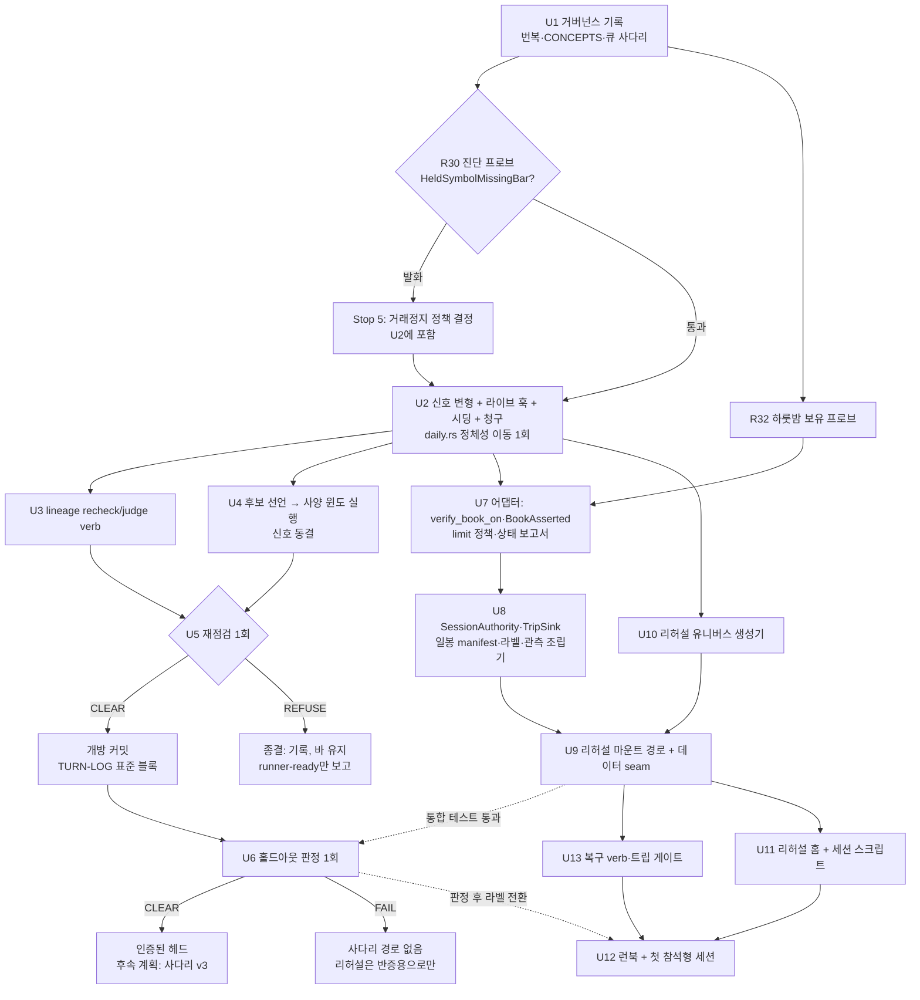
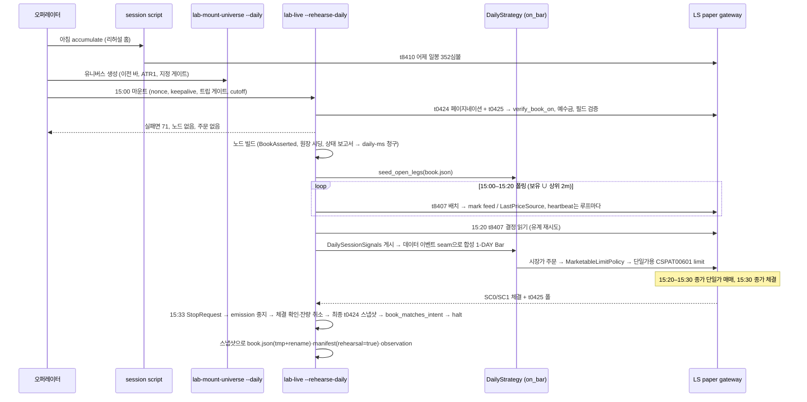
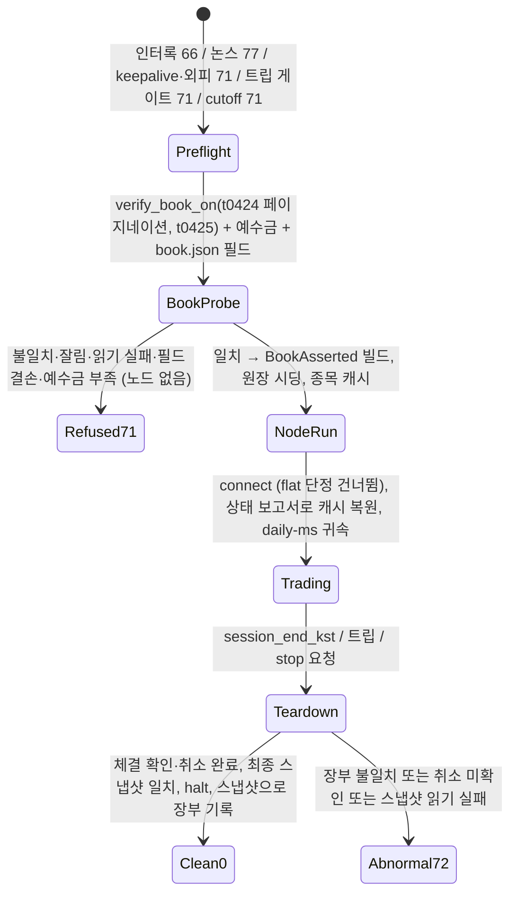

# Unblock Paper Trading via the Daily Lineage - Plan

## Goal Capsule

- **Objective.** 오퍼레이터가 후속 리니지 `daily-resolution-v1`의 전략을 LS 페이퍼 레인에서 **참석형 페이퍼 세션**으로 돌릴 수 있다. 세션은 포지션을 하룻밤 넘겨 보유하고, 안전 외피(킬스위치·데드맨·브레이커·워치독·fail-closed 티어다운) 아래에서 끝나며, 그 결과는 리니지의 등록된 효과와 비교 가능한 관측 기록으로 남는다. 같은 기간에 리니지는 사전 등록된 게이트(pre-turn admissibility re-check → 개방 → 단 1회의 홀드아웃 판정)를 통과하거나 거부된다.
- **Means.** 거버넌스 결정을 기록하고(KTD1, KTD2), 랭킹 신호를 사양 윈도에서 동결한 뒤 리니지를 개방하고 홀드아웃을 1회 판정하며(KTD7, KTD8, KTD9), 그와 병렬로 일봉 전략용 **페이퍼 리허설 러너**를 기존 마운트 안전 외피 위에 dispatch 체인 없이 세운다(KTD3~KTD6, KTD11, KTD13~KTD15).
- **Authority.** 동결 아티팩트 `adapters/nautilus/lab/config/lineage-preregistration.json`(해시 `0ecd9d11…`)과 `CONCEPTS.md`의 Lineage closure / Search budget 규칙이 최상위. 그 아래 2026-08-10-001 스코프 계획(R20 재점검, R21 페이퍼 스테이지), 2026-08-15-001 P7 계획, 2026-08-27-1453 검증 아크 계획. 이 계획은 08-27 계획의 결정 한 가지(일봉 동결 미개방)를 기록된 행위로 번복한다(KTD1). 프로즌 아티팩트는 바이트 동일하게 유지한다.
- **Stop conditions.** (1) 재점검이 REFUSE를 내면 개방하지 않고 기록한다. 바를 낮추거나 재도출로 우회하지 않으며, 다른 후보로 재점검을 다시 돌리지 않는다. REFUSE는 이 리니지에 대해 이 계획의 종결이다. (2) 홀드아웃 판정이 허들에 못 미치면 인증된 헤드는 없다. 리허설은 드라이버 반증 목적으로만 계속되고 사다리 경로는 열리지 않는다. (3) 리허설 세션에서 안전 트립이 나면 세션은 ABNORMAL로 끝나고, 트립이 논스 게이트 verb로 해제될 때까지 다음 마운트는 거부된다. (4) `rederivation_trigger`가 발화하면(카탈로그 핑거프린트, pit-universe 해시, 캘린더 아티팩트 변화, 또는 재점검 측정값이 등록된 투영 바를 움직이는 경우) 판정 전 모든 수치를 재도출한다. (5) R30 프로브가 실제 352심볼 카탈로그의 사양 윈도에서 `HeldSymbolMissingBar`를 발화시키면 백테스트의 거래정지 정책(abort 유지 vs 라이브의 보유 유지에 맞춤)을 오퍼레이터가 결정한 뒤에만 U2를 시작한다. 그 결정은 코드 해시 이동이라 U2와 같은 이동에 들어간다.
- **Execution profile.** 혼합. U1, U4, U5, U6, U12와 R30·R32 프로브는 오퍼레이터 참석형 거버넌스·실행 행위이고, 나머지는 게이트가 걸린 코드 턴이다. 조달 아크(`arc-*` 큐 항목)는 이 계획과 병렬로 계속되며 이 계획이 막지 않는다.
- **Tail ownership.** 인증된 헤드 이후의 사다리 재진입(prereg v3 재등록, rung-0 페이퍼 청결 술어(08-27 계획 U5~U7))은 이 계획 밖이다. 후속 계획이 소유한다.

---

## Product Contract

### Summary

일봉 리니지를 지금 개방하는 절차를 시작하고, 홀드아웃 판정과 병렬로 일봉 전략의 페이퍼 리허설 러너를 세운다. 러너는 기존 마운트의 안전 외피를 재사용하되 dispatch 체인을 요구하지 않고, 16세션 보유를 위해 세션 종료 시 청산하지 않으며, 연속 매매가 끝나는 15:20에 t8407 행을 합성 일봉으로 만들어 전략의 `on_bar`에 전달하고, 그 주문을 15:20~15:30 종가 단일가 매매에 넣어 당일 종가에 체결시킨다. 판정 전 세션은 타입이 있는 필드로 "증거 없음"으로 표시된다. 큐에는 이 사다리가 stage되고, 각 턴은 진입 시 개별 계획으로 상세화된다.

### Problem Frame

2026-09-08 기준 열린 전략 리니지가 없다(`adapters/nautilus/lab/TURN-LOG.md` 표준 블록). ORB는 탐지 불가능성 판정으로 CLOSED이고, 후속 `daily-resolution-v1`은 2026-08-15에 동결됐지만 08-27 계획의 결정으로 조달 판정 뒤까지 미개방이다. 페이퍼 세션(`lab-live --mount`)은 유효한 dispatch를 요구하고, dispatch는 인증된 헤드 뒤에 오는 사다리 재등록을 요구하므로, 페이퍼까지의 사슬은 외부 벤더 리드타임에 걸려 있다. 자세한 사슬은 `docs/operator-docs/20260908-1139-paper-trading-blocker.html`에 있다.

코드 쪽에는 사슬과 별개의 갭이 있다. `adapters/nautilus/lab/src/runner/live.rs`의 마운트는 `OrbStrategy`와 분봉에 묶여 있고, 라이브 데이터 클라이언트는 바를 배달하지 않으며(`subscribe_bars` 없음), `DailyStrategy`의 랭킹 신호는 placeholder이고, 어댑터는 시장가 주문을 거부하며, 세 곳(어댑터 `connect()`, dispatch `flat_start`, 티어다운 `is_flat`)이 계좌가 flat임을 단정한다. 어댑터가 포지션 상태 보고서를 내지 않아 재시작한 노드의 캐시에는 포지션이 없고, 보고서를 내더라도 nautilus는 청구되지 않은 포지션을 `EXTERNAL` 전략에 귀속시킨다. 실행 클라이언트는 Netting OMS인데 일봉 백테스트 베뉴는 Hedging이다. 재점검·판정을 실행하는 verb도 없다. 즉 결정을 번복해도 코드 없이는 페이퍼 세션이 열리지 않는다.

### Key Decisions

- **일봉 리니지를 조달 판정보다 먼저 개방한다.** (session-settled: user-directed — chosen over 조달 판정까지 대기: 벤더 리드타임이 무제한이고 페이퍼가 최우선이므로, 번복을 기록된 거버넌스 행위로 남기고 조달은 병렬로 진행한다.) Governs R1, R2, R3.
- **페이퍼 리허설은 홀드아웃 판정과 병렬로 허용한다.** (session-settled: user-directed — chosen over 판정 통과 후에만: 동결 아티팩트는 판정 후 스테이지를 성공 라벨 조건으로 둘 뿐 그 전의 드라이버 점검을 금지하지 않는다. 판정 전 세션은 증거가 아니다.) Governs R4, R5, R20, R28.
- **리허설은 마운트 안전 외피만 재사용하고 사다리 dispatch를 요구하지 않는다.** (session-settled: user-directed — chosen over prereg v3 재등록 후 rung-1 dispatch: 인증된 헤드 전엔 밴드를 도출할 분포가 없다.) Governs R12, R13, R14, R25, R27.
- **우산 계획 1개와 큐 사다리로 진행한다.** (session-settled: user-directed — chosen over 워크스트림별 계획 여러 개: 2026-08-10-001의 P0~P7 관례를 따른다.) Governs R3.
- **결정은 연속 매매 종료 시각 15:20에 동결된 `daily.rs`가 내리고, 주문은 종가 단일가 매매에 들어간다.** KRX는 2016-08-01부터 15:20에 연속 매매를 끝내고 15:20~15:30 단일가 매매로 15:30 종가를 결정한다(`docs/research/krx-part-a-public-pass-findings.md`, `docs/solutions/conventions/exchange-rule-constants-need-an-effective-date-switch-before-history-is-acquired.md`). 15:20의 t8407 행을 합성 일봉으로 전략에 전달하면 `on_bar`가 결정하고, 그 주문이 단일가에 들어가 당일 종가에 체결되므로 동결 메커니즘(종가 진입·청산)과 일치한다. 기각한 대안: 러너가 규칙을 재구현(헤드 정체성 이탈), 다음 시가 실행(메커니즘 이탈), 15:40~16:00 시간외 종가매매(단일가가 이미 종가 체결을 주므로 불필요). Governs R15, R16, R18, R21, R22.
- **하룻밤 보유의 안전 상태는 "flat"이 아니라 "장부 일치"다.** 장부의 진실은 브로커 읽기(t0424)이며 `book.json`은 그 확인의 기록이다. Governs R17, R18, R19, R26.

### Actors

- A1. **오퍼레이터** — 거버넌스 결정을 기록하고 서명한다. 사양 윈도 신호 선택과 홀드아웃 판정을 실행한다. 리허설 세션에 참석하고 keepalive를 유지하며, 트립 해제와 장부 채택 verb를 논스로 실행한다. `.env.calendar`와 페이퍼 레인 자격 증명을 보유한다.
- A2. **에이전트** — 코드 유닛, 큐 조작(`lab-next`), 재점검·판정 verb, 관측 기록의 작성자.
- A3. **LS 페이퍼 게이트웨이** — t8410 일봉, t8407 진행 중 시세, CSPAT00601/00701/00801 주문, t0424/t0425 잔고·미체결, SC0/SC1 체결 스트림.

### Requirements

**거버넌스**

- R1. 08-27 계획의 "일봉 동결은 견적 통과 전까지 미개방" 결정의 번복은 TURN-LOG의 날짜 있는 거버넌스 항목과 큐 supersede/re-note로 기록된다. 그 항목은 번복이 무엇을 소비하는지도 적는다. 리니지의 단 1회 홀드아웃 판정과 조달 실패 시 fallback 역할, 조달이 통과할 때 #241 에포크가 one-lineage 규칙 아래 이 리니지 뒤에 줄을 서는 것, 08-27 R18의 선택세 리셋 가용성이다.
- R2. 개방은 재점검이 CLEAR한 뒤의 별도 커밋이며, TURN-LOG 2026-08-15 항목에 사전 작성된 표준 블록 문안을 기계적으로 적용한다. `lineage-preregistration.json`과 `preregistration.json`은 바이트 동일하게 남는다.
- R3. 이 계획의 사다리는 `lab-next`로 큐에 stage되고, 프런티어 항목이 priority 마커를 받으며, `rung1-ladder-reentry-successor-margin-head`, `arc-procurement-verdict`, `orb-cost-artifact-hash-and-head-identity`의 unblock 문안은 번복을 반영해 re-note된다. 마지막 항목은 ORB/사다리 페이퍼 세션만 막고 리허설은 막지 않는다는 사실을 적는다.
- R4. `CONCEPTS.md`에 "Paper rehearsal"(참석형, 판정 전, 증거 없음, 사다리 밖이며 어떤 rung의 N에도 세지 않음) 항목이 추가되고 "prospective paper stage"와의 관계가 한 문장으로 적히며 Production ladder 항목에서 상호 링크된다.
- R5. 리허설 세션의 manifest와 data-quality 보고서는 타입이 있는 `rehearsal: Option<bool>` 필드를 가지며, 등록된 소비자(레지스트리 분할, governance 보고서 거부)가 그 필드를 읽는다. 산문 라벨은 라벨이 아니다.

**턴 1: 신호 동결, 재점검, 판정**

- R6. 랭킹 신호는 `DailyParams`의 동결 가능한 변형(variant)으로 선택되며, 후보 구현은 모두 해시되는 소스(`daily.rs` 또는 `DAILY_SOURCE`에 연결된 `daily_signal.rs`)에 있어 신호 선택이 코드 해시가 아니라 일봉 파라미터 해시를 움직인다.
- R7. 후보 신호 목록, 각 후보의 워밍업 룩백, 선택 기준(거래비용 모델 장착 net RoR, 동결된 손절 규칙), 동률 규칙은 첫 **후보 평가** 실행 전에 TURN-LOG에 선언된다. R30 프로브는 비평가 진단 실행이라 이 게이트에 앞선다. 사양 윈도(2016-08-01 ~ 2019-12-31)만 관찰하며 홀드아웃은 판정 전 어떤 후보에도 노출되지 않는다. 재점검은 선언된 기준으로 선택된 후보의 실행에 대해 정확히 한 번 돌고, 다른 후보로 다시 돌리는 것은 새 사전 등록 행위다.
- R8. 재점검 verb는 사양 윈도 실행에서 이 리니지 자체의 ICC, 캘린더 세션 기준 세션당 거래 수, 세션 참여율을 측정해 바·헤어컷·허들을 재도출하고, **등록된** 효과(+0.0486 net RoR)가 통과하는지 CLEAR/REFUSE로 출력한다. 후보의 실현 RoR은 재점검 입력이 아니다. ICC는 실행의 거래 단위 기록(`performance.json`)에서 청산 세션을 클러스터로 계산하고, 참여율과 거래율은 워밍업 이후 세션에서 계산하며, 블록 길이는 16세션 이상이다.
- R9. 재점검 결과 중 하나라도 등록된 투영 바를 움직이면 `rederivation_trigger` (4)가 발화한 것으로 기록되고, 아티팩트 수정이 아니라 전면 재도출로 처리된다.
- R10. 판정 verb는 홀드아웃(2020-01-02 ~ 2026-05-20) 실행에 대해 `judge_holdout`을 호출한다. claim 전에 관측의 날짜 범위가 홀드아웃 윈도와 정확히 일치하는지, 카탈로그 핑거프린트가 동결 값과 같은지, 실행 manifest의 코드 해시와 일봉 파라미터 해시가 핀된 값 및 재점검이 CLEAR한 실행의 값과 같은지 확인한다. 원장은 커밋되는 `adapters/nautilus/lab/ledger/lineage-holdout-judgments.jsonl`이다. claim 행을 먼저 쓰고 판정값을 back-fill하며, claim 후 back-fill 전에 프로세스가 죽으면 같은 run id·핑거프린트·해시의 미완 claim은 재개해 back-fill할 수 있고 다른 실행은 거부된다.
- R11. 판정과 재점검은 2026-08-12에 동결된 352심볼 일봉 카탈로그(`config/daily-catalog-20160801-20260812.json`)에서만 실행되며, 그 홈은 판정 전에 전진(accumulate)되지 않는다. 판정 홈의 마커 파일이 accumulate 경로를 코드 수준에서 거부한다.
- R30. U2 전에 Placeholder 신호로 사양 윈도 전체를 한 번 실행하는 **비평가 진단 프로브**를 돌려 실제 카탈로그에서 `HeldSymbolMissingBar` 발화 여부와 실행 시간을 기록한다. 이 프로브는 후보 평가가 아니며 어떤 후보의 실행 가능성도 증명하지 않는다. 발화하면 Stop condition (5)에 따른다. 발화하지 않아도 후보 실행이 발화하면 같은 결정이 필요하므로, 후보 실행의 발화 역시 U5 전 정지 조건이다.
- R31. 백테스트는 `LS_BTD_SDATE` 이전의 워밍업 바를 신호 계산에만 쓰고, 진입과 관측 기록의 `data_range`는 윈도 안으로 한정한다. 홀드아웃 실행은 2019년 바로 워밍업하되 2020-01-02부터만 진입한다.

**페이퍼 리허설 러너**

- R12. 리허설 진입점은 페이퍼 인터록(종료 66), 참석/논스 게이트(77), keepalive 파일, 워치독 한계, `live_guard`, `run_live_session` 외피, `run_teardown`의 halt-last 순서를 그대로 재사용한다.
- R13. 리허설은 dispatch 체인을 열지도 쓰지도 않는다. `spawn_watchdog`, `session_liveness_loop`, tracking 사이드카의 세 체인 접근 지점은 모두 트립 싱크 추상화로 대체되거나 리허설에서 건너뛴다. 안전 트립과 세션 spend는 `<data_home>/rehearsal/` 아래 원장에 기록된다.
- R14. 리허설 외피 설정 파일은 `heartbeat_interval_secs`, `session_max_loss_krw`, `breaker_basis`(당일 손익), `decision_time_kst`(15:20), `session_end_kst`(15:30 단일가 체결 확인 후, 기본 15:33), `mount_cutoff_kst`, `marketable_ticks`, `poll_symbol_policy`, `closing_auction`(15:20~15:30, 효력일 2016-08-01)을 담는다. `preregistration.json`은 읽지 않는다. 포지션 크기는 동결된 `notional_per_position`이며 rung fraction은 존재하지 않는다.
- R15. 15:20에 러너는 t8407 25심볼 배치 읽기로 당일 open/high/low/price/volume을 얻어 심볼당 하나의 1-DAY `Bar`로 합성하고, 세션 신호를 먼저 게시한 뒤 노드의 데이터 이벤트 경로로 전달해 전략의 `on_bar`가 정확히 한 번 호출되게 한다. `on_bar`가 진입·손절·보유 만료를 결정하고 주문을 낸다. 러너는 규칙을 평가하지 않는다.
- R16. `daily.rs`는 백테스트와 같은 시장가 주문을 내고, 어댑터의 실행 클라이언트 정책이 시장가를 종가 단일가에 들어가는 limit으로 변환한다. 매수는 15:20 현재가 + k틱을 틱 그리드로 올림, 매도는 − k틱 내림, 캐시된 종목 정보의 당일 상하한가로 클램프한다. 현재가는 lab이 주입한 가격 소스에서 온다. `close_position` 경유 청산도 같은 정책을 탄다. 15:30 단일가에서 체결되지 않은 주문은 취소되거나 거래소가 만료시키며, 둘 다 취소로 취급해 divergence 행(limit vs 종가)으로 기록한다.
- R17. 장부 일치는 두 단계다. 마운트 전에 lab이 공유 SDK로 t0424(`cts_expcode` 페이지네이션, `janqty` 기준)와 t0425를 기대 장부와 대조하고, 예수금이 (빈 슬롯 × `notional_per_position`) 이상인지 확인하며, `book.json`의 각 레그가 필수 필드(진입 세션 서수, 진입가, 손절가, 수량, 진입 ClientOrderId, `entered_under`)를 갖고 내부적으로 일관된지(서수 ≤ 오늘, 손절가 > 0) 검사한다. 불일치·잘림·읽기 실패·필드 결손·예수금 부족이면 노드를 만들지 않고 종료 71로 거부한다. 어댑터는 `StartPosture::BookAsserted`로 `connect()`의 flat 단정만 건너뛴다. 기본 모드(flat 단정)는 변하지 않는다.
- R18. 티어다운은 청산 주문을 내지 않는다. 순서는 emission 중지 → 15:30 단일가 체결 확인(t0425를 미체결이 없어질 때까지 유계 폴링, 남으면 취소) → 최종 t0424 스냅샷 읽기 → 그 스냅샷으로 장부 일치 확인(positive-only) → halt. 같은 스냅샷이 `book.json`의 원천이다. 장부 불일치나 취소 미확인은 ABNORMAL이며 종료 72다.
- R19. 보유 레그(심볼, 진입 세션 서수, 진입가, 손절가, 수량, 진입 ClientOrderId, `entered_under` 라벨)는 데이터 홈의 리허설 장부에 세션 간 영속화된다. 장부는 티어다운의 최종 t0424 스냅샷에서 쓰고(tmp + rename, `session_date`·`run_id` 스탬프), 스탬프가 직전 증명된 거래 세션이 아니면 마운트에서 거부된다. 세션 서수는 어제까지 증명된 세션 수 + 1이다. 포지션 id는 영속화하지 않고 Netting 규칙 `{instrument}-{strategy}`로 도출한다.
- R20. 보유 심볼의 당일 진행 중 일봉이 없으면(거래정지 등) 세션을 중단하지 않고 보유를 유지하며 타입이 있는 data-quality gap 행을 남긴다. 백테스트의 abort 정책은 라이브에 적용되지 않는다.
- R21. 데드맨 runtime heartbeat는 러너 폴링 루프의 반복마다 갱신되고, 마크 피드는 보유 심볼 ∪ 순위 상위 2×target_m(동결 `target_m = 8`)만 폴링한다. 결정 읽기가 스로틀되면 유계 재시도 후 "결정 없음"(보유 유지)으로 끝나며 트립이 아니다.
- R22. `DailyStrategy`는 emission gate, heartbeat, mark feed, 초기 보유 시딩, 라이브 전용 `external_order_claims`, 명시적 `oms_type`을 갖되, 이 훅은 재점검·판정 실행보다 먼저 착지해 판정된 코드 해시와 리허설된 코드 해시가 같다. 바 전달은 전략이 아니라 lab 측 데이터 클라이언트 seam이 담당한다.
- R27. 리허설 트립 원장의 마지막 행이 해제되지 않은 `Engage`면 다음 마운트는 거부된다. 논스 게이트 verb `--rehearsal-clear-trip`이 원인 문자열과 함께 `Clear` 행을 쓴다. 논스 게이트 verb `--rehearsal-book adopt`는 먼저 t0425의 미체결을 모두 취소해 빈 것을 확인한 뒤 t0424 읽기로 장부를 다시 쓰고 divergence 행을 남긴다. 장부는 손으로 편집하지 않는다.
- R28. manifest는 `paper_stage: Option<bool>`도 가진다. 홀드아웃 CLEAR 이후의 세션은 `rehearsal: false, paper_stage: true`로 열리고, `entered_under: rehearsal`인 레그의 청산은 paper-stage 행에서 제외된다. 첫 paper-stage 세션 전에 divergence 상한(결정가 대비 체결가 차이의 손절 폭 대비 비율)을 TURN-LOG에 선언하고, 상한을 넘는 세션은 비교에서 제외한다.
- R29. 라이브 OMS는 Netting으로 명시되고, 마운트된 종목은 `external_order_claims`로 청구되어 재구성된 포지션이 `daily-ms`에 귀속된다. 복원된 레그의 손절 청산은 포지션을 줄이며 절대 반대 방향으로 뒤집지 않는다. 복원된 레그에서 발생하는 `PositionOpened`는 패닉이 아니라 시딩된 레그와 결합된다.
- R32. U7 전에 오퍼레이터가 페이퍼 계좌에서 소액 매수 1건을 하룻밤 보유하고 다음 세션의 t0424 행과 예수금을 TURN-LOG에 기록한다. 포지션이 리셋되면 이 계획의 U7~U13 설계는 재검토된다.
- R33. `mount_cutoff_kst` 이후의 마운트는 거부된다. 장 시간이 바뀐 날(수능일 등)은 외피 파일이 그 날짜의 시각을 명시하지 않으면 stand-down한다.

**데이터와 운영**

- R23. 리허설은 판정 홈을 복제한 별도 리허설 홈에서 거래하며, 그 홈만 매 세션 t8410 accumulate로 전진한다. 복제는 lock 파일을 복사하지 않는다.
- R24. 리허설 유니버스 생성기는 카탈로그의 이전 세션 일봉으로 순위 목록과 ATR(1)을 만들고, 해시로 바인딩된 universe-metadata 아티팩트의 designation으로 라이브 지정 게이트(`is_tradable`)를 적용한다. t8407 시가 읽기는 하지 않는다.
- R25. 리허설 전용 런북이 세션 순서, 환경 변수, 종료 코드 계약(0/66/71/72/77), 재시작 절차, 트립 후 복구, 장부 채택, 장 시간 변경일 규칙, 판정 전 세션의 학습 계약(드라이버·런북 수정만 유발, 파라미터·전략 수정은 유발하지 않음)을 적는다. `session-morning.sh`는 데이터 홈과 프로필을 매개변수로 받아 일봉 홈의 아침 accumulate와 마감 전 프리플라이트를 수행하되 `lab-live`는 절대 호출하지 않는다.
- R26. 리허설 세션의 관측 기록은 `RunObservation`과 같은 세션 행 형태로 실현 손익과 risk capital(체결 수량 기준)을 남기고, 등록된 효과와의 비교 보고서는 거래비용 모델(`config/transaction-costs.json`)을 적용한 net 기준으로 산출하며 거래정지일 divergence 클래스를 별도로 표시한다.

### Key Flows

- F1. 리니지 개방
  - **Trigger:** U1 거버넌스 기록 완료.
  - **Actors:** A1, A2
  - **Steps:** R30 진단 프로브 → (필요 시 거래정지 정책 결정) → U2 정체성 이동 → 후보 선언(TURN-LOG) → 사양 윈도 후보 실행 → 신호 동결(상수 핀) → 선택 실행에 재점검 1회 → CLEAR면 개방 커밋 / REFUSE면 기록 후 종결.
  - **Covered by:** R2, R6, R7, R8, R9, R30, R31
- F2. 홀드아웃 판정
  - **Trigger:** 개방 커밋 착지, 그리고 U9 통합 테스트가 U2의 훅 집합으로 충분함을 증명.
  - **Actors:** A1, A2
  - **Steps:** 동결 카탈로그 핑거프린트 확인 → 홀드아웃 실행(비용 모델 장착, 2019년 워밍업) → 판정 verb(해시·범위·핑거프린트 검사 → claim → back-fill) → 원장 커밋 → TURN-LOG 항목.
  - **Covered by:** R10, R11, R31
- F3. 리허설 세션 하루
  - **Trigger:** 오퍼레이터가 마감 전 창에 참석.
  - **Actors:** A1, A3
  - **Steps:** 아침 accumulate(어제 일봉) → 유니버스 생성 → 15:00 마운트(트립 게이트, cutoff, 장부·예수금·필드 프로브 71) → 노드 빌드(장부 시딩, 상태 보고서로 캐시 복원, `daily-ms` 청구) → 15:00~15:20 폴링(heartbeat, 마크) → 15:20 합성 바 전달 → `on_bar` 결정 → 단일가용 limit 변환 주문 → 15:30 단일가 체결 → 15:33 티어다운(체결 확인·취소·최종 스냅샷·장부 일치·halt) → 스냅샷으로 장부 기록 → 관측 기록.
  - **Covered by:** R12~R29, R33
- F4. 복구
  - **Trigger:** 트립, 크래시, 지연 체결, 상장폐지, 미체결 잔류 등으로 장부와 브로커가 어긋남.
  - **Actors:** A1
  - **Steps:** 원인 기록 → `--rehearsal-clear-trip`(트립인 경우) → `--rehearsal-book adopt`(미체결 취소 → 장부 재작성 → divergence 행) → 다음 세션 마운트.
  - **Covered by:** R27

### Acceptance Examples

- AE1. Covers R8, R9.
  - **Given** 사양 윈도 실행의 거래 기록과 관측 기록,
  - **When** 재점검 verb가 청산 세션 클러스터로 ICC 0.60을 측정하면,
  - **Then** 재도출된 요구 세션 수가 S_max를 넘어 REFUSE가 출력되고, 아티팩트는 수정되지 않으며, 출력이 측정값과 등록된 투영값을 나란히 인용한다.
- AE2. Covers R10.
  - **Given** 홀드아웃 실행이 2020-01-02 ~ 2026-05-19로 끝난 관측 기록,
  - **When** 판정 verb를 호출하면,
  - **Then** 원장에 아무것도 쓰지 않고 날짜 범위 불일치로 거부한다.
- AE3. Covers R17.
  - **Given** 리허설 장부가 128개 보유를 기대하고 t0424가 여러 페이지에 걸쳐 127개만 보고할 때,
  - **When** 리허설 마운트가 사전 장부 프로브를 돌리면,
  - **Then** 노드를 만들지 않고 어떤 주문도 내지 않으며 누락 심볼을 인용하고 종료 71로 거부한다.
- AE4. Covers R13.
  - **Given** genesis가 없는 데이터 홈에서 리허설 세션의 브레이커가 트립될 때,
  - **When** 트립이 기록되면,
  - **Then** `<data_home>/dispatch/` 디렉터리가 생성되지 않고, tracking 사이드카도 쓰이지 않으며, 리허설 원장에 `Engage` 행이 남고 세션은 72로 끝난다.
- AE5. Covers R5.
  - **Given** `rehearsal: true`인 라이브 일봉 실행,
  - **When** `lab-research report`가 그 실행을 근거로 governance 판정을 시도하면,
  - **Then** 증거 없음 사유로 거부한다.
- AE6. Covers R16, R18, R26.
  - **Given** 15:20에 단일가로 낸 매수 limit 8건 중 2건이 15:30 종가보다 낮은 limit이라 체결되지 않았을 때,
  - **When** 15:33 티어다운이 돌면,
  - **Then** 미체결 2건은 취소(또는 만료) 확인 후 divergence 행(limit vs 종가)으로 기록되고, 체결 6건은 최종 t0424 스냅샷에서 장부로 기록되며 risk capital은 체결 수량이다.
- AE7. Covers R20.
  - **Given** 보유 심볼 하나가 당일 거래정지로 t8407 행이 비었을 때,
  - **When** 결정 시각이 지나면,
  - **Then** 그 레그는 보유 유지, gap 행 기록, 나머지 심볼의 결정은 정상 진행한다.
- AE8. Covers R19, R22, R29.
  - **Given** 어제 진입해 장부에 기록된 레그의 손절가가 오늘 합성 바의 저가보다 높을 때,
  - **When** 오늘 세션이 그 레그를 시딩하고 상태 보고서로 캐시를 복원한 뒤 합성 바를 전달하면,
  - **Then** 캐시의 포지션은 `daily-ms`에 귀속되어 있고, `on_bar`가 손절 청산을 내며 그 주문은 단일가용 limit으로 게이트웨이에 도달하고 포지션은 줄어들며 반대 방향으로 열리지 않는다.
- AE9. Covers R21.
  - **Given** 15:20 결정 읽기가 IGW00201로 세 번 연속 스로틀될 때,
  - **When** 유계 재시도가 끝나면,
  - **Then** 트립 없이 "결정 없음"이 기록되고 보유는 유지되며 세션은 티어다운으로 정상 종료한다.
- AE10. Covers R27.
  - **Given** 어제 세션이 브레이커 트립으로 끝나고 `Clear` 행이 없을 때,
  - **When** 오늘 리허설 마운트를 시도하면,
  - **Then** 논스 게이트와 무관하게 거부되고 트립 행을 인용한다.
- AE11. Covers R10.
  - **Given** 판정 verb가 claim 행을 쓴 직후 프로세스가 죽은 원장,
  - **When** 같은 run id로 판정 verb를 다시 호출하면,
  - **Then** 미완 claim을 재개해 back-fill 행을 쓰고, 다른 run id로 호출하면 거부한다.

### Success Criteria

이 계획은 두 완료 상태를 따로 보고한다. 둘 다 이 계획의 정당한 종결이지만 의미가 다르다.

- **runner-ready:** 참석형 리허설 세션이 종료 0으로 끝나고, 다음 세션의 장부 프로브가 통과하며, 복원된 레그가 2일차 세션의 포지션 캐시에 `daily-ms`로 시딩되어 `on_bar`가 각 레그를 영속화된 손절가와 비교한 결정 기록을 남긴다. 2일차 손절 주문 경로 자체는 U9의 AE8 통합 테스트가 증명한다. 리허설 세션 중 어떤 순간에도 dispatch 체인 디렉터리가 생성되거나 변하지 않는다. 오퍼레이터가 런북만으로 정상 시작·종료와 복구 경로를 도움 없이 수행한다.
- **lineage-authorized:** 재점검 CLEAR가 측정값과 함께 TURN-LOG에 기록되고 리니지가 열렸으며, 홀드아웃이 정확히 1회 판정되어 커밋된 원장에 claim + back-fill 행이 있다. 재점검 REFUSE는 이 상태를 달성하지 못한 종결이며 "runner-ready"만으로 페이퍼 트레이딩 목표가 완료됐다고 보고하지 않는다.

### Scope Boundaries

**Deferred to Follow-Up Work**

- 사다리 재진입: prereg v3 재등록, `RUNG1-PREFLIGHT.md` 리터럴 이동, rung-0 페이퍼 청결 술어(08-27 계획 U5~U7). 인증된 헤드가 생긴 뒤의 별도 계획. `orb-cost-artifact-hash-and-head-identity`는 ORB/사다리 페이퍼 세션만 막고 리허설은 막지 않는다(일봉 헤드 정체성은 U2에서 이동하고 리허설은 dispatch 청결 술어를 쓰지 않는다).
- 리허설 divergence(15:20 결정가 vs 종가, 체결률)로 tracking-error band를 라이브 보정하는 작업. 데이터가 쌓인 뒤.
- `make next`/`lab-next`가 진행 중인 리허설 시퀀스와 다음 행위를 표시하는 리더. 첫 세션 뒤. 그 전까지 리허설 상태는 런북과 리허설 원장이 보여준다.
- 2016 이전 Unknown 캘린더 3일, `next.rs`/`queue/mod.rs` 분할, AGENTS.md 동사 열거. 큐에 이미 있다.
- 조달 아크(`arc-*`). 병렬로 계속되며 이 계획이 소유하지 않는다.

**Outside this plan**

- 라이브 레인(실자금) 전환. 리허설은 `LS_TRADING_ENV=paper`에서만 돈다.
- 홀드아웃 재판정이나 N_max 상향. 새 사전 등록이다.
- ORB 리니지 재개. 폐쇄 규칙이 금지한다.

### Dependencies / Assumptions

- LS 페이퍼 계좌가 포지션을 하룻밤 보유하고 다음 세션 t0424에 그대로 보고한다. R32 프로브가 U7 전에 확인한다.
- 페이퍼 계좌 예수금이 정상 상태 노출 100,000,000 KRW(128 × 781,250) 이상이다. R32 프로브에서 읽고, 매 마운트의 예수금 프리플라이트(R17)가 이어서 확인한다.
- 리허설 기간 동안 리허설 레인의 계좌는 flat이 아니다. `.env.domestic`을 쓰면 그 레인의 flat 게이트 harness(dispatch flat-start, guarded paper order, position-creating flip)는 리허설 기간에 정지된다. 두 번째 페이퍼 자격 증명으로 `.env.rehearsal` 레인을 만들 수 있는지는 Outstanding Question이다.
- LS 페이퍼 레인이 15:30 종가 단일가 체결을 실제 시장과 같이 재현하고, t8407 `price`가 15:20~15:30에 마지막 연속 체결가 또는 예상 체결가 중 무엇을 주는지는 U12의 첫 `--stop-before-orders` 세션이 기록한다.
- 페이퍼 계좌는 리허설 시작 시 flat이다. 아니라면 첫 세션 전에 오퍼레이터가 정리한다.
- 지정(designation) 원천은 해시 바인딩된 universe-metadata 아티팩트다. pit-universe 아티팩트는 지정을 담지 않을 수 있다.
- nautilus 0.60의 `generate_position_status_reports`는 `avg_px_open`이 있는 보고서만 포지션으로 만들고, `external_order_claims`로 청구된 종목의 포지션을 그 전략에 귀속시킨다. U7이 통합 테스트로 확인한다.

### Outstanding Questions

- **Deferred (판정 후):** 홀드아웃이 CLEAR한 뒤 리허설 세션을 소급해 prospective paper stage로 분류할 수 있는가? 동결 텍스트는 판정 후 전진 실행을 말하므로 소급하지 않는다. R28이 이 답을 가정한다.
- **Deferred (U4 진입 시):** 후보 신호 수 K와 워밍업 길이. K ≤ 6을 가정한다. 사양 윈도 1회 실행 시간은 R30 프로브가 측정한다.
- **Deferred (U4 진입 시):** 사양 윈도를 선택 구간과 검증 구간으로 나눌 것인가. 재점검은 후보의 실현 RoR이 아니라 등록된 효과와 측정된 클러스터링만 쓰므로(R8) 선택 오염은 재점검 결과에 직접 들어가지 않는다. 다만 참여율·ICC는 선택된 신호에 의존하므로, 분할이 필요하다고 판단되면 후보 선언 항목에 분할 규칙을 함께 선언한다.
- **Deferred (R32 이후):** 두 번째 페이퍼 자격 증명으로 `.env.rehearsal` 레인을 만들 수 있는가. 가능하면 `.env.domestic`의 flat 게이트 harness를 정지하지 않아도 된다.
- **Deferred (U12 진입 시):** 판정 전 리허설의 세션 케이던스와 홀드아웃 FAIL 이후 드라이버 반증 리허설의 세션 수 상한, 그리고 자발적으로 건너뛴 세션 중 열린 16세션 보유의 처리. 런북에 적는다.

### Sources / Research

- `docs/operator-docs/20260908-1139-paper-trading-blocker.html` — 블로커 사슬.
- `adapters/nautilus/lab/config/lineage-preregistration.json`, `LINEAGE-PREREGISTRATION.md` § The two gates — 재점검과 페이퍼 스테이지의 원문. `not_claimed`는 원장이 커밋되어 검토 가능함을 전제한다.
- `adapters/nautilus/lab/TURN-LOG.md` L7~26 표준 블록, L255~279 사전 작성된 개방 문안.
- `docs/research/krx-part-a-public-pass-findings.md` — 15:20 연속 매매 종료, 15:20~15:30 종가 단일가 매매.
- `docs/plans/2026-08-10-001-docs-next-strategy-lineage-scope-plan.md` — R20, R21, KD7 라이브 지정 정책, 클러스터링 표(m=10 손익분기 ICC ≈ 0.572), `target_m = 8`.
- `docs/plans/2026-08-15-001-feat-daily-multi-session-backtest-path-plan.md` — 일봉 경로 KTD, 마감가 체결 메커니즘, Hedging 베뉴(그 계획의 KTD12).
- `docs/plans/2026-08-27-1453-feat-orb-licensed-verdict-arc-plan.md` — 번복 대상 결정, R9/R17/R18, U7 페이퍼 술어 원문.
- `adapters/nautilus/lab/src/runner/live.rs` — `run_mount`, `prepare_mount`, `run_live_session`, `run_teardown`, `StopRequest`, `TripLatch`, `stage_and_finalize`, `mount_verdict`, `MountAuthorization`(구조체), `LiveSessionContext.params: OrbParams`.
- `adapters/nautilus/lab/src/runner/watchdog.rs` — `execute_trip`, `record_safety_trip`이 `DispatchChain`에 기록.
- `adapters/nautilus/lab/src/dispatch/chain.rs` — `DispatchChain::open`이 `dispatch/` 디렉터리를 생성.
- `adapters/nautilus/lab/src/dispatch/tracking.rs` — 사이드카가 `<home>/dispatch/reports/`에 기록.
- `adapters/nautilus/src/execution.rs` — `LsExecClient::connect` 첫 줄의 `verify_flat`, `submit_request`의 시장가 거부(주문 외 입력 없음), `OmsType::Netting`, 상태 보고서 훅 미구현, `check_flat_start_on`이 `cts_expcode`를 읽지 않음.
- `adapters/nautilus/src/data.rs` — `subscribe_trades`/`subscribe_quotes`만 구현. `DataClient::start`가 데이터 이벤트 sender를 잡는다.
- `adapters/nautilus/src/instruments.rs` — 캐시된 `Equity`의 당일 상하한가.
- `adapters/nautilus/src/rules.rs` — `tick_size`, `round_down_to_tick`. 가격제한폭 상수 없음.
- nautilus-live 0.60 `execution/manager.rs` — 청구되지 않은 포지션은 `EXTERNAL` 전략에 귀속, `avg_px_open` 없는 보고서는 무시. nautilus-trading 0.60 `strategy/config.rs` — `external_order_claims`.
- `adapters/nautilus/lab/src/strategy/daily.rs`, `params_daily.rs`, `runner/backtest_daily.rs`, `backtest_daily/{selection,handles}.rs` — `PLACEHOLDER_RANKING_SIGNAL`, 시장가 진입, `exit()`의 캐시 miss 시 조용한 반환, `on_position_opened`의 Long 단정, `HeldSymbolMissingBar`, 윈도 안 바만 적재.
- `adapters/nautilus/lab/src/runner/pnl.rs` — `Book::apply`가 선행 매수 없는 매도를 공매도로 기장.
- `adapters/nautilus/lab/src/lineage_prereg.rs` — `judge_holdout`, `specification_dry_run`, `judgment_ledger_path()`가 `CARGO_MANIFEST_DIR/ledger/`를 가리킴. 생산 호출자 0개.
- `adapters/nautilus/lab/src/stats.rs` — `clustering`(값 + 클러스터 id), `power_z`, `expected_max_null`, `block_bootstrap_ratio`.
- `adapters/nautilus/lab/src/runner/report.rs::report_sample` — `performance.json` 거래 기록으로 ICC 계산, 캘린더 세션 기준 `RateBasis`. 진입 귀속·1세션 블록·ORB 마진이라 그대로는 재사용 불가.
- `adapters/nautilus/lab/src/artifacts/manifest.rs` — `daily_strategy_code_hash`, `Manifest::new_daily`가 `RunSource::Backtest` 고정. 일봉 파라미터 해시 함수 없음.
- `crates/ls-sdk/src/market_session/quote.rs` `T8407OutBlock1` — price/open/high/low/volume. 상하한가 필드 없음. `crates/ls-sdk/src/account/holdings.rs` — t0424 `pamt`(평균 단가), `cts_expcode`.
- docs/solutions: `architecture-patterns/head-identity-hash-is-file-scoped-so-live-only-wiring-forces-a-rebaseline.md`, `architecture-patterns/live-session-teardown-must-share-the-nodes-arcs-and-capture-handles-before-build.md`, `conventions/kill-switch-ordering-in-order-placing-teardown.md`, `architecture-patterns/making-a-failure-graceful-can-delete-the-signal-that-detected-it.md`, `conventions/latch-a-stop-request-driver-side-nautilus-clears-its-own-stop-flag.md`, `conventions/suspend-vs-amend-frozen-governance-artifacts.md`, `conventions/backtest-derivable-vs-live-calibrated-bands.md`, `conventions/power-questions-three-traps-calendar-denominator-paired-se-and-cluster-size.md`, `conventions/range-scoped-comparability-scope-every-derived-input.md`, `logic-errors/t0424-zero-balance-row-reads-as-open-holding.md`, `workflow-issues/todays-session-cannot-be-ingested-tonight-the-krx-witness-is-retrospective.md`, `conventions/exchange-rule-constants-need-an-effective-date-switch-before-history-is-acquired.md`.

---

## Planning Contract

### Key Technical Decisions

- KTD1. **번복은 자체 거버넌스 항목이다.** (session-settled: user-directed — chosen over 개방 커밋에 암시: `suspend-vs-amend` 관례는 결정 변경을 별도 기록된 행위로 요구한다.) TURN-LOG 항목 + `lab-next supersede`/re-note. Cites R1, R3.
- KTD2. **리허설과 페이퍼 스테이지는 타입이 있는 필드로 구분된다.** (session-settled: user-directed — chosen over 판정 후 스테이지만: 드라이버 결함은 판정 뒤에 발견하면 두 번 비용을 치른다.) `Manifest`와 `DataQualityReport`에 `rehearsal: Option<bool>`, `paper_stage: Option<bool>`을 추가하고 레그에 `entered_under`를 둔다. 의미는 한 가지다. `None`은 U8 이전의 백테스트 시대 manifest이며 모든 소비자가 비리허설로 읽고, `Some(true)`만 리허설이며, `Some(false)`는 라이브 비리허설이다. `latest_finalized_run_for`는 `Some(true)`만 제외하고 governance 보고서는 `Some(true)`를 거부한다. Cites R5, R28.
- KTD3. **리허설 권한은 `SessionAuthority` 값이고 트립 싱크는 트레이트다.** (session-settled: user-directed — chosen over rung-1 dispatch 재사용: 분포 없는 밴드는 도출할 수 없다.) `MountAuthorization`은 사다리 타입으로 남기고, 사다리와 리허설이 모두 만드는 `SessionAuthority { run_id, lane_hash, trading_env, dispatch: Option<DispatchLink>, trips: Arc<dyn TripSink> }`를 `run_live_session`에 넘긴다. `TripSink`는 `watchdog.rs`에 두고 `ChainTripSink { chain, rung }`와 `RehearsalLedger { path }`가 구현하며, `spawn_watchdog`와 `session_liveness_loop`는 `data_home + chain_rung` 대신 싱크를 받아 `DispatchChain::open`을 호출하지 않는다. `run_mount`는 `runner/live/mount.rs`(사다리)와 `runner/live/rehearsal.rs`로 나뉘고 인터록·논스·외피·구동을 공유한다. `mount_verdict`는 리허설용 메시지 arm을 갖는다(`--clear-killswitch` 안내 없음). Cites R12, R13, R14.
- KTD4. **결정 입력은 15:20 t8407 합성 1-DAY 바이고, 결정 주체는 `daily.rs`이며, 체결은 15:30 종가 단일가다.** 15:20은 연속 매매의 끝이므로 t8407의 open/high/low/price/volume은 당일 연속 매매 구간의 바다. 그 바로 `on_bar`가 결정한 주문이 단일가 매매에 들어가 종가에 체결되므로, 동결 메커니즘(종가 진입·저가 손절·종가 청산)과의 divergence는 "15:20 결정가 vs 15:30 종가"와 "15:20까지의 저가 vs 종일 저가" 두 가지로 한정되고 둘 다 측정된다. Cites R15, R16, R21.
- KTD5. **시장가→단일가 limit 변환은 어댑터 정책이고 OMS는 Netting이다.** `daily.rs`는 백테스트와 같은 시장가 주문을 유지해 바이트 동일성을 지킨다. `LsExecClient`의 `MarketableLimitPolicy { ticks, prices: Arc<dyn LastPriceSource> }`가 시장가 `OrderInitialized`(진입과 `close_position` 청산)를 limit으로 변환한다. 현재가는 lab이 주입한 `LastPriceSource`(리허설의 `MarkFeed`, 15:00~15:20 폴링으로 갱신)에서, 클램프 밴드는 캐시된 `Equity`의 당일 상하한가에서 오고, 둘 중 하나라도 없으면 주문을 거부한다. 가격 도우미 `marketable_limit`은 `rules.rs`에 두고 매수는 틱 그리드로 올림, 매도는 내림한다. 단일가에서는 교차하는 limit이 모두 종가에 체결되므로 k는 체결 보장을 위한 여유이지 가격 결정 요소가 아니다. `DailyStrategy` 설정은 `oms_type = Netting`을 명시한다. Cites R16, R29.
- KTD6. **안전 상태 = 장부 일치, 술어와 자세를 분리한다.** 어댑터: `verify_book_on(sdk, &ExpectedBook)`를 `verify_flat_on` 옆의 자유 함수로 두고(flat = 빈 장부), t0424를 `cts_expcode`로 페이지네이션하며, `StartPosture::{Flat, BookAsserted}`에서 `BookAsserted`는 `connect()`의 `verify_flat` 호출만 건너뛴다. `ExpectedBook`은 심볼→수량만 담는다. Lab: `prepare_rehearsal`이 노드 빌드 전에 공유 SDK로 `verify_book_on`, 예수금 프리플라이트, `book.json` 필드 검증을 돌려 어느 하나라도 실패하면 71이고, 티어다운의 `book_matches_intent`도 같은 함수를 최종 스냅샷과 세션 후 기대 장부로 호출한다. 브로커가 확인할 수 없는 레그 필드(진입 서수, 손절가, `entered_under`)는 `book.json`이 권위이며 결손이면 adopt를 요구한다. 청산 주문은 절대 내지 않는다(halt-last의 전제). Cites R17, R18.
- KTD7. **헤드 정체성은 `daily_strategy_code_hash` + `daily_governed_params_hash`이며, 모든 라이브 훅은 판정 전 한 번의 이동에 착지한다.** U2가 옮기는 것: emission gate·heartbeat·mark feed 훅, 초기 보유 시딩(`seed_open_legs`), 복원 레그를 허용하는 `on_position_opened`, 라이브 전용 `external_order_claims`와 `oms_type` 설정(백테스트 경로의 `StrategyConfig`는 불변), `RankingSignalKind` 디스패치와 `signal_unavailable` 거부, 그리고 Stop condition (5)가 요구하면 거래정지 정책. `daily_governed_params_hash(&DailyParams)`를 새로 만들어 `identity_guards.rs`에 핀한다. 신호 구현이 커지면 `DAILY_SOURCE`를 `daily.rs` + `daily_signal.rs` 연결로 정의해 두 파일을 함께 해시한다. 판정 이후 두 파일을 건드리면 같은 버전 재베이스라인 등식 검사가 필요하다. U6은 U9의 통합 테스트가 이 훅 집합으로 하루를 구동한 뒤에만 돈다. Cites R6, R22.
- KTD8. **재점검과 판정은 `lab-research lineage <recheck|judge>` verb이며 구현은 `runner/lineage.rs`다.** `research.rs`는 두 줄 위임만 갖는다. ICC와 설계효과는 `performance.json`의 거래 기록(거래별 net r, 클러스터 = 청산 시각의 KST 세션)으로 `stats::clustering`을 호출해 계산하고, 비율 통계·세션 수·참여율은 `RunObservation`에서 읽는다. 16세션 블록 빌더를 새로 만든다. `judge`는 claim 전에 날짜 범위, 카탈로그 핑거프린트, 코드·파라미터 해시 등식을 확인하고, 원장은 `lineage_prereg::judgment_ledger_path()`(커밋되는 `lab/ledger/`)를 쓴다. 테스트만 환경변수로 임시 경로를 준다. claim 행은 run id·핑거프린트·해시를 담아 같은 실행의 미완 claim 재개를 허용한다. Cites R8, R9, R10.
- KTD9. **신호 선택은 파라미터 이동이고 동결은 상수 핀이다.** `DailyParams.ranking_signal: RankingSignalKind`는 `Placeholder`(placeholder: true, `#[serde(default)]`의 기본값)를 실제 변형으로 유지해 `judgment_arguments()`의 거부가 생산자를 잃지 않게 한다. U4의 선택은 `FROZEN_RANKING_SIGNAL: Option<RankingSignalKind>` 상수로 기록되고 `validate()`가 그 뒤 다른 변형을 거부한다. 각 변형은 워밍업 룩백을 선언한다. Cites R6, R7, R31.
- KTD10. **두 개의 일봉 홈.** 판정 홈은 2026-08-12 동결 카탈로그 그대로이며 `FROZEN-20260812` 마커 파일을 두어 accumulate 경로가 코드에서 거부한다. 리허설 홈은 그 복제본(lock 파일 제외)을 t8410 accumulate로 전진시킨다. `rederivation_trigger` (1)은 판정 턴이 선언하는 카탈로그에만 적용되고 리허설 홈의 전진에는 적용되지 않는다. Cites R11, R23.
- KTD11. **리허설 장부는 브로커 확인의 기록이다.** `<data_home>/rehearsal/book.json`은 티어다운의 최종 t0424 스냅샷에서 쓰고(tmp + rename, `session_date`·`run_id` 스탬프), 세션 시작 시 복원해 `seed_open_legs`로 전략에 주입한다. 원장이 아니라 계좌에서 쓰므로 지연 체결이 다음 세션의 71을 만들지 않는다. 세션 서수는 캘린더 스냅샷의 어제까지 증명된 세션 수 + 1이고, 보유 만료 창은 증명된 휴장이 아닌 날로 센다. 신선도는 직전 증명된 거래 세션 기준이다(월요일·연휴 뒤 포함). Cites R19.
- KTD12. **거래정지는 보유 유지.** 라이브에서 `HeldSymbolMissingBar`는 abort가 아니라 타입이 있는 `held_symbol_gaps` 행이다. 손절·만료 판정은 다음 유효 바에서 한다. 이 divergence 클래스(백테스트 abort vs 라이브 보유)는 비교 보고서가 별도 표시한다. Stop condition (5)가 백테스트 정책을 라이브에 맞추기로 결정하면 U2가 그 변경을 같은 정체성 이동에 넣는다. Cites R20, R26.
- KTD13. **브레이커 기준은 당일 손익이고 원가는 장부에서 시딩한다.** `FillLedger`는 프로세스별이라 전날 레그의 원가가 없고, `pnl::Book::apply`는 선행 매수 없는 매도를 공매도로 기장한다. 리허설은 노드 빌드 시 장부 레그를 합성 체결로 원장에 시딩하고, 관측 조립기는 당일 실현 + (마크 − 이전 종가) × 수량을 `session_max_loss_krw`와 비교한다. `MarkPolicy`의 손절가 폴백은 장부의 손절가를 쓴다. Cites R14.
- KTD14. **어댑터가 포지션·주문 상태 보고서를 내고, 전략이 종목을 청구한다.** `LsExecClient`에 `generate_position_status_reports`(t0424 `janqty > 0` 행마다, `signed_decimal_qty = janqty`, `avg_px_open = pamt`, `pamt` 파싱 실패 시 fail closed)와 `generate_order_status_reports`(t0425)를 구현한다. nautilus는 청구되지 않은 포지션을 `EXTERNAL`에 귀속시키므로 `DailyStrategy`의 라이브 설정이 `external_order_claims = 마운트된 종목`을 갖고, `seed_open_legs`는 포지션 id를 `{instrument}-{strategy}` 규칙으로 도출한다. 청구 범위는 마운트된 전체 종목이며, 청구되지 않은 종목의 예상치 못한 포지션은 사전 장부 프로브가 71로 거부한다. 캐시에 종목이 없으면 조정이 조용히 건너뛰므로 KRX `Equity`가 시작 전에 캐시되어 있음을 통합 테스트가 단정한다. Cites R19, R29.
- KTD15. **바 전달은 lab 측 데이터 클라이언트 seam이다.** `DailyStrategy::on_start`가 구독한 1-DAY 바 타입으로 `DataEngine`이 `on_bar`를 호출하게 하려면 노드의 데이터 이벤트 sender로 보내야 한다. lab의 `RehearsalDataClient`(`LsDataClient` 래퍼)가 `start()`에서 `get_data_event_sender()`를 잡아 `live_daily.rs`에 노출하고, 러너가 `DataEvent::Data(Data::Bar)`를 전략이 구독한 정확한 `BarType`으로 보낸다. `daily.rs`는 이 축에서 변하지 않는다. 전달은 빌드된 노드를 통해 `live_rehearsal.rs`가 증명한다. Cites R15, R22.

### High-Level Technical Design

임계 경로. 왼쪽 열은 거버넌스·판정, 오른쪽 열은 리허설 러너이며 U2 이후 병렬이다. U6은 U9의 통합 테스트 뒤에 온다.

리허설 세션 하루의 시퀀스. 15:20~15:30은 종가 단일가 매매다.

리허설 마운트의 시작 상태. 장부 프로브는 노드 빌드 전에 있으므로 71을 낼 수 있다.

### Assumptions

- `T8407OutBlock1`의 `price/open/high/low/volume`이 15:20 KST에 당일 연속 매매 구간의 값이다.
- 페이퍼 계좌의 하룻밤 포지션은 다음 세션 t0424에 그대로 보고되고 예수금은 100,000,000 KRW 이상이다(R32가 확인).
- 후보 신호 K ≤ 6. 사양 윈도 1회 실행 시간은 R30 프로브가 측정한다.
- `lab-backtest-daily`에는 비용 로더가 없다(`LS_BT_COST_CONFIG`는 ORB 경로에만 연결). U4가 `backtest_daily.rs`에서 로더를 연결하는 것을 계획된 작업으로 둔다.
- nautilus 0.60의 시작 조정이 `external_order_claims`로 청구된 종목의 포지션을 그 전략에 귀속시키고 `PositionOpened`를 전달한다. U7이 통합 테스트로 확인한다.
- 보유 ∪ 상위 2×target_m은 최대 144심볼이며 25심볼 배치 6회로 한 스윕이 끝난다.

### Sequencing

1. U1 → R30 진단 프로브 → (Stop 5 결정) → U2 (정체성 이동, 한 번) → U3 ∥ U4 → U5 → U6. U6은 U9의 통합 테스트 통과가 추가 전제다.
2. U1 → R32 하룻밤 보유 프로브 → U7. U2 이후 병렬: U7 → U8 → U9 → U13, U10 → U9 → U11 → U12.
3. U12의 첫 세션은 U5 결과와 무관하게 `rehearsal: true`로 열 수 있다. `FROZEN_RANKING_SIGNAL`이 핀되기 전의 세션은 Placeholder 신호로 돌며 드라이버 반증 전용이고(`ranking_signal_is_placeholder`로 기록), 등록된 효과와의 비교 행은 동결 신호로 돈 세션부터 시작한다. U6 CLEAR 이후 세션부터 `paper_stage: true`로 연다.
4. 어떤 유닛도 `lineage-preregistration.json`, `preregistration.json`, `sample-margin.json`을 수정하지 않는다.
5. U2 이후 `daily.rs`/`daily_signal.rs`를 수정하는 유닛은 없다. 필요해지면 계획을 갱신하고 재베이스라인을 한다.

---

## Implementation Units

| U-ID | 제목 | 주요 파일 | 의존 |
|---|---|---|---|
| U1 | 거버넌스 기록과 큐 사다리 | `lab/TURN-LOG.md`, `CONCEPTS.md`, `queue/items.jsonl`(lab-next 경유) | — |
| U2 | 랭킹 신호 변형 + 라이브 훅 + 시딩 + 청구 (정체성 이동) | `lab/src/strategy/daily.rs`, `lab/src/strategy/daily_signal.rs`, `lab/src/params_daily.rs`, `lab/tests/identity_guards.rs` | U1, R30 |
| U3 | `lab-research lineage recheck/judge` verb | `lab/src/runner/lineage.rs`(신규), `lab/src/artifacts/observation.rs`, `lab/src/lineage_prereg.rs`, `lab/src/stats.rs` | U2 |
| U4 | 후보 선언, 사양 윈도 실행, 신호 동결 (참석형) | TURN-LOG, `lab/src/params_daily.rs`(상수 핀), `lab/src/runner/backtest_daily.rs`(워밍업·비용 로더), 데이터 홈 | U2 |
| U5 | 재점검 실행과 개방 커밋 (참석형) | TURN-LOG, `lab/config/LINEAGE-PREREGISTRATION.md` | U3, U4 |
| U6 | 홀드아웃 판정 1회 (참석형) | TURN-LOG, `lab/ledger/lineage-holdout-judgments.jsonl` | U5, U9 통합 테스트 |
| U7 | 어댑터: 장부 술어, 시작 자세, 단일가 limit 정책, 상태 보고서 | `adapters/nautilus/src/{execution,rules}.rs`, `adapters/nautilus/tests/*` | U2, R32 |
| U8 | `SessionAuthority`, `TripSink`, 일봉 라이브 manifest·라벨·관측 조립기 | `lab/src/runner/{live,watchdog}.rs`, `lab/src/artifacts/{manifest,data_quality,observation}.rs`, `lab/src/runner/research.rs` | U7 |
| U9 | 리허설 마운트 경로 `lab-live --rehearse-daily` + 데이터 seam | `lab/src/runner/live/{mount,rehearsal,shared}.rs`, `lab/src/runner/live_daily.rs`, `lab/src/runner/rehearsal_data.rs`, `lab/src/bin/lab-live.rs`, `lab/config/rehearsal-envelope.json`, `lab/tests/live_rehearsal.rs` | U8, U10 |
| U10 | 리허설 유니버스 생성기 `--daily` | `lab/src/runner/mount_universe.rs`, `lab/tests/mount_universe.rs` | U2 |
| U11 | 리허설 홈 부트스트랩과 세션 스크립트 | `adapters/nautilus/scripts/session-morning.sh`, `scripts/tests/session-morning.test.sh`, `scripts/rehearsal-bootstrap.sh` | U9 |
| U12 | 런북과 첫 참석형 리허설 세션 | `lab/RUNBOOK-rehearsal-daily.md`, `lab/README.md`, `lab/src/runner/report.rs` | U11, U13 |
| U13 | 복구 verb와 트립 게이트 | `lab/src/runner/live/rehearsal.rs`, `lab/tests/live_rehearsal.rs` | U9 |

경로 표기는 `adapters/nautilus/` 기준이며 `lab/`은 `adapters/nautilus/lab/`이다.

### U1. 거버넌스 기록과 큐 사다리

- **Goal:** 번복, 새 어휘, 큐 사다리를 코드 없이 착지시켜 `make next`가 이 계획의 프런티어를 가리키게 한다.
- **Requirements:** R1, R3, R4. Cites KTD1.
- **Dependencies:** 없음.
- **Files:** `adapters/nautilus/lab/TURN-LOG.md`, `CONCEPTS.md`, `queue/items.jsonl`(오직 `lab-next`로).
- **Approach:**
  1. TURN-LOG에 날짜 있는 "Governance — 재우선순위" 항목을 추가한다. 무엇이 변하지 않았는지(모든 동결 아티팩트 바이트 동일, 헤드 v35, 코드 없음), 번복된 결정과 그 출처(08-27 계획 Key Decisions 2번째), 번복이 소비하는 것(R1의 세 가지), 새 순서(프로브 → 재점검 → 개방 → 판정 ∥ 리허설), 조달 아크는 계속됨을 적는다.
  2. `CONCEPTS.md`에 "Paper rehearsal" 항목을 추가한다. 참석형, `LS_TRADING_ENV=paper`, dispatch 없음, 증거 없음, 사다리 밖이며 어떤 rung의 N에도 세지 않음, prospective paper stage와의 관계 한 문장. Production ladder 항목에서 상호 링크한다.
  3. `lab-next add`로 R30 프로브, R32 프로브, U2~U13에 해당하는 항목을 stage한다(window: U4/U5/U6은 `any`, U12는 `open-attended`). `block`으로 의존 조건을 기록한다. `priority`를 R30 프로브 항목에 준다. `rung1-ladder-reentry-successor-margin-head`는 unblock 문안이 "조달 판정"을 인용하므로 새 항목으로 supersede하고, `arc-procurement-verdict`는 "일봉 동결 유지" 절을 R1의 내용으로 re-note한 항목으로 supersede하며, `orb-cost-artifact-hash-and-head-identity`는 리허설을 막지 않는다는 문장을 더한 항목으로 supersede한다.
- **Patterns to follow:** TURN-LOG 2026-08-11 폐쇄 선언 항목의 구조. `docs/solutions/conventions/suspend-vs-amend-frozen-governance-artifacts.md`의 3단계 무소비자 검사.
- **Test scenarios:**
  - `Test expectation: none -- 문서와 큐 상태 변경. 큐는 lab-next의 자체 테스트(next_cli.rs)가 이미 스키마를 지킨다.`
- **Verification:** `make next`가 R30 프로브 항목을 `next:`로 제안한다. `make todo-check`, `make docs-check` 녹색. `git diff --stat`에 `config/*.json` 변경이 없다.

### U2. 랭킹 신호 변형 + 라이브 훅 + 시딩 + 청구 (정체성 이동)

- **Goal:** 해시되는 전략 소스를 딱 한 번 옮겨 후보 신호 구현, 라이브 훅, 보유 시딩, 종목 청구, OMS 명시를 함께 넣고, 이후 재점검·판정·리허설이 같은 해시로 돌게 한다.
- **Requirements:** R6, R22, R29. Cites KTD7, KTD9, KTD14.
- **Dependencies:** U1, R30 프로브 완료(발화 시 Stop 5 결정 포함).
- **Files:** `adapters/nautilus/lab/src/strategy/daily.rs`, `adapters/nautilus/lab/src/strategy/daily_signal.rs`(신규, `DAILY_SOURCE`에 연결), `adapters/nautilus/lab/src/strategy/mod.rs`, `adapters/nautilus/lab/src/strategy/hooks.rs`(신규: `EmissionGate`/`Heartbeats`/`MarkFeed` 재수출), `adapters/nautilus/lab/src/params_daily.rs`, `adapters/nautilus/lab/src/dispatch/ladder.rs`(`daily_governed_params_hash`), `adapters/nautilus/lab/src/runner/backtest_daily.rs`(신호 선택 전달), `adapters/nautilus/lab/src/runner/backtest_daily/handles.rs`(2026-08-15 계획 KTD12 설명 갱신), `adapters/nautilus/lab/src/artifacts/observation.rs`, `adapters/nautilus/lab/tests/identity_guards.rs`, `adapters/nautilus/lab/tests/strategy_daily.rs`, `adapters/nautilus/lab/tests/backtest_daily_run.rs`.
- **Approach:**
  1. `params_daily.rs`에 `RankingSignalKind`(`Placeholder` 포함, 변형별 워밍업 룩백 선언)와 `DailyParams.ranking_signal`(`#[serde(default)]` = `Placeholder`), `FROZEN_RANKING_SIGNAL: Option<RankingSignalKind>`(지금은 `None`)를 추가한다. `validate()`는 상수가 `Some`이면 다른 변형을 거부한다.
  2. `daily_signal.rs`에 후보 구현을 두고 각 후보가 필요한 이전 바 수를 선언한다. `daily.rs`의 순위 디스패치와 `signal_unavailable` 거부는 해시되는 소스에 둔다. `strategy/mod.rs`의 `DAILY_SOURCE`를 두 파일의 연결로 정의한다.
  3. `PLACEHOLDER_RANKING_SIGNAL` 상수는 `RankingSignalKind::Placeholder`에서 파생되는 값으로 바꾸고 `judgment_arguments()`의 거부는 유지한다.
  4. `DailyStrategy`에 `with_emission_gate`, `with_heartbeats`, `with_mark_feed`, `seed_open_legs(&[BookLeg])`(`open`/`pending_leg`/entry-risk 사전 채움, 포지션 id는 `{instrument}-{strategy}`로 도출), `with_external_order_claims(instrument_ids)`(라이브 전용, 백테스트는 `None`)를 추가하고, `on_position_opened`는 시딩된 레그와 결합되는 `PositionOpened`를 패닉 없이 받는다. 백테스트에서는 모두 `None`/빈 값이라 동작이 바뀌지 않는다. 바 전달 훅은 전략에 두지 않는다(KTD15).
  5. 라이브 생성 경로의 `StrategyConfig`에 `oms_type = Netting`과 `external_order_claims`를 명시하고 백테스트 경로의 `StrategyConfig`는 그대로 둔다. `handles.rs`의 (2026-08-15 계획) KTD12 설명을 Netting 라이브 의미(청산은 줄임, 재진입은 새 포지션이 아닌 증가)로 갱신하고, 백테스트 결과가 바뀌지 않음을 등식으로 증명한다. 바뀌면 이 유닛은 정지하고 메커니즘 거버넌스 항목을 만든다.
  6. Stop condition (5)가 백테스트 거래정지 정책 변경을 결정했다면 같은 이동에 넣는다. 그 경우 등식 증명은 정지 정책이 발화하지 않는 픽스처에 한정된다.
  7. `daily_governed_params_hash(&DailyParams)`를 만들고 `identity_guards.rs`에 코드 해시와 함께 핀한다. TURN-LOG에 정체성 이동 항목(이전/이후 다이제스트)을 남긴다.
- **Execution note:** 모든 훅이 `None`인 상태에서 같은 픽스처 백테스트의 trades/performance가 바이트 동일함을 먼저 증명한다. 같지 않으면 정체성 이동이 아니라 결함이다. 라이브 전용 `StrategyConfig` 경로가 백테스트 경로와 분리되어 있음을 등식 증명이 명시적으로 덮는다.
- **Patterns to follow:** `orb.rs`의 `with_heartbeats`/`with_mark_feed`, `docs/solutions/architecture-patterns/head-identity-hash-is-file-scoped-so-live-only-wiring-forces-a-rebaseline.md`.
- **Test scenarios:**
  - 기본 `DailyParams`(Placeholder)로 21세션 픽스처를 돌리면 훅 추가 전 결과와 trades·performance가 바이트 동일하다.
  - `ranking_signal = PriorTurnoverDesc`와 `Momentum12x1`이 같은 픽스처에서 서로 다른 순위를 내고, 각 결정 기록의 `ranking_signal` 이름이 선택과 일치한다.
  - 필요한 이전 바 수를 못 채운 심볼은 후보에서 빠지고 `signal_unavailable` 거부 기록을 남긴다.
  - `FROZEN_RANKING_SIGNAL = Some(X)`로 컴파일한 테스트 빌드에서 `validate()`가 다른 변형을 거부한다.
  - `seed_open_legs`로 2레그를 시딩한 전략이 다음 바에서 손절가 이하면 청산을 내고, 시딩 레그의 `PositionOpened`를 패닉 없이 받는다.
  - 라이브 설정에서 `external_order_claims`가 마운트된 종목을 담고 `oms_type`이 Netting이며, 백테스트 설정은 둘 다 없다.
  - Netting 설정에서 손절 청산 후 포지션이 0이고 공매도가 없다.
  - `identity_guards.rs`의 코드 해시와 파라미터 해시 핀이 새 값과 일치하고 ORB 값과 다르다.
- **Verification:** `make adapter-check` 녹색(`adapters/nautilus`에서, LS_* 변수 해제, 파일로 리다이렉트 후 종료 코드 확인). TURN-LOG에 다이제스트 이동이 기록된다.

### U3. `lab-research lineage recheck/judge` verb

- **Goal:** 재점검과 판정을 재현 가능한 명령으로 만든다.
- **Requirements:** R8, R9, R10. Cites KTD8.
- **Dependencies:** U2.
- **Files:** `adapters/nautilus/lab/src/runner/lineage.rs`(신규), `adapters/nautilus/lab/src/runner/research.rs`(두 줄 위임), `adapters/nautilus/lab/src/artifacts/observation.rs`(리더 추가), `adapters/nautilus/lab/src/lineage_prereg.rs`(claim 재개, 해시 필드), `adapters/nautilus/lab/src/stats.rs`(16세션 블록 빌더), `adapters/nautilus/lab/tests/research_cli.rs`, `adapters/nautilus/lab/tests/lineage_recheck.rs`.
- **Approach:**
  1. `observation.rs`에 `RunObservation` 리더를 추가한다. 실행 디렉터리에서 읽고 `strategy_id == daily-ms`를 검증한다. 거래 단위 기록은 `performance.json`의 기존 리더로 읽는다.
  2. `stats.rs`에 거래 기록을 청산 세션 기준 16세션 블록으로 묶는 빌더를 추가한다(블록 길이는 아티팩트의 `bootstrap_block_length_sessions`).
  3. `lineage recheck --run <spec-run>`: 관측 기록의 날짜 범위가 사양 윈도 안인지 확인(`specification_dry_run` 재사용) → 거래 기록의 거래별 net r과 청산 세션 클러스터로 `stats::clustering`(ICC/설계효과) → 캘린더 세션 기준 세션당 거래 수와 참여율(워밍업 이후 세션, 캘린더 스냅샷 필요) → 아티팩트의 `derivation` 규칙으로 요구 세션 수와 바·헤어컷·허들 재계산 → `effect_size_net_ror`가 재계산 허들을 등록 검정력에서 통과하면 CLEAR, 아니면 REFUSE. 측정값·투영값·재계산값을 `<run>/recheck.json`에 쓴다. 아티팩트는 쓰지 않는다. 실행 manifest의 코드·파라미터 해시를 출력에 기록한다.
  4. `lineage judge --run <holdout-run>`: `data_range`가 홀드아웃 윈도와 정확히 같고, `catalog_fingerprint`가 `config/daily-catalog-20160801-20260812.json`의 값과 같고, manifest의 코드·파라미터 해시가 `identity_guards.rs` 핀 및 `--recheck <run>`으로 지정한 재점검 실행의 값과 같은지 확인 → 원장은 `judgment_ledger_path()`(테스트만 환경변수로 임시 경로) → 미완 claim이 같은 run id·핑거프린트·해시면 재개, 아니면 새 claim 행(run id·핑거프린트·해시 포함) → `judge_holdout` 호출 → back-fill(`JudgmentLedger::append(.., first_claim=false)`) → 결과를 stdout과 `<run>/judgment.json`에 쓴다.
- **Patterns to follow:** `turn governed`가 `runner::governed`에 위임하는 방식, `report_sample`의 거래 기록 ICC와 캘린더 세션 `RateBasis`, `research_cli.rs`의 바이너리 구동 방식.
- **Test scenarios:**
  - 합성 거래 기록(ICC 0.30, 참여 1.0, m 8)에서 recheck가 CLEAR와 함께 재계산 허들을 등록값과 5자리까지 일치시킨다.
  - Covers AE1. ICC 0.60 합성 기록에서 REFUSE, 출력에 측정 ICC와 투영 ICC 0.327334가 함께 인용된다.
  - 워밍업 세션의 무진입이 참여율을 낮추지 않는다(워밍업 표시 유무로 두 결과 비교).
  - 사양 윈도 밖 날짜가 섞인 관측은 계산 전에 거부된다.
  - Covers AE2. 홀드아웃 끝이 하루 짧은 관측은 원장에 아무것도 쓰지 않고 거부한다.
  - 카탈로그 핑거프린트가 동결 값과 다르거나 코드·파라미터 해시가 핀과 다른 실행은 claim 전에 거부한다.
  - 정상 홀드아웃 관측에서 judge가 원장에 claim 행과 back-fill 행을 남기고, 두 번째 judge는 거부된다(임시 원장 경로).
  - Covers AE11. claim 행만 있는 원장에서 같은 run id로 재개하면 back-fill이 되고 다른 run id는 거부된다.
  - `placeholder: true` 관측은 judge와 recheck 모두 거부한다.
  - ORB 실행 디렉터리를 주면 strategy id 불일치로 거부한다.
- **Verification:** 위 시나리오가 `cargo test -p nautilus-ls-lab --test lineage_recheck --test research_cli`에서 녹색이고 `make adapter-check`도 녹색. `research.rs` 줄 수가 늘지 않는다.

### U4. 후보 선언, 사양 윈도 실행, 신호 동결 (참석형)

- **Goal:** 후보 신호를 사양 윈도에서 평가하고 하나를 상수로 동결한다.
- **Requirements:** R7, R11, R31. Cites KTD9, KTD10.
- **Dependencies:** U2.
- **Files:** `adapters/nautilus/lab/TURN-LOG.md`(후보 선언 항목 → 결과 항목), `adapters/nautilus/lab/src/params_daily.rs`(`FROZEN_RANKING_SIGNAL` 상수만), `adapters/nautilus/lab/src/runner/backtest_daily.rs`(워밍업 적재, 비용 로더), `adapters/nautilus/lab/tests/backtest_daily_run.rs`, 데이터 홈 `data/next-daily-2016`(런 생성만), `adapters/nautilus/lab/config/transaction-costs.json`(읽기).
- **Approach:**
  1. `backtest_daily.rs`에 워밍업 적재(`LS_BTD_SDATE` 이전 최대 룩백만큼의 바를 신호 계산에만 사용, 진입과 `data_range`는 윈도 안)와 비용 로더(`LS_BT_COST_CONFIG`, ORB 경로와 같은 로더)를 연결한다. 해시되는 전략 소스는 건드리지 않는다.
  2. 첫 후보 평가 실행 전에 TURN-LOG에 후보 목록(K ≤ 6)과 워밍업 룩백, 기준(비용 장착 net RoR, 동결 손절, 16세션 보유), 동률 규칙, 그리고 필요하면 선택/검증 분할 규칙을 선언한다.
  3. 각 후보로 `lab-backtest-daily`를 2016-08-01 ~ 2019-12-31에 돌린다(`LS_BTD_*`, 비용 모델 장착). 홀드아웃 날짜는 어떤 실행에도 넣지 않는다. 후보 실행이 `HeldSymbolMissingBar`로 중단되면 Stop condition (5)의 결정 없이는 진행하지 않는다.
  4. 선언된 기준으로 하나를 고르고 `FROZEN_RANKING_SIGNAL`을 `Some(선택)`으로 바꾼다(파라미터 해시만 이동, `daily.rs`/`daily_signal.rs` 불변). TURN-LOG에 표와 선택을 기록한다.
- **Patterns to follow:** TURN-LOG의 파라미터 턴 항목, `docs/solutions/conventions/strategy-loop-param-turn-governance-and-fresh-home-seeding.md`, `runner/backtest.rs`의 비용 로더.
- **Test scenarios:**
  - rate=0 비용 설정에서 performance가 로더 연결 전과 바이트 동일하다.
  - 워밍업 적재 시 첫 윈도 세션부터 룩백 L 신호가 계산되고, 관측의 `data_range`는 `LS_BTD_SDATE`부터다.
  - `FROZEN_RANKING_SIGNAL`이 `Some`으로 바뀐 뒤 `identity_guards.rs`의 파라미터 해시 핀이 갱신되고 코드 해시 핀은 그대로다.
- **Verification:** 선언 항목이 결과 항목보다 앞서고, K개의 실행이 레지스트리에 `daily-ms`로 있으며 `data_range`가 사양 윈도 안이다.

### U5. 재점검 실행과 개방 커밋 (참석형)

- **Goal:** 선택된 신호의 사양 윈도 실행에 recheck를 한 번 돌리고, CLEAR면 리니지를 연다.
- **Requirements:** R2, R7, R8, R9. Cites KTD1, KTD8.
- **Dependencies:** U3, U4.
- **Files:** `adapters/nautilus/lab/TURN-LOG.md`, `adapters/nautilus/lab/config/LINEAGE-PREREGISTRATION.md`(상태줄 주석만), `queue/items.jsonl`(lab-next).
- **Approach:**
  1. `lab-research lineage recheck --run <U4 선택 실행>`. 정확히 한 번.
  2. CLEAR: TURN-LOG 표준 블록을 2026-08-15 항목의 사전 작성 문안으로 교체하고(`<DATE>` 치환, 제목 변경), 재점검 측정값과 실행 해시를 담은 날짜 항목을 추가하고, `LINEAGE-PREREGISTRATION.md` L16~19의 "이 동결은 리니지를 열지 않는다" 문단 아래에 개방 날짜 주석 한 줄을 붙인다. JSON은 손대지 않는다.
  3. REFUSE: 표준 블록은 그대로 두고 REFUSE 항목과 측정값을 기록한다. `rederivation_trigger` (4) 여부를 판단해 후속 항목을 큐에 넣는다. U6은 열리지 않고 이 계획은 runner-ready 상태만 보고한다.
- **Patterns to follow:** `docs/solutions/conventions/suspend-vs-amend-frozen-governance-artifacts.md`.
- **Test scenarios:**
  - `Test expectation: none -- 거버넌스 실행. 다이제스트 검증은 U3의 테스트가 담당한다.`
- **Verification:** `shasum -a 256 lab/config/lineage-preregistration.json`이 `0ecd9d11…`로 유지된다. `make docs-check` 녹색.

### U6. 홀드아웃 판정 1회 (참석형)

- **Goal:** 동결 카탈로그에서 홀드아웃을 실행하고 정확히 한 번 판정한다.
- **Requirements:** R10, R11, R31. Cites KTD7, KTD8, KTD10.
- **Dependencies:** U5 (CLEAR), U9의 통합 테스트 통과.
- **Files:** `adapters/nautilus/lab/TURN-LOG.md`, `adapters/nautilus/lab/ledger/lineage-holdout-judgments.jsonl`(커밋).
- **Approach:**
  1. 판정 홈의 카탈로그 핑거프린트가 `config/daily-catalog-20160801-20260812.json`의 값과 같은지, 빌드된 바이너리의 코드·파라미터 해시가 핀과 같은지 확인한다.
  2. `lab-backtest-daily`를 2020-01-02 ~ 2026-05-20에 비용 모델 장착, 2019년 워밍업으로 한 번 돌린다.
  3. `lab-research lineage judge --run <실행> --recheck <U5 실행>`. 결과와 원장 행, 허들, 관측 net RoR을 TURN-LOG에 기록하고 원장 파일을 같은 커밋에 넣는다.
  4. CLEAR면 "인증된 헤드" 선언과 함께 사다리 재진입 후속 계획을 큐에 넣는다. FAIL이면 리허설의 성격을 "드라이버 반증"으로 한정하고 세션 수 상한을 정하는 항목을 기록한다.
- **Test scenarios:**
  - `Test expectation: none -- 실행 턴. 원장 거부·재개 동작은 U3이 증명한다.`
- **Verification:** 커밋된 원장에 정확히 한 쌍(claim + back-fill)의 행이 있고 두 번째 judge 시도가 거부된다.

### U7. 어댑터: 장부 술어, 시작 자세, 단일가 limit 정책, 상태 보고서

- **Goal:** 어댑터가 번역 전용 경계를 지키면서 하룻밤 보유를 이어받고, 시장가를 단일가용 limit으로 변환하며, nautilus가 재시작 시 포지션을 복원할 수 있게 한다.
- **Requirements:** R16, R17, R29. Cites KTD5, KTD6, KTD14.
- **Dependencies:** U2, R32 프로브 완료.
- **Files:** `adapters/nautilus/src/execution.rs`, `adapters/nautilus/src/rules.rs`, `adapters/nautilus/src/instruments.rs`(상하한가 읽기), `adapters/nautilus/tests/execution_reconcile.rs`(신규), `adapters/nautilus/tests/execution_marketable.rs`(신규), `adapters/nautilus/tests/execution_reports.rs`(신규), 기존 `adapters/nautilus/tests/*execution*` 픽스처, `crates/ls-sdk-test-support`(wiremock 픽스처 추가만).
- **Approach:**
  1. `verify_book_on(sdk, &ExpectedBook)`를 `verify_flat_on` 옆의 자유 함수로 추가한다. `ExpectedBook`은 `BTreeMap<shcode, qty>`. t0424는 `cts_expcode`로 유계 페이지네이션하고 `janqty` 기준으로 비교하며, t0425 미체결이 있으면 불일치다. 읽기 실패·잘림은 불일치다. `verify_flat_on`은 빈 장부 호출로 재정의한다. 예수금 읽기 도우미를 같은 자리에 둔다.
  2. `LsExecClient::with_start_posture(StartPosture::{Flat, BookAsserted})`. `BookAsserted`는 `connect()`의 `verify_flat` 호출만 건너뛴다. 기본은 `Flat`.
  3. `MarketableLimitPolicy { ticks, prices: Arc<dyn LastPriceSource> }`를 클라이언트 설정에 두고, `submit_request`가 시장가 `OrderInitialized`를 받으면 가격 소스의 현재가와 캐시된 `Equity`의 당일 상하한가로 `rules.rs`의 `marketable_limit`을 호출해 CSPAT00601 limit으로 낸다. `close_position`이 만드는 시장가도 같은 경로다. 정책이 없거나 현재가·밴드가 없으면 기존처럼 거부한다.
  4. `rules.rs`에 `marketable_limit(market, regime, last, side, k, band)`를 추가한다. 매수는 그리드로 올림, 매도는 내림, 밴드로 클램프.
  5. `generate_position_status_reports`(t0424 `janqty > 0` 행마다 Long 보고서, `signed_decimal_qty = janqty`, `avg_px_open = pamt`, 파싱 실패 시 오류)와 `generate_order_status_reports`(t0425)를 구현한다. flat 계좌면 빈 벡터.
- **Patterns to follow:** `check_flat_start_on`, `check_stranded_orders_on`의 positive-only 규율, `docs/solutions/logic-errors/t0424-zero-balance-row-reads-as-open-holding.md`.
- **Test scenarios:**
  - `Flat` 자세와 정책 없음에서 기존 실행 테스트가 모두 그대로 통과한다.
  - Covers AE3. 기대 128보유, t0424가 세 페이지에 걸쳐 127행이면 `verify_book_on`이 거부하고 누락 심볼을 인용한다.
  - 기대 128보유가 세 페이지에 걸쳐 정확히 일치하고 t0425가 비어 있으면 통과한다.
  - 하나의 `janqty`가 기대와 다르면 거부한다. t0425에 미체결이 있으면 거부한다. 두 번째 페이지 읽기가 오류면 거부한다.
  - `BookAsserted`에서 `connect()`가 비어 있지 않은 t0424에도 성공한다. `Flat`에서는 거부한다.
  - 매수 k=3에서 limit 가격이 현재가 + 3틱을 그리드로 올린 값이고, 상한가를 넘으면 상한가로 클램프된다. 매도는 내림. 현재가나 밴드가 없으면 주문이 거부된다.
  - 시장가 `OrderInitialized`가 정책 아래에서 CSPAT00601 limit 요청으로 나가고, 정책이 없으면 기존 거부 메시지를 낸다. `close_position`이 만든 시장가 매도가 같은 변환을 탄다.
  - t0424에 2행이 있으면 `generate_position_status_reports`가 `avg_px_open == pamt`인 Long 보고서 2건을 돌려주고, `pamt`가 파싱되지 않으면 오류이며, 빈 계좌면 빈 벡터다.
  - 통합: 청구된 종목의 보고서로 시작한 라이브 노드에서 포지션이 `daily-ms`에 귀속되고 `exit()`가 그 포지션을 찾는다. 청구되지 않은 종목은 `EXTERNAL`로 귀속됨을 대조로 기록한다. 종목이 캐시되어 있지 않으면 조정이 건너뛰므로 시작 전 캐시를 단정한다.
- **Verification:** `cd adapters/nautilus && cargo test --workspace` 녹색. `cargo test -p ls-sdk-test-support` 녹색.

### U8. `SessionAuthority`, `TripSink`, 일봉 라이브 manifest·라벨·관측 조립기

- **Goal:** 라이브 일봉 실행이 올바른 정체성과 라벨로 레지스트리에 들어가고, 안전 트립이 체인 밖에 기록되며, 브레이커가 전날 보유 노출을 본다.
- **Requirements:** R5, R13, R14, R26, R28. Cites KTD2, KTD3, KTD13.
- **Dependencies:** U7.
- **Files:** `adapters/nautilus/lab/src/runner/live.rs`(`SessionAuthority`, `stage_and_finalize` 리팩터, `mount_verdict` arm), `adapters/nautilus/lab/src/runner/watchdog.rs`(`TripSink`, `ChainTripSink`, `RehearsalLedger`), `adapters/nautilus/lab/src/artifacts/manifest.rs`, `adapters/nautilus/lab/src/artifacts/data_quality.rs`, `adapters/nautilus/lab/src/artifacts/observation.rs`, `adapters/nautilus/lab/src/runner/pnl.rs`(원장 시딩), `adapters/nautilus/lab/src/runner/research.rs`(소비자), `adapters/nautilus/lab/tests/identity_guards.rs`, `adapters/nautilus/lab/tests/live_wiring.rs`, `adapters/nautilus/lab/tests/watchdog_sink.rs`(신규).
- **Approach:**
  1. `SessionAuthority`를 정의하고 `authorize_mount`가 사다리 값을, U9의 `authorize_rehearsal`이 리허설 값을 만든다. `run_live_session`·`spawn_watchdog`·`session_liveness_loop`는 `data_home + chain_rung` 대신 `Arc<dyn TripSink>`를 받는다. `execute_trip`의 `record_safety_trip`은 싱크를 호출한다. `RehearsalLedger`는 append마다 파일을 열어 `Send + Sync`를 유지한다.
  2. `Manifest::new_daily`를 `RunSource::Live`, `dispatch: None`으로 넓히고 `rehearsal`, `paper_stage`를 KTD2의 의미로 추가한다. `stage_and_finalize`는 미리 만든 `Manifest`를 받고, `produce_report`와 tracking 사이드카는 `dispatch.is_some()`일 때만 돈다. `LiveSessionContext.params`는 `SessionIdentity::{Orb(OrbParams), Daily(DailyParams, OrbParams 조립)}`로 바꾼다. `LiveSessionHandles.marks`의 타입은 `strategy::hooks`에서 재수출한다.
  3. 소비자: `latest_finalized_run_for(DAILY_STRATEGY_ID)`가 기본으로 `rehearsal: Some(true)`를 제외하고, governance 보고서(`report sample`, tracking)가 리허설 실행을 사유와 함께 거부한다. `None`은 비리허설로 읽는다.
  4. 리허설 관측 조립기: 노드 빌드 시 `book.json` 레그를 합성 체결로 `FillLedger`에 시딩하고, 브레이커 기준을 당일 실현 + (마크 − 이전 종가) × 수량으로 계산한다. `MarkPolicy` 폴백은 장부 손절가를 쓴다. 라이브 일봉 실행도 `observation.json`을 쓴다(세션 행 1개, 청산 귀속, risk capital은 체결 수량).
  5. `mount_verdict`와 `finalize_session` 메시지에 리허설 arm을 추가한다(장부 채택 verb 안내, `--clear-killswitch` 없음).
- **Patterns to follow:** `docs/solutions/architecture-patterns/making-a-failure-graceful-can-delete-the-signal-that-detected-it.md`(잔해의 소비자를 먼저 명명), `finalize_session`의 `hard_stopped` 처리, `docs/solutions/architecture-patterns/live-session-teardown-must-share-the-nodes-arcs-and-capture-handles-before-build.md`.
- **Test scenarios:**
  - `Manifest::new_daily(RunSource::Live, dispatch None, rehearsal Some(true))`가 `validate_strategy_identity`를 통과하고 ORB 리더는 거부한다.
  - Covers AE4. `RehearsalLedger`에 트립을 기록하면 임시 홈에 `dispatch/`가 생기지 않고 `rehearsal/trips.jsonl`에 한 행이 는다. `ChainTripSink`는 기존 체인 테스트를 그대로 통과한다.
  - `spawn_watchdog`를 `RehearsalLedger`로 띄운 세션에서 데드맨 트립이 원장에만 기록된다.
  - Covers AE5. `rehearsal: Some(true)` 실행을 `report sample`에 주면 거부 메시지에 "no-evidence"가 들어간다.
  - `latest_finalized_run_for("daily-ms")`가 리허설 실행을 건너뛰고 백테스트 실행을 돌려준다. `rehearsal` 필드가 없는 기존 manifest는 비리허설로 선택된다.
  - 2레그를 시딩한 원장에서 이전 종가 대비 −5% 마크가 브레이커 당일 손익에 반영되고, 시딩 없이 같은 매도 체결을 넣으면 공매도로 기장되는 기존 동작이 테스트로 문서화된다.
  - `dispatch: None` 세션에서 `stage_and_finalize`가 tracking 사이드카를 쓰지 않는다.
- **Verification:** `make adapter-check` 녹색. `identity_guards.rs`의 레지스트리 분할 테스트가 새 케이스를 포함한다. `live.rs`의 줄 수가 늘지 않는다(분리는 U9).

### U9. 리허설 마운트 경로 `lab-live --rehearse-daily` + 데이터 seam

- **Goal:** 일봉 전략을 페이퍼 레인에서 안전 외피 아래 dispatch 없이 돌리고, 종가 단일가에 체결시킨다.
- **Requirements:** R12, R14, R15, R16, R17, R18, R19, R20, R21, R22, R33. Cites KTD3, KTD4, KTD5, KTD6, KTD11, KTD12, KTD13, KTD14, KTD15.
- **Dependencies:** U8, U10.
- **Files:** `adapters/nautilus/lab/src/runner/live/mount.rs`(사다리 마운트, 기존 `run_mount` 이동), `adapters/nautilus/lab/src/runner/live/rehearsal.rs`(신규), `adapters/nautilus/lab/src/runner/live/shared.rs`(인터록·논스·외피·구동 공유), `adapters/nautilus/lab/src/runner/live_daily.rs`(신규: 폴링 루프, 바 합성, 장부 I/O), `adapters/nautilus/lab/src/runner/rehearsal_data.rs`(신규: `RehearsalDataClient` 래퍼, 데이터 이벤트 sender 노출), `adapters/nautilus/lab/src/bin/lab-live.rs`, `adapters/nautilus/lab/config/rehearsal-envelope.json`(신규), `adapters/nautilus/lab/tests/live_rehearsal.rs`(신규), `adapters/nautilus/lab/tests/live_driver.rs`.
- **Approach:**
  1. `run_mount`를 `live/mount.rs`로 옮기고 인터록(66)·논스(77)·keepalive·외피·`live_guard`·`run_live_session`·판정을 `live/shared.rs`로 뽑는다. `live/rehearsal.rs`의 `run_rehearsal`은 dispatch peek/consume 대신 트립 게이트(U13)와 `mount_cutoff_kst` 검사, 그리고 `verify_book_on`·예수금·`book.json` 필드의 사전 프로브(실패 71, 노드 없음)를 한다.
  2. 워치독 한계와 시각은 `rehearsal-envelope.json`에서 읽는다(`WatchdogLimits::from_envelope`). `stop_grace`가 `heartbeat_interval_secs`를 넘지 않게 검증한다. `LiveDriverConfig`에 절대 마감 시각을 추가한다.
  3. `rehearsal_data.rs`의 `RehearsalDataClient`가 `start()`에서 데이터 이벤트 sender를 잡아 러너에 노출한다. 러너는 전략이 구독한 `BarType`으로 `Data::Bar`를 보낸다.
  4. `live_daily.rs`가 세션을 구동한다. `book.json` 복원(스탬프·필드 검증) → `seed_open_legs` → `FillLedger` 시딩 → `BookAsserted` 클라이언트 + `MarketableLimitPolicy`(가격 소스 = 리허설 `MarkFeed`)로 노드 빌드(종목 캐시 확인) → 폴링 루프(보유 ∪ 순위 상위 2×target_m, t8407 25심볼 배치, heartbeat는 루프마다, 마크는 읽기 성공 시, spend 기록) → 15:20 결정 읽기(유계 재시도, 실패 시 "결정 없음" 기록) → `DailySessionSignals` 게시 → 심볼당 합성 `Bar`를 데이터 이벤트로 전달 → 전략이 결정·주문 → 15:30 단일가 체결 대기 → `session_end_kst`(15:33)에 `StopRequest::request()` → 티어다운(emission 중지 → t0425 유계 폴링으로 체결 확인, 잔량 취소 → 최종 t0424 스냅샷 → `book_matches_intent` → halt).
  5. 최종 스냅샷으로 `book.json`을 쓰고(tmp + rename), 미체결·만료와 15:20 결정가 vs 종가를 divergence 행으로 `data_quality.json`에 남긴다.
  6. 진행 중 바가 없는 보유 심볼은 `held_symbol_gaps` 행을 남기고 보유를 유지한다.
  7. `--stop-before-orders` 플래그는 결정 기록까지 남기고 주문 제출 전에 정상 종료한다. 이 모드는 15:20~15:30 사이 t8407 `price`의 의미(마지막 연속 체결가 또는 예상 체결가)도 기록한다.
- **Execution note:** 첫 증명은 stub 실행 클라이언트와 stub t8407로 하루를 통째로 돌리는 통합 테스트다. 실제 게이트웨이 스모크는 U12에서 참석형으로 한다.
- **Patterns to follow:** `run_live_session`, `run_teardown`, `TripLatch::try_claim`, `StopRequest`(모든 stop 요청은 latch 경유), `kill-switch-ordering`(halt 마지막, 티어다운은 주문을 내지 않음), `RunWriter`의 tmp + rename, `docs/solutions/conventions/latch-a-stop-request-driver-side-nautilus-clears-its-own-stop-flag.md`.
- **Test scenarios:**
  - `LS_TRADING_ENV=live`면 66으로 즉시 거부한다.
  - 논스 없는 no-TTY 실행은 77.
  - keepalive 파일이 없으면 71, 주문 없음. `mount_cutoff_kst` 이후 마운트는 71.
  - Covers AE3. stub t0424가 기대 장부와 다르면 71, 노드 빌드 없음, 주문 0건. 예수금이 부족해도 71. `book.json`에 손절가가 없는 레그가 있어도 71.
  - 정상 하루: 8개 신규 진입 주문이 시장가로 전략에서 나가 limit으로 게이트웨이에 도달하고 종료 0, `book.json`에 8레그(스냅샷 기준), manifest `rehearsal: Some(true)`.
  - 합성 바가 데이터 이벤트 경로로 전달되어 빌드된 노드의 `on_bar`가 심볼당 정확히 한 번 호출된다.
  - Covers AE8. 복원 레그의 합성 바 저가가 손절가 이하면 청산이 나가고 그 레그가 `book.json`에서 빠지며 반대 포지션이 없다.
  - 세션 서수 차가 16이면 만료 청산이 나간다. 15면 나가지 않는다. 서수는 증명된 세션 수 + 1로 계산된다.
  - Covers AE6. 단일가 stub에서 매수 8건 중 2건이 미체결이면 티어다운이 잔량을 취소하고 divergence 행과 체결 수량의 레그를 남긴다.
  - Covers AE7. 보유 심볼의 t8407 행이 비면 gap 행을 남기고 세션은 정상 종료한다.
  - Covers AE9. 결정 읽기가 세 번 스로틀되면 "결정 없음"이 기록되고 트립 없이 종료 0이다. 폴링 루프가 스로틀 중에도 heartbeat를 갱신해 데드맨이 트립하지 않는다.
  - 브레이커 트립에서 티어다운이 한 번만 돌고(`try_claim`) 72로 끝나며 트립이 리허설 원장에 `Engage`로 기록된다.
  - 티어다운의 최종 t0424 읽기가 실패하거나 스냅샷이 기대 장부와 다르면 72이며, 티어다운은 한 번만 돌고 추가 emission이 없다. 취소가 확인되지 않아도 72다.
  - 세션 중 `dispatch/` 디렉터리가 존재하지 않고 생성되지 않는다.
  - 두 번째 세션 시작 시 스탬프가 직전 거래 세션인 `book.json`이 복원되고(월요일 픽스처 포함), 그보다 오래된 스탬프는 거부된다.
  - `--stop-before-orders`에서 주문 제출 카운트가 0이고 결정 기록은 남는다.
- **Verification:** `make adapter-check` 녹색. `live_rehearsal.rs`가 컴파일된 `lab-live` 바이너리를 `--rehearse-daily`로 구동한다(엔트리포인트 도달 증명). 사다리 마운트 테스트(`live_driver.rs`, `live_session.rs`)가 이동 후에도 그대로 통과한다. 이 통합 테스트의 통과가 U6의 전제다.

### U10. 리허설 유니버스 생성기 `--daily`

- **Goal:** 리허설 세션이 소비할 순위 목록과 ATR(1)을 카탈로그에서 오프라인으로 만든다.
- **Requirements:** R24. Cites KTD10.
- **Dependencies:** U2.
- **Files:** `adapters/nautilus/lab/src/runner/mount_universe.rs`, `adapters/nautilus/lab/src/bin/lab-mount-universe.rs`, `adapters/nautilus/lab/tests/mount_universe.rs`.
- **Approach:**
  1. `--daily` 모드를 추가한다. 입력은 리허설 홈 카탈로그, 해시 바인딩된 universe-metadata 아티팩트(지정 원천), 세션 날짜. 출력은 새 행 타입 `DailyUniverseRow { shcode, prior_close, prior_atr1, signal_value, rank, tradable }`이며 `MountUniverseSymbol`을 재사용하지 않는다.
  2. `build_candidates`를 `atr_window = 1`과 선택된 신호의 룩백으로 호출하고 `DailyParams.ranking_signal`로 순위를 매긴다. 상위 N 절단은 하지 않는다. ORB 헤드 리졸버는 거치지 않는다.
  3. `is_tradable(designation)`을 적용해 `tradable: false` 행을 남기되 러너가 진입 후보에서 제외한다(보유 청산은 허용).
  4. t8407 시가 읽기와 09:00 이전 거부 규칙은 적용하지 않는다.
- **Patterns to follow:** 기존 `lab-mount-universe`의 오프라인 경로와 행 왕복 테스트, `docs/solutions/workflow-issues/prior-atr-absent…`(선택 입력 부재가 게이트를 무력화하는 함정: ATR 없는 심볼은 후보 아님).
- **Test scenarios:**
  - 3심볼 픽스처에서 순위가 신호 값 내림차순이고 ATR(1)이 이전 바에서 계산된다.
  - 이전 바가 룩백보다 적은 심볼은 출력에서 빠진다.
  - 지정된 심볼은 `tradable: false`로 남는다.
  - ORB 홈(1-MINUTE만 있는 심볼)을 주면 일봉 부재로 거부한다.
  - 같은 카탈로그·같은 날짜에서 두 번 실행한 출력이 바이트 동일하다.
- **Verification:** `make adapter-check` 녹색.

### U11. 리허설 홈 부트스트랩과 세션 스크립트

- **Goal:** 리허설 홈을 만들고 매 세션 아침 accumulate와 마감 전 프리플라이트를 한 스크립트로 돌린다.
- **Requirements:** R11, R23, R25. Cites KTD10, KTD11.
- **Dependencies:** U9.
- **Files:** `adapters/nautilus/scripts/session-morning.sh`, `adapters/nautilus/scripts/tests/session-morning.test.sh`, `adapters/nautilus/scripts/rehearsal-bootstrap.sh`(신규), `adapters/nautilus/src/ingest/mod.rs`(마커 거부), `adapters/nautilus/lab/src/runner/backtest_daily.rs`(마커 거부).
- **Approach:**
  1. `rehearsal-bootstrap.sh`: `data/next-daily-2016`을 `data/rehearsal-daily`로 복제(lock 파일 제외)하고 `rehearsal/` 디렉터리와 빈 `book.json`을 만든다. 판정 홈에는 `FROZEN-20260812` 마커를 두고, accumulate 경로(`ls-ingest`)와 `lab-backtest-daily`의 카탈로그 쓰기 경로가 마커를 보면 거부한다.
  2. `session-morning.sh`에 `LS_SM_DATA_HOME`과 `LS_SM_PROFILE=<orb|daily-rehearsal>`을 추가한다. daily-rehearsal 프로필은 [1]~[7]의 캘린더·accumulate를 352심볼로 돌리고, [10]을 `lab-mount-universe --daily`로 바꾸며, [11] GO/NO-GO에 "어제 일봉 watermark ≥ 마지막 종료 세션", "`book.json` 파싱 가능·스탬프가 캘린더 스냅샷의 직전 증명된 거래 세션", "보유 심볼의 새 adjustment-basis shift 없음(있으면 경고 행)"을 더한다. `lab-live`는 어떤 프로필에서도 호출하지 않는다. 기본 프로필은 기존 동작 그대로다.
  3. `session-morning.test.sh`에 프로필별 argv 리플레이 케이스와 주말·연휴 신선도 케이스를 추가한다.
- **Patterns to follow:** 기존 스크립트의 종료 코드 체계(0/1/40/41/64), `todays-session-cannot-be-ingested-tonight…` 학습.
- **Test scenarios:**
  - 기본 프로필의 기존 harness 케이스가 모두 통과한다.
  - daily-rehearsal 프로필이 `ls-ingest`에 352심볼과 `LS_INGEST_KIND=daily`를 넘긴다(argv 리플레이).
  - `book.json`이 깨져 있거나 스탬프가 직전 거래 세션보다 오래되면 NO-GO(1). 월요일에 금요일 스탬프는 GO.
  - 판정 홈 경로를 `LS_SM_DATA_HOME`으로 주면 마커 때문에 거부한다.
  - `ls-ingest`가 마커 있는 홈에 accumulate를 시도하면 거부한다(Rust 테스트).
- **Verification:** `make script-check` 녹색(`make adapter-check` 뒤에 실행). `make adapter-check` 녹색.

### U12. 런북과 첫 참석형 리허설 세션

- **Goal:** 오퍼레이터가 문서만 보고 리허설 세션을 열고 닫을 수 있고, 첫 세션이 실제 페이퍼 게이트웨이에서 끝난다.
- **Requirements:** R25, R26, R28. Cites KTD2, KTD4, KTD12.
- **Dependencies:** U11, U13.
- **Files:** `adapters/nautilus/lab/RUNBOOK-rehearsal-daily.md`(신규), `adapters/nautilus/lab/README.md`(§ Paper rehearsal 링크), `adapters/nautilus/lab/TURN-LOG.md`(첫 세션 항목), `adapters/nautilus/lab/src/runner/report.rs`(`report rehearsal`).
- **Approach:**
  1. 런북: 전제(페이퍼 계좌 flat, 예수금 ≥ 100,000,000 KRW, 레인 파일, `.env.calendar`, 리허설 홈 존재, 그 레인의 flat 게이트 harness 정지), 하루 순서(F3, 15:20 결정·15:30 단일가·15:33 티어다운), 환경 변수 표, 종료 코드 표, 트립 후 복구(F4), 재시작 절차, 장 시간 변경일 규칙, 판정 전 세션의 학습 계약, 판정 후 라벨 전환 절차와 divergence 상한 선언, 홀드아웃 FAIL 시 세션 수 상한, 세션 케이던스.
  2. 첫 세션: `--stop-before-orders`로 15:20 결정까지 돌려 주문 없이 종료하고 t8407 `price`의 15:20~15:30 의미와 예수금을 기록 → 두 번째 세션에 실제 주문 → 세 번째 세션 시작의 장부 프로브가 하룻밤 보유를 확인하고 복원 레그의 `on_bar` 결정 기록이 남는다. 세 세션의 관측 기록과 divergence를 TURN-LOG에 남긴다.
  3. `lab-research report rehearsal --run <id>`: 실현 손익에 `transaction-costs.json`을 적용해 net 기준 세션 행을 내고, 거래정지일 divergence 클래스와 `entered_under: rehearsal` 레그의 청산을 별도 표시한다.
  4. 오퍼레이터 수용: 오퍼레이터가 런북만으로 정상 시작·종료와 복구 경로(`--rehearsal-clear-trip`, `--rehearsal-book adopt`) 각 1회를 도움 없이 수행한 기록을 남긴다.
- **Test scenarios:**
  - `report rehearsal`이 리허설 실행에서 비용 적용 net 행을 내고 백테스트 실행은 거부한다.
  - `entered_under: rehearsal` 레그의 청산이 `paper_stage: true` 실행의 행에서 제외 표시된다.
- **Verification:** 세 세션이 종료 0, 세 번째 세션의 장부 프로브가 통과, TURN-LOG 항목 존재, 오퍼레이터 수용 기록 존재. 자격 증명은 어떤 아티팩트에도 없다.

### U13. 복구 verb와 트립 게이트

- **Goal:** 트립, 크래시, 지연 체결, 상장폐지, 미체결 잔류로 장부와 브로커가 어긋났을 때 손 편집 없이 복구한다.
- **Requirements:** R27. Cites KTD3, KTD11.
- **Dependencies:** U9.
- **Files:** `adapters/nautilus/lab/src/runner/live/rehearsal.rs`, `adapters/nautilus/lab/src/bin/lab-live.rs`, `adapters/nautilus/lab/tests/live_rehearsal.rs`.
- **Approach:**
  1. 트립 게이트: `run_rehearsal`이 `rehearsal/trips.jsonl`의 마지막 행을 읽어 `Engage`이고 뒤에 `Clear`가 없으면 71로 거부하고 행을 인용한다.
  2. `lab-live --rehearsal-clear-trip --why <text>`: 논스 게이트, `Clear` 행(who/why 스크럽)을 쓴다.
  3. `lab-live --rehearsal-book adopt`: 논스 게이트. 먼저 t0425의 미체결을 모두 취소하고 빈 것을 확인한다(취소 실패는 거부). 그 뒤 t0424를 읽어 `book.json`을 다시 쓰고(레그의 진입 서수·손절가·`entered_under`는 기존 장부에서 이어받되 수량은 브로커 값, 기존 장부에 없는 심볼은 오퍼레이터가 `--why`로 확인한 뒤 오늘 서수·손절가 없음으로 기록되어 다음 마운트가 필드 결손으로 거부하지 않도록 손절가를 진입가 − 1.5 × ATR(1)로 계산), 이전 장부와의 차이를 divergence 행으로 `rehearsal/book-adoptions.jsonl`에 남긴다.
- **Patterns to follow:** `--clear-killswitch`의 논스·스크럽 처리, `OperatorGate::authorize`.
- **Test scenarios:**
  - Covers AE10. 마지막 트립 행이 `Engage`면 마운트가 71로 거부되고 행을 인용한다. `Clear` 뒤에는 통과한다.
  - no-TTY에서 두 verb 모두 77.
  - adopt가 미체결 2건을 취소하고 t0425가 빈 것을 확인한 뒤 t0424 기준으로 장부를 다시 쓰고 차이를 divergence 행으로 남긴다. 취소가 확인되지 않으면 장부를 쓰지 않고 거부한다.
  - adopt 후 마운트의 장부 프로브가 통과한다.
- **Verification:** `make adapter-check` 녹색.

---

## Verification Contract

| 게이트 | 명령 | 적용 유닛 | 완료 신호 |
|---|---|---|---|
| 어댑터 워크스페이스 | `cd adapters/nautilus && env -u LS_… cargo test --workspace > /tmp/ac.log; echo MAKE_EXIT=$?` (`make adapter-check`와 동일) | U2, U3, U4, U7~U11, U13 | 모든 result 줄 `0 failed`, MAKE_EXIT=0 |
| 스크립트 harness | `make script-check` (adapter-check 뒤) | U11 | 녹색 |
| 문서 | `make docs-check`, `make todo-check` | U1, U5, U6, U12 | 녹색 |
| 루트 워크스페이스 | `cargo test -p ls-sdk-test-support` | U7(픽스처 추가 시) | 녹색 |
| 동결 아티팩트 | `shasum -a 256 adapters/nautilus/lab/config/{lineage-preregistration,preregistration,sample-margin}.json` | 모든 유닛 | 계획 전과 동일 |
| 정체성 등식 | 훅 `None` 픽스처 백테스트의 trades/performance 바이트 비교 | U2 | 동일 |
| 판정 원장 | `wc -l adapters/nautilus/lab/ledger/lineage-holdout-judgments.jsonl` | U6 (CLEAR 경로만) | 정확히 2행(claim + back-fill), 커밋됨 |
| 라이브 스모크 | 참석형, `LS_TRADING_ENV=paper` | R32, U12 | R32: 다음 세션 t0424에 보유 행. U12: 세 세션 종료 0, 세 번째 세션 장부 프로브 통과 |

`make adapter-check`는 45분 안팎이며 동시에 두 개를 돌리지 않는다. 큐 항목은 게이트가 끝난 뒤에 닫는다(핑거프린트가 트리 전체다). `lab/src` 아래 새 파일은 `LAB_SRC_FINGERPRINT`를 옮기므로 TURN-LOG 관례대로 전후 다이제스트를 기록한다.

---

## Definition of Done

**Global**

- R1~R33이 구현되었거나 기록된 사유와 함께 명시적으로 유예되었다.
- 세 동결 JSON이 바이트 동일하다.
- 어떤 dispatch 체인 디렉터리도 리허설에 의해 생성·변경되지 않았다.
- `daily.rs`/`daily_signal.rs`의 해시가 U2 이후 변하지 않았다.
- 완료 상태가 runner-ready와 lineage-authorized로 따로 보고된다. 재점검 REFUSE 경로에서는 홀드아웃 판정이 없고 원장 행도 없으며, REFUSE 기록이 그 자리를 대신한다.
- `make next`가 이 계획의 다음 프런티어를 가리키거나, 계획이 끝났다면 후속 계획 항목을 가리킨다.
- 실험적 코드와 폐기된 접근의 잔해가 diff에 없다.

**Per unit**

- U1: TURN-LOG 항목, CONCEPTS 항목, 큐 사다리가 `lab-next list --all`에 보인다.
- U2: 두 다이제스트가 TURN-LOG와 `identity_guards.rs`에 일치하게 기록되고, 훅 `None` 결과가 바이트 동일하다.
- U3: 두 verb가 컴파일된 바이너리로 통합 테스트되고 원장 이중 호출·핑거프린트 불일치·해시 불일치가 거부되며 미완 claim 재개가 동작한다.
- U4: 선언 항목이 결과 항목보다 앞서고 홀드아웃 날짜가 어떤 실행에도 없다.
- U5: 재점검이 정확히 한 번 돌았고, CLEAR면 표준 블록이 사전 작성 문안과 일치하고, REFUSE면 표준 블록이 변하지 않았다.
- U6: 커밋된 원장에 정확히 한 판정(CLEAR 경로만).
- U7: `Flat` 기본 동작 불변, `verify_book_on`이 페이지네이션과 positive-only, 시장가 변환이 정책·가격 소스·밴드 유무에 따라 분기, 상태 보고서가 `pamt`를 담고 청구된 종목이 `daily-ms`에 귀속.
- U8: `rehearsal`/`paper_stage` 필드에 소비자가 있고 테스트되며, 트립 싱크가 체인을 열지 않는다.
- U9: 통합 테스트가 실제 엔트리포인트로 하루를 구동하고 모든 종료 코드, 티어다운 실패 경로, 데이터 seam 전달, 2일차 손절을 증명한다.
- U10: 같은 입력에서 바이트 동일 출력.
- U11: 기존 프로필 무변경, 새 프로필 argv 리플레이 통과, 마커 거부, 주말·연휴 신선도 통과.
- U12: 세 세션 종료 0, 런북만으로 재현 가능, 오퍼레이터 수용 기록.
- U13: 트립 게이트와 두 verb가 논스 게이트 아래 동작하고 adopt가 미체결을 먼저 정리한다.

---

## Risks & Dependencies

- **페이퍼 계좌의 하룻밤 보유.** 게이트웨이가 페이퍼 포지션을 세션 간 리셋하면 U7~U13 설계의 대부분이 무의미해진다. R32 프로브가 U7 전에 판별한다. 리셋되면 리허설은 "매일 flat 시작 + 장부는 가상"으로 격하되고 이는 새 결정이다.
- **페이퍼 레인의 단일가 재현.** LS 페이퍼 레인이 15:30 종가 단일가를 실제와 같이 체결하는지, 미체결 주문을 스스로 만료시키는지는 U12 첫 세션이 기록한다. 만료 응답을 티어다운이 "이미 취소됨"으로 분류해야 한다.
- **nautilus 시작 조정과 귀속.** 어댑터의 상태 보고서에 `avg_px_open`이 없으면 포지션이 만들어지지 않고, 청구가 없으면 `EXTERNAL`에 귀속되어 2일차 청산이 조용히 무시된다. U7의 통합 테스트와 U9의 AE8 시나리오가 이를 막는다. 복원이 불가능하면 청산 경로를 다시 설계해야 하며 그것은 해시 이동이다.
- **Netting vs Hedging.** 백테스트 베뉴는 Hedging이고 라이브는 Netting이다. U2가 OMS를 명시하고 백테스트 등식을 증명한다. 등식이 깨지면 메커니즘 결정이 필요하다.
- **실제 카탈로그에서의 `HeldSymbolMissingBar`.** 352심볼 837세션에서 거래정지 아래 보유가 발생하면 백테스트가 중단된다. R30 프로브는 진단일 뿐이며 후보 실행이 발화할 수 있다. 발화하면 Stop condition (5)의 결정이 필요하고, 그 결정은 U2에 들어가야 두 번째 해시 이동을 피한다. 발화 확률은 낮지 않으므로 U2 전에 정책을 정하는 편이 안전하다.
- **15:20 결정 vs 15:30 종가.** 단일가 덕분에 체결가는 종가지만, 결정 입력(15:20 저가·현재가)과 종가 사이의 이동은 남는다. divergence 행을 첫 세션부터 남기고 paper-stage 전에 상한을 선언한다.
- **IGW00201 예산.** 아침 352 accumulate + 15:00~15:20 t8407 배치(최대 144심볼, 6회/스윕, heartbeat 간격) + 주문 + 15:30 이후 t0425 폴링. ORB 홈의 아침 체인과 같은 날 겹치면 예산을 나눠 쓴다. 리허설 기간엔 ORB 아침 체인을 세우는 것을 권한다. 스로틀은 트립이 아니라 "결정 없음"이다.
- **자본과 레인.** 정상 상태 100,000,000 KRW 노출. 매 마운트의 예수금 프리플라이트가 부족을 71로 막는다. `.env.domestic`을 쓰면 그 레인의 flat 게이트 harness가 정지된다. 두 번째 자격 증명 가능 여부는 Outstanding Question이다.
- **재점검 REFUSE.** 클러스터링 표의 m=8 허용은 ICC ≈ 0.57까지만 산다. REFUSE는 이 계획의 정당한 종결이며 lineage-authorized 없이 runner-ready만 보고한다. 리허설 러너(U7~U13)의 어댑터·외피 부분은 다음 리니지에도 재사용되지만, 전략 훅과 유니버스 생성기는 다음 리니지의 메커니즘에 따라 다시 짜야 할 수 있다.
- **코드 해시 재이동.** U2 이후 `daily.rs`/`daily_signal.rs`를 건드리면 같은 버전 등식 재베이스라인이 필요하다. U9가 새 전략 API를 요구하지 않도록 U2가 모든 훅을 미리 넣고, U6은 U9의 통합 테스트가 그 훅 집합으로 하루를 구동한 뒤에만 돈다.
- **`LAB_SRC_FINGERPRINT`.** `lab/src` 아래 새 파일들은 다이제스트를 옮기고 prebuilt 바이너리는 한 번 거부된다. 전후 다이제스트를 기록한다.
- **큐 항목 문안 충돌.** `arc-procurement-verdict`의 "일봉 동결 유지" 절은 번복과 모순된다. U1의 supersede가 이를 해소하지 않으면 `make next`가 서로 다른 두 진실을 보여준다.
- **리허설 상태 가시성.** `make next`는 리허설 프로필을 모른다. 첫 세션까지는 런북과 리허설 원장이 상태를 보여주며, 통합은 후속 작업이다.

---

## Documentation / Operational Notes

- 런북 `adapters/nautilus/lab/RUNBOOK-rehearsal-daily.md`가 리허설의 단일 진입 문서다. `RUNBOOK-rung1.md`는 사다리 경로 문서로 남고 리허설을 다루지 않는다.
- 리허설 기간 동안 `make next`의 attended chain 표시는 `daily-rehearsal` 프로필을 인식하지 못한다(후속 작업). 런북이 그 사실과 리허설 원장의 위치를 적는다.
- 자격 증명은 레인 파일과 `.env.calendar`에만 있고 어떤 관측 기록·원장·런북에도 쓰지 않는다.
